# Feedback Loops

The scout is a self-tuning system. Its outputs become inputs to future runs through 21 feedback loops operating at different timescales. This document maps every loop — what data flows where, what behavior changes, and whether the loop amplifies or corrects.

---

## System Overview

How data flows through one scout cycle. Arrows show where outputs become inputs to future decisions.

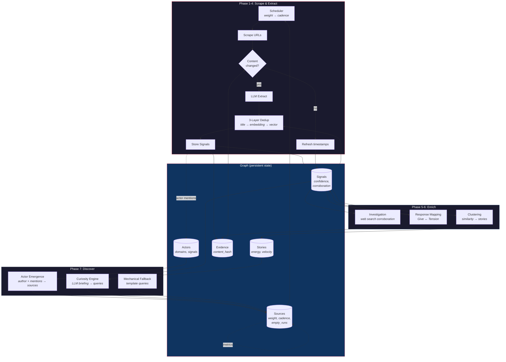

## Amplifying Loops

Productive activity begets more productive activity. These loops grow the graph.

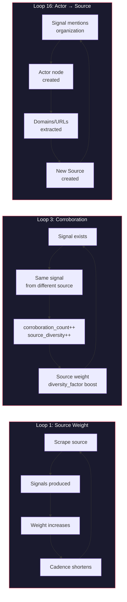

## Corrective Loops

These loops counteract problems — removing stale data, rebalancing signal types, and degrading gracefully under budget pressure.

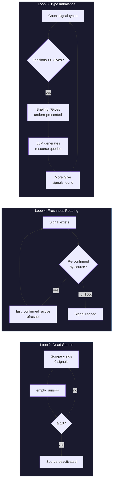

## Curiosity Engine (Loop 5)

The most sophisticated loop. The LLM sees its own track record and adjusts strategy.

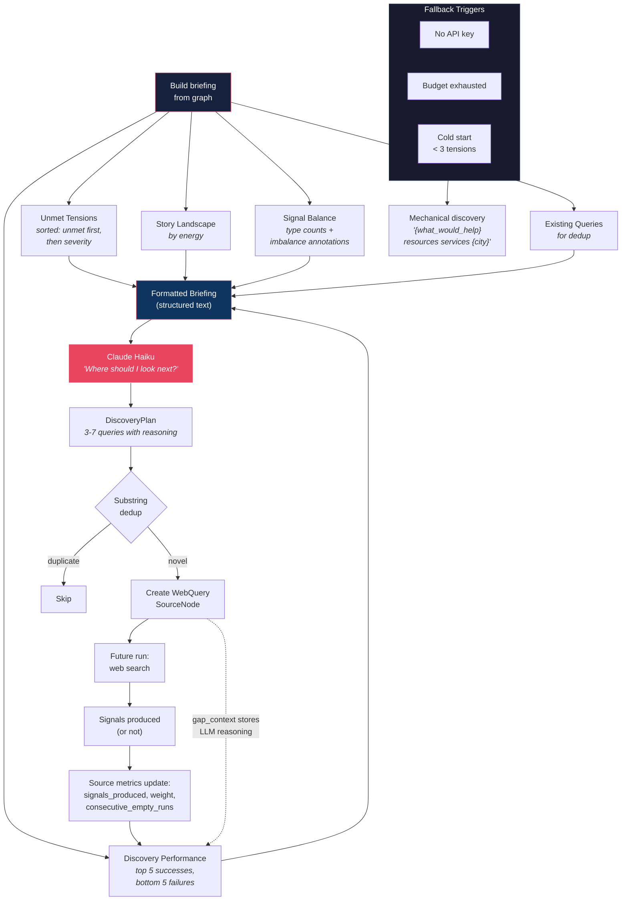

## Response Mapping Loop (Loops 6 + 9)

How discovered resources reduce tension priority over time.

```mermaid
flowchart LR
    T["Tension extracted<br/><i>severity=high,<br/>what_would_help='food shelf'</i>"]
    T --> Unmet["Marked UNMET<br/><i>no RESPONDS_TO edges</i>"]
    Unmet --> Brief["High priority in<br/>discovery briefing"]
    Brief --> Query["LLM generates:<br/>'food shelf locations<br/>Minneapolis'"]
    Query --> Source["New WebQuery<br/>source created"]
    Source --> Scrape["Scraped next run"]
    Scrape --> Give["Give signal found:<br/>'Second Harvest food shelf<br/>expansion program'"]
    Give --> Map["Response Mapper:<br/>cosine similarity > 0.7"]
    Map --> Edge["RESPONDS_TO edge<br/><i>match_strength=0.82</i>"]
    Edge --> Met["Tension now has<br/>response_count=1"]
    Met --> Lower["Lower priority<br/>in next briefing"]

    style T fill:#e94560,stroke:#fff,color:#fff
    style Give fill:#16213e,stroke:#e94560,color:#fff
    style Edge fill:#0f3460,stroke:#e94560,color:#fff
```

## Dedup Pipeline (Loops 13-15)

Three layers prevent the same information from appearing as multiple signals.

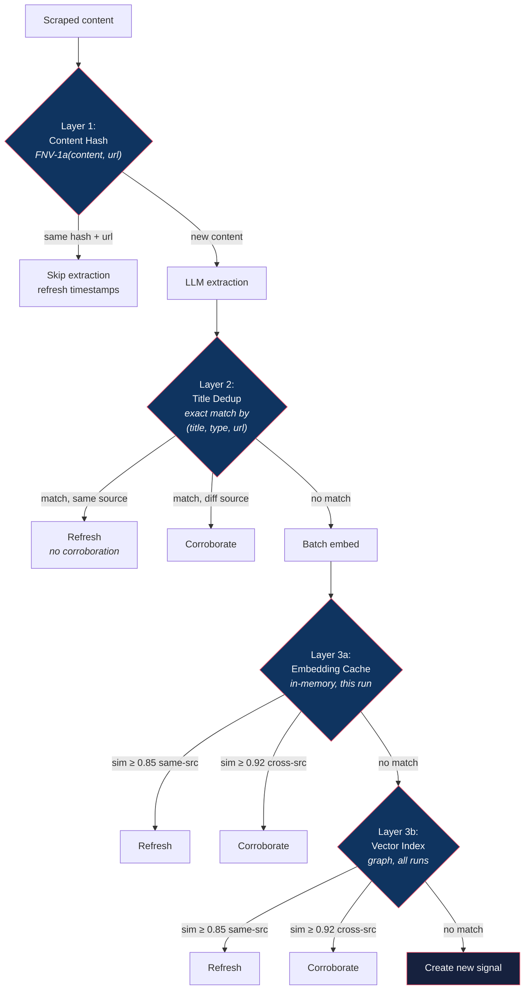

## Budget Degradation (Loop 11)

The system gracefully drops expensive features as budget is consumed.

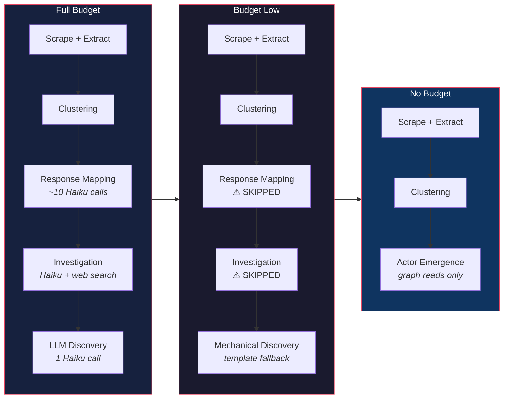

## Source Lifecycle

How a source moves through the system from discovery to deactivation.

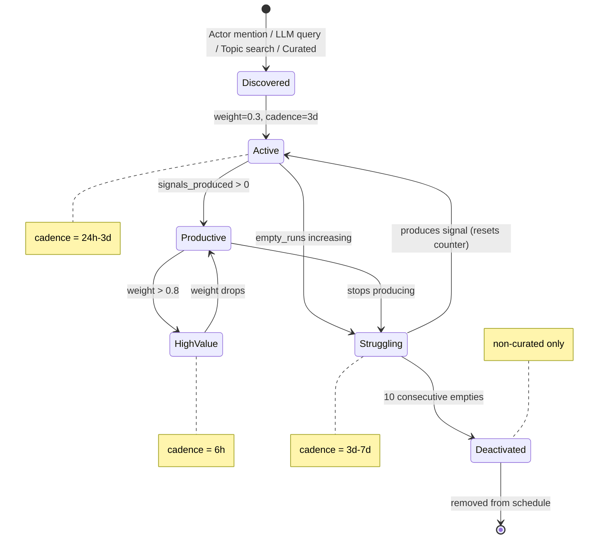

---

## Loop Map

| # | Loop | Type | Timescale | Files |
|---|------|------|-----------|-------|
| 1 | [Source Weight & Scheduling](#1-source-weight--scheduling) | Reinforcing + Balancing | Across runs | scheduler.rs, scout.rs |
| 2 | [Dead Source Deactivation](#2-dead-source-deactivation) | Balancing | Across runs | writer.rs, scout.rs |
| 3 | [Corroboration](#3-corroboration) | Reinforcing | Within + across | scout.rs, writer.rs |
| 4 | [Freshness Reaping](#4-freshness-reaping) | Balancing | Across runs | writer.rs |
| 5 | [Discovery Briefing (Curiosity Engine)](#5-discovery-briefing-curiosity-engine) | Reinforcing | Across runs | discovery.rs, writer.rs |
| 6 | [Unmet Tensions → Discovery Priority](#6-unmet-tensions--discovery-priority) | Reinforcing | Within run | discovery.rs, writer.rs |
| 7 | [Story Energy & Velocity](#7-story-energy--velocity) | Reinforcing | Across runs | cluster.rs, writer.rs |
| 8 | [Signal Type Imbalance → Discovery](#8-signal-type-imbalance--discovery) | Balancing | Within run | discovery.rs, writer.rs |
| 9 | [Response Mapping (RESPONDS_TO)](#9-response-mapping-responds_to) | Reinforcing | Within run | response.rs, writer.rs |
| 10 | [Investigation Cooldown](#10-investigation-cooldown) | Balancing | Across runs | investigator.rs, writer.rs |
| 11 | [Budget Exhaustion → Phase Skipping](#11-budget-exhaustion--phase-skipping) | Balancing | Within run | budget.rs, scout.rs, discovery.rs |
| 12 | [Quality Penalty](#12-quality-penalty) | Balancing | Persistent | quality.rs, scout.rs |
| 13 | [Content Hash Dedup](#13-content-hash-dedup) | Balancing | Within + across | scout.rs, writer.rs |
| 14 | [Embedding Cache (Within-Batch)](#14-embedding-cache-within-batch) | Balancing | Within run | scout.rs |
| 15 | [Vector Dedup (Cross-Run)](#15-vector-dedup-cross-run) | Balancing | Across runs | scout.rs, writer.rs |
| 16 | [Actor Mentions → Source Discovery](#16-actor-mentions--source-discovery) | Reinforcing | Across runs | scout.rs, discovery.rs |
| 17 | [Topic Discovery → New Accounts](#17-topic-discovery--new-accounts) | Reinforcing | Within + across | scout.rs |
| 18 | [Mechanical Discovery Fallback](#18-mechanical-discovery-fallback) | Balancing | Within run | discovery.rs |
| 19 | [Geo-Filtering Confidence Penalty](#19-geo-filtering-confidence-penalty) | Balancing | Persistent | scout.rs |
| 20 | [Source Diversity Factor](#20-source-diversity-factor) | Informing | Persistent | writer.rs |
| 21 | [Actor Signal Count Tracking](#21-actor-signal-count-tracking) | Informing | Across runs | writer.rs |

---

## Detail

### 1. Source Weight & Scheduling

The central feedback loop. Every source has a weight (0.1–1.0) that determines how often it's scraped.

**Produces:** `signals_produced`, `signals_corroborated`, `consecutive_empty_runs`, `last_produced_signal` on each Source node.

**Consumes:** `compute_weight()` in scheduler.rs combines these into a single weight score:

```
weight = base_yield * tension_bonus * recency_factor * diversity_factor

base_yield    = Bayesian smoothed signal/scrape ratio (prior: 0.3)
tension_bonus = 1.0 + (tension_signals / total_signals), capped at 2.0
recency_factor= 1.0 (recent) → 0.5 (30+ days since last signal)
diversity_factor = 1.0 + (corroboration_ratio * 0.5), max 1.5x
```

**Effect:** Weight maps to cadence: >0.8 → 6h, 0.5–0.8 → 24h, 0.2–0.5 → 3d, <0.2 → 7d. Productive sources get scraped more. Unproductive ones fade to weekly.

---

### 2. Dead Source Deactivation

**Produces:** `consecutive_empty_runs` counter incremented on each scrape that yields zero signals.

**Consumes:** `deactivate_dead_sources(10)` marks sources with 10+ consecutive empties as `active=false`.

**Effect:** Non-curated sources that consistently produce nothing are removed from the schedule. Curated sources are immune — they represent editorial judgment.

---

### 3. Corroboration

**Produces:** When the same signal is found from a different source URL:
- `corroboration_count` incremented on the signal
- `source_diversity` recomputed (unique entity domains in evidence)
- `external_ratio` updated (fraction of evidence from non-self sources)
- New Evidence node created linking signal to corroborating source

**Consumes:** Source weight formula uses `diversity_factor` (loop 1). Story synthesis uses corroboration depth.

**Effect:** Signals confirmed by multiple independent sources rise in credibility. Sources that produce corroborated signals get weight boosts. Two thresholds: 0.85 cosine similarity for same-source (refresh only), 0.92 for cross-source (real corroboration).

---

### 4. Freshness Reaping

**Produces:** `last_confirmed_active` timestamp refreshed on every scrape — even unchanged content.

**Consumes:** `reap_expired()` runs at the start of each scout cycle and deletes:
- Past non-recurring events (end/start time + grace period)
- Asks older than 30 days
- Notices older than 30 days
- Gives/Tensions not confirmed in 150 days

**Effect:** The graph stays current. Signals that disappear from their sources eventually expire. Same-source re-scrapes keep signals alive without inflating corroboration.

---

### 5. Discovery Briefing (Curiosity Engine)

The system's learning loop. Past discovery results inform future discovery queries.

**Produces:** Each LLM-discovered source stores its reasoning in `gap_context`: `"Curiosity: {reasoning} | Gap: {gap_type} | Related: {tension}"`. Over time, sources accumulate `signals_produced`, `weight`, and `consecutive_empty_runs`.

**Consumes:** `build_briefing()` queries the graph for:
- Top 5 successful discoveries (active, signals_produced > 0, by weight)
- Bottom 5 failures (deactivated or 3+ empty runs)

These appear in the LLM prompt as "Worked well" and "Didn't work" sections, with the original reasoning visible so the LLM can diagnose *why* a query succeeded or failed.

**Effect:** The LLM avoids repeating failed patterns and doubles down on strategies that worked. The `gap_context` field preserves provenance — a query that failed because "youth mentorship" doesn't have web presence is different from one that failed because the query was too vague.

---

### 6. Unmet Tensions → Discovery Priority

**Produces:** Tension nodes with `severity` and `what_would_help` fields. `RESPONDS_TO` edges track which tensions have response resources.

**Consumes:** `get_unmet_tensions()` returns tensions ordered by: unmet first (no RESPONDS_TO edges), then by severity DESC. These appear as the highest-priority section in the discovery briefing.

**Effect:** As RESPONDS_TO edges form, unmet tensions shrink. Discovery naturally shifts from "find any resources" to "find resources for the remaining unmet tensions." Critical unmet tensions always surface first.

---

### 7. Story Energy & Velocity

**Produces:** `ClusterSnapshot` nodes created each clustering run, storing signal_count and entity_count at that timestamp.

**Consumes:** Velocity calculated as `(current_entity_count - entity_count_7d_ago) / 7`. Entity diversity (not raw signal count) drives velocity — prevents spam inflation.

**Effect:** High-energy stories appear in the discovery briefing's story landscape section. Rapidly growing stories signal emerging narratives that may warrant deeper investigation.

---

### 8. Signal Type Imbalance → Discovery

**Produces:** `get_signal_type_counts()` aggregates active signal counts per type (Event, Give, Ask, Notice, Tension).

**Consumes:** The briefing annotates significant imbalances:
- `tensions > 3 * gives` → "Give signals significantly underrepresented"
- `asks > 2 * gives` → "Few Give signals to match Ask signals"

**Effect:** When the graph has 31 tensions but only 8 gives, the LLM is nudged toward finding resources, programs, and services rather than more problem reports. A corrective force against the natural bias of news sources toward problem coverage.

---

### 9. Response Mapping (RESPONDS_TO)

**Produces:** `RESPONDS_TO` edges between Give/Event/Ask signals and Tension nodes, with `match_strength` and `explanation` properties.

**Consumes:** `get_unmet_tensions()` checks for incoming RESPONDS_TO edges. Tensions with zero responses are marked `unmet=true`.

**Effect:** Closes the loop between tension identification and resource discovery. When a Give signal (e.g., "food shelf expansion") is found that responds to a Tension ("Northside food desert"), the tension drops in discovery priority. The system tracks which problems have solutions.

---

### 10. Investigation Cooldown

**Produces:** `investigated_at` timestamp set on signal nodes after investigation.

**Consumes:** `find_investigation_targets()` filters out signals investigated within the last 7 days. Per-domain dedup ensures max 1 target per source domain.

**Effect:** Prevents wasting web search budget investigating the same signals repeatedly. The 7-day cooldown allows new evidence to accumulate before re-investigation. Domain dedup prevents one prolific source from consuming the entire investigation budget.

---

### 11. Budget Exhaustion → Phase Skipping

**Produces:** `spent_cents` atomic counter incremented by each operation.

**Consumes:** Phase guards check `has_budget()` before expensive operations:
- Response mapping: needs ~10x CLAUDE_HAIKU_SYNTHESIS
- Investigation: needs CLAUDE_HAIKU_INVESTIGATION + SEARCH_INVESTIGATION
- LLM discovery: needs CLAUDE_HAIKU_DISCOVERY

**Effect:** Four-level degradation:
1. Full LLM discovery (normal)
2. Mechanical template fallback (budget/API/cold-start)
3. Actor emergence only (always free — graph reads from extraction)
4. No discovery (no tensions/actors — correct behavior)

The system never crashes from budget exhaustion. It gracefully drops expensive features.

---

### 12. Quality Penalty

**Produces:** `quality_penalty` multiplier (1.0 = no penalty, <1.0 = penalized) set by quality scoring or supervisor override.

**Consumes:** Applied in weight calculation: `new_weight = (base_weight * quality_penalty).clamp(0.1, 1.0)`.

**Effect:** Sources producing low-quality signals (poor geo accuracy, missing action URLs, low confidence) get reduced scheduling priority. A supervisor can also manually penalize sources.

---

### 13. Content Hash Dedup

**Produces:** FNV-1a content hash stored in Evidence nodes (`content_hash`).

**Consumes:** `content_already_processed(hash, url)` checks before extraction. If content from the same URL hasn't changed, extraction is skipped entirely.

**Effect:** Saves LLM extraction budget on unchanged pages while still refreshing signal timestamps. Scoped to (hash, URL) so the same content from a different URL still gets processed (cross-source).

---

### 14. Embedding Cache (Within-Batch)

**Produces:** In-memory embedding vectors cached during a scout run.

**Consumes:** Before each graph vector search, the cache is checked first. Catches duplicates between Instagram and Facebook posts from the same org processed in the same batch.

**Effect:** Prevents duplicate signals within a single run without waiting for graph indexing. Same-source matches refresh only; cross-source matches at 0.92+ similarity trigger corroboration.

---

### 15. Vector Dedup (Cross-Run)

**Produces:** Embedding vectors stored on signal nodes and indexed for vector search.

**Consumes:** `find_duplicate()` queries graph vector indices (one per signal type) with 0.85 threshold.

**Effect:** Catches semantic duplicates across runs. A signal about "bike lane conflict on Hennepin" matches "bicycle infrastructure dispute Hennepin Ave" even with different wording. Same-source → refresh; cross-source >=0.92 → corroborate.

---

### 16. Actor Mentions → Source Discovery

**Produces:** Actor nodes created when mentioned in extracted signals. `ACTED_IN` edges link actors to signals.

**Consumes:** `discover_from_actors()` queries actors with domains/social_urls not yet tracked as sources.

**Effect:** Closes a discovery loop: signals mentioning organizations → actor nodes with domains → new source nodes → future scrapes → more signals. Organizations active in community life automatically become tracked sources.

---

### 17. Topic Discovery → New Accounts

**Produces:** New Instagram SourceNodes created when hashtag/topic search finds accounts posting signals.

**Consumes:** Next run's scheduling includes these new sources at starter weight (0.3).

**Effect:** Social media accounts discovered via topic searches get added to the source registry. If they produce signals, their weight increases (loop 1). If not, they get deactivated (loop 2).

---

### 18. Mechanical Discovery Fallback

**Produces:** Template-generated queries: `"{what_would_help} resources services {city}"`.

**Consumes:** Triggered when LLM discovery can't run (no API key, budget exhausted, cold start < 3 tensions).

**Effect:** Ensures the system always makes progress on discovery even without LLM access. Not as smart as the curiosity engine, but maintains forward momentum during outages or cold starts.

---

### 19. Geo-Filtering Confidence Penalty

**Produces:** Signals from city-local sources with unrecognized location names get `confidence *= 0.8`.

**Consumes:** Downstream ranking and filtering use confidence scores.

**Effect:** Signals that can't be geo-verified are kept but marked as less certain. Signals with coordinates outside the city radius are dropped entirely.

---

### 20. Source Diversity Factor

**Produces:** `source_diversity` (unique entity domains) and `external_ratio` computed from evidence nodes.

**Consumes:** Used in story-level quality metrics (corroboration_depth). Feeds into source weight diversity_factor (loop 1).

**Effect:** Signals backed by diverse, independent sources are treated as more reliable. Single-source signals remain but carry lower weight in story narratives.

---

### 21. Actor Signal Count Tracking

**Produces:** `Actor.signal_count` incremented on each mention. `Actor.last_active` timestamp updated.

**Consumes:** Enables "who's most active in community space" analysis. Actors with high signal counts and recent activity represent key community organizations.

**Effect:** Primarily informing — doesn't directly change scout behavior, but enriches the graph for downstream consumers (editions, API queries).

---

---

## Decision Trees

### Signal Ingestion

What happens when the scout encounters a piece of content.

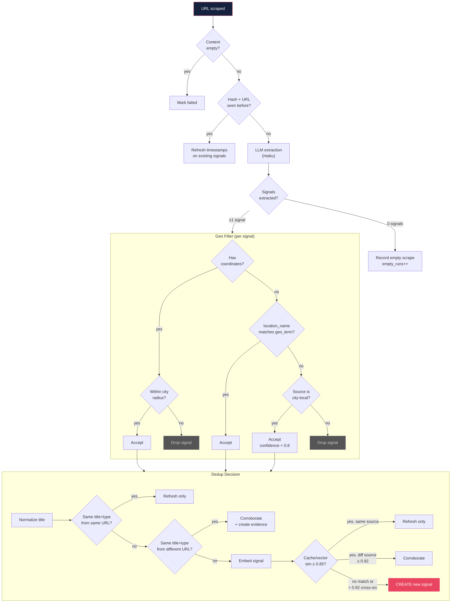

### Discovery Method Selection

How the scout decides which discovery strategy to use.

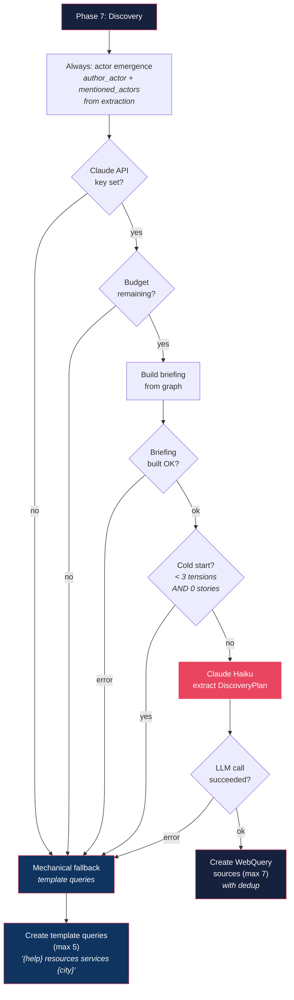

### Source Scheduling

How the scheduler decides which sources to scrape this run.

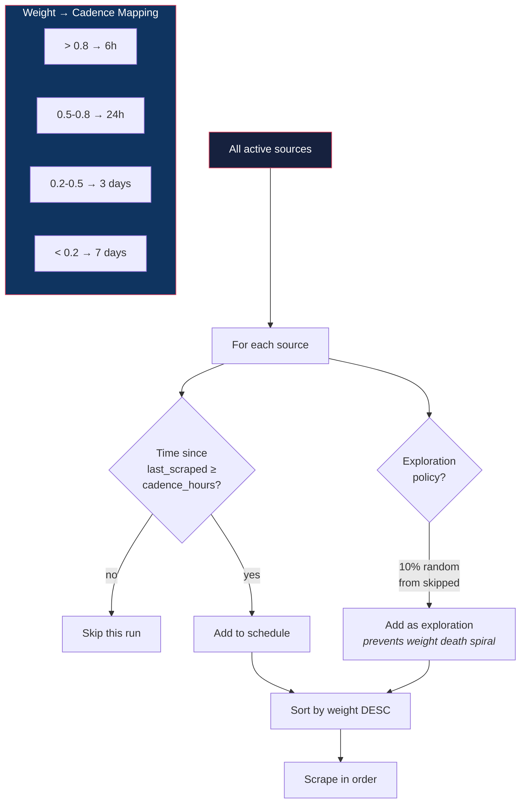

### Investigation Target Selection

How the investigator picks which signals to verify.

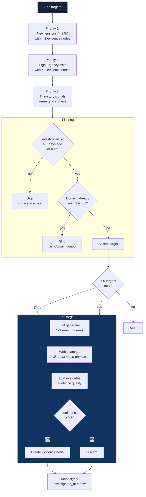

### Weight Computation

How source weight is calculated from accumulated metrics.

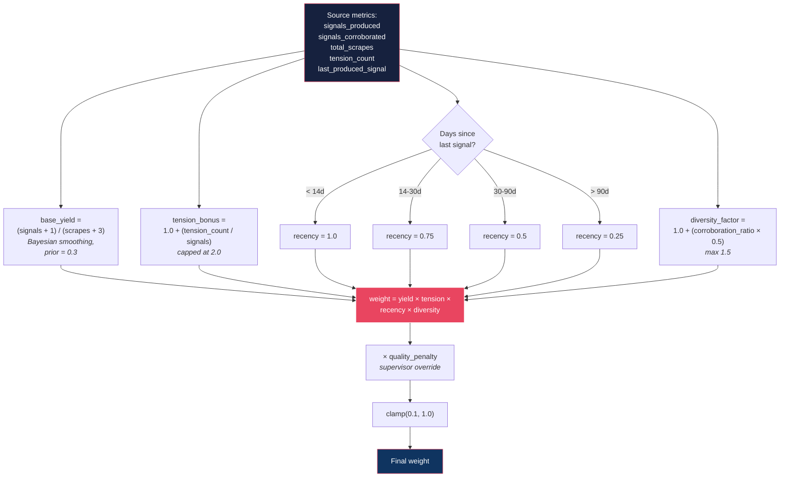

---

## System Dynamics

The loops form three natural groups:

**Amplifying loops (signal → more signal):** Loops 1, 3, 5, 6, 9, 16, 17 — productive sources get more attention, corroborated signals get weight boosts, unmet tensions drive discovery.

**Corrective loops (poor signal → less signal):** Loops 2, 4, 8, 10, 11, 12, 18 — dead sources deactivated, stale signals reaped, imbalances corrected, budget forces graceful degradation.

**Dedup loops (prevent noise):** Loops 13, 14, 15 — content hashing, embedding cache, and vector search prevent the same information from appearing as multiple signals.

The curiosity engine (loop 5) is the most sophisticated — it's the only loop where the system explicitly reasons about its own past performance and adjusts strategy accordingly.
