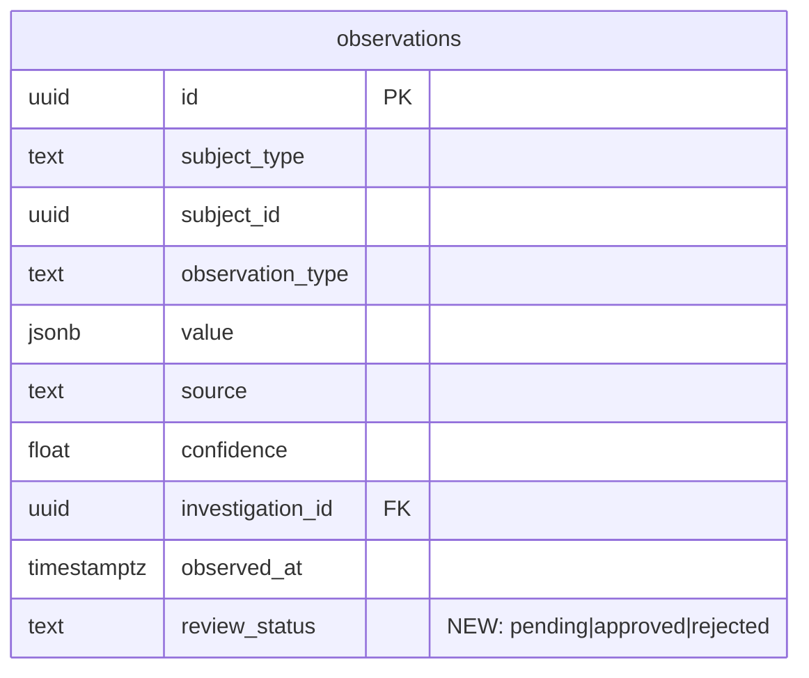

# Admin App and API Client JS Packages

## Overview

Add two new JS/TS packages to the rootsignal monorepo: `api-client-js` (typed GraphQL client via codegen + fetch) and `admin-app` (Next.js). The admin app provides CRUD, moderation, and operational tooling for the rootsignal platform. Auth uses Twilio Verify OTP → JWT → HTTP-only cookies, matching the proven mntogether pattern.

This is a large feature with significant Rust-side work required before the JS packages can be useful — the GraphQL schema is currently read-only and has no auth layer.

## Problem Statement

Root Signal currently has no admin interface. All data management happens through direct database access or the Restate workflow pipeline. Operators need a web UI to:

- Create and edit listings, entities, and services
- Review and moderate automatically scraped/extracted data
- Trigger and monitor scraping, extraction, translation, and investigation workflows
- View aggregate stats, heatmaps, and clusters

## Proposed Solution

### Architecture

```
┌─────────────────┐     ┌──────────────────────┐     ┌─────────────┐
│   admin-app     │────▶│   rootsignal-server      │────▶│  PostgreSQL  │
│   (Next.js)     │     │   (Axum, port 9081)   │     └─────────────┘
│   port 3000     │     │                       │
│                 │     │   GraphQL mutations    │────▶│  Restate     │
│   uses          │     │   proxy to Restate     │     │  (port 9080) │
│   api-client-js │     │   ingress via HTTP     │     └─────────────┘
└─────────────────┘     └──────────────────────┘
```

**Key decision: GraphQL as single API surface.** The admin app talks only to the Axum GraphQL endpoint. Workflow triggers are GraphQL mutations that internally call Restate's HTTP ingress API. This keeps auth in one place and gives the admin a single URL.

### Package Structure

```
rootsignal/
├── modules/                    # Rust workspace (existing)
├── modules/
│   ├── api-client-js/         # @rootsignal/api-client
│   │   ├── package.json
│   │   ├── codegen.ts
│   │   ├── schema.graphql     # Exported SDL (generated by Rust build)
│   │   ├── src/
│   │   │   ├── client.ts      # Fetch-based GraphQL client
│   │   │   └── index.ts       # Re-exports generated types + client
│   │   └── gql/               # Generated types (codegen output)
│   └── admin-app/             # Next.js admin dashboard
│       ├── package.json
│       ├── next.config.ts
│       ├── tailwind.config.ts
│       ├── app/
│       │   ├── layout.tsx
│       │   ├── login/
│       │   │   └── page.tsx
│       │   ├── (app)/
│       │   │   ├── layout.tsx          # Auth-gated layout
│       │   │   ├── page.tsx            # Dashboard
│       │   │   ├── listings/
│       │   │   │   ├── page.tsx        # List
│       │   │   │   ├── new/page.tsx    # Create
│       │   │   │   └── [id]/page.tsx   # Detail/Edit
│       │   │   ├── entities/
│       │   │   │   ├── page.tsx
│       │   │   │   └── [id]/page.tsx
│       │   │   ├── observations/
│       │   │   │   └── page.tsx        # Review queue
│       │   │   ├── workflows/
│       │   │   │   └── page.tsx        # Trigger & monitor
│       │   │   └── stats/
│       │   │       └── page.tsx
│       │   └── api/
│       │       └── graphql/route.ts    # BFF proxy (optional)
│       ├── lib/
│       │   ├── auth.ts                 # JWT cookie helpers
│       │   ├── client.ts               # Configured api-client-js instance
│       │   └── actions.ts              # Server actions for auth
│       └── components/
├── pnpm-workspace.yaml
├── package.json               # Root workspace config
└── .npmrc
```

## Design Decisions

### Open Questions Resolved

**1. Mutations needed (minimum viable set):**

| Category | Mutations |
|----------|-----------|
| Auth | `sendVerificationCode(phone)`, `verifyCode(phone, code)` |
| Listings | `createListing(input)`, `updateListing(id, input)`, `archiveListing(id)` |
| Entities | `createEntity(input)`, `updateEntity(id, input)`, `archiveEntity(id)` |
| Services | `createService(input)`, `updateService(id, input)` |
| Observations | `reviewObservation(id, decision: APPROVE \| REJECT)` |
| Workflows | `triggerScrape(sourceId)`, `triggerScrapeCycle`, `triggerExtraction(snapshotId)`, `triggerTranslation(type, id, locale)` |

**2. Workflow triggers go through GraphQL.** Axum server calls Restate HTTP ingress internally. Admin app never talks to Restate directly.

**3. Observation review: add `review_status` column.** Default `pending`, transitions to `approved` or `rejected`. Approving an observation does NOT auto-apply changes to the subject — that's a future enhancement.

**4. Auth is config-list based.** No users table. Admin phone numbers in env var (`ADMIN_PHONE_NUMBERS`). JWT contains phone number + `is_admin` flag. Queries remain public; mutations require admin JWT.

**5. Twilio-rs: copy into rootsignal as a new crate.** Simpler than git dependency. Small crate (~200 lines). Path: `modules/twilio-rs/`.

**6. Codegen uses exported SDL file.** Add a binary/script that calls `schema.sdl()` and writes to `modules/api-client-js/schema.graphql`. No running server needed for codegen.

**7. Soft delete for listings and entities.** Set `status = 'archived'`. No cascade. Block archival of entities with active listings.

**8. Translations are machine-generated only.** Admin can trigger re-translation but not directly edit translation text.

**9. Cursor pagination is fine for admin tables.** Forward-only cursor pagination with "load more" pattern. No offset-based queries needed initially.

**10. Polling for workflow status.** No subscriptions. Admin polls a `workflowStatus(workflowId)` query.

### Tech Stack

| Tool | Version | Notes |
|------|---------|-------|
| pnpm | latest | Workspace manager, pinned via `packageManager` field |
| Next.js | 16+ | App Router, server components |
| React | 19+ | |
| TypeScript | 5+ | |
| Tailwind CSS | 4 | |
| graphql-codegen | latest | `@graphql-codegen/cli` + `@graphql-codegen/client-preset` |
| graphql | 16.x | Pinned in root resolutions |

## Implementation Phases

### Phase 1: Foundation — JS Workspace + SDL Export + Auth Crate

Set up the monorepo infrastructure and auth building blocks. No UI yet.

**1a. pnpm workspace scaffolding**

- `modules/` directory
- Root `package.json` with `"private": true`, `"packageManager": "pnpm@..."`, graphql resolution
- `pnpm-workspace.yaml` listing `modules/*`
- `.npmrc` with `shamefully-hoist=true` (Next.js compatibility)
- Update `.gitignore`: `node_modules/`, `.next/`, `modules/*/gql/`, `.pnpm-store/`

**1b. SDL export from Rust**

- Add a `bin/export-schema.rs` (or integration test) in `rootsignal-server` that builds the schema and calls `schema.sdl()`
- Writes output to `modules/api-client-js/schema.graphql`
- Add a `Makefile` or shell script: `make schema` runs the export

**1c. api-client-js scaffold**

- `modules/api-client-js/package.json` — name `@rootsignal/api-client`, deps: `graphql`, `@graphql-codegen/cli`, `@graphql-codegen/client-preset`
- `modules/api-client-js/codegen.ts` — reads `schema.graphql`, outputs to `gql/`
- `modules/api-client-js/src/client.ts` — minimal fetch-based GraphQL client:

```typescript
// modules/api-client-js/src/client.ts
type GraphQLResponse<T> = { data?: T; errors?: Array<{ message: string }> };

export function createClient(url: string, headers?: Record<string, string>) {
  return {
    async query<T>(document: string, variables?: Record<string, unknown>): Promise<T> {
      const res = await fetch(url, {
        method: "POST",
        headers: { "Content-Type": "application/json", ...headers },
        body: JSON.stringify({ query: document, variables }),
      });
      const json: GraphQLResponse<T> = await res.json();
      if (json.errors) throw new Error(json.errors[0].message);
      return json.data!;
    },
  };
}
```

- Run `pnpm codegen` to generate types from exported SDL
- Verify types compile

**1d. twilio-rs crate**

- Copy `/Users/craig/Developer/fourthplaces/mntogether/modules/twilio-rs/` → `modules/twilio-rs/`
- Add to workspace members in root `Cargo.toml`
- Verify it builds

**1e. Auth domain in rootsignal-server**

- Add to `AppConfig`: `jwt_secret`, `twilio_account_sid`, `twilio_auth_token`, `twilio_verify_service_sid`, `admin_phone_numbers` (comma-separated)
- Add to `.env.example`
- New module: `modules/rootsignal-server/src/graphql/auth/`
  - `mod.rs` — `AuthMutation` struct with `send_verification_code` and `verify_code`
  - `jwt.rs` — encode/decode JWT (24h expiry, claims: phone, is_admin)
  - `middleware.rs` — Axum extractor that reads `auth_token` cookie → validates JWT → injects `AdminClaims` into request extensions
- Add `AuthMutation` to the GraphQL schema (replace `EmptyMutation` with a `MutationRoot`)
- Auth middleware on mutation resolver: reject if no valid admin JWT

**1f. Observation review_status migration**

- New migration: `ALTER TABLE observations ADD COLUMN review_status TEXT NOT NULL DEFAULT 'pending'`
- Add index on `review_status` for queue queries
- Update `Observation` model in `rootsignal-domains`



### Phase 2: Core Mutations — CRUD + Review + Workflows

Build the Rust mutation layer. Still no UI — test via GraphiQL.

**2a. Listing mutations**

- Add write methods to Listing model: `create`, `update`, `archive`
- Input types: `CreateListingInput`, `UpdateListingInput` (partial fields)
- Handle polymorphic relationships: tags, locations, schedules created/linked in same transaction
- Validation: require `title`, `source_locale`; validate `entity_id`/`service_id` exist if provided
- `archiveListing` sets `status = 'archived'`, does not delete

```rust
// modules/rootsignal-server/src/graphql/listings/mutations.rs
#[derive(InputObject)]
pub struct CreateListingInput {
    pub title: String,
    pub description: Option<String>,
    pub source_locale: String,
    pub entity_id: Option<Uuid>,
    pub service_id: Option<Uuid>,
    pub tag_ids: Option<Vec<Uuid>>,
}
```

**2b. Entity mutations**

- Add `update` and `archive` methods to Entity model
- Handle entity subtypes (Organization, GovernmentEntity, BusinessEntity)
- `archiveEntity` checks for active listings first — returns error if any exist
- Input types: `CreateEntityInput`, `UpdateEntityInput`

**2c. Service mutations**

- Add `create`, `update` methods to Service model
- Link to entity on creation

**2d. Observation review mutation**

- `reviewObservation(id, decision)` — sets `review_status` to `approved` or `rejected`
- Return the updated observation
- Guard: only reviewable if current status is `pending`

**2e. Workflow trigger mutations**

- Add Restate ingress HTTP client to `ServerDeps` (or build inline with `reqwest`)
- `triggerScrape(sourceId)` → POST to Restate `/ScrapeWorkflow/{sourceId}/run`
- `triggerScrapeCycle` → POST to Restate `/SchedulerService/startCycle/send`
- `triggerExtraction(snapshotId)` → POST to Restate `/ExtractWorkflow/{snapshotId}/run`
- `triggerTranslation(type, id, locale)` → POST to Restate `/TranslateWorkflow/{type}-{id}/run`
- All return a `WorkflowTriggerResult { workflow_id: String, status: String }`

**2f. Workflow status query**

- Add `workflowStatus(workflowId, workflowType)` query
- GET from Restate `/WorkflowType/{workflowId}/get_status`
- Returns status string

### Phase 3: Admin App — UI

Build the Next.js admin app consuming the mutations from Phase 2.

**3a. Next.js scaffold**

- `modules/admin-app/package.json` — deps: `next`, `react`, `react-dom`, `tailwindcss`, `@rootsignal/api-client` (`workspace:*`)
- `next.config.ts` — standalone output, TypeScript strict
- `tailwind.config.ts`
- Root layout with Tailwind globals

**3b. Auth flow**

- `/login` page — phone number input, OTP entry (two-step form)
- Server actions in `lib/actions.ts`:
  - `sendVerificationCode(phone)` → calls GraphQL `sendVerificationCode` mutation
  - `verifyCode(phone, code)` → calls GraphQL `verifyCode` mutation → sets `auth_token` cookie
  - `logout()` → clears cookie
- `(app)/layout.tsx` — reads cookie, redirects to `/login` if missing/expired
- All `(app)/*` routes are auth-gated

**3c. Dashboard**

- `(app)/page.tsx` — overview with stats from `StatsQuery`
- Cards: total listings, total entities, pending observations count, active workflows

**3d. Listings CRUD**

- `(app)/listings/page.tsx` — paginated table (cursor-based "load more")
  - Columns: title, entity, status, source_locale, freshness_score
  - Filter by status, locale
- `(app)/listings/new/page.tsx` — create form
  - Fields: title, description, source_locale, entity selector, service selector, tags
- `(app)/listings/[id]/page.tsx` — detail view + edit form
  - Show related: tags, locations, schedules, contacts, notes, observations
  - Edit fields inline
  - Archive button with confirmation

**3e. Entities management**

- `(app)/entities/page.tsx` — list with type filter
- `(app)/entities/[id]/page.tsx` — detail with linked listings, services, observations

**3f. Observation review queue**

- `(app)/observations/page.tsx` — list filtered to `review_status = pending`
  - Show: subject, observation_type, value preview, confidence, source
  - Approve/Reject buttons per row
  - Bulk actions (approve/reject selected)

**3g. Workflows page**

- `(app)/workflows/page.tsx`
  - Source list with "Trigger Scrape" button per source
  - "Trigger Full Cycle" button
  - Active workflow status panel (polls every 5s)

**3h. Stats page**

- `(app)/stats/page.tsx` — listing stats, heatmap visualization, cluster view

### Phase 4: Hardening

**4a. Error handling**

- GraphQL error display in admin UI (toast notifications)
- Mutation validation errors shown inline on forms
- Auth token expiry → auto-redirect to login

**4b. Optimistic locking**

- Add `updated_at` check on update mutations — return conflict error if stale

**4c. Rate limiting**

- OTP send: max 3 per phone per 10 minutes (Twilio handles this, but add server-side guard too)

**4d. Admin logging**

- Log all mutations with admin phone number + timestamp for audit trail

**4e. Dev workflow documentation**

- Document: `make schema && pnpm codegen && pnpm dev`
- Update README with setup instructions

## Acceptance Criteria

### Phase 1
- [x] `pnpm install` works from repo root
- [x] `make schema` exports SDL to `modules/api-client-js/schema.graphql`
- [x] `pnpm codegen` generates TypeScript types matching the GraphQL schema
- [x] `twilio-rs` crate builds and passes tests
- [x] `sendVerificationCode` and `verifyCode` mutations work in GraphiQL
- [x] JWT cookie is set on successful verification
- [x] Mutations reject requests without valid admin JWT
- [x] `observations.review_status` column exists with `pending` default

### Phase 2
- [x] All CRUD mutations work in GraphiQL with valid admin JWT
- [x] `archiveEntity` with active listings returns error
- [x] `reviewObservation` transitions status correctly
- [x] Workflow trigger mutations successfully invoke Restate workflows
- [x] `workflowStatus` query returns current status

### Phase 3
- [x] Admin can log in via phone OTP
- [x] Admin can create, edit, and archive listings
- [x] Admin can manage entities and services
- [x] Admin can approve/reject observations from the review queue
- [x] Admin can trigger scrape workflows and see status
- [x] Dashboard shows aggregate stats

### Phase 4
- [ ] Stale updates return conflict error
- [ ] OTP rate limiting works
- [ ] Mutation audit logging in place
- [x] Dev workflow documented

## Dependencies & Risks

| Risk | Mitigation |
|------|-----------|
| Schema is query-only — all mutations must be built from scratch | Phase 1-2 focus on Rust backend before touching UI |
| No write paths exist for most models | Build domain methods before GraphQL mutations |
| Twilio requires external account setup | Use test identifiers in dev (`+1234567890` / code `123456`) |
| Codegen depends on schema export | SDL export is Phase 1 — blocks nothing else |
| Restate ingress calls from Axum untested | Test with `curl` before building GraphQL wrapper |
| Large scope — risk of feature creep | Phases are independent; ship Phase 1-2 before starting Phase 3 |

## References

- Brainstorm: `docs/brainstorms/2026-02-14-admin-app-brainstorm.md`
- GraphQL plan: `docs/plans/2026-02-14-feat-graphql-api-plan.md`
- mntogether admin-app (reference): `/Users/craig/Developer/fourthplaces/mntogether/modules/admin-app/`
- mntogether auth domain: `/Users/craig/Developer/fourthplaces/mntogether/modules/server/src/domains/auth/`
- mntogether twilio-rs: `/Users/craig/Developer/fourthplaces/mntogether/modules/twilio-rs/`
- Existing GraphQL schema: `modules/rootsignal-server/src/graphql/mod.rs`
- AppConfig: `modules/rootsignal-core/src/config.rs`
