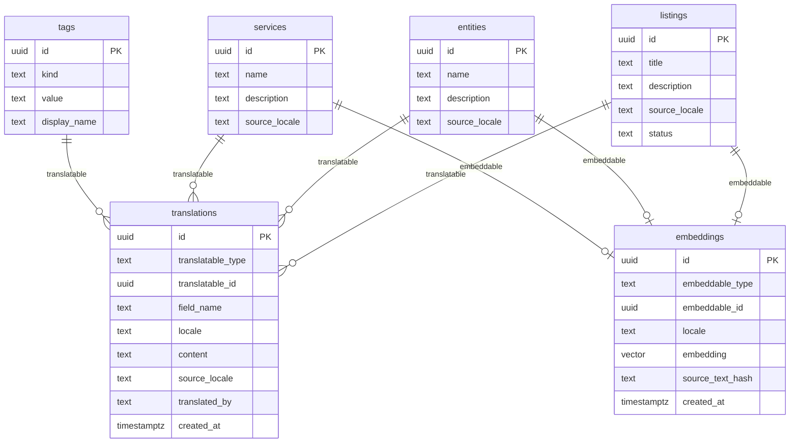

# Multi-Language Support

## Overview

Add a decoupled translation and cross-language search layer to Taproot. Content scraped in any supported language is preserved in its original form, translated into all supported locales, and made discoverable via semantic search in a shared English vector space.

Supported locales: English (`en`), Spanish (`es`), Somali (`so`), Haitian Creole (`ht`).

Source brainstorm: `docs/brainstorms/2026-02-14-multi-language-support-brainstorm.md`

## Problem Statement

Taproot serves diverse communities where residents speak English, Spanish, Somali, and Haitian Creole. Sources publish content in these languages. Without multi-language support:

- Non-English listings are extracted but stored opaquely — users who don't speak the source language can't use them
- Semantic search only works within the source language — a Spanish user can't find a Somali food distribution event
- No infrastructure exists to translate, store, or serve localized content

## Proposed Solution

Three new database tables, each with one responsibility:

1. **`translations`** — stores localized text per field per record (polymorphic)
2. **`embeddings`** — stores one vector per record, always from English text (polymorphic, replaces `listings.embedding`)
3. **`source_locale`** column added to `listings`, `entities`, `services` — tracks original language

A new **TranslateWorkflow** (Restate) handles translation as a separate pipeline step, triggered after normalization.

## Technical Approach

### Architecture

```
Scrape → Extract (detect source_locale)
  → Normalize (store original-language text, set source_locale)
  → TranslateWorkflow:
      Step 1: if source_locale != 'en' → translate to English (blocking)
      Step 2: Generate English embedding
      Step 3: Translate to remaining locales (parallel, async)
```

Three clean, decoupled concerns:
- **Content** lives in source tables (`listings.title`, `entities.description`, etc.) in original language
- **Translations** live in `translations` table, keyed by (type, id, field, locale)
- **Search vectors** live in `embeddings` table, always generated from English text

### Key Design Decisions

**Source fields store original language text.** `listings.title` for a Somali listing contains the Somali title. English is available via the `translations` table. This preserves fidelity and provenance.

**English is infrastructure.** For non-English content, English translation is blocking — it must complete before embedding can happen. Other locale translations are async and non-blocking.

**Embeddings are English-only (for now).** The `embeddings` table has a `locale` column for future expansion, but Phase 1 only generates `locale='en'` embeddings. All semantic search operates in the English vector space.

**Translation is idempotent.** `ON CONFLICT DO UPDATE` on the unique constraint ensures retries and re-translations are safe.

**Cross-language dedup uses semantic similarity.** After both an English and Somali version of the same event are translated and embedded, vector similarity flags them as potential duplicates. This integrates with the existing dedup pipeline rather than creating a parallel one.

### ERD



### Implementation Phases

#### Phase 1: Schema & Models

New migration `017_translations_and_embeddings.sql` and Rust model files.

**Tasks:**

- [x] Create migration `017_translations_and_embeddings.sql`
  - `translations` table with unique constraint `(translatable_type, translatable_id, field_name, locale)`
  - `embeddings` table with unique constraint `(embeddable_type, embeddable_id, locale)`
  - Add `source_locale TEXT DEFAULT 'en'` to `listings`, `entities`, `services`
  - Drop `embedding` column from `listings`
  - Indexes on both tables for polymorphic lookups and locale filtering
  - HNSW index on `embeddings.embedding` for vector similarity search
- [x] Create `crates/taproot-domains/src/entities/models/translation.rs`
  - `Translation` struct with `sqlx::FromRow`
  - `Translation::create()` — upsert (ON CONFLICT DO UPDATE)
  - `Translation::find_for(type, id, locale)` — all translations for a record in a locale
  - `Translation::find_field(type, id, field, locale)` — single field translation
- [x] Create `crates/taproot-domains/src/entities/models/embedding.rs`
  - `Embedding` struct with `sqlx::FromRow`
  - `Embedding::upsert(type, id, locale, vector, hash)` — idempotent insert/update
  - `Embedding::find_for(type, id, locale)` — get embedding for a record
  - `Embedding::search_similar(vector, limit, threshold)` — cosine similarity search
- [x] Register new models in `crates/taproot-domains/src/entities/models/mod.rs`

**Files:**

```
migrations/017_translations_and_embeddings.sql
crates/taproot-domains/src/entities/models/translation.rs
crates/taproot-domains/src/entities/models/embedding.rs
crates/taproot-domains/src/entities/models/mod.rs (edit)
```

**Migration SQL:**

```sql
-- Translations (polymorphic, per-field)
CREATE TABLE translations (
    id UUID PRIMARY KEY DEFAULT gen_random_uuid(),
    translatable_type TEXT NOT NULL,
    translatable_id UUID NOT NULL,
    field_name TEXT NOT NULL,
    locale TEXT NOT NULL,
    content TEXT NOT NULL,
    source_locale TEXT,
    translated_by TEXT,
    created_at TIMESTAMPTZ NOT NULL DEFAULT NOW(),
    UNIQUE(translatable_type, translatable_id, field_name, locale)
);

CREATE INDEX idx_translations_target ON translations(translatable_type, translatable_id);
CREATE INDEX idx_translations_locale ON translations(locale);
CREATE INDEX idx_translations_lookup ON translations(translatable_type, translatable_id, locale);

-- Embeddings (polymorphic, per-record per-locale)
CREATE TABLE embeddings (
    id UUID PRIMARY KEY DEFAULT gen_random_uuid(),
    embeddable_type TEXT NOT NULL,
    embeddable_id UUID NOT NULL,
    locale TEXT NOT NULL DEFAULT 'en',
    embedding VECTOR(1536) NOT NULL,
    source_text_hash TEXT,
    created_at TIMESTAMPTZ NOT NULL DEFAULT NOW(),
    UNIQUE(embeddable_type, embeddable_id, locale)
);

CREATE INDEX idx_embeddings_target ON embeddings(embeddable_type, embeddable_id);
CREATE INDEX idx_embeddings_locale ON embeddings(locale);

-- HNSW index for fast vector similarity search (English embeddings)
CREATE INDEX idx_embeddings_vector ON embeddings
    USING hnsw (embedding vector_cosine_ops)
    WHERE locale = 'en';

-- Add source_locale to content tables
ALTER TABLE listings ADD COLUMN source_locale TEXT NOT NULL DEFAULT 'en';
ALTER TABLE entities ADD COLUMN source_locale TEXT NOT NULL DEFAULT 'en';
ALTER TABLE services ADD COLUMN source_locale TEXT NOT NULL DEFAULT 'en';

-- Remove embedding from listings (moved to embeddings table)
ALTER TABLE listings DROP COLUMN IF EXISTS embedding;
```

#### Phase 2: Extraction Changes

Update AI extraction to detect source language.

**Tasks:**

- [x] Add `source_locale` field to `ExtractedListing` in `crates/taproot-core/src/types.rs`
- [x] Update extraction system prompt in `crates/taproot-domains/src/extraction/activities/extract.rs` to instruct AI to detect content language and return `source_locale`
- [x] Update `normalize_extraction()` in `crates/taproot-domains/src/extraction/activities/normalize.rs` to:
  - Read `source_locale` from extracted data
  - Fall back to source-level config if AI returns null
  - Write `source_locale` to `listings`, `entities`, `services` tables
- [ ] Add `default_locale` field to `sources` table config JSONB (for source-level fallback)

**Files:**

```
crates/taproot-core/src/types.rs (edit)
crates/taproot-domains/src/extraction/activities/extract.rs (edit)
crates/taproot-domains/src/extraction/activities/normalize.rs (edit)
```

**ExtractedListing change:**

```rust
pub struct ExtractedListing {
    // ... existing fields ...

    /// Detected language of the source content (ISO 639-1: en, es, so, ht)
    pub source_locale: Option<String>,
}
```

**System prompt addition:**

```
Additionally, detect the primary language of the content and return it as `source_locale`:
- "en" for English
- "es" for Spanish
- "so" for Somali
- "ht" for Haitian Creole
If the content is in a language not listed above, use the closest match or "en" as default.
If the content is mixed-language, use the majority language.
```

**Normalization change** (pseudo-code):

```rust
// In normalize_extraction(), after creating listing:
let source_locale = listing_data.source_locale
    .as_deref()
    .unwrap_or("en"); // TODO: fall back to source config

sqlx::query("UPDATE listings SET source_locale = $1 WHERE id = $2")
    .bind(source_locale)
    .bind(listing_id)
    .execute(pool)
    .await?;
```

#### Phase 3: Translation Domain

New domain module for translation activities and Restate workflow.

**Tasks:**

- [x] Create `crates/taproot-domains/src/translation/` module structure:
  - `mod.rs` — module exports
  - `activities/mod.rs` — activity exports
  - `activities/translate.rs` — translation activity
  - `activities/embed.rs` — embedding generation activity
  - `restate/mod.rs` — TranslateWorkflow
- [x] Implement `translate_record()` activity:
  - Fetches source fields for a record based on type (listing → title+description, service → name+description+eligibility+fees+application_process, etc.)
  - Calls AI translation (GPT-4o) for each field
  - Stores results in `translations` table via `Translation::create()`
  - Returns translation IDs
- [x] Implement `generate_embedding()` activity:
  - Fetches English text for a record (from translations if source is non-English, from source fields if English)
  - Composes embedding input: `title + " " + description` for listings, `name + " " + description` for entities/services
  - Hashes composed text for `source_text_hash`
  - Calls `EmbeddingService::embed()`
  - Stores result via `Embedding::upsert()`
- [x] Implement `TranslateWorkflow` (Restate):
  - Step 1: If `source_locale != "en"`, translate to English (blocking, retryable)
  - Step 2: Generate English embedding (blocking)
  - Step 3: For each remaining target locale, translate (parallel via separate `ctx.run()` calls)
  - Track status via `ctx.set("status", ...)`
- [x] Add `TranslationService` trait to `crates/taproot-core/src/deps.rs` for AI translation
- [x] Register `TranslateWorkflowImpl` in `crates/taproot-server/src/main.rs`

**Files:**

```
crates/taproot-domains/src/translation/mod.rs (new)
crates/taproot-domains/src/translation/activities/mod.rs (new)
crates/taproot-domains/src/translation/activities/translate.rs (new)
crates/taproot-domains/src/translation/activities/embed.rs (new)
crates/taproot-domains/src/translation/restate/mod.rs (new)
crates/taproot-domains/src/lib.rs (edit — add translation module)
crates/taproot-core/src/deps.rs (edit — add TranslationService trait)
crates/taproot-server/src/main.rs (edit — register workflow)
```

**TranslateWorkflow structure:**

```rust
#[derive(Debug, Clone, Serialize, Deserialize)]
pub struct TranslateRequest {
    pub translatable_type: String,  // "listing", "entity", "service"
    pub translatable_id: String,
    pub source_locale: String,      // detected or inferred
}
impl_restate_serde!(TranslateRequest);

#[derive(Debug, Clone, Serialize, Deserialize)]
pub struct TranslateResult {
    pub translation_count: u32,
    pub embedding_generated: bool,
    pub status: String,
}
impl_restate_serde!(TranslateResult);
```

**Embedding composition per record type:**

| Record Type | Composition |
|---|---|
| Listing | `title + " " + description` |
| Entity | `name + " " + description` |
| Service | `name + " " + description` |

#### Phase 4: Pipeline Integration

Wire translation into the extraction pipeline.

**Tasks:**

- [x] Update `ExtractWorkflow` in `crates/taproot-domains/src/extraction/restate/mod.rs` to trigger `TranslateWorkflow` after normalization
  - After each listing is normalized, send a `TranslateRequest` to Restate
  - Fire-and-forget for the translation (don't block extraction on translation completion)
  - Also trigger for the entity and service created during normalization
- [ ] Add translation trigger for tag display_names:
  - Seeded tags: one-time batch migration script or activity
  - AI-extracted tags: trigger after `Taggable::tag()` creates a new tag

**Files:**

```
crates/taproot-domains/src/extraction/restate/mod.rs (edit)
```

**Integration pattern** (in ExtractWorkflow, after normalization step):

```rust
// After normalize_extraction returns listing_id:
if let Some(lid) = &listing_id {
    // Fire TranslateWorkflow for this listing (non-blocking)
    let translate_client = ctx.restate_client::<TranslateWorkflowClient>();
    translate_client
        .run(TranslateRequest {
            translatable_type: "listing".to_string(),
            translatable_id: lid.clone(),
            source_locale: source_locale.to_string(),
        })
        .send();
}
```

#### Phase 5: API Changes

Surface translations in the REST API.

**Tasks:**

- [x] Update `GET /api/listings` to accept locale:
  - Query param `?locale=es` takes precedence
  - `Accept-Language` header as fallback
  - Default to `en` if neither specified
  - Join to `translations` table for requested locale
  - Fallback chain: requested locale → `en` → source text
- [x] Add translation metadata to API response:
  - `locale` — what locale is being served
  - `source_locale` — original language of the content
  - `is_fallback` — true if serving a fallback locale (e.g., requested `so` but got `en`)
- [x] Update `ListingDetail` struct in `crates/taproot-server/src/routes.rs`
- [ ] Add `GET /api/tags?locale=es` — return tags with translated display_names

**Files:**

```
crates/taproot-server/src/routes.rs (edit)
```

**Updated ListingDetail:**

```rust
#[derive(Debug, Clone, Serialize, Deserialize)]
pub struct ListingDetail {
    pub id: Uuid,
    pub title: String,
    pub description: Option<String>,
    pub status: String,
    pub entity_name: Option<String>,
    pub entity_type: Option<String>,
    pub source_url: Option<String>,
    pub location_text: Option<String>,
    pub timing_start: Option<DateTime<Utc>>,
    pub timing_end: Option<DateTime<Utc>>,
    pub created_at: DateTime<Utc>,
    // New fields
    pub locale: String,
    pub source_locale: String,
    pub is_fallback: bool,
}
```

**Query pattern with translation fallback:**

```sql
SELECT
    l.id,
    COALESCE(t_title.content, en_title.content, l.title) as title,
    COALESCE(t_desc.content, en_desc.content, l.description) as description,
    l.status,
    e.name as entity_name, e.entity_type,
    l.source_url, l.location_text,
    l.timing_start, l.timing_end, l.created_at,
    l.source_locale,
    CASE
        WHEN t_title.content IS NOT NULL THEN $1
        WHEN en_title.content IS NOT NULL THEN 'en'
        ELSE l.source_locale
    END as served_locale,
    CASE
        WHEN t_title.content IS NOT NULL THEN false
        ELSE true
    END as is_fallback
FROM listings l
LEFT JOIN entities e ON e.id = l.entity_id
-- Requested locale translations
LEFT JOIN translations t_title
    ON t_title.translatable_type = 'listing'
    AND t_title.translatable_id = l.id
    AND t_title.field_name = 'title'
    AND t_title.locale = $1
LEFT JOIN translations t_desc
    ON t_desc.translatable_type = 'listing'
    AND t_desc.translatable_id = l.id
    AND t_desc.field_name = 'description'
    AND t_desc.locale = $1
-- English fallback translations
LEFT JOIN translations en_title
    ON en_title.translatable_type = 'listing'
    AND en_title.translatable_id = l.id
    AND en_title.field_name = 'title'
    AND en_title.locale = 'en'
LEFT JOIN translations en_desc
    ON en_desc.translatable_type = 'listing'
    AND en_desc.translatable_id = l.id
    AND en_desc.field_name = 'description'
    AND en_desc.locale = 'en'
WHERE l.status = 'active'
ORDER BY l.created_at DESC
LIMIT $2 OFFSET $3
```

#### Phase 6: Seed Tag Translations

Translate existing seeded tag display_names.

**Tasks:**

- [ ] Create migration `018_seed_tag_translations.sql` or a one-time activity that:
  - Queries all tags with `display_name IS NOT NULL`
  - For each tag, creates translation rows for `es`, `so`, `ht`
  - Can be hard-coded for the ~50 seeded tags (more reliable than AI for known vocabulary)
- [ ] Alternatively, run `TranslateWorkflow` for each tag as a batch job

**Files:**

```
migrations/018_seed_tag_translations.sql (new, if hard-coded)
  OR
crates/taproot-domains/src/translation/activities/seed_tags.rs (new, if AI-translated)
```

## Acceptance Criteria

### Functional Requirements

- [ ] Non-English content is extracted with correct `source_locale` detection
- [ ] Non-English listings are translated to English before embedding
- [ ] All listings have English embeddings regardless of source language
- [ ] Translations to es, so, ht are generated asynchronously after extraction
- [ ] API returns translated content when `?locale=` or `Accept-Language` is provided
- [ ] API falls back gracefully: requested locale → en → source text
- [ ] API response includes `locale`, `source_locale`, and `is_fallback` metadata
- [ ] Tags return translated `display_name` for requested locale
- [ ] Translation failures don't block listing creation
- [ ] Translation retries via Restate durable execution

### Non-Functional Requirements

- [ ] Translations are idempotent (safe to retry, ON CONFLICT DO UPDATE)
- [ ] Embedding generation uses `source_text_hash` to skip re-embedding unchanged content
- [ ] HNSW index on embeddings table for sub-100ms vector search
- [ ] Translation workflow is fully decoupled from extraction workflow

## Dependencies & Risks

**Dependencies:**
- GPT-4o for translation (already in stack via `ai-client` crate)
- Restate SDK for durable workflow orchestration (already in stack)
- pgvector for HNSW index (already enabled via `001_extensions.sql`)

**Risks:**
- **Somali/Haitian Creole translation quality** — GPT-4o handles these languages but quality is lower than Spanish. Mitigation: store `translated_by` for provenance, plan for community review later.
- **Embedding column removal** — dropping `listings.embedding` is destructive. Mitigation: column is not currently populated by any code path, so this is safe.
- **Translation API costs** — 4 locales × translatable fields per record. Mitigation: batch where possible, skip re-translation of unchanged content via hashing.

## Future Considerations

- **Per-locale embeddings**: The `embeddings.locale` column supports adding Somali/Spanish-specific embeddings later for better native-language search quality
- **Community translation review**: Add a `verified` boolean and `verified_by` to translations for human review
- **On-demand translation**: For rarely-accessed content, translate lazily on first request instead of eagerly
- **Cross-language deduplication**: Use English embedding similarity to detect same event posted in different languages across sources (integrates with clustering brainstorm)

## References

### Internal References

- Brainstorm: `docs/brainstorms/2026-02-14-multi-language-support-brainstorm.md`
- Clustering brainstorm: `docs/brainstorms/2026-02-14-clustering-infrastructure-brainstorm.md`
- Architecture: `docs/architecture/signal-service-architecture.md`
- Extraction activity: `crates/taproot-domains/src/extraction/activities/extract.rs`
- Normalization activity: `crates/taproot-domains/src/extraction/activities/normalize.rs`
- ExtractWorkflow: `crates/taproot-domains/src/extraction/restate/mod.rs`
- Polymorphic pattern reference: `crates/taproot-domains/src/entities/models/tag.rs`
- Core types: `crates/taproot-core/src/types.rs`
- Listings migration: `migrations/008_listings.sql`
