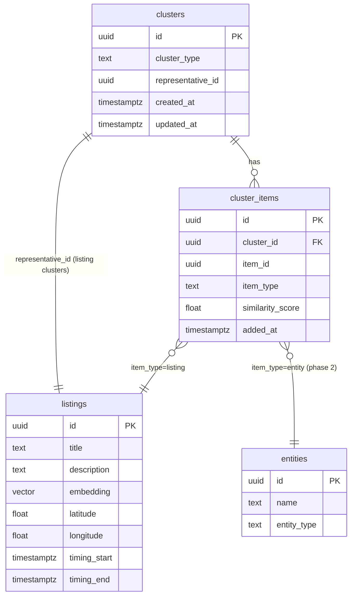

# Polymorphic Clustering Infrastructure

## Overview

Build a polymorphic clustering system that groups duplicate listings (and eventually entities) without deleting source data. Instead of inline dedup, items flow in freely during ingestion. A batch clustering job groups semantically similar items using pgvector embedding similarity, gated by geographic proximity and temporal overlap. Downstream consumers (search, heat maps, detail views) show one representative per cluster.

This is **read-side infrastructure** — the write path stays dumb and fast.

## Problem Statement / Motivation

Root Signal scrapes the same real-world events and services from multiple sources (Facebook, Instagram, city websites, community boards). A single community dinner might appear 3-5 times from different platforms. Without grouping, search results are 70%+ noise from duplication.

The current fingerprint dedup (SHA-256 of normalized title + org + time + location) only catches exact matches. Semantically identical listings with different wording slip through.

## Proposed Solution

**Cluster and link, don't merge.** Source data is never modified or deleted. Clustering creates a read-side grouping layer. Each cluster has a representative (the "best" item), and search results show one result per cluster.

### Architecture

```
Ingestion (unchanged)
  scrape → extract → normalize → listing (with fingerprint fast-path)
                                      ↓
Embedding Generation (new)
  batch job: listings WHERE embedding IS NULL
  → OpenAI embed_batch → UPDATE listings SET embedding
                                      ↓
Clustering Job (new)
  scan unclustered items → pgvector nearest neighbors
  → gate by geography + time → assign to cluster or create new
  → compute representative
                                      ↓
Search / API (modified)
  return representative per cluster + unclustered items
```

### Key Design Decisions

| Decision | Choice | Rationale |
|----------|--------|-----------|
| Cluster, don't merge | Source data untouched | Never lose provenance. Multiple sources = higher confidence signal. |
| Batch, not inline | Periodic job after ingestion | Keep write path fast. Acceptable latency for read-side grouping. |
| Fingerprint dedup stays | Complementary to clustering | Catches exact re-extractions cheaply. Reduces unnecessary volume before clustering. |
| Geographic gate | Required for clustering | "Free Dinner" in Minneapolis ≠ "Free Dinner" in St. Paul. Embedding similarity alone is insufficient. |
| Temporal gate | Required for event-type listings | "Yoga July 4" ≠ "Yoga July 11" even if embeddings are identical. |
| One cluster per item | UNIQUE(item_type, item_id) | Prevents data integrity issues. |
| Entity clustering deferred | Phase 2 | Entities lack embeddings. Existing UNIQUE(name, entity_type) handles exact dedup. |
| Stored representative | Recomputed on new member | Fast reads. Simple recompute trigger. |
| Soft scoring over hard gates | Geo + time are weighted signals, not pass/fail | Research shows composite scores produce better clusters than binary gates (Splink, Fellegi-Sunter). |
| Cluster coherence check | Verify merged clusters stay coherent | Prevents runaway transitive chains (A→B→C→...→Z where A and Z are unrelated). |
| Materialized CTE for ANN | pgvector HNSW only works with `ORDER BY ... LIMIT` | JOINs and WHERE on distance bypass the index. Two-step pattern is the documented best practice. |

## Research Validation

This approach is validated by established entity resolution research:

- **VLDB 2023 ("Pre-trained Embeddings for Entity Resolution")**: Embedding-based ANN search is competitive with specialized blocking techniques for candidate generation. Our pgvector HNSW approach effectively serves as the blocking step.
- **Splink (UK Ministry of Justice)**: Production system that deduplicated 7M+ records. Uses connected components for clustering (same as our cluster merge approach). Key lesson: use weighted composite scores, not hard filters.
- **Fellegi-Sunter model**: The mathematical foundation for record linkage. Our composite match score is a simplified version with manually tuned weights — appropriate at our scale.
- **pgvector best practices**: HNSW over IVFFlat for our use case (better recall, handles incremental inserts, no stale centroids). Use `MATERIALIZED` CTEs to ensure index utilization.

**Rolling our own is the right call** because: (1) no ER tool integrates with Rust/Postgres natively, (2) our domain-specific gates (geography, temporality, recurrence) matter more than general-purpose ER, (3) our scale (10k-100k) doesn't need Splink's Spark backend.

**Rust crates to use**: `geo` (haversine), `strsim` (Jaro-Winkler for location_text fallback), `petgraph` (connected components / union-find for cluster merging).

## Implementation Phases

### Phase 1: Embedding Generation Pipeline

**Goal:** Populate the existing `listings.embedding` column and add a vector index.

**Migration: `017_clusters.sql`**

```sql
-- pgvector HNSW index for fast nearest-neighbor search
-- ef_construction=128 (higher than default 64) for better recall — important for dedup
-- where missed duplicates are worse than slow queries
CREATE INDEX idx_listings_embedding ON listings
  USING hnsw (embedding vector_cosine_ops)
  WITH (m = 16, ef_construction = 128);
```

**New activity: `generate_embeddings.rs`**

```
modules/rootsignal-domains/src/extraction/activities/generate_embeddings.rs
```

- Query: `SELECT id, title, description FROM listings WHERE embedding IS NULL ORDER BY created_at ASC LIMIT $1`
- Concatenate key fields as embedding input: `"{title} | {description} | {location_text} | {organization_name}"`
- Including structured fields improves dedup accuracy over title+description alone
- Call `deps.embedding_service.embed_batch()` (already exists)
- UPDATE each listing's embedding column
- Return count of items embedded

**Wire into extraction pipeline:**
- Add as a final step in `ExtractWorkflow` after normalization completes
- Or: standalone Restate workflow `EmbedWorkflow` triggered after extraction

**Files changed:**
- `migrations/017_clusters.sql` (new)
- `modules/rootsignal-domains/src/extraction/activities/generate_embeddings.rs` (new)
- `modules/rootsignal-domains/src/extraction/activities/mod.rs` (add pub mod)
- `modules/rootsignal-domains/src/extraction/restate/mod.rs` (add embedding step to workflow)

### Phase 2: Clustering Tables and Models

**Migration: `017_clusters.sql` (continued)**

```sql
-- Cluster grouping
CREATE TABLE clusters (
    id UUID PRIMARY KEY DEFAULT gen_random_uuid(),
    cluster_type TEXT NOT NULL CHECK (cluster_type IN ('listing', 'entity')),
    representative_id UUID NOT NULL,
    created_at TIMESTAMPTZ NOT NULL DEFAULT now(),
    updated_at TIMESTAMPTZ NOT NULL DEFAULT now()
);

CREATE INDEX idx_clusters_type ON clusters(cluster_type);
CREATE INDEX idx_clusters_representative ON clusters(representative_id);

-- Polymorphic cluster membership
CREATE TABLE cluster_items (
    id UUID PRIMARY KEY DEFAULT gen_random_uuid(),
    cluster_id UUID NOT NULL REFERENCES clusters(id) ON DELETE CASCADE,
    item_id UUID NOT NULL,
    item_type TEXT NOT NULL CHECK (item_type IN ('listing', 'entity')),
    similarity_score FLOAT,              -- cosine similarity to representative
    added_at TIMESTAMPTZ NOT NULL DEFAULT now(),
    UNIQUE(item_type, item_id)           -- one cluster per item
);

CREATE INDEX idx_cluster_items_target ON cluster_items(item_type, item_id);
CREATE INDEX idx_cluster_items_cluster ON cluster_items(cluster_id);

-- Enforce representative must be a member of its own cluster
-- (enforced in application code since representative_id is polymorphic)

-- Enforce item_type matches cluster_type
-- (enforced via application-level check: ClusterItem::create validates
--  item_type == cluster.cluster_type before inserting)
```

**Domain module:**

```
modules/rootsignal-domains/src/clustering/
  mod.rs
  models/
    mod.rs
    cluster.rs
    cluster_item.rs
  activities/
    mod.rs
    cluster_listings.rs
  restate/
    mod.rs
```

**`cluster.rs` model methods:**
- `Cluster::create(cluster_type, representative_id, pool)` → INSERT
- `Cluster::find_by_representative(item_type, item_id, pool)` → lookup
- `Cluster::update_representative(cluster_id, new_representative_id, pool)` → UPDATE
- `Cluster::merge(keep_id, absorb_id, pool)` → reassign items, delete absorbed cluster
- `Cluster::representatives_for_type(cluster_type, pool)` → all representative IDs

**`cluster_item.rs` model methods:**
- `ClusterItem::create(cluster_id, item_id, item_type, similarity_score, pool)` → INSERT
- `ClusterItem::find_cluster_for(item_type, item_id, pool)` → which cluster is this item in?
- `ClusterItem::items_in_cluster(cluster_id, pool)` → all items in a cluster
- `ClusterItem::unclustered(item_type, limit, pool)` → items not in any cluster

**Files changed:**
- `migrations/017_clusters.sql` (continued)
- `modules/rootsignal-domains/src/clustering/` (new module, 6 files)
- `modules/rootsignal-domains/src/lib.rs` (add `pub mod clustering;`)

### Phase 3: Clustering Algorithm

**Activity: `cluster_listings.rs`**

The core clustering logic:

```
fn cluster_listings(deps, threshold, geo_radius_meters, time_window_hours, batch_size):
    1. Fetch unclustered listings with embeddings (deterministic ordering):
       SELECT id, embedding, latitude, longitude, timing_start
       FROM listings
       WHERE embedding IS NOT NULL
         AND id NOT IN (SELECT item_id FROM cluster_items WHERE item_type = 'listing')
       ORDER BY created_at ASC
       LIMIT batch_size

    2. For each unclustered listing:
       a. Find nearest neighbors via pgvector (two-step for HNSW utilization):

          -- Step 1: ANN search using MATERIALIZED CTE (ensures HNSW index usage)
          -- pgvector HNSW only works with ORDER BY + LIMIT, not with JOINs or WHERE on distance
          -- Set hnsw.ef_search = 100 for better recall during dedup
          WITH candidates AS MATERIALIZED (
              SELECT id, embedding, latitude, longitude, timing_start,
                     embedding <=> $1 AS distance
              FROM listings
              WHERE embedding IS NOT NULL
                AND id != $2  -- exclude self
              ORDER BY embedding <=> $1
              LIMIT 50
          )
          SELECT id, latitude, longitude, timing_start, 1 - distance AS similarity
          FROM candidates
          WHERE distance < $3  -- cosine distance threshold (e.g., 0.08 = similarity 0.92)

          -- Step 2: In application code, look up cluster_items for each candidate
          -- to find which cluster each neighbor belongs to

       b. Composite match scoring (soft gates, not hard filters):
          For each candidate, compute a weighted match score:

          match_score = embedding_sim * 0.40        -- semantic similarity (already filtered)
                      + geo_score * 0.25            -- geographic proximity (0-1 via haversine)
                      + time_score * 0.15           -- temporal proximity (0-1)
                      + name_sim * 0.10             -- title Jaro-Winkler similarity
                      + org_match * 0.10            -- same entity_id bonus

          geo_score: 1.0 if within 100m, linear decay to 0 at geo_radius_meters.
                     If either item lacks coordinates, fall back to location_text
                     Jaro-Winkler similarity (using `strsim` crate).
                     If both lack location info, score = 0.5 (neutral).

          time_score: 1.0 if same day, linear decay to 0 at time_window_hours.
                      For recurring events (is_recurring=true): compare day-of-week
                      and time-of-day instead of absolute dates.
                      If both have NULL timing (ongoing services): score = 1.0.
                      If one has timing and the other doesn't: score = 0.3 (weak match).

       c. Classification:
          match_score > 0.75 → auto-cluster
          match_score < 0.75 → no match (create singleton if no other matches)

       d. If matches found → add to best matching cluster, recompute representative
          If no matches → create singleton cluster

    3. Handle cluster merges via connected components:
       Build a graph of all pairwise matches found in this batch.
       Use `petgraph`'s UnionFind to find connected components.
       If a component spans 2+ existing clusters, merge into the largest.

       Cluster coherence check: After merging, verify representative-to-representative
       similarity > MERGE_THRESHOLD (0.85, lower than clustering threshold).
       If coherence fails, do NOT merge — keep separate clusters.

    4. Return stats: { items_processed, clusters_created, clusters_merged, items_assigned }
```

**Representative selection heuristic:**

```rust
fn select_representative(items: &[ListingWithMeta]) -> Uuid {
    // Composite score per item:
    //   field_completeness * 0.25   -- fraction of non-null optional fields
    //   + confidence * 0.20         -- extraction_confidence from listing_extractions
    //   + recency * 0.15            -- newer = higher (linear decay)
    //   + source_trust * 0.20       -- adapter priority: eventbrite(0.95) > firecrawl(0.70) > tavily(0.60) > http(0.50)
    //   + provenance_count * 0.20   -- min(extraction_count, 5) / 5 — corroboration bonus
    //
    // The provenance_count signal is uniquely valuable: a listing confirmed
    // by 3 independent sources (via listing_extractions) is more trustworthy
    // than one from a single scrape. Our schema already tracks this.
}
```

Implement as a standalone, testable function.

**Configurable parameters (env vars):**
- `CLUSTER_SIMILARITY_THRESHOLD` — default 0.92 (cosine similarity; 0.95+ = near-exact, 0.88-0.95 = strong overlap)
- `CLUSTER_MATCH_SCORE_THRESHOLD` — default 0.75 (composite score including geo/time/name)
- `CLUSTER_MERGE_COHERENCE_THRESHOLD` — default 0.85 (minimum representative-to-representative similarity for merging)
- `CLUSTER_GEO_RADIUS_METERS` — default 500
- `CLUSTER_TIME_WINDOW_HOURS` — default 24
- `CLUSTER_BATCH_SIZE` — default 100
- `HNSW_EF_SEARCH` — default 100 (higher than pgvector default of 40, for better recall during dedup)

**New Cargo dependencies:**
- `geo` — haversine distance calculations
- `strsim` — Jaro-Winkler string similarity for title/location_text comparison
- `petgraph` — connected components / union-find for cluster merging

**Files changed:**
- `modules/rootsignal-domains/src/clustering/activities/cluster_listings.rs` (new)
- `modules/rootsignal-core/src/config.rs` (add clustering config fields)
- `modules/rootsignal-domains/Cargo.toml` (add geo, strsim, petgraph deps)

### Phase 4: Restate Workflow

**`ClusterWorkflow`** — orchestrates the full clustering cycle:

```
1. Generate embeddings for unembedded listings
2. Run clustering algorithm in batches
3. Log summary stats
```

**Concurrency guard:** Use a Restate virtual object keyed on `"clustering"` to prevent concurrent runs, following the `SourceObject` pattern.

```rust
#[restate_sdk::object]
#[name = "ClusteringJob"]
pub trait ClusteringJob {
    async fn run(req: ClusterRequest) -> Result<ClusterResult, HandlerError>;
    #[shared]
    async fn get_status(req: EmptyRequest) -> Result<String, HandlerError>;
}
```

**Triggering:** Chain from `ExtractWorkflow` completion, or call on-demand via Restate API.

**Files changed:**
- `modules/rootsignal-domains/src/clustering/restate/mod.rs` (new)
- `modules/rootsignal-server/src/main.rs` (register workflow with Restate endpoint)

### Phase 5: Cluster-Aware Search API

**Modify `ListingDetail::find_active`** to be cluster-aware:

```sql
-- Return one listing per cluster (the best ACTIVE item) + unclustered listings
-- Uses a CTE to find the best active representative per cluster,
-- falling back from stored representative to next-best active member
WITH cluster_reps AS (
    -- For each listing cluster, pick the best active item:
    -- prefer the stored representative if active, else highest-scoring active member
    SELECT DISTINCT ON (c.id)
        ci.item_id AS listing_id
    FROM clusters c
    JOIN cluster_items ci ON ci.cluster_id = c.id AND ci.item_type = 'listing'
    JOIN listings l ON l.id = ci.item_id
    WHERE c.cluster_type = 'listing'
      AND l.status = 'active'
    ORDER BY c.id,
        (ci.item_id = c.representative_id) DESC,  -- prefer stored representative
        ci.similarity_score DESC NULLS LAST        -- fallback: closest to representative
)
SELECT l.*, e.name as entity_name, e.entity_type
FROM listings l
LEFT JOIN entities e ON l.entity_id = e.id
WHERE l.status = 'active'
  AND (
    -- This listing is the best active item in its cluster
    l.id IN (SELECT listing_id FROM cluster_reps)
    OR
    -- This listing is not in any cluster (unclustered)
    l.id NOT IN (SELECT item_id FROM cluster_items WHERE item_type = 'listing')
  )
ORDER BY l.created_at DESC
```

**Why this query shape:** The stored `representative_id` might point to an inactive/expired listing. Instead of hiding the entire cluster, this CTE falls back to the next-best active member. If ALL members are inactive, the cluster naturally disappears from results — correct behavior.

**Add cluster provenance endpoint:**

```
GET /api/listings/:id/cluster
→ returns all items in the same cluster (for detail view "also posted on" section)
```

**Files changed:**
- `modules/rootsignal-domains/src/listings/models/listing.rs` (modify find_active query)
- `modules/rootsignal-server/src/routes.rs` (add cluster provenance endpoint)

## ERD



## Acceptance Criteria

### Functional Requirements

- [x] Listings with `embedding IS NULL` get embeddings generated via batch job
- [x] pgvector HNSW index exists on `listings.embedding` for fast nearest-neighbor queries
- [x] `clusters` and `cluster_items` tables created with correct constraints and indexes
- [x] Clustering job groups semantically similar listings (cosine similarity > threshold)
- [x] Geographic gate prevents clustering items in different locations (> 500m apart)
- [x] Temporal gate prevents clustering events with different dates (> 24h apart)
- [x] Each item belongs to at most one cluster (UNIQUE constraint enforced)
- [x] Representative is automatically selected and stored on the cluster
- [x] Representative recomputed when new items join a cluster
- [ ] Cluster merges handled when a new item bridges two existing clusters *(greedy assignment in place; full connected-components merge deferred)*
- [x] Search API returns one result per cluster (representative) + unclustered items
- [x] Cluster provenance endpoint returns all items in a given cluster
- [x] Clustering job is deterministic — same input data + same ordering produces same clusters
- [x] `ClusterItem::create` validates `item_type` matches `cluster.cluster_type` before inserting
- [x] Representative is always a member of its own cluster (enforced in `Cluster::create`)
- [x] Only one clustering job can run at a time (Restate virtual object guard)

### Non-Functional Requirements

- [x] Clustering job handles 10,000+ unclustered items without timeout
- [x] pgvector queries use HNSW index (no sequential scans)
- [x] Similarity threshold, geo radius, time window, and batch size are configurable via env vars
- [x] Clustering job logs summary stats (items processed, clusters created/merged)

## Dependencies & Risks

| Risk | Mitigation |
|------|------------|
| OpenAI embedding API rate limits / cost | Use `embed_batch` (reduces calls). Process in configurable batch sizes. |
| Similarity threshold too aggressive | Start at 0.92, make configurable. Monitor cluster sizes. |
| HNSW index memory usage at scale | Monitor. Can switch to IVFFlat if needed. |
| Cluster merges creating mega-clusters | Log cluster sizes. Consider max cluster size cap in future. |
| Stale representatives (inactive/expired) | Search query CTE falls back to next-best active member in cluster. |
| Geo gate skipped (no coordinates populated yet) | `normalize.rs` has `TODO: geocode`. Geo gate is soft — falls back to embedding-only when coords missing. Geocoding is a separate concern to address. |

## What's Deferred (Phase 2 / Future)

- **Entity clustering** — requires adding embeddings to entities table
- **Geocoding pipeline** — populate latitude/longitude so geo gate is effective (currently `TODO: geocode` in normalize.rs)
- **Synthesis step** — merge cluster items into a richer canonical record
- **Admin UI** — manual cluster splitting, reassignment
- **Heat map integration** — one pin per cluster, size as intensity
- **Max cluster size cap** — prevent mega-clusters from hiding legitimate listings

## References

### Internal
- Brainstorm: `docs/brainstorms/2026-02-14-clustering-infrastructure-brainstorm.md`
- Polymorphic pattern: `migrations/011_tags.sql` (taggables)
- Current dedup: `modules/rootsignal-domains/src/extraction/activities/normalize.rs:35-61`
- Embedding service: `modules/rootsignal-core/src/deps.rs:10-14`
- Restate workflow pattern: `modules/rootsignal-domains/src/extraction/restate/mod.rs`
- Virtual object pattern: `modules/rootsignal-domains/src/scraping/restate/mod.rs:108`
- Listing model: `modules/rootsignal-domains/src/listings/models/listing.rs`
- Signal architecture: `docs/architecture/signal-service-architecture.md`

### External Research
- [Pre-trained Embeddings for Entity Resolution (VLDB 2023)](https://www.vldb.org/pvldb/vol16/p2225-skoutas.pdf) — validates embedding ANN as blocking technique
- [Splink - Probabilistic Record Linkage](https://github.com/moj-analytical-services/splink) — production ER at 7M+ records, connected components clustering
- [pgvector GitHub](https://github.com/pgvector/pgvector) — MATERIALIZED CTE pattern, HNSW configuration
- [pgvector issue #760](https://github.com/pgvector/pgvector/issues/760) — DISTINCT ON / JOIN kills HNSW index usage
- [AWS: HNSW vs IVFFlat deep dive](https://aws.amazon.com/blogs/database/optimize-generative-ai-applications-with-pgvector-indexing-a-deep-dive-into-ivfflat-and-hnsw-techniques/) — benchmark data for index selection
