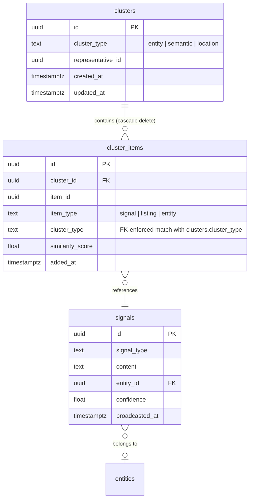

# Cross-Source Signal Clustering

## Overview

Adapt the existing clustering infrastructure to group signals from different sources that represent the same real-world thing. Primary use case: an organization posts the same event/ask/give on Facebook, Instagram, and their website — producing 3 separate signals that should be grouped with one representative shown in search.

## Problem Statement

Same-source dedup is handled by LLM-matched extraction (signal refresh). But cross-source duplication is unsolved — signals arrive from independent pipelines with no shared identity. An org posting a community cleanup on 3 platforms creates 3 signals in search results. The clustering infrastructure exists but isn't fully wired for signals.

## Proposed Solution

Reuse the existing clustering infrastructure (`clusters` + `cluster_items` tables, composite scoring algorithm, Restate workflow) with:

1. Schema migration to support signals and multi-dimension clustering
2. Fix `unclustered()` query to actually query signals (currently queries listings — pre-existing bug)
3. Model updates for multi-dimension awareness (`ClusterItem::create`, `Cluster::create` validation)
4. Search CTE simplification and scoping by cluster_type
5. Wired workflow trigger after extraction batches

### Design Decisions (from brainstorm)

| Decision | Choice | Rationale |
|---|---|---|
| Cluster, don't merge | Read-side only | Source data never modified. False negatives harmless, false positives suppress real signals. |
| Multi-dimension via cluster_type | `UNIQUE(cluster_type, item_type, item_id)` | Venn diagram model — one cluster per signal per dimension. Enables experimentation with different cluster types (entity, semantic, location). |
| Start with entity clustering | `cluster_type = 'entity'` | Same org, cross-platform is the immediate problem. Schema supports adding more dimensions without migration. |
| Conservative threshold | 0.75 composite, loosen over time | Missed duplicates harmless; wrong groupings suppress signals. |
| Best representative | One result per cluster in search | Existing `cluster_reps` CTE handles this. |

### Gap Resolutions

Defaults chosen for v1 — tune with real clustering data:

| Gap | Decision | Rationale |
|---|---|---|
| Entity page signal count | **Raw count** for v1 | Simplest. Revisit if confusing. |
| Signal update → cluster re-eval | **Leave in cluster** for v1 | Accept staleness. Cluster membership persists until next clustering run. |
| Job cadence | **After extraction batches** via Restate workflow chain | Near real-time dedup. |
| `broadcasted_at` in representative selection | **Yes, as ORDER BY column** | One line addition. Showing past events as representatives is poor UX. |
| Scoring weights | **Keep current weights** for v1 | Tune with data, not gut feel. |
| Signal type matching | **Ignore for v1** | If same entity + similar embedding + similar geo/time, it's the same thing regardless of LLM type classification. Add penalty later if bad clusters appear. |
| Confidence gate | **No gate for v1** | Signals without embeddings are already skipped. If low-confidence causes problems, add gate then. |
| Embedding staleness on update | **Accept staleness for v1** | Same class of problem as stale clusters — eventually consistent on next extraction + re-embedding cycle. |
| Max cluster size | **No limit, log warning at 50** | Conservative threshold should prevent mega-clusters. Monitor. |
| Direct signal lookup | **Returns signal regardless of cluster status** | Admin/direct links should always work. |

## Technical Approach

### Phase 1: Schema Migration

**File:** `migrations/057_signal_clustering.sql`

```sql
BEGIN;

-- 1. Add cluster_type column to cluster_items FIRST (nullable for backfill)
ALTER TABLE cluster_items ADD COLUMN cluster_type TEXT;

-- 2. Backfill from parent clusters table
UPDATE cluster_items ci
SET cluster_type = c.cluster_type
FROM clusters c
WHERE c.id = ci.cluster_id;

-- 3. Set NOT NULL after backfill
ALTER TABLE cluster_items ALTER COLUMN cluster_type SET NOT NULL;

-- 4. Update CHECK constraints to include 'signal'
ALTER TABLE clusters DROP CONSTRAINT clusters_cluster_type_check;
ALTER TABLE clusters ADD CONSTRAINT clusters_cluster_type_check
  CHECK (cluster_type IN ('listing', 'entity', 'signal'));

ALTER TABLE cluster_items DROP CONSTRAINT cluster_items_item_type_check;
ALTER TABLE cluster_items ADD CONSTRAINT cluster_items_item_type_check
  CHECK (item_type IN ('listing', 'entity', 'signal'));

-- 5. Add CHECK on cluster_items.cluster_type too
ALTER TABLE cluster_items ADD CONSTRAINT cluster_items_cluster_type_check
  CHECK (cluster_type IN ('listing', 'entity', 'signal'));

-- 6. Drop old unique constraint, add new multi-dimension one
ALTER TABLE cluster_items DROP CONSTRAINT cluster_items_item_type_item_id_key;
ALTER TABLE cluster_items ADD CONSTRAINT cluster_items_cluster_type_item_type_item_id_key
  UNIQUE (cluster_type, item_type, item_id);

-- 7. Composite FK to enforce denormalization consistency:
--    cluster_items.cluster_type must match its parent cluster's cluster_type
ALTER TABLE clusters ADD CONSTRAINT clusters_id_cluster_type_unique
  UNIQUE (id, cluster_type);

ALTER TABLE cluster_items ADD CONSTRAINT cluster_items_cluster_id_cluster_type_fk
  FOREIGN KEY (cluster_id, cluster_type) REFERENCES clusters (id, cluster_type)
  ON DELETE CASCADE;

-- 8. Migrate existing cluster_type values: 'signal' → 'entity' for signal clusters
-- (existing code used 'signal' as cluster_type; the correct dimension name is 'entity')
UPDATE clusters SET cluster_type = 'entity' WHERE cluster_type = 'signal';
UPDATE cluster_items SET cluster_type = 'entity' WHERE cluster_type = 'signal';

COMMIT;
```

**Key decisions:**
- Column added and backfilled **before** the UNIQUE constraint references it
- Composite FK `(cluster_id, cluster_type)` → `clusters(id, cluster_type)` enforces that the denormalized `cluster_type` on `cluster_items` always matches its parent cluster. No application-level drift possible.
- Existing `cluster_type = 'signal'` values migrated to `'entity'` (the correct dimension name)
- Wrapped in explicit transaction for atomicity

### Phase 2: Fix ClusterItem Model

**File:** `modules/rootsignal-domains/src/clustering/models/cluster_item.rs`

Three changes needed:

**2a. Fix `unclustered()` — currently queries `listings` table (pre-existing bug)**

Replace the hardcoded listings query with one that queries signals, using `NOT EXISTS` instead of `NOT IN` for scalability:

```rust
pub async fn unclustered_signals(
    cluster_type: &str,
    batch_size: i64,
    pool: &PgPool,
) -> Result<Vec<Uuid>> {
    sqlx::query_as::<_, (Uuid,)>(
        r#"
        SELECT s.id
        FROM signals s
        JOIN embeddings e ON e.embeddable_type = 'signal'
            AND e.embeddable_id = s.id AND e.locale = 'en'
        WHERE NOT EXISTS (
            SELECT 1 FROM cluster_items ci
            WHERE ci.item_type = 'signal'
              AND ci.cluster_type = $1
              AND ci.item_id = s.id
        )
        ORDER BY s.created_at ASC
        LIMIT $2
        "#,
    )
    .bind(cluster_type)
    .bind(batch_size)
    .fetch_all(pool)
    .await
    .map(|rows| rows.into_iter().map(|r| r.0).collect())
    .map_err(Into::into)
}
```

**2b. Update `create()` — add `cluster_type` param, fix ON CONFLICT**

The current INSERT doesn't include `cluster_type` (will fail after migration) and `ON CONFLICT` references the old constraint:

```rust
pub async fn create(
    cluster_id: Uuid,
    item_id: Uuid,
    item_type: &str,
    cluster_type: &str,  // NEW
    similarity_score: Option<f64>,
    pool: &PgPool,
) -> Result<Self> {
    sqlx::query_as::<_, Self>(
        r#"
        INSERT INTO cluster_items (cluster_id, item_id, item_type, cluster_type, similarity_score)
        VALUES ($1, $2, $3, $4, $5)
        ON CONFLICT (cluster_type, item_type, item_id) DO UPDATE
        SET cluster_id = $1, similarity_score = $5, added_at = NOW()
        RETURNING *
        "#,
    )
    .bind(cluster_id)
    .bind(item_id)
    .bind(item_type)
    .bind(cluster_type)
    .bind(similarity_score)
    .fetch_one(pool)
    .await
    .map_err(Into::into)
}
```

**2c. Update `find_cluster_for()` — scope by cluster_type**

With multi-dimension, a signal can be in multiple clusters. The lookup must be scoped:

```rust
pub async fn find_cluster_for(
    item_type: &str,
    item_id: Uuid,
    cluster_type: &str,  // NEW
    pool: &PgPool,
) -> Result<Option<Self>> {
    // ...WHERE item_type = $1 AND item_id = $2 AND cluster_type = $3
}
```

### Phase 3: Fix Cluster Model Validation

**File:** `modules/rootsignal-domains/src/clustering/models/cluster.rs`

The `create()` method at line 33 validates `item_type == cluster_type` and bails if they differ. With multi-dimension clustering, a signal (`item_type = 'signal'`) goes into an entity cluster (`cluster_type = 'entity'`). **Remove this validation** — the composite FK on the schema enforces consistency where it matters.

### Phase 4: Modify Existing Clustering Activity

**File:** `modules/rootsignal-domains/src/clustering/activities/cluster_listings.rs`

The file already clusters signals (queries `signals` table, uses `embeddable_type = 'signal'`). **No fork needed.** Modify in place:

1. Pass `cluster_type` parameter through to `ClusterItem::unclustered_signals()`, `ClusterItem::create()`, `ClusterItem::find_cluster_for()`, and `Cluster::create()`
2. Change `Cluster::create("signal", ...)` calls to `Cluster::create("entity", ...)` (or pass cluster_type as parameter)
3. Add `s.broadcasted_at DESC NULLS LAST` to the representative selection ORDER BY (one line)
4. **Keep current scoring weights** — tune with data after observing real clusters

Optional: rename file to `cluster_signals.rs` for clarity, since listings are being removed from the codebase.

### Phase 5: Simplify and Scope Search CTE

**File:** `modules/rootsignal-domains/src/search/hybrid.rs`

Two changes:

**5a. Simplify `cluster_reps` CTE — use `representative_id` directly**

The current CTE joins `cluster_items` and sorts to find the representative. But `representative_id` is already stored and maintained on `clusters`. Eliminate the join:

```sql
WITH cluster_reps AS (
    SELECT representative_id AS signal_id
    FROM clusters
    WHERE cluster_type = 'entity'
)
```

This removes a join and sort from every search query.

**5b. Use `NOT EXISTS` in the dedup filter**

Replace `NOT IN` with `NOT EXISTS` for scalability:

```sql
AND (
    s.id IN (SELECT signal_id FROM cluster_reps)
    OR NOT EXISTS (
        SELECT 1 FROM cluster_items ci
        WHERE ci.item_type = 'signal'
          AND ci.cluster_type = 'entity'
          AND ci.item_id = s.id
    )
)
```

**Note for future multi-dimension search:** When additional cluster types are added, the CTE and filter will need to handle multiple dimensions. The schema supports this without migration; the search query will need updating. Documented as a known forward-compatibility concern.

### Phase 6: Wire Restate Workflow

**File:** `modules/rootsignal-domains/src/clustering/restate/mod.rs`

The existing `ClusteringJob` virtual object wraps `cluster_listings()`. Update to pass `cluster_type` as a parameter:

```rust
#[restate_sdk::object]
impl ClusteringJob {
    #[handler]
    async fn run(&self, ctx: ObjectContext<'_>, cluster_type: String) -> Result<(), TerminalError> {
        ctx.set("status", format!("clustering_{}", cluster_type));
        ctx.run(|| async {
            cluster_signals(&deps, &cluster_type).await
        }).await?;
        ctx.set("status", "completed".to_string());
        Ok(())
    }
}
```

**Trigger:** In the extraction workflow, after signals are extracted and embeddings generated, invoke via `ctx.object_client::<ClusteringJob>("signal").send().run("entity".to_string())`. Use `send` (fire-and-forget) so extraction doesn't block on clustering completion.

### Phase 7: Clean Up Ghost cluster_items on Signal Deletion

**File:** `modules/rootsignal-domains/src/signals/models/signal.rs`

The `delete_by_source()` method deletes signals and their polymorphic associations but does NOT clean up `cluster_items` rows. Since `cluster_items.item_id` has no FK to `signals.id` (polymorphic UUID), there's no cascade. Ghost rows can hide other signals in the same cluster.

Add to `delete_by_source()`:

```sql
DELETE FROM cluster_items WHERE item_type = 'signal' AND item_id = ANY($1);
```

## Acceptance Criteria

### Functional Requirements

- [ ] Signals from the same entity across different sources cluster together
- [ ] Search returns one representative per cluster + all unclustered signals
- [ ] Representative selection includes `broadcasted_at` recency as ORDER BY factor
- [ ] Multi-dimension schema supports experimenting with different cluster types without migration
- [ ] Clustering job runs after extraction batches via Restate
- [ ] Denormalized `cluster_type` enforced consistent via composite FK
- [ ] Signal deletion cleans up `cluster_items` membership
- [ ] Existing clusters migrated from `cluster_type = 'signal'` to `'entity'`

### Non-Functional Requirements

- [ ] Clustering batch of 100 signals completes in < 30 seconds
- [ ] HNSW index is used (MATERIALIZED CTE pattern verified via EXPLAIN)
- [ ] No regression in hybrid search performance (simplified CTE should improve it)
- [ ] Clustering is deterministic (same input → same output)
- [ ] `NOT EXISTS` used instead of `NOT IN` in all clustering/search queries

## Dependencies & Risks

| Risk | Mitigation |
|---|---|
| Migration must deploy atomically with code changes | `ClusterItem::create()` ON CONFLICT changes. Deploy code and migration together, or split migration into backward-compatible steps. |
| Existing `cluster_type = 'signal'` data migrated to `'entity'` | Data migration included in Phase 1. Verify no rows are missed. |
| Mega-clusters hiding legitimate signals | Conservative 0.75 threshold. Monitor cluster sizes, log warning at 50. |
| Embedding race condition | `unclustered()` query joins embeddings table — signals without embeddings skipped, picked up next run. |
| Stale clusters after signal update | Accepted for v1. Signal re-clusters on next run after re-embedding. |
| Search CTE not forward-compatible with multi-dimension | Schema is ready; search query will need updating when second dimension is added. Documented. |

## File Changes Summary

| File | Change |
|---|---|
| `migrations/057_signal_clustering.sql` | New migration: cluster_type column, CHECK constraints, unique constraint, composite FK, data migration |
| `modules/rootsignal-domains/src/clustering/models/cluster_item.rs` | Add `unclustered_signals()`, update `create()` with cluster_type param + ON CONFLICT, update `find_cluster_for()` with cluster_type scope |
| `modules/rootsignal-domains/src/clustering/models/cluster.rs` | Remove `item_type == cluster_type` validation in `create()` |
| `modules/rootsignal-domains/src/clustering/activities/cluster_listings.rs` | Pass cluster_type through all calls, change `"signal"` → parameterized, add `broadcasted_at` to representative ORDER BY |
| `modules/rootsignal-domains/src/clustering/restate/mod.rs` | Accept `cluster_type` parameter in `run` handler |
| `modules/rootsignal-domains/src/search/hybrid.rs` | Simplify `cluster_reps` CTE to use `representative_id` directly, scope by `cluster_type = 'entity'`, use `NOT EXISTS` |
| `modules/rootsignal-domains/src/signals/models/signal.rs` | Add `DELETE FROM cluster_items` to `delete_by_source()` |

## ERD: Cluster Schema After Migration



**Composite FK:** `cluster_items(cluster_id, cluster_type)` → `clusters(id, cluster_type)` ensures denormalized `cluster_type` never drifts.

## References

### Internal

- Brainstorm: `docs/brainstorms/2026-02-15-signal-clustering-brainstorm.md`
- Original clustering brainstorm: `docs/brainstorms/2026-02-14-clustering-infrastructure-brainstorm.md`
- Clustering plan (listings): `docs/plans/2026-02-14-feat-polymorphic-clustering-infrastructure-plan.md`
- Signal architecture: `docs/architecture/signal-architecture.md`
- Signal refresh brainstorm: `docs/brainstorms/2026-02-15-signal-refresh-brainstorm.md`

### Code

- Existing clustering algorithm: `modules/rootsignal-domains/src/clustering/activities/cluster_listings.rs`
- Cluster models: `modules/rootsignal-domains/src/clustering/models/`
- Hybrid search: `modules/rootsignal-domains/src/search/hybrid.rs`
- Signal model: `modules/rootsignal-domains/src/signals/models/signal.rs`
- Restate workflow: `modules/rootsignal-domains/src/clustering/restate/mod.rs`
- Config: `config/rootsignal.toml` (clustering section)

### Pressure Test Findings Incorporated

- **Architecture:** Composite FK for denormalization consistency, relaxed type validation, no file fork
- **Performance:** `NOT EXISTS` over `NOT IN`, simplified `cluster_reps` CTE using `representative_id` directly
- **Data integrity:** Correct migration ordering, atomic transaction, data migration for `'signal'` → `'entity'`, ghost `cluster_items` cleanup
- **Simplicity:** Keep current scoring weights, no signal_type penalty, no confidence gate, no embedding deletion — tune with data
