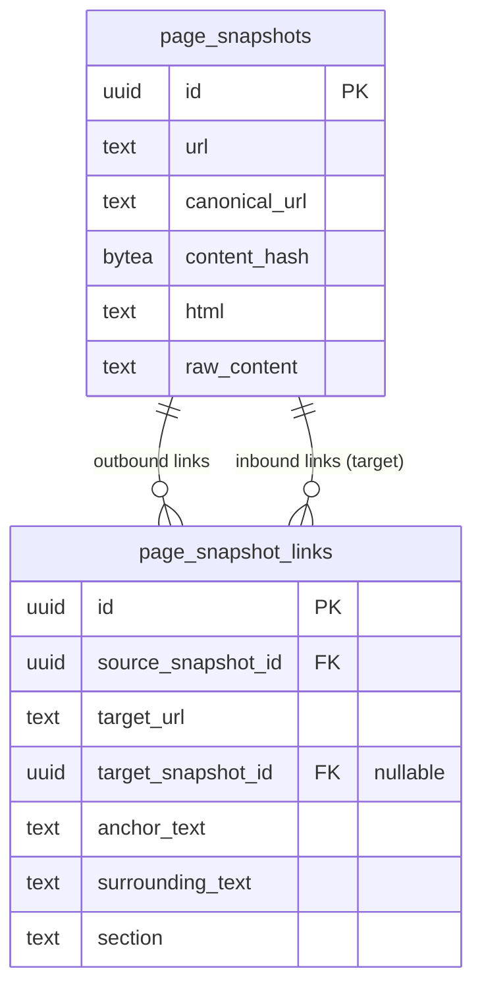

# Page Snapshot Link Graph

## Overview

Add a `page_snapshot_links` table that captures outbound links from every page snapshot with rich context (anchor text, surrounding text, section), enabling a cross-source link graph for entity authority scoring, source discovery, signal corroboration, and LLM-driven crawl decisions.

## Problem Statement

When we scrape a page, we extract links for crawling but immediately discard them. We have no persistent record of which pages link to which other pages. This means we can't answer questions like:
- "Which entities are most linked-to across sources?" (authority)
- "What URLs have we seen but never scraped?" (discovery)
- "Do multiple independent sources reference the same page?" (corroboration)
- "Should an LLM follow this link?" (crawl decisions — needs context about *why* the link exists)

## Proposed Solution

Extract links from HTML during `store_page_snapshot` using a DOM parser, store them with rich context in a new table, and resolve cross-source connections via URL normalization.

## Technical Approach

### Phase 1: Migration + Link Extraction Utility

#### 1a. Migration: `054_page_snapshot_links.sql`

```sql
CREATE TABLE page_snapshot_links (
    id UUID PRIMARY KEY DEFAULT gen_random_uuid(),
    source_snapshot_id UUID NOT NULL REFERENCES page_snapshots(id) ON DELETE CASCADE,
    target_url TEXT NOT NULL,
    target_snapshot_id UUID REFERENCES page_snapshots(id) ON DELETE SET NULL,
    anchor_text TEXT,
    surrounding_text TEXT,
    section TEXT,
    UNIQUE(source_snapshot_id, target_url)
);

CREATE INDEX idx_page_snapshot_links_source ON page_snapshot_links(source_snapshot_id);
CREATE INDEX idx_page_snapshot_links_target_url ON page_snapshot_links(target_url);
CREATE INDEX idx_page_snapshot_links_target_snapshot ON page_snapshot_links(target_snapshot_id)
    WHERE target_snapshot_id IS NOT NULL;
CREATE INDEX idx_page_snapshot_links_unresolved ON page_snapshot_links(target_url)
    WHERE target_snapshot_id IS NULL;
```

#### 1b. HTML Link Extractor: New utility module

**New file**: `modules/rootsignal-domains/src/scraping/link_extractor.rs`

**New dependency**: `scraper` crate in `rootsignal-domains/Cargo.toml` — the existing regex approach in `http.rs:34` cannot extract anchor text, surrounding text, or section. A DOM parser is required.

```rust
pub struct ExtractedLink {
    pub target_url: String,       // Absolute, normalized
    pub anchor_text: Option<String>,
    pub surrounding_text: Option<String>, // ~200 chars centered on link
    pub section: Option<String>,  // nav, header, body, footer, sidebar
}

/// Extract outbound links from HTML with rich context.
/// - Resolves relative URLs against base_url
/// - Normalizes target URLs via normalize_url()
/// - Filters: no self-links, no non-http schemes, no anchors/javascript/mailto/tel
/// - Caps at 500 links per page
/// - Deduplicates by target_url, preferring body context over nav/footer
pub fn extract_links_with_context(
    html: &str,
    base_url: &str,
) -> Vec<ExtractedLink>;
```

**Section classification strategy** (simple, based on HTML5 semantic ancestors):
- `<nav>` ancestor → `"nav"`
- `<header>` ancestor → `"header"`
- `<footer>` ancestor → `"footer"`
- `<aside>` ancestor → `"sidebar"`
- Everything else → `"body"`
- Non-semantic `<div>` with class/id heuristics: skip for now (YAGNI), default to `"body"`

**Surrounding text strategy**:
- Strip HTML tags from the parent block element
- Take up to 100 chars before and 100 chars after the anchor's text position
- If the parent block is short (<200 chars), use the entire block text

**Deduplication within a page**:
- When the same `target_url` appears multiple times (e.g., logo in nav + text link in body), keep one row
- Prefer `body` section context over `nav`/`header`/`footer`/`sidebar`
- If both are `body`, keep the one with longer `surrounding_text`

**Filters**:
- Only `http://` and `https://` schemes
- Exclude self-links (`target_url == base_url` after normalization)
- Exclude fragment-only, `javascript:`, `mailto:`, `tel:` (already done in existing code)
- Cap at 500 links per page after dedup

### Phase 2: Integration into store_page_snapshot

**Modified file**: `modules/rootsignal-domains/src/scraping/activities/store_snapshot.rs`

After the snapshot upsert (line 56) and before embedding (line 74), add:

```rust
// Extract and store outbound links if HTML is available
if let Some(html) = &page.html {
    let links = extract_links_with_context(html, &page.url);
    if !links.is_empty() {
        // Bulk insert with ON CONFLICT DO UPDATE to prefer body context
        bulk_insert_links(snapshot_id, &links, pool).await?;

        // Best-effort target resolution: look up existing snapshots
        resolve_target_snapshots(snapshot_id, pool).await?;
    }
}
```

**`bulk_insert_links`**: Uses a single multi-row INSERT with `ON CONFLICT (source_snapshot_id, target_url) DO UPDATE` that updates anchor_text/surrounding_text/section only if the new section is "body" and the existing section is not (prefers body context).

**`resolve_target_snapshots`**: After inserting links for a new snapshot, runs:

```sql
UPDATE page_snapshot_links psl
SET target_snapshot_id = ps.id
FROM page_snapshots ps
WHERE ps.canonical_url = psl.target_url
  AND psl.source_snapshot_id = $1
  AND psl.target_snapshot_id IS NULL
```

Also, when *any* new snapshot is stored, resolve dangling links pointing to its URL:

```sql
UPDATE page_snapshot_links
SET target_snapshot_id = $1
WHERE target_url = $2
  AND target_snapshot_id IS NULL
```

This bidirectional resolution keeps the graph connected without a separate backfill job.

### Phase 3: Wire into module structure

**Modified file**: `modules/rootsignal-domains/src/scraping/activities/mod.rs` — add `pub mod link_extractor;` or wherever the module tree expects it.

**Modified file**: `modules/rootsignal-domains/src/scraping/mod.rs` — expose link extractor if needed by other modules.

## Key Design Decisions

| Decision | Choice | Rationale |
|---|---|---|
| HTML parser | `scraper` crate | Regex can't extract anchor text, surrounding text, or section |
| Extract at store time | Yes | HTML available, no separate pipeline step needed |
| Section detection | HTML5 semantic elements only | YAGNI — class/id heuristics are fragile and complex |
| Target resolution | Bidirectional at insert time | No separate cron/backfill job needed |
| Link cap | 500 per page | Prevents sitemap/directory page blowup |
| Dedup strategy | One row per (snapshot, target_url), prefer body | Keeps table slim, body context is most valuable |
| Self-links | Excluded | Inflate authority scores, provide no graph value |
| Firecrawl limitation | Accepted | `only_main_content: true` strips nav/footer — document as body-only link graph |
| URL normalization | `normalize_url()` | Matches `page_snapshots.canonical_url` for target resolution |
| GraphQL surface | Deferred | Internal pipelines consume directly; API can be added when needed |

## Acceptance Criteria

- [x] Migration `054_page_snapshot_links.sql` creates table with indexes
- [x] `extract_links_with_context` extracts links from HTML with anchor_text, surrounding_text, section
- [x] Links are stored during `store_page_snapshot` when `page.html` is `Some`
- [x] No links stored when `page.html` is `None` (social/structured adapters)
- [x] `target_snapshot_id` is resolved bidirectionally at insert time
- [x] Self-links excluded, non-http schemes excluded, cap at 500 links
- [x] Dedup prefers body context over nav/footer
- [x] `scraper` crate added to `rootsignal-domains/Cargo.toml`
- [x] Existing tests pass; new unit tests for `extract_links_with_context`

## Files to Create/Modify

| File | Action | Description |
|---|---|---|
| `migrations/054_page_snapshot_links.sql` | Create | New table + indexes |
| `modules/rootsignal-domains/Cargo.toml` | Modify | Add `scraper` dependency |
| `modules/rootsignal-domains/src/scraping/link_extractor.rs` | Create | `ExtractedLink` struct + `extract_links_with_context` fn |
| `modules/rootsignal-domains/src/scraping/activities/store_snapshot.rs` | Modify | Call link extraction after snapshot upsert |
| `modules/rootsignal-domains/src/scraping/activities/mod.rs` | Modify | Expose link_extractor module |

## ERD



## Open Questions (from brainstorm, resolved)

| Question | Resolution |
|---|---|
| Surrounding text: eager or lazy? | Eager — extracted at store time, simpler and immutable |
| Filter junk links? | Cap at 500, exclude self-links and non-http. Let LLM decide on the rest |
| Backfill target_snapshot_id? | Bidirectional resolution at insert time — no separate job |

## References

- Brainstorm: `docs/brainstorms/2026-02-15-page-snapshot-link-graph-brainstorm.md`
- Existing link extraction: `modules/rootsignal-domains/src/scraping/adapters/http.rs:34-55`
- Store snapshot: `modules/rootsignal-domains/src/scraping/activities/store_snapshot.rs`
- URL normalization: `modules/rootsignal-domains/src/scraping/url_alias.rs`
- RawPage type: `modules/rootsignal-core/src/types.rs:7-78`
