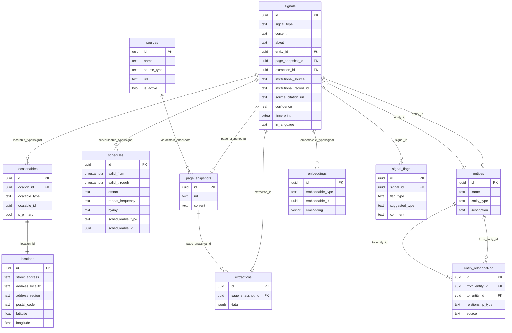

# Signal Root: Unified Vision

## Overview

Reframe Root Signal from a community listing system to a **semantic signal graph**. The system collects "broadcasts" — asks, gives, events, and informative records — from community sources and institutional databases, links them to entities, and makes everything searchable via full-text + pgvector embeddings.

This is not a new feature bolted on — it's a reframing of what the entire pipeline does.

**Brainstorm:** `docs/brainstorms/2026-02-15-institutional-accountability-signals-brainstorm.md`

## Problem Statement

The current system extracts "listings" from community sources with a taxonomy-driven classification (30+ tag kinds, LLM qualification gate, signal domains). This creates three problems:

1. **Editorial bias** — the qualification gate decides what's "worth" monitoring
2. **Taxonomy rigidity** — predefined categories can't cover the full spectrum of community activity
3. **No institutional data** — government databases (contracts, violations, enforcement) aren't connected to community signals

## Proposed Solution

Replace `listings` with `signals`. Four types: `ask`, `give`, `event`, `informative`. LLM reads content and classifies semantically — no taxonomy, no tags. Content is searchable via full-text + embeddings. Institutional databases (USAspending, EPA ECHO) feed `informative` signals. Qualification gate removed; adaptive cadence handles low-value sources mechanically.

## Technical Approach

### Architecture

The existing pipeline stays intact. What changes:

```
Source → Scrape → page_snapshot → [NEW] Signal Extraction → signals table
                                                          → entity linking
                                                          → embedding generation
```

**What's new:**
- `signals` table (replaces `listings` over time)
- `ExtractedSignal` struct (replaces `ExtractedListing`)
- Domain-matched adapters for institutional APIs (usaspending, epa_echo) — same pattern as instagram/facebook/x
- Signal extraction prompt (replaces listing extraction prompt)

**What's removed:**
- Qualification gate (`qualify_source.rs` — embedding pre-screen + LLM)
- Tag-based taxonomy (tags, taggables, tag_kinds for listings)
- `signal_domain`, `audience_role`, `category`, `listing_type` tag filters

**What's reused (polymorphic infra):**
- `locationables` — signals get geocoded locations via `locatable_type = 'signal'` (same geo queries as listings)
- `schedules` — signals get temporal data via `scheduleable_type = 'signal'` (iCal-aligned: one-time events, recurring programs, date ranges)
- `embeddings` — signals get vector embeddings via `embeddable_type = 'signal'`

**What stays:**
- Sources, page_snapshots, adaptive cadence, entity model, entity_relationships
- Source creation: single text input → domain detection → adapter selection (existing pattern)
- Scraping adapters (http, spider, firecrawl, social media)
- Embedding infrastructure (pgvector, HNSW indexes)
- Hybrid search (full-text + vector)

### Implementation Phases

#### Phase 1: Signal Data Model & Migration

Create the `signals` table alongside `listings`. No destructive migration — both coexist during transition.

##### `migrations/049_signals.sql`

```sql
-- Signal types: ask, give, event, informative
-- Location via locationables (locatable_type = 'signal') — reuses existing geo infra
-- Temporal via schedules (scheduleable_type = 'signal') — reuses existing iCal infra
-- Embeddings via embeddings (embeddable_type = 'signal') — reuses existing vector infra
CREATE TABLE signals (
    id UUID PRIMARY KEY DEFAULT gen_random_uuid(),
    signal_type TEXT NOT NULL CHECK (signal_type IN ('ask', 'give', 'event', 'informative')),
    content TEXT NOT NULL,
    about TEXT,                          -- schema.org: subject matter (what's being asked/given/discussed)
    entity_id UUID REFERENCES entities(id) ON DELETE SET NULL,
    source_url TEXT,

    -- Provenance
    page_snapshot_id UUID REFERENCES page_snapshots(id) ON DELETE SET NULL,
    extraction_id UUID REFERENCES extractions(id) ON DELETE SET NULL,
    institutional_source TEXT,          -- 'usaspending', 'epa_echo', etc. (NULL for community)
    institutional_record_id TEXT,       -- external ID (award_id, frs_id, etc.)
    source_citation_url TEXT,           -- direct link to government source

    -- Quality
    confidence REAL NOT NULL DEFAULT 0.7,
    fingerprint BYTEA NOT NULL,
    schema_version INT NOT NULL DEFAULT 1,

    -- Language (schema.org: inLanguage, BCP 47)
    in_language TEXT NOT NULL DEFAULT 'en',

    -- Timestamps
    created_at TIMESTAMPTZ NOT NULL DEFAULT NOW(),
    updated_at TIMESTAMPTZ NOT NULL DEFAULT NOW(),

    UNIQUE(fingerprint, schema_version)
);

CREATE INDEX idx_signals_type ON signals(signal_type);
CREATE INDEX idx_signals_entity ON signals(entity_id);
CREATE INDEX idx_signals_created ON signals(created_at DESC);
CREATE INDEX idx_signals_institutional ON signals(institutional_source, institutional_record_id)
    WHERE institutional_source IS NOT NULL;
CREATE INDEX idx_signals_snapshot ON signals(page_snapshot_id);

-- Full-text search on content + about
ALTER TABLE signals ADD COLUMN search_vector tsvector
    GENERATED ALWAYS AS (
        setweight(to_tsvector('english', coalesce(content, '')), 'A') ||
        setweight(to_tsvector('english', coalesce(about, '')), 'B')
    ) STORED;

CREATE INDEX idx_signals_search ON signals USING GIN(search_vector);
```

**Polymorphic infra — no new tables needed:**

- **Location:** `locationables` row with `locatable_type = 'signal'`, `locatable_id = signal.id` → links to `locations` table with lat/lng, city, state, postal_code. LLM extracts raw location text, extraction activity calls `Location::find_or_create_from_extraction()` and creates `Locationable` — same as listings do today.
- **Schedule:** `schedules` row with `scheduleable_type = 'signal'`, `scheduleable_id = signal.id` → stores `valid_from`/`valid_through` for date ranges, `dtstart`/`freq`/`byday` for recurring programs (e.g., "Food pantry Mon-Fri 9-5"), one-time event dates. Same iCal-aligned infra listings use.
- **Embedding:** `embeddings` row with `embeddable_type = 'signal'`, `embeddable_id = signal.id` → pgvector with HNSW index. Same as listings/entities.

This means geo queries on signals use the exact same Haversine joins, map view works identically, and recurring signals (gives with hours, weekly events) get proper iCal representation.

##### `modules/rootsignal-core/src/types.rs` — New ExtractedSignal

```rust
/// What the AI extracts from content — a semantic signal.
///
/// schema.org alignment:
///   signal_type "ask"         → schema:Demand
///   signal_type "give"        → schema:Offer
///   signal_type "event"       → schema:Event
///   signal_type "informative" → schema:Report
///   about                     → schema:about (subject matter)
///   location_text             → schema:location (geocoded into locationables)
///   start_date / end_date     → schema:startDate / endDate (stored in schedules)
///   in_language               → schema:inLanguage (BCP 47)
#[derive(Debug, Clone, Serialize, Deserialize, schemars::JsonSchema)]
pub struct ExtractedSignal {
    /// Signal type: ask, give, event, informative
    pub signal_type: String,
    /// Natural language description of the signal
    pub content: String,
    /// schema.org: about — what's being asked/given/discussed
    pub about: Option<String>,
    /// Entity name (organization, company, agency)
    pub entity_name: Option<String>,
    /// Entity type (organization, government_entity, business_entity)
    pub entity_type: Option<String>,
    /// Location mention (raw text — extraction activity geocodes into locationables)
    pub location_text: Option<String>,
    /// Address components (extraction activity creates Location record)
    pub address: Option<String>,
    pub city: Option<String>,
    pub state: Option<String>,
    pub postal_code: Option<String>,
    /// Temporal (ISO 8601 — extraction activity creates Schedule record)
    pub start_date: Option<String>,
    pub end_date: Option<String>,
    pub is_recurring: Option<bool>,
    pub recurrence_description: Option<String>,
    /// Source URL
    pub source_url: Option<String>,
    /// Detected language (BCP 47)
    pub source_locale: Option<String>,
}

/// Wrapper for batch signal extraction response.
#[derive(Debug, Clone, Serialize, Deserialize, schemars::JsonSchema)]
pub struct ExtractedSignals {
    pub signals: Vec<ExtractedSignal>,
}
```

The extraction activity normalizes `ExtractedSignal` fields into polymorphic tables — same pattern as the current listing normalization in `extract.rs` → `normalize.rs`:

1. `location_text` / address fields → `Location::find_or_create_from_extraction()` → `Locationable::create("signal", signal_id)`
2. `start_date` / `end_date` / recurrence → `Schedule::create("signal", signal_id, ...)`
3. `content` → `Embedding::upsert("signal", signal_id, ...)`

##### `modules/rootsignal-domains/src/signals/` — New Signal domain module

```
modules/rootsignal-domains/src/signals/
├── mod.rs                  -- pub mod models; pub mod activities;
├── models/
│   ├── mod.rs
│   └── signal.rs           -- Signal struct, CRUD, filtered queries
└── activities/
    ├── mod.rs
    └── extract_signals.rs  -- LLM extraction into signals (replaces extract.rs)
```

Key files:

- `signal.rs` — `Signal` struct with `find_by_type`, `find_by_entity`, `find_near_location`, `search_hybrid`
- `extract_signals.rs` — reads page_snapshot content, calls LLM with signal extraction prompt, creates Signal rows + entity links + embeddings

**Acceptance Criteria:**
- [x] `signals` table created with migration `049_signals.sql`
- [x] `Signal` Rust model with CRUD operations in `modules/rootsignal-domains/src/signals/models/signal.rs`
- [x] `ExtractedSignal` + `ExtractedSignals` structs in `modules/rootsignal-core/src/types.rs`
- [x] Signal extraction activity in `modules/rootsignal-domains/src/signals/activities/extract_signals.rs`
- [x] Extraction activity creates `locationables` rows (`locatable_type = 'signal'`) via existing `Location::find_or_create_from_extraction()`
- [x] Extraction activity creates `schedules` rows (`scheduleable_type = 'signal'`) for temporal data
- [x] Extraction activity creates `embeddings` rows (`embeddable_type = 'signal'`) for vector search
- [x] Full-text search index on `content`, `about`
- [x] `ResourceType::Signal` added to `types.rs` enum
- [x] Geo queries on signals use same Haversine joins as listings (via `locationables`)

---

#### Phase 2: Signal Extraction Prompt

Replace the listing extraction prompt with a signal-aware prompt.

##### `config/prompts/signal_extraction.md`

```markdown
You are a signal classifier for a community information system. You read content
and extract structured signals — broadcasts that someone put into the world.

## Signal Types

- **ask**: Entity needs something. Someone can help.
  "We need food pantry volunteers this Saturday"
  "Donations needed for flood relief"
  "Looking for volunteer lawyers for legal clinic"

- **give**: Entity offers something actionable. Someone can receive.
  "Free meals every Tuesday, no questions asked"
  "Food pantry Mon-Fri 9-5" (infer: this means free food is available)
  "Free legal clinic March 5 at the library"

- **event**: People are gathering. Someone can show up.
  "Community meeting Thursday to discuss the proposed development"
  "River cleanup Saturday 9am, meet at Bridge Park"
  "Know your rights workshop March 5"

- **informative**: A published institutional record. A documented fact.
  "EPA fined Company X $2M for Clean Water Act violation"
  "Company Y was awarded a $50M contract by ICE"
  Always use for government database records.

## What Is NOT a Signal

Descriptions, about pages, mission statements, staff directories, service
schedules without actionable content. "We hold services Sunday at 10am" is
NOT a signal. "We need volunteers for Sunday service" IS an ask.

## Rules

1. Classify each signal into exactly ONE type
2. Extract `about` — the subject matter (what's being asked/given/discussed)
3. Extract entity name if mentioned
4. Extract location if mentioned (address, city, state, postal code — will be geocoded)
5. Extract dates if mentioned (ISO 8601). For recurring programs, note recurrence
   ("Mon-Fri 9-5" → is_recurring: true, recurrence_description: "Monday through Friday, 9am to 5pm")
6. If content contains MULTIPLE signals, extract each separately
7. If content is purely descriptive (not a broadcast), return empty array

Do NOT classify urgency or tone. The system stores facts (about, when, where, who).
The user decides what's urgent to them. Emotional language ("URGENT!",
"desperate") should not influence signal ranking or classification.
```

**Acceptance Criteria:**
- [x] Signal extraction prompt at `config/prompts/signal_extraction.md`
- [x] `PromptRegistry` updated to load `signal_extraction_prompt()` in `modules/rootsignal-core/src/prompt_registry.rs`
- [x] Extraction activity uses new prompt when extracting signals (not listings)
- [x] Integration test: social media post → correct signal type + semantic fields

---

#### Phase 3: Remove Qualification Gate

Replace the two-pass qualification (embedding pre-screen + LLM) with direct activation. Sources are created `is_active = TRUE` by default. Adaptive cadence handles everything.

##### Changes to `modules/rootsignal-domains/src/scraping/source.rs`

- `compute_cadence()` — remove qualification_status dependency. Base cadence by source type only.
- Sources created with `is_active = TRUE` (already partially done in migration 042)
- Remove `qualification_status`, `qualification_summary`, `qualification_score` from `Source` struct (or deprecate — leave columns, stop using)
- Remove `find_pending_qualification()` method

##### Changes to pipeline

- `qualify_source.rs` — soft-delete (stop calling from pipeline). Keep file for reference.
- Scraping workflow: source created → first scrape → extraction → signals. No qualification step.
- If a source produces 0 signals after 10 consecutive scrapes, `consecutive_misses` naturally backs off cadence to max ceiling.

##### Migration: `050_remove_qualification_gate.sql`

```sql
-- Sources active by default, qualification columns deprecated
ALTER TABLE sources ALTER COLUMN is_active SET DEFAULT TRUE;

-- Don't drop qualification columns yet — deprecate in code, remove in future migration
COMMENT ON COLUMN sources.qualification_status IS 'DEPRECATED: qualification gate removed. Adaptive cadence handles source quality.';
COMMENT ON COLUMN sources.qualification_score IS 'DEPRECATED: qualification gate removed.';
COMMENT ON COLUMN sources.qualification_summary IS 'DEPRECATED: qualification gate removed.';
```

**Acceptance Criteria:**
- [x] Sources created with `is_active = TRUE` by default
- [x] `compute_cadence()` no longer references `qualification_status`
- [x] Qualification pipeline no longer runs on new sources
- [x] Existing qualified sources continue working (no data loss)
- [x] Sources with 10+ consecutive misses backed off to max ceiling (existing behavior)

---

#### Phase 4: Institutional Domain Adapters

Institutional APIs are just domains. The same `parse_source_input()` that matches `instagram.com` → instagram adapter now matches `api.usaspending.gov` → usaspending adapter. Admin enters a URL, system picks the adapter by domain. No special source types.

##### Domain → Adapter Mapping (added to `parse_source_input()`)

```
| URL domain                  | source_type    | Name derivation              |
|----------------------------|----------------|------------------------------|
| api.usaspending.gov        | usaspending    | "USAspending" + query params |
| echodata.epa.gov           | epa_echo       | "EPA ECHO" + query params    |
| (existing)                 |                |                              |
| instagram.com              | instagram      | handle from path             |
| facebook.com               | facebook       | handle from path             |
| x.com / twitter.com        | x              | handle from path             |
```

##### Source Config (same pattern as `web_search`)

Admin enters: `https://api.usaspending.gov/api/v2/search/spending_by_award/`

`parse_source_input()` detects domain → creates source with config:

```json
{
  "source_type": "usaspending",
  "config": {
    "query_type": "recipient_name",
    "query_value": "GEO Group",
    "date_range_start": "2020-01-01"
  }
}
```

Same for EPA ECHO: `https://echodata.epa.gov/echo/dfr_rest_services.get_facility_info`

```json
{
  "source_type": "epa_echo",
  "config": {
    "facility_name": "Acme Corporation"
  }
}
```

##### Adapter Cadence

Added to `source_category()`:

```rust
fn source_category(source_type: &str) -> &'static str {
    match source_type {
        "instagram" | "facebook" | "x" | "tiktok" | "gofundme" => "social",
        "web_search" | "search_query" => "search",
        "usaspending" | "epa_echo" => "institutional",  // NEW
        _ => "website",
    }
}
```

Institutional cadence: base = 168h (weekly), ceiling = 720h (30 days). Government data updates slowly — no need to poll frequently.

##### USAspending Adapter: `modules/rootsignal-domains/src/scraping/adapters/usaspending.rs`

- API: `https://api.usaspending.gov/api/v2/`
- Auth: None (free, public)
- Rate limit: 30 req/min with exponential backoff on 429
- Endpoints: `POST /search/spending_by_award/`, `GET /awards/{id}/`, `POST /subawards/`
- Query strategy: entity-driven (query by recipient name from config)
- Returns `Vec<RawPage>` with structured JSON content per award

```rust
pub async fn fetch_awards(config: &serde_json::Value, deps: &ServerDeps) -> Result<Vec<RawPage>> {
    // POST /search/spending_by_award/ with recipient_name filter from config
    // Paginate through results (page_size=100)
    // For each award, create a RawPage with JSON content
    // Rate limit: 30 req/min with exponential backoff on 429
}
```

LLM translates each award JSON → natural language `informative` signal:

```
Award JSON → Signal:
{
  signal_type: "informative",
  content: "GEO Group Inc was awarded a $110M contract by Immigration and Customs Enforcement for custodial services, 2017 to 2022.",
  entity_name: "GEO Group Inc",
  about: "federal contract for custodial services",
  start_date: "2017-06-01",
  end_date: "2022-05-31",
  source_url: "https://api.usaspending.gov/api/v2/awards/..."
}
```

##### EPA ECHO Adapter: `modules/rootsignal-domains/src/scraping/adapters/epa_echo.rs`

- API: `https://echodata.epa.gov/echo/`
- Auth: None
- Two-step QID pattern:
  1. `GET /dfr_rest_services.get_facility_info?p_name=...&output=JSON` → `QueryID`
  2. `GET /dfr_rest_services.get_dfr?qid=<QID>&output=JSON` → facility + violations
- Retry: if QID step fails, wait 5s, retry up to 3 times
- Violation severity preserved in content: HPV (air), SNC (water/RCRA), Serious Violator (SDWA)

```rust
pub async fn fetch_violations(config: &serde_json::Value, deps: &ServerDeps) -> Result<Vec<RawPage>> {
    // Step 1: GET facility info by name → QID
    // Step 2: GET detailed facility report by QID
    // Retry with backoff
    // Parse violations, create RawPage per violation record
}
```

##### Entity Matching (Tiered — shared across all institutional adapters)

1. **Exact EIN/DUNS** — entity `tax_id` matches award's `recipient_uei` → auto-link (confidence 1.0)
2. **Exact name** — normalized case-insensitive → auto-link (confidence 0.9)
3. **Fuzzy name** — Levenshtein distance < 3 → admin review queue (confidence 0.6)
4. **No match** → create new entity, queue for merge review

**Acceptance Criteria:**
- [x] `parse_source_input()` matches `api.usaspending.gov` → `usaspending` and `echodata.epa.gov` → `epa_echo`
- [x] `source_category()` handles `"institutional"` category with appropriate cadence
- [x] USAspending adapter at `modules/rootsignal-domains/src/scraping/adapters/usaspending.rs`
- [x] EPA ECHO adapter at `modules/rootsignal-domains/src/scraping/adapters/epa_echo.rs`
- [x] Both return `Vec<RawPage>` — same interface as all other adapters
- [x] Award/violation JSON → LLM → natural language `informative` signal
- [x] Entity matching: EIN exact → name exact → fuzzy → new entity
- [x] Source citation URLs point to government source pages
- [x] Integration tests: mock API responses → signals created in DB

---

#### Phase 5: GraphQL API Updates

Update the GraphQL schema to expose signals alongside (and eventually replacing) listings.

##### `modules/rootsignal-server/src/graphql/signals/`

```
modules/rootsignal-server/src/graphql/signals/
├── mod.rs
├── types.rs         -- SignalType, SignalNode, SignalConnection
├── queries.rs       -- signals(type, near, search, entity_id)
└── mutations.rs     -- flagSignal(id, flagType, suggestedCorrection)
```

##### Key Queries

```graphql
type Signal {
  id: ID!
  signalType: SignalType!
  content: String!
  about: String                     # schema.org: about
  entity: Entity
  locations: [Location!]!           # via locationables (locatable_type = 'signal')
  schedules: [Schedule!]!           # via schedules (scheduleable_type = 'signal')
  sourceCitationUrl: String
  institutionalSource: String
  confidence: Float!
  inLanguage: String!
  createdAt: DateTime!
}

enum SignalType { ASK, GIVE, EVENT, INFORMATIVE }

type Query {
  signals(
    type: SignalType
    entityId: ID
    search: String
    lat: Float
    lng: Float
    radiusKm: Float
    since: DateTime
    limit: Int = 50
    offset: Int = 0
  ): SignalConnection!

  signal(id: ID!): Signal
}

type Mutation {
  flagSignal(
    id: ID!
    flagType: FlagType!
    suggestedType: SignalType
    comment: String
  ): Boolean!
}

enum FlagType { WRONG_TYPE, WRONG_ENTITY, EXPIRED, SPAM }
```

**Acceptance Criteria:**
- [x] `Signal` GraphQL type with all fields
- [x] `signals` query with type, entity, search, geo, temporal filters
- [x] `flagSignal` mutation for user corrections
- [x] Entity page shows signals grouped by type
- [x] Hybrid search (full-text + embedding) on `search` parameter

---

#### Phase 6: Admin App Updates

Update the Next.js admin app to manage signals and institutional sources.

##### New/Updated Pages

- `/signals` — Signal list with type filter tabs (ask/give/event/informative)
- `/signals/[id]` — Signal detail with entity link, source citation, flag button
- `/entities/[id]` — Updated entity page showing signals (not listings), grouped by type
- `/sources/new` — Same single text input. `https://api.usaspending.gov/...` just works (domain detection)
- `/sources/[id]` — Shows signals produced by this source (not listings)

##### Entity Page: Breadcrumb Navigation

Entity page shows:
1. Entity details (name, type, description)
2. Signals grouped by type (tabs: ask/give/event/informative)
3. Related entities (from `entity_relationships`)
4. Map of signals with location data

**Acceptance Criteria:**
- [x] Signals list page with type filter tabs
- [x] Signal detail page with entity link + source citation
- [x] Entity page updated to show signals
- [x] Institutional URLs auto-detected (no special form — same single text input)
- [x] Flag button on signal detail page

---

## Entity Relationship Diagram



## Migration: `051_signal_flags.sql`

```sql
CREATE TABLE signal_flags (
    id UUID PRIMARY KEY DEFAULT gen_random_uuid(),
    signal_id UUID NOT NULL REFERENCES signals(id) ON DELETE CASCADE,
    flag_type TEXT NOT NULL CHECK (flag_type IN ('wrong_type', 'wrong_entity', 'expired', 'spam')),
    suggested_type TEXT CHECK (suggested_type IN ('ask', 'give', 'event', 'informative')),
    comment TEXT,
    resolved BOOLEAN NOT NULL DEFAULT FALSE,
    created_at TIMESTAMPTZ NOT NULL DEFAULT NOW()
);

CREATE INDEX idx_signal_flags_signal ON signal_flags(signal_id);
CREATE INDEX idx_signal_flags_unresolved ON signal_flags(resolved) WHERE resolved = FALSE;
```

## Key Design Decisions

| Decision | Choice | Rationale |
|----------|--------|-----------|
| Signal table vs. listing rename | New `signals` table alongside `listings` | Non-destructive migration, parallel operation during transition |
| Qualification gate | Removed | Adaptive cadence naturally handles low-value sources (exponential backoff) |
| Taxonomy/tags | Removed for signals | Content is the metadata — searchable via full-text + embeddings |
| Institutional data query strategy | Entity-driven (not full crawl) | Avoids 400M+ record ingestion, eliminates bias of choosing which agencies to crawl |
| Institutional adapters | Domain-matched, not special source types | Same pattern as instagram/facebook/x — `parse_source_input()` detects domain, picks adapter. No special creation UI. |
| Entity matching | Tiered: EIN exact → name exact → fuzzy → new entity | Balances automation with accuracy |
| Database | Postgres + pgvector | Per brainstorm decision. Recursive CTEs for entity traversal. |
| Urgency | Not a system field — dropped entirely | Emotional language ("URGENT!") shouldn't rank signals. Temporal proximity is a fact (stored in `schedules`). Scale is in `content`. User decides what's urgent. |
| Location/temporal | Reuse existing polymorphic infra (`locationables`, `schedules`) | No new geo/temporal tables. Signals get same Haversine queries, iCal schedules, and map view as listings. |
| schema.org alignment | `about` (subject), `inLanguage` (BCP 47), signal types map to Demand/Offer/Event/Report | Aligned with existing schema.org renames (migrations 040, 041) |
| Signal expiry | Via `schedules.valid_through` — events expire on date, asks/gives expire via `valid_through`, informative never expires | Keeps search fresh without losing historical institutional records |
| LLM classification accuracy | 95% target, user flagging for corrections | Per brainstorm — "good enough, not perfect" |

## Open Questions (from Brainstorm)

These were identified during brainstorming and have proposed resolutions in this plan:

| Question | Proposed Resolution |
|----------|-------------------|
| Entity relationship modeling | Use existing `entity_relationships` table, add `contractor`, `subsidiary` to CHECK constraint |
| Institutional crawl cadence | Weekly for USAspending, monthly for EPA ECHO (configurable per source) |
| Retracted/corrected evidence | Re-crawl detects changes via fingerprint; old signal archived, new one created |
| Entity matching strategy | Tiered: EIN/DUNS exact → name exact → fuzzy → new entity (Phase 4) |
| USAspending volume | Entity-driven queries, not full crawl |

## Dependencies & Risks

| Risk | Mitigation |
|------|-----------|
| USAspending API rate limits | Conservative 30 req/min, exponential backoff on 429 |
| LLM misclassification | 95% bar + user flagging + admin review queue |
| Entity matching false positives | Fuzzy matches require admin review (confidence < 0.9) |
| Database growth from institutional data | Entity-driven queries limit volume; retention policy for expired signals |
| Migration disruption | Parallel tables, no destructive changes, gradual transition |

## References

### Internal
- Brainstorm: `docs/brainstorms/2026-02-15-institutional-accountability-signals-brainstorm.md`
- Current extraction: `modules/rootsignal-domains/src/extraction/activities/extract.rs`
- Entity model: `modules/rootsignal-domains/src/entities/models/entity.rs`
- Entity relationships: `modules/rootsignal-domains/src/entities/models/entity_relationship.rs`
- Source model: `modules/rootsignal-domains/src/scraping/source.rs`
- Adaptive cadence: `modules/rootsignal-domains/src/scraping/source.rs:42` (`compute_cadence`)
- Qualification gate: `modules/rootsignal-domains/src/scraping/activities/qualify_source.rs`
- ExtractedListing: `modules/rootsignal-core/src/types.rs:92`

### External
- USAspending API: `https://api.usaspending.gov/api/v2/` (free, no auth)
- EPA ECHO API: `https://echodata.epa.gov/echo/` (free, no auth)
- ICE subtier code: `7012` under DHS toptier `070`
