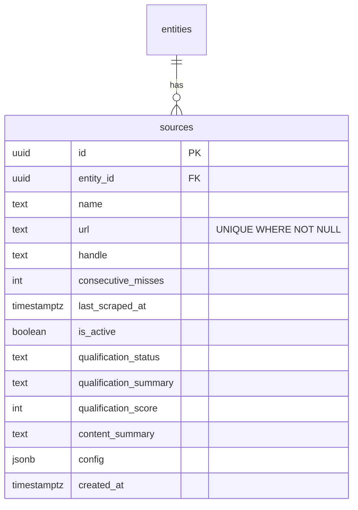

# Simplify Source Architecture

## Overview

A source is a URL (or a search query). Drop `source_type` column, drop `website_sources` and `social_sources` child tables, normalize URLs on input, and derive everything — adapter, cadence, category — from the URL at runtime.

Precedent: migration 037 already dropped the `adapter` column the same way. Migration 046 already moved cadence to runtime computation. This continues that trajectory.

## Proposed Solution

Replace `parse_source_input()` with `normalize_and_classify()` — one function that takes raw input, normalizes the URL, and returns everything needed (normalized URL, adapter hint, name, handle). Store the normalized URL. Derive source_type as a computed GraphQL field so the frontend needs zero changes.

## Acceptance Criteria

- [x] `source_type` column dropped from `sources` table
- [x] `website_sources` and `social_sources` tables dropped
- [x] URLs normalized before storage (www stripped, trailing slashes removed, tracking params stripped, domain aliases canonicalized, https forced)
- [x] `UNIQUE(url)` constraint on `sources` table
- [x] `addSource` returns existing source if normalized URL already exists (find-or-create)
- [x] `createSource` mutation removed (replaced entirely by `addSource`)
- [x] `source_type` exposed as computed GraphQL field — frontend unchanged
- [x] Adapter selection derived from URL domain at scrape time
- [x] Cadence derived from URL domain at scheduling time
- [x] Existing data migrated: URLs backfilled from child tables, then normalized
- [x] All existing tests pass (updated for new signatures)

## Implementation

### Phase 1: Add `normalize_and_classify()` function

**File: `modules/rootsignal-domains/src/scraping/source.rs`**

Replace `parse_source_input()` with `normalize_and_classify()`. Same domain-matching logic, but now also normalizes the URL before returning.

```rust
pub struct ClassifiedSource {
    pub normalized_url: Option<String>,  // None for web_search
    pub name: String,
    pub handle: Option<String>,
    pub config: serde_json::Value,
}

pub fn normalize_and_classify(input: &str) -> ClassifiedSource {
    // 1. Trim input
    // 2. If not a URL → web_search (url = None, query in config)
    // 3. Parse URL
    // 4. Lowercase + strip www.
    // 5. Canonicalize domain aliases (fb.com → facebook.com, twitter.com → x.com)
    // 6. Strip tracking params (utm_*, fbclid, gclid, ref, mc_cid)
    // 7. Strip trailing slashes
    // 8. Force https://
    // 9. Extract name/handle based on domain
    // 10. Return ClassifiedSource
}
```

Normalization rules:

| Domain | Rule |
|--------|------|
| Social (instagram, facebook, x, tiktok) | `https://{canonical_domain}/{handle}` — strip all query params and trailing path |
| Instagram search (`/explore/search/`) | Preserve `?q=` param only |
| GoFundMe | Preserve `/f/{slug}` path |
| Generic website | Strip `utm_*`, `fbclid`, `gclid`, `ref` params; keep meaningful path/query |
| All | Lowercase domain, strip `www.`, force `https://`, strip trailing slash |

Add a companion function for adapter/category derivation from a URL:

```rust
/// Derive the source category from a URL for cadence computation.
/// Returns "social", "search", or "website".
pub fn source_category_from_url(url: Option<&str>) -> &'static str {
    // None → "search"
    // instagram/facebook/x/tiktok/gofundme domain → "social"
    // everything else → "website"
}

/// Derive the adapter name from a URL for scraping.
pub fn adapter_for_url(url: Option<&str>) -> &'static str {
    // None → not applicable (web_search uses web_searcher directly)
    // instagram.com → "apify_instagram"
    // facebook.com → "apify_facebook"
    // x.com → "apify_x"
    // tiktok.com → "apify_tiktok"
    // gofundme.com → "apify_gofundme"
    // everything else → "spider"
}
```

Update `compute_cadence()` to accept `url: Option<&str>` instead of `source_type: &str`.

Update `Source::effective_cadence_hours()` to pass `self.url.as_deref()`.

**Tests:** Comprehensive tests for normalization edge cases:
- `instagram.com/user/` → `https://instagram.com/user`
- `www.instagram.com/user?blah=1` → `https://instagram.com/user`
- `fb.com/page` → `https://facebook.com/page`
- `twitter.com/user` → `https://x.com/user`
- `example.com/page?utm_source=foo&real=bar` → `https://example.com/page?real=bar`
- `http://EXAMPLE.COM/Page` → `https://example.com/Page` (lowercase domain, preserve path case)
- `community spaces Minneapolis` → `ClassifiedSource { normalized_url: None, ... }`

### Phase 2: Update `Source` struct and creation methods

**File: `modules/rootsignal-domains/src/scraping/source.rs`**

1. Remove `source_type: String` from `Source` struct (line 13)
2. Add `pub fn source_type(&self) -> &str` method that derives from `self.url`
3. Update `Source::create()` — remove `source_type` parameter, remove from SQL INSERT
4. Update `Source::create_from_input()`:
   - Call `normalize_and_classify()` instead of `parse_source_input()`
   - Remove child record creation (`WebsiteSource::create`, `SocialSource::create`)
   - Before INSERT, check `SELECT id FROM sources WHERE url = $1` for dedup (find-or-create)
5. Update `Source::find_or_create_website()` — replace `website_sources.domain` lookup with `sources.url` lookup after normalization
6. Update `Source::find_or_create_social()` — replace `social_sources(platform, handle)` lookup with `sources.url` lookup after normalization
7. Delete `WebsiteSource` struct and impl entirely (lines 453-491)
8. Delete `SocialSource` struct and impl entirely (lines 493-522)
9. Update all tests

**File: `modules/rootsignal-domains/src/scraping/mod.rs`** (line 9)

Remove `SocialSource` and `WebsiteSource` from re-exports.

### Phase 3: Update scraping activities

**File: `modules/rootsignal-domains/src/scraping/activities/scrape_source.rs`**

1. `ScrapeOutput.source_type` → remove field, callers derive from source URL
2. `scrape_source()` (line 33): replace `source.source_type == "web_search"` with `source.url.is_none()`
3. `scrape_content_source()` (line 110): replace `match source.source_type.as_str()` with `adapter_for_url(source.url.as_deref())`
4. Remove `source_type` from `ScrapeOutput` construction (lines 52-54, 101-103)

**File: `modules/rootsignal-domains/src/scraping/activities/detect_entity.rs`** (line 53-58)

Replace `source.source_type` in user prompt with `source.source_type()` (the new derived method).

**File: `modules/rootsignal-domains/src/scraping/restate/mod.rs`**

1. Line 92: remove `"source_type": output.source_type` from serialized payload
2. Lines 105-111: replace `source_type == "web_search"` branching with checking if `snapshot_ids` is empty and `discovered_pages` is non-empty (or pass a boolean `is_search` flag)

**File: `modules/rootsignal-domains/src/entities/activities/discover_social.rs`**

Update calls to `Source::find_or_create_social()` — signature changes since child tables are gone.

### Phase 4: Update GraphQL layer

**File: `modules/rootsignal-server/src/graphql/sources/types.rs`**

Make `source_type` a computed field:

```rust
#[derive(SimpleObject, Clone)]
#[graphql(complex)]
pub struct GqlSource {
    pub id: Uuid,
    pub entity_id: Option<Uuid>,
    pub name: String,
    // source_type removed from struct fields
    pub url: Option<String>,
    pub handle: Option<String>,
    // ... rest unchanged
}

#[ComplexObject]
impl GqlSource {
    async fn source_type(&self) -> String {
        rootsignal_domains::scraping::source_type_from_url(self.url.as_deref()).to_string()
    }

    // existing signal_count resolver unchanged
}
```

Update `From<Source>` impl — remove `source_type: s.source_type` line.

**File: `modules/rootsignal-server/src/graphql/sources/mutations.rs`**

1. Delete `CreateSourceInput` struct and `create_source` mutation entirely (lines 12-54) — `addSource` is the only creation path
2. Update `add_source` tracing (line 71) — use derived source_type or just remove it

### Phase 5: Database migration

**File: `migrations/049_simplify_sources.sql`** (new)

```sql
-- Step 1: Backfill URLs from child tables for any sources missing them
UPDATE sources s
SET url = 'https://' || ss.platform || '.com/' || ss.handle
FROM social_sources ss
WHERE ss.source_id = s.id
  AND s.url IS NULL;

UPDATE sources s
SET url = 'https://' || ws.domain
FROM website_sources ws
WHERE ws.source_id = s.id
  AND s.url IS NULL;

-- Step 2: Normalize existing URLs
-- (This is best done in application code via a Rust migration script
--  since URL normalization logic lives in Rust. Add a one-time task.)

-- Step 3: Drop source_type column
ALTER TABLE sources DROP COLUMN source_type;

-- Step 4: Drop child tables
DROP TABLE IF EXISTS social_sources;
DROP TABLE IF EXISTS website_sources;

-- Step 5: Add unique constraint on normalized URL
-- (NULL urls for web_search sources are fine — Postgres UNIQUE allows multiple NULLs)
CREATE UNIQUE INDEX idx_sources_url_unique ON sources (url) WHERE url IS NOT NULL;

-- Step 6: Drop the old source_type index
DROP INDEX IF EXISTS idx_sources_type;
```

**Note:** URL normalization of existing data should be run as a Rust one-time task before the migration, since the normalization logic is in Rust. The migration itself just drops the column and tables.

### Phase 6: Admin app (minimal changes)

The frontend queries `sourceType` from GraphQL. Since it becomes a computed field with the same name and same values, **no frontend changes are needed** for display and filtering.

The only change: the "new source" modal (`@modal/(.)sources/new/page.tsx`) currently uses `CreateSourceInput` with a `sourceType` dropdown. Since `createSource` is being removed, this modal should use `addSource(input: String!)` instead — which it may already do (the sources table has an `addSource` input field). Verify and remove the old modal if redundant.

## Files Changed Summary

| File | Change |
|------|--------|
| `modules/rootsignal-domains/src/scraping/source.rs` | Major: new normalize_and_classify, remove source_type field, delete child structs, update all methods |
| `modules/rootsignal-domains/src/scraping/mod.rs` | Remove child struct re-exports |
| `modules/rootsignal-domains/src/scraping/activities/scrape_source.rs` | Derive adapter from URL, remove source_type from ScrapeOutput |
| `modules/rootsignal-domains/src/scraping/activities/detect_entity.rs` | Use derived source_type method |
| `modules/rootsignal-domains/src/scraping/restate/mod.rs` | Remove source_type from serialized payload, adjust branching |
| `modules/rootsignal-domains/src/entities/activities/discover_social.rs` | Update find_or_create_social calls |
| `modules/rootsignal-server/src/graphql/sources/types.rs` | Make source_type a computed ComplexObject field |
| `modules/rootsignal-server/src/graphql/sources/mutations.rs` | Delete createSource, clean up addSource |
| `modules/admin-app/app/(app)/@modal/(.)sources/new/page.tsx` | Remove or simplify (use addSource only) |
| `migrations/049_simplify_sources.sql` | New: drop column, drop tables, add unique index |

## Not In Scope

- **`notes.source_type`** — semantically different column (origin of a note, not a source record). Leave unchanged.
- **`usaspending` / `epa_echo` adapter wiring** — pre-existing issue, separate PR.
- **Instagram search vs profile URL distinction** — can be added later as a refinement to `adapter_for_url()`. For now, all instagram.com URLs use `apify_instagram`.
- **GoFundMe cadence recategorization** — currently "social" (12h), probably should be "website" (168h). Separate concern.

## ERD After Simplification



## References

- Brainstorm: `docs/brainstorms/2026-02-15-simplified-source-architecture-brainstorm.md`
- Precedent migration (dropped adapter): `migrations/037_drop_adapter_column.sql`
- Precedent migration (runtime cadence): `migrations/046_adaptive_cadence.sql`
- Current source struct: `modules/rootsignal-domains/src/scraping/source.rs:8-25`
- Current adapter mapping: `modules/rootsignal-domains/src/scraping/activities/scrape_source.rs:110-117`
- Current GraphQL type: `modules/rootsignal-server/src/graphql/sources/types.rs:5-21`
