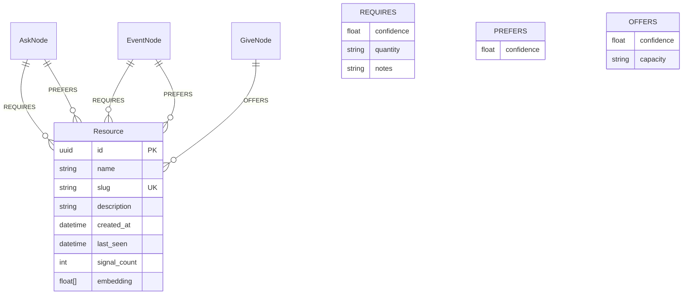

# feat: Add Resource Capability Matching

## Overview

Add a new **Resource** node type and three edge types (`Requires`, `Prefers`, `Offers`) to the graph, enabling capability-based matching between what people can offer and what organizations need. A person with a car finds every org needing drivers. A person needing food finds every org giving food. Cross-tension resource aggregation reveals systemic bottlenecks.

This is the third clustering axis in the graph — orthogonal to tensions (the *why*) and stories (the *narrative*). Resources answer **"what kind of help?"**

## Design Decisions (from brainstorm + spec analysis)

Decisions on gaps identified during spec flow analysis:

| Gap | Decision | Rationale |
|-----|----------|-----------|
| Tension/Notice → Resource edges | **Skip for v1.** Aggregation works via `Tension ← RespondsTo ← Ask → Requires → Resource`. | Simpler. Tensions describe systemic problems, not resource needs. The Asks that respond to them carry the resource semantics. |
| Resource node geography | **Global taxonomy, no city field.** "Vehicle" means the same everywhere. | Geographic scoping happens through the signal edges (signals have GeoPoint). |
| `updated_at` on ResourceNode | **Add `last_seen: DateTime<Utc>`** — updated when any edge is created. | Enables stale resource reaping. Follows ActorNode pattern (`last_active`). |
| Quantity/capacity edge properties | **`Option<String>`, informational only.** Not used in scoring. | Programmatic quantity matching is premature. Human-readable context ("10 people, Saturday mornings") is sufficient for v1. |
| Score capping | **Uncapped for ranking.** Normalize to 0.0–1.0 only for API display. | A score of 1.4 (all Requires + 2 Prefers) ranks higher than 1.0 (all Requires, no Prefers). That's correct behavior. |
| Prefers-only signals (zero Requires) | **Base score = 0.0 + 0.2 per matched Prefers.** Signals with only Prefers participate in matching but rank low. | Avoids division-by-zero. A Prefers-only signal is a weak match but still relevant. |
| Minimum score threshold | **Score > 0.0 to be returned.** Results capped at 50 per query. | Fuzzy-AND means any match participates. Limit prevents flood. |
| Free-text → Resource resolution | **Slug exact match first, then embedding nearest-neighbor fallback.** | Fast path for known resources, graceful degradation for novel queries. No LLM in the query path. |
| Locationless signals in matching | **Include with city-level scope.** Signals with no GeoPoint are treated as citywide — returned when query city matches signal city. | A citywide Ask like "Minneapolis needs winter coats" should not be invisible. |
| Embedding input for Resources | **Embed `"{name}: {description}"`** not just the name. | Short strings produce noisy embeddings. Adding description improves dedup quality. |
| Resource dedup timing | **Daily batch only.** Accept up to 24h fragmentation for novel LLM-invented resources. | Keeps extraction path fast. Seed vocabulary minimizes fragmentation for common resources. |

## Technical Approach

### Architecture

```
                                    ┌──────────────┐
                                    │  Resource     │
                                    │  (vehicle)    │
                                    └──┬───┬───┬────┘
                           Requires ──┘   │   └── Offers
                                          │Prefers
                    ┌─────────┐    ┌──────┴───┐    ┌─────────┐
                    │  Ask    │    │  Event    │    │  Give   │
                    │  node   │    │  node     │    │  node   │
                    └────┬────┘    └─────┬─────┘    └─────────┘
                         │               │
                    RespondsTo      RespondsTo
                         │               │
                    ┌────┴────────────────┴────┐
                    │       Tension            │
                    └─────────────────────────┘
```

**ERD:**



### Implementation Phases

#### Phase 1: Data Model + Graph Writer (foundation)

Add the ResourceNode type, edge types, and graph write operations. No extraction yet — just the graph schema and writer methods.

**Files to modify:**

1. **`modules/rootsignal-common/src/types.rs`**
   - Add `ResourceNode` struct (standalone, like `PlaceNode` at line 413)
   - Add `Requires`, `Prefers`, `Offers` variants to `EdgeType` enum (line 718)

2. **`modules/rootsignal-graph/src/writer.rs`**
   - Add `find_or_create_resource(name, slug, description, embedding) -> Uuid` — MERGE on slug, following `find_or_create_place()` pattern (line 3323)
   - Add `create_requires_edge(signal_id, resource_id, confidence, quantity, notes)` — MERGE with ON CREATE/ON MATCH, following `create_drawn_to_edge()` pattern (line 3290)
   - Add `create_prefers_edge(signal_id, resource_id, confidence)`
   - Add `create_offers_edge(signal_id, resource_id, confidence, capacity)`
   - Add `find_resource_by_slug(slug) -> Option<Uuid>` — exact match lookup
   - Add `find_resource_by_embedding(embedding, threshold) -> Option<(Uuid, f64)>` — vector similarity fallback

3. **`modules/rootsignal-graph/src/lib.rs`**
   - Export new public types

**Cypher for resource MERGE:**
```cypher
MERGE (r:Resource {slug: $slug})
ON CREATE SET
    r.id = $id,
    r.name = $name,
    r.slug = $slug,
    r.description = $description,
    r.created_at = datetime(),
    r.last_seen = datetime(),
    r.signal_count = 1,
    r.embedding = $embedding
ON MATCH SET
    r.last_seen = datetime(),
    r.signal_count = r.signal_count + 1,
    r.description = CASE WHEN size($description) > size(coalesce(r.description, ''))
                    THEN $description ELSE r.description END
RETURN r.id AS resource_id
```

**Cypher for REQUIRES edge:**
```cypher
MATCH (s {id: $signal_id})
MATCH (r:Resource {id: $resource_id})
MERGE (s)-[e:REQUIRES]->(r)
ON CREATE SET
    e.confidence = $confidence,
    e.quantity = $quantity,
    e.notes = $notes,
    e.created_at = datetime()
ON MATCH SET
    e.confidence = CASE WHEN $confidence > e.confidence THEN $confidence ELSE e.confidence END
```

**Acceptance criteria:**
- [x] `ResourceNode` struct in `types.rs` with: id, name, slug, description, created_at, last_seen, signal_count
- [x] `EdgeType` enum has `Requires`, `Prefers`, `Offers` variants with doc comments
- [x] `find_or_create_resource()` uses MERGE on slug, idempotent
- [x] `create_requires_edge()`, `create_prefers_edge()`, `create_offers_edge()` use MERGE with ON CREATE/ON MATCH
- [x] `find_resource_by_slug()` returns existing resource UUID
- [x] `find_resource_by_embedding()` queries vector index with configurable threshold
- [x] Vector index `resource_embedding` created in graph init
- [x] Unit tests for ResourceNode construction and edge type Display

---

#### Phase 2: Extraction (main extractor + ResponseScout)

Teach the LLM to extract resource tags from web content. Add resource fields to `ExtractedSignal` and `DiscoveredResponse`. Wire resource node creation into the signal processing pipeline.

**Files to modify:**

1. **`modules/rootsignal-scout/src/extractor.rs`**
   - Add `ResourceTag` struct:
     ```rust
     #[derive(Debug, Clone, Serialize, Deserialize, JsonSchema)]
     pub struct ResourceTag {
         /// Canonical slug (e.g. "vehicle", "bilingual-spanish")
         pub name: String,
         /// "requires", "prefers", or "offers"
         pub role: String,
         /// 0.0-1.0 confidence that this resource is relevant
         pub confidence: f64,
         /// Optional context (e.g. "10 people", "Saturday mornings")
         pub context: Option<String>,
     }
     ```
   - Add `#[serde(default)] pub resources: Vec<ResourceTag>` to `ExtractedSignal` (line 16)
   - Add `ExtractionResult.resources: Vec<(Uuid, Vec<ResourceTag>)>` to associate resource tags with their signal node IDs
   - Update `build_system_prompt()` (line 343) with new `## Resource Capabilities` section containing seed vocabulary and extraction instructions

2. **`modules/rootsignal-scout/src/response_scout.rs`**
   - Add `#[serde(default)] pub resources: Vec<ResourceTag>` to `DiscoveredResponse` (line 47)
   - Update `STRUCTURING_SYSTEM` prompt (line 202) with resource extraction instructions
   - In `process_response()` (line 418): after creating signal node and edges, iterate resource tags and call `find_or_create_resource()` + edge creation

3. **`modules/rootsignal-scout/src/scout.rs`** (main pipeline)
   - After signal extraction and graph write, process resource tags: for each signal's resources, MERGE the Resource node and create the appropriate edge

**Seed vocabulary for extractor prompt (~20 resources):**
```
vehicle, bilingual-spanish, bilingual-somali, bilingual-hmong, legal-expertise,
food, shelter-space, clothing, childcare, medical-professional, mental-health,
physical-labor, kitchen-space, event-space, storage-space, technology,
reliable-internet, financial-donation, skilled-trade, administrative
```

**Extractor prompt addition (new section in `build_system_prompt()`):**
```
## Resource Capabilities (optional)

For Ask and Event signals, identify what CAPABILITIES or RESOURCES someone
would need to help. For Give signals, identify what RESOURCES are being offered.

Use these canonical labels when they fit:
{seed_vocabulary}

If none of these fit, propose a concise noun-phrase slug (e.g. "boat-operator",
"hazmat-certification", "wildlife-rehabilitation").

For each resource, specify:
- name: the resource slug
- role: "requires" (must have to help), "prefers" (better if you have it), or "offers" (what a Give provides)
- confidence: 0.0-1.0 how confident you are this resource is needed/offered
- context: optional specifics (e.g. "10 people", "Saturday mornings", "500 lbs shelf-stable")

Only extract resources when they are clearly stated or strongly implied.
Do NOT guess. If unsure, omit the resource — an empty list is fine.
Routine community events (farmers markets, worship services) typically have no resources.
```

**Acceptance criteria:**
- [x] `ResourceTag` struct with JsonSchema derive
- [x] `ExtractedSignal.resources` field with `#[serde(default)]`
- [x] `build_system_prompt()` includes seed vocabulary and resource extraction instructions
- [x] `DiscoveredResponse.resources` field in ResponseScout
- [x] ResponseScout structuring prompt includes resource instructions
- [x] Pipeline wires resource tags to `find_or_create_resource()` + edge creation after signal write
- [x] Resources with `confidence < 0.3` are filtered out (noise gate)
- [x] Test: extraction JSON with resources parses correctly
- [x] Test: extraction JSON missing resources defaults to empty vec
- [x] Test: ResourceTag round-trips through serde

---

#### Phase 3: Query API (reader methods + matching)

Add query methods to `PublicGraphReader` for resource-based matching.

**Files to modify:**

1. **`modules/rootsignal-graph/src/reader.rs`**
   - Add `ResourceMatch` return type:
     ```rust
     pub struct ResourceMatch {
         pub node: Node,
         pub score: f64,           // raw match score (can exceed 1.0)
         pub normalized_score: f64, // clamped to 0.0-1.0 for display
         pub matched_requires: Vec<String>,  // resource slugs matched
         pub matched_prefers: Vec<String>,
         pub unmatched_requires: Vec<String>,
     }
     ```
   - Add `find_asks_by_resource(slug, lat, lng, radius_km, limit) -> Vec<ResourceMatch>`:
     - Finds all Ask/Event nodes linked to `Resource {slug}` via REQUIRES or PREFERS
     - Computes match score: 1.0 for each matched Requires / total Requires, +0.2 per matched Prefers
     - Filters by geography (bounding box on lat/lng, plus citywide signals)
     - Filters by expiry (existing `expiry_clause()` pattern)
     - Returns sorted by score descending, limited to `limit`
   - Add `find_gives_by_resource(slug, lat, lng, radius_km, limit) -> Vec<ResourceMatch>`:
     - Finds all Give nodes linked to `Resource {slug}` via OFFERS
     - Score = 1.0 for exact match (single resource query from "I need" direction)
     - Filters by geography and expiry
   - Add `find_asks_by_resources(slugs: Vec<String>, lat, lng, radius_km, limit) -> Vec<ResourceMatch>`:
     - Multi-resource variant: "I have a car AND speak Spanish"
     - Returns Asks linked to ANY of the provided resources
     - Scores by match completeness across the query set
   - Add `resolve_resource(text) -> Option<ResourceNode>`:
     - Exact slug match first
     - Embedding nearest-neighbor fallback (threshold 0.80)
   - Add `resource_gap_analysis(city_slug) -> Vec<ResourceGap>`:
     ```rust
     pub struct ResourceGap {
         pub resource_slug: String,
         pub resource_name: String,
         pub requires_count: u32,
         pub offers_count: u32,
         pub gap: i32,  // requires - offers (negative = unmet need)
     }
     ```
     - Aggregates Requires and Offers edge counts per Resource
     - Optionally scoped to a city (via signal geography)
     - Returns sorted by gap ascending (worst gaps first)
   - Add `list_resources(limit) -> Vec<ResourceNode>`:
     - Returns all resources sorted by signal_count descending

2. **`modules/rootsignal-graph/src/lib.rs`**
   - Export `ResourceMatch`, `ResourceGap`

**Cypher for "I have a car" query:**
```cypher
MATCH (r:Resource {slug: $slug})<-[:REQUIRES]-(s)
WHERE s.lat IS NOT NULL
  AND s.lat >= $min_lat AND s.lat <= $max_lat
  AND s.lng >= $min_lng AND s.lng <= $max_lng
  AND (s:Ask OR s:Event)
OPTIONAL MATCH (s)-[:REQUIRES]->(req:Resource)
OPTIONAL MATCH (s)-[:PREFERS]->(pref:Resource)
RETURN s, collect(DISTINCT req.slug) AS required_resources,
       collect(DISTINCT pref.slug) AS preferred_resources
ORDER BY s.cause_heat DESC, s.confidence DESC
LIMIT $limit
```

Score computation happens in Rust after fetching results (not in Cypher).

**Acceptance criteria:**
- [x] `find_asks_by_resource()` returns scored Ask/Event nodes matching a single resource
- [x] `find_gives_by_resource()` returns scored Give nodes offering a resource
- [x] `find_asks_by_resources()` handles multi-resource queries with fuzzy-AND scoring
- [ ] `resolve_resource()` resolves free text to ResourceNode (slug first, embedding fallback) — deferred, composable from existing writer methods
- [x] `resource_gap_analysis()` returns gap table sorted by unmet need
- [x] `list_resources()` returns resources by signal_count
- [x] Locationless signals included as citywide matches
- [x] Expired signals excluded (existing expiry pattern)
- [x] Results limited (default 50)
- [ ] Test: single-resource query returns correct signals
- [ ] Test: multi-resource query computes correct fuzzy-AND scores
- [ ] Test: gap analysis aggregates correctly

---

#### Phase 4: Batch Consolidation (daily dedup)

Add a daily batch job that merges near-duplicate Resource nodes.

**Files to modify:**

1. **`modules/rootsignal-graph/src/writer.rs`**
   - Add `consolidate_resources() -> ConsolidationStats`:
     - Load all Resource node embeddings from graph
     - Compute pairwise cosine similarity in memory (reuse `cosine_sim_f64()` at line 3634)
     - For pairs with similarity >= 0.85: cluster them
     - Within each cluster, pick canonical (highest `signal_count`)
     - For each non-canonical node:
       - Re-point all REQUIRES, PREFERS, OFFERS edges to canonical (use MERGE to avoid duplicates)
       - Sum `signal_count` into canonical
       - Delete non-canonical node
     - Return stats: clusters_found, nodes_merged, edges_redirected
   - Add `ConsolidationStats` struct

2. **`modules/rootsignal-scout/src/scout.rs`** (pipeline orchestrator)
   - Call `consolidate_resources()` at end of daily pipeline run (after story weaving, before completion)

**Cypher for edge re-pointing (per edge type):**
```cypher
MATCH (dup:Resource {id: $dup_id})<-[old:REQUIRES]-(s)
MATCH (canonical:Resource {id: $canonical_id})
MERGE (s)-[new:REQUIRES]->(canonical)
ON CREATE SET
    new.confidence = old.confidence,
    new.quantity = old.quantity,
    new.notes = old.notes,
    new.created_at = old.created_at
DELETE old
```

Repeat for PREFERS and OFFERS.

**Acceptance criteria:**
- [x] `consolidate_resources()` loads all resource embeddings
- [x] Pairwise cosine similarity with 0.85 threshold
- [x] Canonical selection by highest signal_count
- [x] All edge types (REQUIRES, PREFERS, OFFERS) re-pointed via MERGE
- [x] Non-canonical nodes deleted after edge re-pointing
- [x] signal_count summed on canonical
- [x] Stats returned: clusters_found, nodes_merged, edges_redirected
- [ ] Test: two resources with 0.90 similarity merge correctly
- [ ] Test: edges survive merge without duplication
- [ ] Test: resources below threshold are NOT merged

---

## Implementation Order & Dependencies

```
Phase 1: Data Model + Graph Writer
    │
    ├── Phase 2: Extraction (depends on Phase 1 writer methods)
    │
    ├── Phase 3: Query API (depends on Phase 1 data model, independent of Phase 2)
    │
    └── Phase 4: Batch Consolidation (depends on Phase 1, independent of Phase 2 & 3)
```

Phases 2, 3, and 4 can be implemented in parallel after Phase 1 is complete. Phase 2 is the highest priority after Phase 1 because it populates the graph with data. Phase 3 is useless without Phase 2 data. Phase 4 can ship anytime after Phase 1.

**Recommended order: Phase 1 → Phase 2 → Phase 3 → Phase 4**

## Risk Analysis

| Risk | Likelihood | Impact | Mitigation |
|------|-----------|--------|------------|
| LLM synonym drift ("car" vs "vehicle" vs "transportation") | High | Medium | Seed vocabulary in prompt + daily batch consolidation |
| Short-text embeddings produce noisy similarity scores | Medium | Medium | Embed "name: description" not just name. Tune threshold. |
| Extractor prompt too long after adding resource section | Low | Low | Resource section is ~20 lines. Current prompt is ~100 lines. Well within limits. |
| Resource nodes accumulate without reaping | Medium | Low | `last_seen` field enables future reaping. Not blocking for v1. |
| 24h fragmentation window for novel resources | Medium | Low | Seed vocabulary covers ~80% of cases. Novel resources are rare. |

## Quality Gates

- [ ] All existing tests pass (`cargo test`)
- [ ] New unit tests for ResourceNode, ResourceTag, edge creation, consolidation
- [ ] Integration test: extract signal with resources → query by resource → verify match
- [ ] Litmus test updated if graph schema assertions exist
- [ ] No unwrap_or() on LLM-extracted resource fields (use Option<T>)

## References

### Internal
- Brainstorm: `docs/brainstorms/2026-02-19-resource-capability-matching-brainstorm.md`
- Vision: `docs/vision/resource-matching.md`
- Data model: `modules/rootsignal-common/src/types.rs` (PlaceNode pattern at line 413, EdgeType at line 718)
- Graph writer: `modules/rootsignal-graph/src/writer.rs` (find_or_create_place at line 3323, create_drawn_to_edge at line 3290)
- Extractor: `modules/rootsignal-scout/src/extractor.rs` (ExtractedSignal at line 16, build_system_prompt at line 343)
- ResponseScout: `modules/rootsignal-scout/src/response_scout.rs` (DiscoveredResponse at line 47)
- Reader: `modules/rootsignal-graph/src/reader.rs` (find_nodes_near at line 30)
- Dedup: `modules/rootsignal-graph/src/writer.rs` (merge_duplicate_tensions at line 2700, cosine_sim_f64 at line 3634)
- Learnings: `docs/solutions/2026-02-17-unwrap-or-masks-data-quality.md` — never unwrap_or on LLM output

### Conventions
- CLAUDE.md: Never write/edit/delete code without explicit user consent
- Standalone graph nodes (not in Node enum) for non-signal entities: PlaceNode, ActorNode pattern
- MERGE with ON CREATE/ON MATCH for idempotent writes
- `#[serde(default)]` for optional LLM extraction fields
- `rootsignal_common::slugify()` for slug generation
- Embedding threshold 0.85 for dedup
