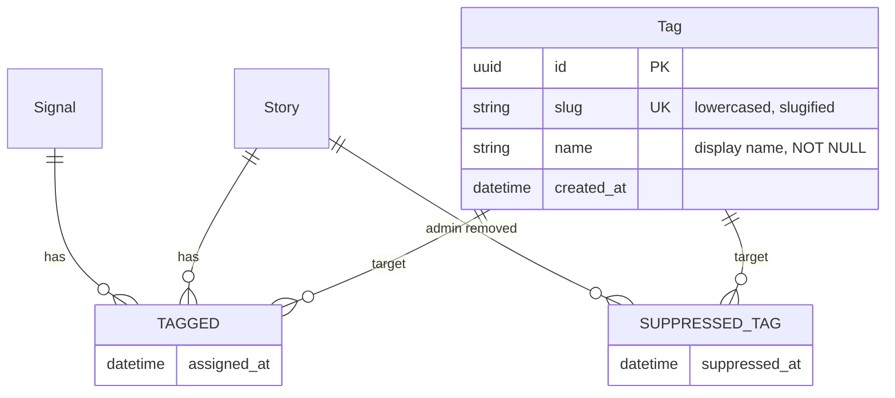

# Two-Tier Tagging System for Signals and Stories

## Overview

Add a tagging system where signals get LLM-assigned tags during extraction, and stories auto-aggregate tags from their constituent signals. Admins can curate story-level tags (add, remove, merge). Tags enable precise navigation/filtering and cross-city thematic queries that semantic search handles poorly.

## Problem Statement

- **Category is too coarse**: 6 buckets (Resource, Gathering, Crisis, etc.) don't differentiate within a high-volume city scrape
- **Semantic search is fuzzy**: "ICE" matches ice storms, ice cream, and immigration enforcement
- **No faceted discovery**: Users must already know what to search for — no way to browse "what exists"
- **Cross-city queries need precision**: "Show me all ICE-enforcement stories everywhere" requires exact matching, not vector similarity

## Proposed Solution

**Two-tier model:**

1. **Signal tags** — LLM-assigned during the existing extraction call (zero extra LLM cost). 3-5 tags per signal, normalized (lowercased, slugified). No admin UI. Internal plumbing only — not exposed via API.
2. **Story tags** — auto-aggregated from constituent signal tags during StoryWeaver Phase B. Admin can add tags and suppress unwanted auto-aggregated tags (`SUPPRESSED_TAG` relationship). Admins can merge tags.

**Hybrid vocabulary:** LLM receives top 50 existing tags as prompt context to prefer reuse over invention. New tags created via `MERGE` when the LLM suggests something novel.

**Tag-as-node in Neo4j:** `(:Tag {id, slug, name})<-[:TAGGED]-(Story|Signal)` — enables graph-native queries, clean merges, and efficient filtering.

## Technical Approach

### Data Model



**Simplifications from review:**
- No `origin` field on TAGGED — a tag is either present or suppressed. Simpler logic, fewer conditional branches.
- Signal tags are internal (not exposed via GraphQL) — they exist for aggregation, not display.
- Single-tag filtering only (no multi-tag AND/OR) — ship, get usage data, then decide.

### Pipeline Ordering

Scout writes signal tags → StoryWeaver Phase B aggregates story tags. StoryWeaver always runs *after* the scout batch completes, so signal tags are guaranteed to exist before aggregation.

### Implementation Phases

#### Phase 1: Schema & Core Types

**Files to change:**

- `modules/rootsignal-graph/src/migrate.rs` — Add Tag node constraints, indexes, and Story geo index
- `modules/rootsignal-common/src/types.rs` — Add `TagNode` struct

**Neo4j migrations (idempotent, following existing pattern):**

```cypher
-- Tag node
CREATE CONSTRAINT tag_id_unique IF NOT EXISTS FOR (t:Tag) REQUIRE t.id IS UNIQUE
CREATE CONSTRAINT tag_slug_unique IF NOT EXISTS FOR (t:Tag) REQUIRE t.slug IS UNIQUE
CREATE CONSTRAINT tag_slug_exists IF NOT EXISTS FOR (t:Tag) REQUIRE t.slug IS NOT NULL
CREATE CONSTRAINT tag_name_exists IF NOT EXISTS FOR (t:Tag) REQUIRE t.name IS NOT NULL

-- Story geo index (benefits all story geo queries, not just tags)
CREATE INDEX story_centroid_lat_lng IF NOT EXISTS FOR (s:Story) ON (s.centroid_lat, s.centroid_lng)
```

**TagNode struct:**

```rust
// modules/rootsignal-common/src/types.rs
pub struct TagNode {
    pub id: Uuid,
    pub slug: String,
    pub name: String,
    pub created_at: DateTime<Utc>,
}
```

---

#### Phase 2: Signal Tagging During Extraction

**Files to change:**

- `modules/rootsignal-scout/src/extractor.rs` — Add `tags` field to `ExtractedSignal`, update extraction prompt with vocabulary context
- `modules/rootsignal-graph/src/writer.rs` — Add `batch_find_or_create_tags()`, `batch_tag_signal()` functions
- `modules/rootsignal-scout/src/scout.rs` — Fetch tag vocabulary before extraction, pass to extractor, write tags after signal creation

**ExtractedSignal change:**

```rust
// modules/rootsignal-scout/src/extractor.rs
pub struct ExtractedSignal {
    // ... existing fields ...
    /// 3-5 thematic tags. Prefer existing vocabulary. Lowercase with hyphens.
    #[serde(default)]
    pub tags: Vec<String>,
}
```

**Extraction prompt addition:**

```text
EXISTING TAG VOCABULARY (prefer these when they fit):
{top_50_tags_by_usage}

For each signal, output 3-5 thematic tags as lowercase-with-hyphens slugs.
Prefer tags from the vocabulary above. Only invent new tags when no existing tag fits.
```

**Writer functions — batched via UNWIND (not per-tag):**

```rust
// modules/rootsignal-graph/src/writer.rs

/// Batch find-or-create Tag nodes. Returns slug→UUID map.
pub async fn batch_find_or_create_tags(&self, tags: &[(String, String)]) -> Result<HashMap<String, Uuid>, neo4rs::Error>
// Cypher:
// UNWIND $tags AS tag
// MERGE (t:Tag {slug: tag.slug})
// ON CREATE SET t.id = tag.id, t.name = tag.name, t.created_at = datetime()
// RETURN t.slug, t.id

/// Batch create TAGGED relationships between signals and tags.
pub async fn batch_tag_signals(&self, pairs: &[(Uuid, String)]) -> Result<(), neo4rs::Error>
// Cypher:
// UNWIND $pairs AS pair
// MATCH (s {id: pair.signal_id}), (t:Tag {slug: pair.tag_slug})
// MERGE (s)-[:TAGGED {assigned_at: datetime()}]->(t)
```

This reduces 60-100 individual Neo4j round-trips per extraction batch down to 2.

**Vocabulary fetch (in scout.rs, before extraction batch):**

```rust
// Served from cache — zero Neo4j cost after first load
let vocab: Vec<String> = reader.top_tags(50).await?;
// Pass vocab to extractor prompt context
```

---

#### Phase 3: Story Tag Aggregation in StoryWeaver

**Files to change:**

- `modules/rootsignal-graph/src/story_weaver.rs` — Add tag aggregation to Phase B (grow)
- `modules/rootsignal-graph/src/writer.rs` — Add `aggregate_story_tags()`, `suppress_tag()` functions

**Aggregation logic (runs in Phase B after signal linking):**

```cypher
// Find all tags from constituent signals with frequency >= 2
MATCH (s:Story {id: $story_id})-[:CONTAINS]->(sig)-[:TAGGED]->(t:Tag)
WITH s, t, count(sig) AS freq
WHERE freq >= 2
// Don't re-add suppressed tags
AND NOT (s)-[:SUPPRESSED_TAG]->(t)
MERGE (s)-[r:TAGGED]->(t)
ON CREATE SET r.assigned_at = datetime()
```

**Frequency threshold:** A tag must appear on 2+ signals within a story to bubble up. Prevents noise from single-signal tags.

**Admin curation preservation:**
- Admin-added tags use a direct `MERGE (s)-[:TAGGED]->(t)` — aggregation's MERGE is idempotent and won't overwrite
- `SUPPRESSED_TAG` relationships prevent auto-aggregation of specific tags on specific stories
- Suppression is per-story, not global
- When admin removes a tag: delete TAGGED edge + create SUPPRESSED_TAG in one operation (prevents re-aggregation next cycle)

---

#### Phase 4: GraphQL API & Cache

**Files to change:**

- `modules/rootsignal-api/src/graphql/types.rs` — Add `GqlTag` type, add `tags` field to `GqlStory`
- `modules/rootsignal-api/src/graphql/schema.rs` — Add `tags`, `stories_by_tag` queries, add optional `tag` param to `stories_in_bounds`
- `modules/rootsignal-api/src/graphql/loaders.rs` — Add `TagsByStoryLoader` (following `ActorsBySignalLoader` pattern)
- `modules/rootsignal-graph/src/reader.rs` — Add `tags_for_stories_batch()`, `top_tags()`, `stories_by_tag()` queries
- `modules/rootsignal-graph/src/cached_reader.rs` — Add tag queries with cache support
- `modules/rootsignal-graph/src/cache.rs` — Add `tags: Vec<TagNode>`, `tags_by_story: HashMap<Uuid, Vec<usize>>` to `SignalCache`, load TAGGED edges during cache refresh

**GqlTag type:**

```rust
pub struct GqlTag {
    pub id: Uuid,
    pub slug: String,
    pub name: String,
}
```

**New queries:**

```graphql
# List available tags, sorted by story count (count computed server-side, not exposed)
tags(limit: Int): [Tag!]!

# Stories by tag, optionally bounded geographically
storiesByTag(tag: String!, minLat: Float, maxLat: Float, minLng: Float, maxLng: Float, limit: Int): [Story!]!

# Extend existing query with optional single-tag filter
storiesInBounds(minLat: Float!, maxLat: Float!, minLng: Float!, maxLng: Float!, tag: String, limit: Int): [Story!]!
```

**Admin mutations:**

```graphql
# Add a curated tag to a story
tagStory(storyId: ID!, tagSlug: String!): Story!

# Remove a tag from a story (deletes TAGGED + creates SUPPRESSED_TAG)
untagStory(storyId: ID!, tagSlug: String!): Story!

# Merge tag B into tag A (single Cypher transaction: repoint all TAGGED + SUPPRESSED_TAG edges, delete B)
mergeTags(sourceSlug: String!, targetSlug: String!): Tag!
```

**mergeTags must be atomic (single Cypher transaction):**

```cypher
MATCH (src:Tag {slug: $source_slug}), (tgt:Tag {slug: $target_slug})
// Repoint TAGGED edges
WITH src, tgt
OPTIONAL MATCH (n)-[old:TAGGED]->(src)
MERGE (n)-[new:TAGGED]->(tgt)
ON CREATE SET new.assigned_at = old.assigned_at
DELETE old
// Repoint SUPPRESSED_TAG edges
WITH src, tgt
OPTIONAL MATCH (s)-[old_sup:SUPPRESSED_TAG]->(src)
MERGE (s)-[new_sup:SUPPRESSED_TAG]->(tgt)
ON CREATE SET new_sup.suppressed_at = old_sup.suppressed_at
DELETE old_sup
// Delete source tag
DETACH DELETE src
RETURN tgt
```

**Dataloader (N+1 prevention):**

```rust
// modules/rootsignal-api/src/graphql/loaders.rs
// Following ActorsBySignalLoader pattern — served from SignalCache
pub struct TagsByStoryLoader { reader: Arc<CachedReader> }

impl Loader<Uuid> for TagsByStoryLoader {
    type Value = Vec<TagNode>;
    // Delegates to CachedReader → SignalCache.tags_by_story
}
```

**Cache invalidation:**
- Admin tag mutations (`tagStory`, `untagStory`, `mergeTags`) call `cache.reload()` after Neo4j write
- Scout-originated tag writes rely on periodic cache reload (acceptable latency)

---

#### Phase 5: Search App UI

**Files to change:**

- `modules/search-app/src/graphql/queries.ts` — Add `tags` field to story queries, add `TAGS` and `STORIES_BY_TAG` queries
- `modules/search-app/src/components/StoryCard.tsx` — Render tag chips
- `modules/search-app/src/components/StoryDetail.tsx` — Render tag chips (clickable for filtering)
- `modules/search-app/src/components/TagFilter.tsx` — New: tag chip bar for single-tag filtering

**StoryCard tag rendering:**

```tsx
{/* After arc and category badges */}
{tags?.slice(0, 3).map((tag: { slug: string; name: string }) => (
  <span key={tag.slug} className="text-xs bg-muted px-1.5 py-0.5 rounded">
    {tag.name}
  </span>
))}
```

**Tag filter component:** A horizontal chip bar above the story list showing available tags for the current bounds. Clicking a tag filters the story list. Single selection — click again to deselect.

---

#### Phase 6: Admin App Tag Management

**Files to change:**

- [x] `modules/admin-app/src/graphql/queries.ts` — Add tags to STORY_DETAIL, add ALL_TAGS query
- [x] `modules/admin-app/src/graphql/mutations.ts` — Add TAG_STORY, UNTAG_STORY, MERGE_TAGS mutations
- [x] `modules/admin-app/src/pages/StoryDetailPage.tsx` — Tag chips with "x" to remove, autocomplete input to add

**Tag management page:** List all tags sorted by story count. Select two tags to merge. (Deferred to follow-up.)

---

## Maintenance

**Orphan tag cleanup (daily, not per-cycle):**

```cypher
// Only delete tags older than 24h with no edges (prevents race with find_or_create_tag)
MATCH (t:Tag)
WHERE NOT (t)<-[:TAGGED]-()
  AND NOT (t)<-[:SUPPRESSED_TAG]-()
  AND t.created_at < datetime() - duration('P1D')
WITH t LIMIT 100
DELETE t
RETURN count(t) AS deleted
```

---

## Acceptance Criteria

### Functional

- [ ] Signals receive 3-5 LLM-assigned tags during extraction
- [ ] LLM receives existing tag vocabulary (top 50) and prefers reuse
- [ ] New tags created automatically via MERGE when LLM invents novel tags
- [ ] Story tags auto-aggregate from constituent signal tags (frequency >= 2)
- [ ] Admin can add curated tags to stories
- [ ] Admin can remove tags from stories (TAGGED deleted + SUPPRESSED_TAG created)
- [ ] Admin can merge two tags (all edges repointed atomically)
- [ ] Search app displays tag chips on StoryCard and StoryDetail
- [ ] Users can filter stories by single tag within bounds
- [ ] Users can query stories by tag cross-city (no bounds)
- [ ] `tags` query returns available tags sorted by story count
- [ ] Budget exhaustion degrades gracefully (no tags, not broken)

### Non-Functional

- [ ] Tag queries use indexes (slug uniqueness constraint)
- [ ] Tag loading uses `TagsByStoryLoader` dataloader (no N+1)
- [ ] Tags loaded into `SignalCache` during cache refresh (`tags_by_story` map)
- [ ] `top_tags()` served from cache, not live Neo4j aggregation
- [ ] Admin mutations call `cache.reload()` after writes
- [ ] `mergeTags` runs as single Cypher transaction
- [ ] Orphan cleanup guarded by 24h age filter + LIMIT 100, runs daily

## Deferred (YAGNI)

- Multi-tag AND/OR filtering — ship single-tag, get usage data first
- `renameTag` mutation — `mergeTags` covers structural fixes; cosmetic name edits are trivial if needed
- Signal tags in API (`GqlSignal.tags`, `TagsBySignalLoader`) — internal plumbing, no UI consumer
- `story_count` on `GqlTag` — sort server-side, don't expose
- `origin` tracking on TAGGED relationship — adds complexity for no current consumer
- Tag embeddings for similarity matching — future optimization for vocabulary consolidation

## Dependencies & Risks

| Risk | Mitigation |
|------|-----------|
| Tag explosion (too many tags per story) | Frequency threshold (2+ signals) for aggregation |
| Tag drift / synonyms | LLM receives existing vocabulary; admin merge tools |
| Merge during concurrent ingestion | MERGE-based writes are idempotent; single-transaction merge prevents partial state |
| Large vocabulary in LLM prompt | Start with top 50; grow to city-scoped subsets if needed |
| Orphaned tags after signal expiry | Daily cleanup with 24h age guard + LIMIT 100 |
| Cache staleness after admin edits | Admin mutations trigger `cache.reload()` |

## References

- Brainstorm: `docs/brainstorms/2026-02-19-story-signal-tags-brainstorm.md`
- Resource node pattern (closest analogue): `modules/rootsignal-graph/src/writer.rs` — `find_or_create_resource()`
- Extraction prompt: `modules/rootsignal-scout/src/extractor.rs:16-76`
- StoryWeaver pipeline: `modules/rootsignal-graph/src/story_weaver.rs:1-19`
- Dataloader pattern: `modules/rootsignal-api/src/graphql/loaders.rs` — `ActorsBySignalLoader`
- Migration pattern: `modules/rootsignal-graph/src/migrate.rs:1-50`
- Cache architecture: `modules/rootsignal-graph/src/cache.rs` — `SignalCache`
