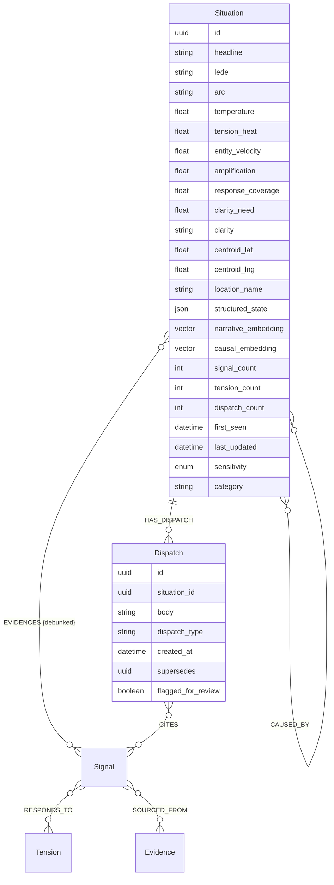

# Living Situations — LLM-Driven Weaving

## Pressure Test Summary (2026-02-21)

Four review rounds stress-tested this plan: (1) soundness review — vision alignment, codebase architecture, 21 feedback loops, kill tests, temperature formula; (2) real-world scenario stress test — 10 scenarios from astroturf attacks to Flint slow burns; (3) Codex audit — 6 findings on arc logic, CONTAINS audit completeness, schema consistency; (4) deep audit — 13 vision docs, 12 user journeys, emergence/antifragility analysis, feedback loop runaway checks. All critical findings addressed.

**Critical reframe**: Situations are an **organizational and narrative layer on top of the existing graph mechanics** — not a replacement for them. The signal graph (cause_heat, tension-only radiation, entity diversity, RESPONDS_TO) is the engine. Situations are the dashboard.

| Layer | Owns | Source of Truth |
|-------|------|-----------------|
| **Signal graph** | cause_heat, tension-only heat radiation, entity diversity velocity, RESPONDS_TO edges, corroboration, freshness | The engine — unchanged |
| **Situations** | Causal grouping, dispatch thread, structured state, banner, organizational temperature | The dashboard — new |

**Brainstorm:** `docs/brainstorms/2026-02-20-living-stories-brainstorm.md`

### Design Tensions (Conscious Tradeoffs)

These are places where the plan departs from the letter of a vision principle for architectural reasons. Each is acknowledged, not accidental.

1. **Temperature is system resource allocation, not community prioritization.** `alignment-machine.md` says "no algorithm prioritizes one tension over another." Temperature IS algorithmic prioritization — it determines which situations get discovery resources and which surface first in the API. We accept this because: (a) the components are transparent and auditable, (b) the ranking is computable from graph mechanics rather than engagement metrics, and (c) the system must allocate finite resources (LLM budget, scraping cadence) somehow. Temperature is the system's internal resource allocator, not an editorial ranking of community importance.

2. **Tension-centric framing vs. "the response is the primary signal."** `editorial-and-signal-inclusion-principles.md` says "the response is the primary signal; the context is what makes it meaningful." The temperature formula centers tension_heat (0.30 weight) with responses appearing only as response_gap coverage. This is deliberate: tensions drive heat because they represent unresolved needs; responses close gaps and cool situations. The system's internal resource allocation should direct attention toward the unresolved, even though the user-facing presentation (dispatches, threads) should highlight responses equally. The dispatch prompt rules ensure responses are featured prominently in the narrative.

3. **LLM causal judgment vs. emergent clustering.** `self-evolving-system.md` says "stories emerge from semantic clustering" and "emergence over engineering." The SituationWeaver uses LLM judgment for causal boundaries rather than letting clusters emerge from graph structure (as Leiden does). This tradeoff is necessary because: causal boundaries require semantic understanding that graph clustering cannot provide (topically similar but causally distinct signals must be separated). The graph mechanics (cause_heat, entity velocity, RESPONDS_TO) remain emergent; only the organizational boundary is engineered.

4. **clarity_need vs. "the system gets quiet when reality gets quiet."** `alignment-machine.md` says the system should reflect reality's quietness. `clarity_need` pushes fuzzy situations warmer, directing investigation even when signals are sparse. This is bounded: (a) clarity_need alone cannot make a situation "Active" (max contribution = 0.15), (b) investigation has a 7-day cooldown, and (c) a staleness decay applies (see Temperature section). The system does push against quietness for genuinely unclear situations — but only gently, with guardrails.

5. **Engineered constants in an emergent system.** `principles-and-values.md` says "emergent over engineered" and "prefer graph structure over application logic." The temperature formula uses fixed weights (0.30/0.25/0.15/0.15/0.15), arc derivation uses fixed thresholds (0.1/0.3/0.6), and the 72-hour Emerging boundary is hardcoded. These are engineering choices, not emergent properties. We accept this because: (a) the INPUTS to the formula are emergent (cause_heat, entity velocity arise from graph structure), (b) the formula is transparent and auditable (no black box), (c) v1 needs stable behavior to validate the architecture. Future: these constants should be calibrated from operational feedback — if situations that hit "Active" at 0.6 consistently turn out to be non-events, the threshold should drift upward. No self-tuning mechanism exists in v1.

6. **response_coverage measures system knowledge, not world state.** `alignment-machine.md` says "the system measures the world, not itself." `response_gap_norm` is an artifact of what the system has discovered. A fully-addressed tension in reality may appear "unmet" if the system hasn't scraped the response yet. We accept this because: (a) the system can only act on what it knows, and (b) the gap drives discovery toward finding responses that may exist but haven't been scraped.

---

## Problem Statement

The current StoryWeaver has structural limitations:

1. **Mechanical clustering**: Stories form around tension hubs with 2+ RESPONDS_TO edges. This misses signals that share a root cause but connect through different tensions.
2. **One-to-one containment**: A signal can only CONTAINS one story. Real signals often evidence multiple situations.
3. **Static synthesis**: LLM writes headline/lede/narrative once, rewrites on growth. No living thread, no dispatches, no evolving record.
4. **No causal boundary**: Stories cluster by semantic proximity, not by shared root cause. Topically similar but causally distinct events merge incorrectly.
5. **No cross-run memory**: The weaving pass has no memory of previous decisions.

**What is NOT broken** (and must be preserved):

- **Entity-diversity-driven velocity** — `story_weaver.rs` Phase D uses entity count growth, not raw signal count. This is the anti-astroturfing defense.
- **cause_heat as epistemology** — "heat = understanding" per `tension-gravity.md`. cause_heat measures how well the system understands why a signal exists. This stays per-signal.
- **Tension-only heat radiation** — only Tensions generate heat; Events/Aids/Gatherings receive it. This structural property prevents blob dominance.
- **Curiosity loop, response mapping, investigation pipeline** — all upstream of weaving, all working.

---

## Proposed Solution

### Architecture: Situations Layer ON TOP of Graph Mechanics

```
                    ┌─────────────────────────────────┐
                    │        SITUATION LAYER           │
                    │  (organizational, narrative)      │
                    │                                   │
                    │  Situations, Dispatches,          │
                    │  Structured State, Banners        │
                    │  Organizational Temperature       │
                    └──────────────┬────────────────────┘
                                   │ derives from
                    ┌──────────────┴────────────────────┐
                    │        SIGNAL GRAPH               │
                    │  (epistemological, structural)     │
                    │                                    │
                    │  cause_heat (per signal)           │
                    │  Tension-only radiation            │
                    │  Entity diversity velocity         │
                    │  RESPONDS_TO edges                 │
                    │  Corroboration, Evidence           │
                    └───────────────────────────────────┘
```

**The situation layer reads from the graph. It does not replace the graph's mechanics.**

### What Changes vs. What Stays

| Component | Current (StoryWeaver) | New (SituationWeaver) | Graph Mechanic |
|-----------|----------------------|----------------------|----------------|
| Clustering | Tension-hub containment | Embedding search → LLM causal verification | Changed |
| Signal membership | One-to-one (CONTAINS) | Many-to-many (EVIDENCES) | Changed |
| Synthesis | Static headline/lede/narrative | Living banner + dispatch thread | Changed |
| Boundary logic | Semantic overlap threshold | Root cause identity (LLM judgment) | Changed |
| Cross-run memory | None | Structured state per situation | New |
| **cause_heat** | Per-signal, tension-only radiation | **Unchanged — stays per-signal** | **Preserved** |
| **Velocity** | Entity diversity growth over 7d | **Principle preserved (entity-diversity, not signal count); computation extended with dual-window (7d+30d)** | **Extended** |
| **RESPONDS_TO** | Tension→Response edges | **Unchanged** | **Preserved** |
| **Corroboration** | Per-signal dedup + evidence | **Per-signal mechanics unchanged; new `debunked` flag on EVIDENCES edges extends corroboration context** | **Extended** |

---

## Technical Approach

### Graph Schema

#### New Node: `Situation`

```
(:Situation {
  id: UUID,
  headline: String,              // Banner headline
  lede: String,                  // Banner lede (1-2 sentences)
  arc: String,                   // "emerging" | "developing" | "active" | "cooling" | "cold"

  // Organizational temperature (derived from graph, transparent)
  temperature: f64,              // Composite score 0.0-1.0
  tension_heat: f64,             // Aggregated cause_heat from constituent Tensions
  entity_velocity: f64,          // Entity diversity growth (not signal count)
  amplification: f64,            // External geographic references (normalized)
  response_coverage: f64,        // Ratio of responded tensions to total tensions
  clarity_need: f64,             // 1.0 = fuzzy (needs investigation), 0.0 = sharp

  // Clarity (how well root cause is understood)
  clarity: String,               // "fuzzy" | "sharpening" | "sharp"

  // Geo
  centroid_lat: f64,
  centroid_lng: f64,
  location_name: String,         // e.g. "East Austin, TX"

  // Structured state (LLM working memory, JSON blob)
  structured_state: String,      // JSON: see schema below

  // Dual embeddings (1024-dim each, Voyage AI)
  narrative_embedding: [f32; 1024],  // What's happening
  causal_embedding: [f32; 1024],     // Why it's happening

  // Metadata
  signal_count: u32,
  tension_count: u32,            // Tensions specifically (heat sources)
  dispatch_count: u32,
  first_seen: DateTime,
  last_updated: DateTime,
  sensitivity: SensitivityLevel, // Typed enum, not String (fix legacy wart)
  category: String,
})
```

#### Structured State Schema (JSON)

```json
{
  "root_cause_thesis": "Rezoning-driven property tax increases",
  "confidence": "medium",
  "arc_state": "developing",
  "clarity": "sharpening",
  "timeline": [
    {"date": "2026-01-15", "event": "Council rezoning vote passed"},
    {"date": "2026-02-01", "event": "First eviction filings in 78702"}
  ],
  "causal_claims": [
    {"claim": "Rezoning-driven tax hikes", "source_count": 8, "evidence_strength": "strong"},
    {"claim": "Market correction", "source_count": 2, "evidence_strength": "weak"}
  ],
  "unmet_response_gaps": ["legal aid", "tenant advocacy"],
  "mentioned_actors": ["Austin City Council", "Blackstone RE"],
  "related_situation_ids": ["uuid-1", "uuid-2"]
}
```

**Note on actors**: `mentioned_actors` is a flat list of names extracted from signals — NOT actor-role assignments. Actor-role assignments ("decision-maker", "beneficiary") are power claims requiring the elevated accuracy bar specified in `power-scout.md`. Those belong in the Power Scout pipeline, not the Haiku-level weaving pass. The situation tracks *who is mentioned*; Power Scout (future) tracks *what role they play*.

**Privacy: structured_state is NOT exposed through the public API.** Per `adversarial-threat-model.md`, the system must not support temporal analysis on actor activity. The `mentioned_actors` list combined with `timeline` entries would create a de facto temporal actor dossier. Therefore:
- The **public** GraphQL `Situation` type exposes: headline, lede, arc, temperature components, clarity, dispatches, signals. No structured_state.
- The **admin** GraphQL endpoint exposes: full structured_state (for debugging and review).
- Dispatch bodies (public) may mention actor names in context of specific events — this is equivalent to a news article and does not constitute temporal analysis. But the aggregated `mentioned_actors` list across the full situation history must not be queryable by the public API.

**Known tension with threat model**: The threat model at `adversarial-threat-model.md` requires "structural" mitigations — protections designed into the architecture that cannot be toggled off by a future maintainer or circumvented by a subpoena. Admin-only access is a policy mitigation, not a structural one. A subpoena targeting the admin API would expose the temporal actor dossier. For v1, admin-only access is the pragmatic choice (the weaver needs `mentioned_actors` for thesis tracking). A structural mitigation would involve: (a) stripping actor names from structured_state after N days, retaining only actor counts, or (b) storing `mentioned_actors` in a separate ephemeral store that is purged on a schedule. This is deferred but acknowledged as a gap against the threat model's strongest requirements.

#### New Node: `Dispatch`

```
(:Dispatch {
  id: UUID,
  situation_id: UUID,
  body: String,                  // The dispatch text
  signal_ids: [UUID],            // Signals that informed this dispatch
  created_at: DateTime,
  dispatch_type: String,         // "update" | "emergence" | "split" | "merge" | "reactivation" | "correction"
  supersedes: UUID?,             // If this dispatch corrects a previous one
  flagged_for_review: bool,      // Set by post-hoc verification (citation, PII, fidelity checks)
  flag_reason: String?,           // "invalid_citation" | "pii_detected" | "uncited_claim" | "low_fidelity" | "signal_reaped" | null
  fidelity_score: f64?,           // Min cosine similarity across cited sentences, null if not checked
})
```

**Correction mechanism**: Dispatches are append-only but can be superseded. When new evidence contradicts a previous dispatch, a new dispatch of type "correction" is written, linking to the dispatch it corrects via `supersedes`. The UI shows the correction inline in the thread. This prevents silent rewriting while allowing the record to evolve.

#### New/Modified Edges

```
// Many-to-many: signal evidences situation(s)
(Signal)-[:EVIDENCES {assigned_at: DateTime, match_confidence: f64, debunked: bool}]->(Situation)

// Dispatch belongs to situation
(Situation)-[:HAS_DISPATCH {position: u32}]->(Dispatch)

// Dispatch cites signals
(Dispatch)-[:CITES]->(Signal)

// Situation causal chain
(Situation)-[:CAUSED_BY {confidence: f64, evidence: String}]->(Situation)

// EXISTING EDGES — UNCHANGED:
// (Signal)-[:RESPONDS_TO]->(Tension)      — tension-response mechanics preserved
// (Signal)-[:SOURCED_FROM]->(Evidence)    — evidence chain preserved
// (Signal)-[:SIMILAR_TO]->(Signal)        — similarity edges preserved
// (Story)-[:CONTAINS]->(Signal)           — OLD, migrated to EVIDENCES
```

**Debunking at the graph level**: When a correction dispatch supersedes a previous dispatch, any signals cited only by the superseded dispatch can be marked `debunked: true` on their EVIDENCES edge. Debunked signals are excluded from `tension_heat_agg` and `entity_velocity` computation but preserved in the graph for historical record. This prevents debunked Tensions from keeping a situation warm after correction.

#### Migration: CONTAINS → EVIDENCES

The current `CONTAINS` edge (one-to-one, Story→Signal) becomes `EVIDENCES` (many-to-many, Signal→Situation). Direction reverses. This migration touches **~39 queries** across `writer.rs` (12), `story_weaver.rs` (5), `reader.rs` (11), `cache.rs` (1), `scout-supervisor` (8), `scout/main.rs` (3), and `loaders.rs` (1). Each must be audited and rewritten. See Phase 5 for the full list.

**Critical**: The single most impactful query is in `cache.rs` (line 404): `load_story_signal_edges`. This populates ALL of CachedReader's in-memory indexes (`story_by_signal`, `signals_by_story`, `stories_by_actor`, `actors_for_story`). Migrating this one query affects every cached reader operation. The data structures change fundamentally: `story_by_signal: HashMap<Uuid, usize>` (one-to-one) becomes `situation_by_signal: HashMap<Uuid, Vec<usize>>` (many-to-many).

### Rust Types

#### `modules/rootsignal-common/src/types.rs`

```rust
#[derive(Debug, Clone, Copy, PartialEq, Eq, Serialize, Deserialize, JsonSchema)]
#[serde(rename_all = "snake_case")]
pub enum SituationArc {
    Emerging,
    Developing,
    Active,
    Cooling,
    Cold,
}

#[derive(Debug, Clone, Copy, PartialEq, Eq, Serialize, Deserialize, JsonSchema)]
#[serde(rename_all = "snake_case")]
pub enum Clarity {
    Fuzzy,
    Sharpening,
    Sharp,
}

#[derive(Debug, Clone, Copy, PartialEq, Eq, Serialize, Deserialize, JsonSchema)]
#[serde(rename_all = "snake_case")]
pub enum DispatchType {
    Update,
    Emergence,
    Split,
    Merge,
    Reactivation,
    Correction,
}

#[derive(Debug, Clone, Serialize, Deserialize)]
pub struct SituationNode {
    pub id: Uuid,
    pub headline: String,
    pub lede: String,
    pub arc: SituationArc,

    // Temperature components (all 0.0-1.0, derived from graph)
    pub temperature: f64,
    pub tension_heat: f64,        // Aggregated cause_heat from constituent Tensions
    pub entity_velocity: f64,     // Entity diversity growth (not signal count!)
    pub amplification: f64,
    pub response_coverage: f64,
    pub clarity_need: f64,        // 1.0 = fuzzy, 0.0 = sharp

    pub clarity: Clarity,

    pub centroid_lat: Option<f64>,
    pub centroid_lng: Option<f64>,
    pub location_name: Option<String>,

    pub structured_state: String, // JSON blob

    pub signal_count: u32,
    pub tension_count: u32,       // Tensions specifically
    pub dispatch_count: u32,
    pub first_seen: DateTime<Utc>,
    pub last_updated: DateTime<Utc>,
    pub sensitivity: SensitivityLevel, // Typed enum
    pub category: Option<String>,
}

#[derive(Debug, Clone, Serialize, Deserialize)]
pub struct DispatchNode {
    pub id: Uuid,
    pub situation_id: Uuid,
    pub body: String,
    pub signal_ids: Vec<Uuid>,
    pub created_at: DateTime<Utc>,
    pub dispatch_type: DispatchType,
    pub supersedes: Option<Uuid>,
    pub flagged_for_review: bool,
    pub flag_reason: Option<String>,
    pub fidelity_score: Option<f64>,
}
```

### Temperature Formula — Derived from Graph Mechanics

Temperature is NOT a standalone activity formula. It **derives from the existing graph mechanics** (cause_heat, entity diversity, tension-response coverage) plus situation-level organizational metrics.

**Per-signal cause_heat is preserved unchanged.** The situation aggregates it.

```
// Canonical formula (multiplicative amplification):
substance = min(tension_heat_agg + entity_velocity_norm, 1.0)
amplification_contrib = amplification_norm * substance

temperature = 0.30 * tension_heat_agg       // cause_heat from Tensions (the engine)
            + 0.25 * entity_velocity_norm    // entity diversity growth (anti-astroturf)
            + 0.15 * response_gap_norm       // unmet tensions within situation
            + 0.15 * amplification_contrib   // external refs × existing substance
            + 0.15 * clarity_need_norm       // fuzzy = high, sharp = low (heat = understanding)
```

**Amplification is multiplicative, not additive.** `amplification_contrib = amplification_norm * substance` where `substance = min(tension_heat + entity_velocity, 1.0)`. This means amplification can only amplify existing substance — 20 cities referencing 1 local signal with 0 tension heat and 0 entity velocity = 0 amplification contribution. The pseudocode in Phase 5 is authoritative; the formula above is the simplified view.

**Component derivation:**

- `tension_heat_agg`: Mean `cause_heat` of **non-debunked** Tension-type signals within this situation. Only Tensions contribute. Events, Aids, Gatherings within the situation receive heat from their tensions via RESPONDS_TO (unchanged) but do **not** contribute to this aggregate. This preserves one-directional heat flow. **If zero Tension-type signals exist, tension_heat_agg = 0.0** (not undefined).
- `entity_velocity_norm`: Dual-window approach to support both fast-breaking and slow-burn situations:
  - `fast_velocity = max(0.0, min(net_new_entities_7d / 3.0, 1.0))` — 7-day window for fast detection
  - `slow_velocity = max(0.0, min(net_new_entities_30d / 5.0, 1.0))` — 30-day window for slow-burn persistence
  - `entity_velocity_norm = max(fast_velocity, slow_velocity)` — takes the higher of the two
  - "Net new entities" = count of unique org/domain entities first seen within the window that were not present before the window. Negative growth is impossible by definition (counting new arrivals, not departures). `max(0.0, ...)` is a safety clamp.
  - Carries forward the existing anti-astroturfing property from StoryWeaver Phase D.
- `response_gap_norm`: `unmet_tensions / max(total_tensions, 1)` — 1.0 when no responses exist, 0.0 when fully covered. `max(..., 1)` prevents division by zero. Only counts tensions from the last 90 days (sharp cutoff — acceptable for v1, a gradual ramp from day 60-90 would be a future improvement).
- `amplification_norm`: `min(external_city_references / 5.0, 1.0)` — 5+ cities referencing = max. Enters the formula as `amplification_contrib` (see above). Logarithmic scaling would be better at large scale; linear for now.
- `clarity_need_norm`: **Computable from graph properties, no LLM dependency.** Derived from the strength of the causal evidence:
  - `thesis_support = count of non-debunked Tension signals with cause_heat >= 0.5`
  - `thesis_diversity = count of unique sources among those Tensions`
  - `clarity_score = min(thesis_support / 3.0, 1.0) * min(thesis_diversity / 2.0, 1.0)` — ranges 0.0 (no strong evidence) to 1.0 (3+ well-understood tensions from 2+ sources)
  - `clarity_need_norm = 1.0 - clarity_score` — high when evidence is thin, low when well-supported
  - The `clarity` enum label is derived from `clarity_score`: `< 0.3 = Fuzzy, 0.3-0.7 = Sharpening, >= 0.7 = Sharp`
  - **Staleness decay**: if `last_updated` is more than 30 days ago AND no new signals have arrived, apply `clarity_need_norm *= max(0.0, 1.0 - (days_since_last_signal - 30) / 60.0)`. This means a situation with no new signals decays to clarity_need = 0.0 after 90 days of silence, allowing it to go Cold. This prevents the 0.15 temperature floor from keeping inactive situations permanently warm while still directing investigation attention toward active unclear situations.
  - **Why computable, not LLM-derived**: The structured_state `confidence` field is still set by the LLM (for narrative use in dispatches), but it does NOT feed into temperature. Temperature's clarity_need is purely graph-derived. This ensures the "temperature has no LLM dependency" invariant holds.

**Why this works:**

1. **Preserves cause_heat epistemology**: The primary heat source is aggregated cause_heat from Tensions. This IS "heat = understanding" — cause_heat already measures how well the system traces signals to their causal origins.
2. **Preserves tension-only radiation**: Only Tension-type signals contribute to `tension_heat_agg`. Events/Aids/Gatherings don't heat themselves.
3. **Preserves entity diversity velocity**: Raw signal count is never used. Astroturf flooding from 3 sources gets entity_velocity ≈ 0.
4. **Adds clarity as temperature component**: Fuzzy situations get a boost. This operationalizes "heat = understanding" — if the system doesn't understand why, the situation heats up, directing investigation resources.
5. **Amplification can't substitute for substance**: The multiplicative formulation means external attention on a thin local situation doesn't inflate temperature. 20 cities referencing 1 local signal with 0 tension heat = 0 amplification contribution.

**Arc derivation (incorporates age, evaluated top-to-bottom — first match wins):**

| Priority | Condition | Arc | Notes |
|----------|---|---|---|
| 1 | previous_arc == Cold AND temperature >= 0.3 | Developing + Reactivation dispatch | **Checked first.** Threshold 0.3 (not 0.2) so weak bounces (dead cat) don't trigger false reactivation. Cannot produce "Emerging" (situation is old by definition). |
| 2 | temperature < 0.1 | Cold | Boundaries are exclusive on left, inclusive on right: [0, 0.1) |
| 3 | temperature >= 0.1 AND temperature < 0.3 | Cooling | [0.1, 0.3) |
| 4 | temperature >= 0.3 AND first_seen < 72h ago | Emerging | Young + warm. Age boundary: strictly less than 72h. |
| 5 | temperature >= 0.3 AND temperature < 0.6 AND first_seen >= 72h | Developing | [0.3, 0.6) |
| 6 | temperature >= 0.6 AND first_seen >= 72h | Active | [0.6, 1.0] |

**Boundary rules**: `<` and `>=` are used consistently. At exactly temperature = 0.3, the situation is Developing (not Cooling) if old, or Emerging if young. At exactly 0.6, it's Active. At exactly 72h, `first_seen >= 72h` is true, so the situation is no longer Emerging.

**Reactivation is checked first** (highest priority) but requires temperature >= 0.3 — a meaningful bounce, not noise. A previously-Cold situation at temperature 0.35 becomes Developing via reactivation. At 0.20, it falls through to standard rules (Cooling) — this is the "dead cat bounce" scenario. Reactivation can NEVER produce "Emerging" because a reactivated situation has `first_seen` well past 72h by definition.

Age matters: a 2-day-old crisis at temperature 0.93 is "Emerging" — not "Active." The system doesn't know enough yet, even if there's a lot of activity.

**Stress test validation** (using multiplicative amplification formula):

| Scenario | t_heat | e_vel | r_gap | amplif | substance | a_contrib | clarity | **Temp** | **Arc** |
|----------|--------|-------|-------|--------|-----------|-----------|---------|----------|---------|
| Astroturf: 50 signals, 3 sources, 0 tensions | 0.0 | 0.2 | 0.0 | 0.0 | 0.2 | 0.0 | 0.5 | **0.13** | Cooling |
| New crisis: 15 signals, 8 sources, 2 days old | 0.8 | 1.0 | 1.0 | 0.4 | 1.0 | 0.4 | 1.0 | **0.85** | Emerging |
| Slow burn: 2/week, 5 sources, 3 cities, sharp | 0.6 | 0.3 | 0.0 | 0.6 | 0.9 | 0.54 | 0.0 | **0.34** | Developing |
| Dead cat bounce: 1 signal, cold, 1 source | 0.1 | 0.07 | 0.5 | 0.0 | 0.17 | 0.0 | 0.5 | **0.20** | Cooling (not reactivated: < 0.3 threshold) |
| Background hum: stable, full coverage, sharp | 0.3 | 0.1 | 0.0 | 0.0 | 0.4 | 0.0 | 0.0 | **0.12** | Cooling |
| False alarm debunked: 3 tensions debunked | 0.0 | 0.0 | 0.0 | 0.3 | 0.0 | 0.0 | 0.0 | **0.00** | Cold |
| Flint slow burn: 1 signal/month, fuzzy, 4mo old | 0.3 | 0.2 | 0.8 | 0.0 | 0.5 | 0.0 | 1.0 | **0.42** | Developing |

**Computation for each row** (showing work):
- Astroturf: `0.30*0 + 0.25*0.2 + 0.15*0 + 0.15*0 + 0.15*0.5 = 0.125 ≈ 0.13`
- New crisis: `0.30*0.8 + 0.25*1.0 + 0.15*1.0 + 0.15*0.4 + 0.15*1.0 = 0.24+0.25+0.15+0.06+0.15 = 0.85`
- Slow burn: `0.30*0.6 + 0.25*0.3 + 0.15*0 + 0.15*0.54 + 0.15*0 = 0.18+0.075+0+0.081+0 = 0.34`
- Dead cat: `0.30*0.1 + 0.25*0.07 + 0.15*0.5 + 0.15*0 + 0.15*0.5 = 0.03+0.018+0.075+0+0.075 = 0.20` → Cooling (previous_arc=Cold but 0.20 < 0.3 reactivation threshold, falls to standard rule: [0.1, 0.3) = Cooling)
- Background: `0.30*0.3 + 0.25*0.1 + 0 + 0 + 0 = 0.09+0.025 = 0.12`
- Debunked: All tensions marked debunked → t_heat=0, e_vel=0 (no active signals), everything zeroes → Cold
- Flint: 30d slow_velocity catches the monthly signal (0.2); clarity_need keeps it visible → 0.42 Developing

The astroturf flood gets 0.13 ("Cooling") because: no tensions (tension_heat=0), only 3 sources (entity_velocity≈0.2), no response gap, no amplification. The anti-astroturfing defense is structural.

The Flint slow burn stays Developing (0.42) despite monthly signals because: the 30-day velocity window catches the slow cadence, and clarity_need=1.0 keeps it warm for investigation. Under the old 7-day-only window, this would oscillate between 0.42 and 0.27 depending on when the scout runs relative to signal arrival.

### Situation Weaver Pipeline

#### Crate placement: Dependency Inversion

The SituationWeaver is domain logic (graph operations) and belongs in `rootsignal-graph` — alongside `StoryWeaver`, `cause_heat`, and `response`. But it needs embeddings (Voyage AI), whose concrete implementation lives in `rootsignal-scout::infra`. Rather than moving the weaver to scout (wrong domain) or creating a circular dependency, we use **dependency inversion**:

- **`TextEmbedder` trait** moves to `rootsignal-common` (shared abstraction). Requires adding `async-trait` to common's `Cargo.toml`.
- **`SituationWeaver`** stays in `rootsignal-graph` (where domain logic belongs). Takes `Arc<dyn TextEmbedder>` — depends on the abstraction, not the implementation.
- **`Embedder` (Voyage AI impl)** stays in `rootsignal-scout::infra`. Implements the trait from common.
- **Scout injects the concrete embedder** when constructing the weaver: `SituationWeaver::new(..., Arc::new(embedder))`.

```
rootsignal-common          rootsignal-graph              rootsignal-scout
┌──────────────────┐      ┌─────────────────────┐       ┌──────────────────┐
│ TextEmbedder     │◄─────│ SituationWeaver      │       │ Embedder (Voyage)│
│ (trait)          │      │ embed: Arc<dyn       │       │ impl TextEmbedder│
│                  │      │   TextEmbedder>      │       │                  │
└──────────────────┘      └─────────────────────┘       │ scout.rs:        │
        ▲                                                │   let weaver =   │
        │                                                │     SituationW.. │
        └────────────────────────────────────────────────│     ::new(..     │
                                                         │       Arc::new( │
                                                         │         embedder│
                                                         │       ))        │
                                                         └──────────────────┘
```

This follows the same pattern as `GraphWriter` (defined in graph, constructed in scout) and keeps domain logic in the domain crate.

#### New file: `modules/rootsignal-graph/src/situation_weaver.rs`

```rust
pub struct SituationWeaver {
    client: GraphClient,
    writer: GraphWriter,
    embedder: Arc<dyn TextEmbedder>,  // Voyage AI, injected
    anthropic_api_key: String,
    scope: ScoutScope,
}

pub struct SituationWeaverStats {
    pub signals_assigned: u32,
    pub situations_created: u32,
    pub situations_updated: u32,
    pub dispatches_written: u32,
    pub splits: u32,
    pub merges: u32,
}

impl SituationWeaver {
    /// Run the situation weaving pipeline for signals from this scout run.
    ///
    /// Discovers new signals by querying the graph for signals with
    /// `scout_run_id = $run_id` that don't yet have EVIDENCES edges.
    /// Does NOT require signal IDs passed in.
    pub async fn run(
        &self,
        scout_run_id: &str,
        has_budget: bool,
    ) -> Result<SituationWeaverStats, Error> {
        // Step 0: Query graph for signals from this run without EVIDENCES edges
        let new_signals = self.writer.find_unassigned_signals(scout_run_id).await?;

        if new_signals.is_empty() {
            return Ok(SituationWeaverStats::default());
        }

        // Step 1: Signal embeddings already exist (computed during extraction)
        // Step 2: Vector search for candidate situations per signal
        // Step 3: LLM weaving pass (batched by candidate cluster)
        // Step 4: Write graph updates
        // Step 5: Recompute temperature for affected situations (from graph mechanics)
        // Step 6: Post-hoc dispatch verification
    }
}
```

**Key change from v1**: `run()` takes `scout_run_id`, not `new_signal_ids`. It discovers its own signals by querying the graph (matching the existing StoryWeaver pattern). The scout pipeline doesn't need to track signal IDs.

#### Phase 1: Signal Discovery

```cypher
MATCH (n)
WHERE n.scout_run_id = $run_id
  AND NOT (n)-[:EVIDENCES]->(:Situation)
  AND NOT n:Evidence
RETURN n.id AS id, n.title AS title, n.summary AS summary,
       labels(n)[0] AS node_type, n.embedding AS embedding,
       n.source_url AS source_url, n.lat AS lat, n.lng AS lng
```

#### Phase 2: Candidate Retrieval

**Candidate retrieval is GLOBAL — not scoped to the scout's geography.** The Cypher query has no geographic filter. This is intentional: a signal from a New York journalist about the NHS crisis in London must be able to find and be assigned to a London-based NHS situation. Situation count is small (hundreds, not millions), so global retrieval is cheap.

This resolves cross-border scenarios: a Texas tweet about the UK NHS, a Geneva NGO reporting on Flint, diaspora communities discussing their home countries — all can find the correct situation via embedding similarity regardless of which scout scraped them.

**Signal geocoding**: Signals are geocoded to their **content location** (where the event is happening), not their source location (where the journalist/poster is). A Geneva NGO report on Flint water contamination is geocoded to Flint, MI. This is the existing behavior in the extraction pipeline. The scout's geographic scope determines what gets *scraped* (sources in-scope); the signal's geocoding determines where it *lands* in the graph.

For each new signal, vector search against `Situation.narrative_embedding`:

```cypher
MATCH (sit:Situation)
WHERE sit.arc <> 'cold'
RETURN sit.id, sit.headline, sit.structured_state,
       sit.narrative_embedding, sit.causal_embedding
```

In-memory cosine similarity (situation count is small — hundreds, not millions). Return top-5 candidates per signal.

**Wide Net fallback**: If a signal has high `cause_heat` (>= 0.5) but low similarity (< 0.6) to all top-5 candidates, perform a secondary search against ALL `Developing` situations at a lower threshold (0.45) before committing to creating a new situation. Early-stage situations have unstable centroids (few signals → high drift risk), so a high-heat signal might genuinely belong to a young situation whose centroid hasn't converged yet. This reduces spurious situation creation during the Emerging→Developing transition.

For cold situations: separate pass at >0.75 narrative similarity OR >0.80 causal similarity (check both embeddings — a factory closure situation might have low narrative similarity to "factory site repurposed as housing" but high causal similarity if the causal embedding captures "former [factory name] site"). Include all cold situations in this check — don't gatekeep reactivation.

Also check `Situation.causal_embedding` for causal fit. Union of top-K from both searches.

#### Phase 3: LLM Weaving Pass

**Model**: Claude Haiku (fast, cheap — same as current synthesis)

**Input per batch** (grouped by candidate situation cluster):

```json
{
  "new_signals": [
    {
      "id": "uuid",
      "title": "Emergency food distribution at Somali community center",
      "summary": "...",
      "type": "aid",
      "cause_heat": 0.72,
      "source_url": "...",
      "event_date": "2026-02-20",
      "scrape_date": "2026-02-21",
      "location": "Minneapolis, MN"
    }
  ],
  "candidate_situations": [
    {
      "id": "uuid",
      "headline": "Food Security Crisis in Cedar-Riverside",
      "structured_state": { ... },
      "recent_dispatches": ["...last 3 dispatches..."],
      "similarity_scores": {"narrative": 0.82, "causal": 0.71}
    }
  ],
  "scope": {
    "city": "Minneapolis, MN",
    "center_lat": 44.9778,
    "center_lng": -93.2650
  }
}
```

**Note**: `cause_heat` is included per signal so the LLM has epistemological context — it can see which signals are well-understood and which aren't.

**Gravity scout signals**: RESPONDS_TO edges created by the gravity scout carry a `gathering_type` property (e.g., "solidarity", "mutual_aid"). The weaving pass treats these the same as any other RESPONDS_TO edge for `response_coverage` computation — a gravity-discovered response closes the gap just like an organically-discovered one. The `gathering_type` metadata is not currently surfaced in the LLM input (it's upstream graph data), but it IS preserved on the edge for future use. No special handling needed in v1.

**Structured output** (JSON mode):

```json
{
  "assignments": [
    {
      "signal_id": "uuid",
      "situation_id": "uuid-or-NEW",
      "confidence": 0.85,
      "reasoning": "Same root cause: federal funding cuts to refugee resettlement programs"
    }
  ],
  "new_situations": [
    {
      "temp_id": "NEW-1",
      "headline": "...",
      "lede": "...",
      "location_name": "...",
      "initial_structured_state": { ... }
    }
  ],
  "dispatches": [
    {
      "situation_id": "uuid",
      "body": "Three new food distribution points opened this week in Cedar-Riverside [signal:uuid-1]. Community organizations report growing demand since federal resettlement funding was cut in January [signal:uuid-2].",
      "signal_ids": ["uuid-1", "uuid-2"],
      "dispatch_type": "update"
    }
  ],
  "state_updates": [
    {
      "situation_id": "uuid",
      "structured_state_patch": {
        "root_cause_thesis": "Federal funding cuts to refugee resettlement programs",
        "confidence": "strong"
      }
    }
  ],
  "causal_links": [
    {
      "from_situation_id": "uuid",
      "to_situation_id": "uuid",
      "confidence": 0.7,
      "evidence": "Federal funding cuts affect both refugee resettlement and food security programs"
    }
  ],
  "splits": [],
  "merges": []
}
```

**Prompt constraints** (enforcing grounded, non-editorial dispatches):

```
You are a situation tracker for a civic intelligence system. Your job is to assign signals
to situations and write factual dispatches.

HARD RULES:
1. Every claim in a dispatch MUST cite a specific signal by ID using [signal:UUID] format.
2. If sources disagree on cause, present ALL claims side by side. Never pick a winner.
3. Describe what is happening, not what it means. "3 new eviction filings" not "the crisis deepens."
4. Use invitational, factual tone. Urgency is about opportunity windows, not threats.
5. If a signal doesn't fit any candidate situation, create a new one.
6. Do not infer geographic parallels. Only associate a signal with a situation if the source
   EXPLICITLY references that place/issue.
7. Different root cause = different situation, even if same place and same surface effect.
8. Do NOT assign actor roles (decision-maker, beneficiary, etc). Only list actor NAMES that
   appear in signals. Role analysis requires a separate, higher-accuracy process.
9. If new evidence contradicts an existing dispatch, write a "correction" dispatch that
   references what it supersedes. Do not silently change the structured state.
10. Actively challenge the existing root_cause_thesis when new evidence suggests alternatives.
    Do not confirm the thesis by default.
11. SEMANTIC FRICTION: If two signals are geographically close but semantically distant, you MUST
    explain why they belong to the SAME situation. Default to separate situations when geography
    overlaps but content diverges (e.g., a water main break and a housing protest in the same
    neighborhood are almost certainly different situations). Proximity is not causation.
12. LEAD WITH RESPONSES: When writing dispatches about situations that have both tensions AND
    responses (Aid, Gathering, RESPONDS_TO edges), lead with the response. The response is the
    primary signal; the tension provides context. "Three new food banks opened [signal:X]" comes
    before "driven by rising food insecurity since funding cuts [signal:Y]."
```

Rule 8 prevents power-claim contamination. Rule 9 ensures dispatch corrections are visible. Rule 10 counters confirmation bias in structured state. Rule 11 prevents geographic-proximity hallucination — LLMs tend to infer causal links between co-located events. Rule 12 enforces `editorial-and-signal-inclusion-principles.md`: "the response is the primary signal; the context is what makes it meaningful."

**Structured state validation**: All LLM-produced JSON (new situations, state patches) is validated against the structured state schema before writing to the graph. Invalid JSON or unexpected field types are rejected and logged. The situation is flagged for review and the weaving pass continues with remaining signals.

**Sequential batch processing**: Within a single SituationWeaver run, signal batches are processed **sequentially**, not in parallel. This prevents race conditions where multiple batches create duplicate situations for the same breaking event. The first batch creates the situation; subsequent batches find it via the just-written graph state.

**Token budget**: ~4000 tokens input per batch (3-5 signals + 2-3 candidate situations), ~1000 tokens output. At 20 new signals per scout run, this is 4-7 LLM calls with Haiku. Pennies.

**Graceful degradation**: If LLM is unavailable or budget exhausted, signals are stored with embeddings but not assigned to situations. A flag `situation_pending = true` marks them for the next run.

**Budget priority**: SituationWeaver runs AFTER response mapping and curiosity engine investigation. The discovery pipeline feeds the graph; the weaving pass reads from it. If budget is tight, discovery takes priority (it produces signal; weaving organizes signal).

#### Phase 4: Graph Writes

```rust
// For each assignment:
writer.merge_evidence_edge(signal_id, situation_id, confidence).await?;
// Note: MERGE, not CREATE — idempotent, matching existing writer patterns

// For each new situation:
writer.create_situation(&situation_node).await?;

// For each dispatch:
writer.create_dispatch(&dispatch_node).await?;
writer.merge_cites_edges(dispatch_id, &signal_ids).await?;

// For each state update:
writer.update_situation_state(situation_id, &state_patch).await?;
```

#### Phase 5: Temperature Recomputation (from graph mechanics)

After writes, recompute temperature for all affected situations:

```rust
for situation_id in affected_situations {
    // Pull from graph mechanics — these are the engine
    let tension_heat = compute_tension_heat_agg(situation_id).await?;
    let entity_velocity = compute_entity_velocity_dual_window(situation_id).await?;
    // Dual-window: max(7d fast velocity, 30d slow-burn velocity) — see formula section
    let response_gap = compute_response_gap(situation_id, 90_days).await?;
    let amplification = compute_amplification(situation_id).await?;
    let clarity_need = compute_clarity_need(situation_id).await?;
    // Graph-derived: thesis_support * thesis_diversity, no LLM dependency

    // Amplification multiplicative: amplifies existing substance
    let substance = (tension_heat + entity_velocity).min(1.0);
    let amplification_contrib = amplification * substance;

    let temperature = 0.30 * tension_heat
                    + 0.25 * entity_velocity
                    + 0.15 * response_gap
                    + 0.15 * amplification_contrib
                    + 0.15 * clarity_need;

    let arc = derive_arc(temperature, first_seen, previous_arc);

    writer.update_situation_temperature(situation_id, temperature, arc, ...).await?;

    // Update narrative embedding (dampened rolling centroid)
    // Weight recent signals more, decay old ones to prevent centroid drift
    let signal_embeddings = get_situation_signal_embeddings(situation_id).await?;
    let narrative_centroid = compute_dampened_centroid(&signal_embeddings);
    writer.update_situation_embedding(situation_id, "narrative", &narrative_centroid).await?;

    // Causal embedding updated only when root_cause_thesis changes
    // (embed the thesis + top causal claim texts for richer vector)
}
```

**Dampened centroid formula**: To prevent centroid drift from early misassignments:

```
For each signal i in the situation (non-debunked only):
  recency_weight_i = exp(-0.03 * days_since_signal_i)    // half-life ≈ 23 days
  heat_weight_i = 0.3 + 0.7 * cause_heat_i               // floor of 0.3 so non-Tension signals still contribute
  weight_i = recency_weight_i * heat_weight_i

centroid = sum(weight_i * embedding_i) / sum(weight_i)
```

- **Recency**: exponential decay with ~23-day half-life. Recent signals dominate; old signals fade but never reach zero.
- **cause_heat**: well-understood signals (high cause_heat) anchor more strongly. Non-Tension signals (which may have cause_heat = 0) get a 0.3 floor weight so they still contribute to the narrative centroid — they represent what's happening even if we don't fully understand why.
- **Debunked signals excluded**: signals with `debunked: true` on their EVIDENCES edge are not included in the centroid computation.
- This creates a self-correcting centroid: as a situation sharpens (high cause_heat signals accumulate), the centroid stabilizes around well-understood signal content.

#### Phase 6: Post-Hoc Dispatch Verification

After dispatches are written, a lightweight verification pass:

```rust
for dispatch in new_dispatches {
    // 1. Citation check: every [signal:UUID] reference must exist in the graph
    let cited_ids = extract_signal_citations(&dispatch.body);
    let valid = writer.verify_signal_ids(&cited_ids).await?;
    if !valid {
        warn!("Dispatch {} has invalid signal citations, marking for review", dispatch.id);
        writer.flag_dispatch_for_review(dispatch.id).await?;
    }

    // 2. PII check: scan for patterns that look like personal information
    //    (phone numbers, addresses, full names of non-public-figures)
    if contains_pii_patterns(&dispatch.body) {
        warn!("Dispatch {} may contain PII, marking for review", dispatch.id);
        writer.flag_dispatch_for_review(dispatch.id).await?;
    }
}
```

```rust
    // 3. Citation coverage check: every factual sentence must have at least one citation
    let sentences = split_sentences(&dispatch.body);
    for sentence in &sentences {
        if is_factual_claim(sentence) && !contains_signal_citation(sentence) {
            warn!("Dispatch {} has uncited factual claim, flagging: {:?}", dispatch.id, sentence);
            writer.flag_dispatch_for_review(dispatch.id).await?;
            break;
        }
    }
    // is_factual_claim: true if sentence contains proper nouns, numbers, dates, or
    // quantitative language. False for connective phrases ("Meanwhile,") or
    // attributions ("According to [signal:UUID]"). Conservative: only flags sentences
    // that clearly assert facts without any citation.
```

```rust
    // 4. Semantic fidelity check: verify dispatch claims match cited signal content
    for (sentence, cited_signal_id) in extract_cited_sentences(&dispatch.body) {
        let signal_embedding = get_signal_embedding(cited_signal_id).await?;
        let sentence_embedding = self.embedder.embed(&sentence).await?;
        let similarity = cosine_similarity(&signal_embedding, &sentence_embedding);
        if similarity < 0.5 {
            warn!("Dispatch {} has low-fidelity citation (sim={:.2}), flagging", dispatch.id, similarity);
            writer.flag_dispatch_for_review(dispatch.id).await?;
            break;
        }
    }
```

This is structural, not policy. Dispatches with invalid citations, uncited factual claims, PII patterns, or low-fidelity claims are flagged before they reach the API.

**Signal removal cascade**: When a signal is reaped (freshness expiration) or manually flagged, any dispatches that cite it via CITES edges are automatically flagged for review. The structured state gets an annotation noting which signals were removed. This prevents forward-propagation of stale or poisoned context through the dispatch thread.

### Situation → Discovery Feedback

1. **Emerging + thin coverage** → triggers curiosity engine investigation at the situation level. After weaving pass, check new situations where `signal_count < 3` and `clarity = "fuzzy"`. Generate investigation queries from the headline. **Cooldown**: 7-day cooldown per situation (matching signal-level investigation cooldown in `tension_linker.rs`).

2. **Hot situations** → accelerate scraping cadence for sources that have produced signals in this situation. In `compute_weight()`, add a `situation_heat_bonus` factor: `1.0 + 0.5 * max_linked_situation_temperature`. This is a multiplicative bonus on existing source weight, not a replacement.

3. **Unmet response gaps** → feed into discovery briefing alongside graph-computed unmet tensions. The LLM-derived `unmet_response_gaps` are *additional* inputs, not replacements. The existing graph-based `unmet_tensions` computation stays authoritative.

4. **Causal thesis** → generates investigation targets. **Cooldown**: only investigate when thesis changes, max once per 7 days per situation.

5. **Discovery briefing update**: `build_briefing()` adds a "Situation Landscape" section alongside the existing "Story Landscape." During transition, both exist. After cutover, Story Landscape is removed.

**Circuit breaker**: If a situation's temperature rises above 0.8 AND its `sensitivity` is `Sensitive` or `Elevated`, the discovery feedback is paused for that situation. Hot + sensitive = slow down, don't amplify. Manual admin review required to resume. **Auto-release after 14 days** with escalation log entry — the circuit breaker is a pause, not a permanent stop.

**Amplification loop dampeners** (for the two new positive feedback loops):
- **Source weight bonus decay**: The `situation_heat_bonus` on source weight decays if the source has not produced NEW signals (not refreshes) in the last 3 scrapes. This prevents "loyal but stale" sources from getting indefinite priority.
- **Briefing diversity constraint**: No single situation should occupy more than 30% of the discovery queries generated in one run. This prevents a single hot situation from monopolizing the discovery budget.

### API Schema

#### New GraphQL Queries

```graphql
type Situation {
  id: UUID!
  headline: String!
  lede: String!
  arc: SituationArc!
  temperature: Float!
  tensionHeat: Float!
  entityVelocity: Float!
  amplification: Float!
  responseCoverage: Float!
  clarityNeed: Float!
  clarity: Clarity!
  centroidLat: Float
  centroidLng: Float
  locationName: String
  sensitivity: SensitivityLevel!
  signalCount: Int!
  tensionCount: Int!
  dispatchCount: Int!
  firstSeen: DateTime!
  lastUpdated: DateTime!
  category: String
  dispatches(limit: Int, offset: Int): [Dispatch!]!
  signals(limit: Int): [Signal!]!
  causalChain: [SituationLink!]!
  relatedSituations: [SituationLink!]!
}

type Dispatch {
  id: UUID!
  body: String!
  dispatchType: DispatchType!
  createdAt: DateTime!
  signals: [Signal!]!
  supersedes: Dispatch
  flaggedForReview: Boolean!
  flagReason: String            # null if not flagged; "invalid_citation" | "pii_detected" | "uncited_claim" | "low_fidelity" | "signal_reaped"
  fidelityScore: Float          # min cosine similarity across cited sentences, null if not checked
}

type SituationLink {
  situation: Situation!
  confidence: Float!
  evidence: String
}

enum SituationArc { EMERGING, DEVELOPING, ACTIVE, COOLING, COLD }
enum Clarity { FUZZY, SHARPENING, SHARP }
enum DispatchType { UPDATE, EMERGENCE, SPLIT, MERGE, REACTIVATION, CORRECTION }

type Query {
  situations(
    lat: Float!, lng: Float!, radiusKm: Float!,
    minTemperature: Float, arc: [SituationArc!],
    limit: Int
  ): [Situation!]!

  situation(id: UUID!): Situation

  situationsInBounds(
    minLat: Float!, maxLat: Float!, minLng: Float!, maxLng: Float!,
    minTemperature: Float, arc: [SituationArc!], limit: Int
  ): [Situation!]!

  searchSituations(query: String!, lat: Float!, lng: Float!, radiusKm: Float!): [Situation!]!

  situationCausalChain(id: UUID!, maxDepth: Int): [SituationLink!]!
}

# Admin-only mutations (behind auth gate)
type Mutation {
  # Dispatch review actions
  approveDispatch(id: UUID!): Dispatch!                    # Unflag, mark as reviewed
  suppressDispatch(id: UUID!, reason: String!): Dispatch!  # Hide from public API
  debunkSignal(signalId: UUID!, situationId: UUID!): Boolean!  # Set debunked=true on EVIDENCES edge

  # Flagged dispatch queue
  flaggedDispatches(limit: Int, offset: Int): [Dispatch!]!  # Query, not mutation, but admin-only
}
```

**Dataloader**: `SituationsBySignalLoader` replaces `StoryBySignalLoader`. Returns `Vec<SituationNode>` (many-to-many). Every signal type's GraphQL resolver gets a `situations` field.

### Frontend Changes

#### `modules/search-app/src/`

- `SituationCard.tsx` replaces `StoryCard.tsx` — shows headline, lede, temperature bar, arc badge, clarity indicator
- `SituationDetail.tsx` replaces `StoryDetail.tsx` — shows banner + dispatch thread + signal list + causal chain links
- `DispatchEntry.tsx` (new) — renders a single dispatch with linked signals as inline citations
- `TemperatureBar.tsx` (new) — visual decomposition of temperature components (tension heat, entity velocity, response gap, amplification, clarity need)
- GraphQL queries updated from `stories*` → `situations*`

**Dispatch thread rendering spec** (the core UX of Living Situations):
- **Thread order**: Reverse chronological (newest first), with option to toggle to chronological. Default shows the 3 most recent dispatches expanded, older dispatches collapsed.
- **Citation rendering**: `[signal:UUID]` tokens in dispatch body are parsed by the frontend and rendered as inline citation chips (signal title as tooltip, click to expand signal detail panel). NOT rendered as raw UUIDs.
- **Correction display**: Superseded dispatches are visually dimmed with a "Corrected" badge and a link to the correcting dispatch. The correction dispatch appears in its chronological position with a "Corrects [dispatch-date]" badge linking back.
- **Split/merge display**: Split dispatches include navigable links to the child situations. Merge dispatches link to the absorbed situation.
- **Reactivation display**: Reactivation dispatch has a distinctive "Reactivated" badge showing the gap duration ("Reactivated after 6 months of inactivity").
- **Empty state**: New situation with 1 dispatch shows the emergence dispatch as full-width, no thread chrome.
- **Note**: This is a rendering specification, not a design spec. Visual design (colors, spacing, typography) is a separate concern.

#### `modules/admin-app/src/`

- `StoriesPage.tsx` → `SituationsPage.tsx`
- `StoryDetailPage.tsx` → `SituationDetailPage.tsx`
- Dashboard queries (`storyCountByArc`, `storyCountByCategory`) → situation equivalents
- Structured state viewer for debugging (shows LLM working memory)
- Flagged dispatch review queue with: flag reason display, fidelity score, approve/suppress actions, manual debunk trigger

---

## Implementation Phases

### Phase 0: Foundation Verification (1 day)

**Goal**: Verify the graph mechanics we're building on are healthy before layering situations.

- [ ] Verify `cause_heat` computation is working correctly (`tension-gravity.md` semantics)
- [ ] Verify entity diversity velocity in `story_weaver.rs` Phase D — confirm it uses entity count growth, not signal count
- [ ] Verify tension-only heat radiation in `cause_heat` computation
- [ ] Verify `ClusterSnapshot` nodes are being created correctly (basis for entity velocity)
- [ ] Audit all CONTAINS edge queries across writer.rs, reader.rs, cached_reader.rs — create full list for Phase 5 migration
- [ ] Verify `scout_run_id` is stored on all signal nodes (needed for Phase 2 signal discovery)

**Files to audit (full CONTAINS inventory — 28 queries):**

`writer.rs` (12 CONTAINS queries):
- `:1294-1303` — `link_signal_to_story` MERGE CONTAINS
- `:1312-1315` — clear all CONTAINS for story rebuild
- `:1375` — OPTIONAL MATCH CONTAINS in story metadata refresh
- `:2769` — emerging stories CONTAINS signal query
- `:3025` — find tensions not yet CONTAINS by any story
- `:3097-3109` — find stories with new responding signals not yet linked via CONTAINS (2 queries)
- `:3288-3293` — re-point CONTAINS edges during dedup (3 queries)
- `:4329` — story signal tags via CONTAINS

`story_weaver.rs` (5 CONTAINS queries):
- `:322` — link tension + respondent signals via CONTAINS
- `:568` — OPTIONAL MATCH story CONTAINS signal
- `:728` — story CONTAINS signal count/metadata
- `:771` — story CONTAINS tension with DRAWN_TO
- `:818` — story CONTAINS signal for velocity

`reader.rs` (11 CONTAINS queries):
- `:59` — signal lookup with OPTIONAL MATCH CONTAINS story
- `:163` — signal lookup with OPTIONAL MATCH CONTAINS story
- `:387` — story detail: CONTAINS signals by label
- `:454` — story CONTAINS signal with SOURCED_FROM evidence
- `:478` — story by ID CONTAINS signal with evidence
- `:504` — story CONTAINS tension with RESPONDS_TO
- `:658` — actor → ACTED_IN → signal ← CONTAINS ← story
- `:683` — story CONTAINS signal with ACTED_IN actor
- `:864` — unresponded tensions NOT CONTAINS by story
- `:1011` — story CONTAINS node for aggregation
- `:1345` — story CONTAINS signal for search

`cache.rs` (1 CONTAINS query — **MOST CRITICAL**):
- `:404` — `load_story_signal_edges`: populates ALL CachedReader indexes

`story_metrics.rs`:
- energy/velocity formulas (Phase D computation)

`rootsignal-scout-supervisor` (3 files, ~8 queries — **MISSED IN ORIGINAL AUDIT**):
- `checks/triage.rs:112` — `MATCH (s:Story)-[:CONTAINS]->(sig)` for incoherent story triage
- `checks/triage.rs:143` — `MATCH (s:Story {id: $id})-[:CONTAINS]->(sig)` for signal detail fetch
- `checks/triage.rs:305` — `MATCH (s:Story {status: 'confirmed'})-[:CONTAINS]->(sig)` for confidence triage
- `checks/echo.rs:21` — `MATCH (s:Story)-[:CONTAINS]->(sig)` for echo score computation
- `checks/echo.rs:25` — `MATCH (s)-[:CONTAINS]->(sig2)-[:ACTED_IN]->(a:Actor)` for entity diversity
- `checks/echo.rs:47` — `MATCH (s:Story {id: $id}) SET s.echo_score` for writing echo score
- `checks/batch_review.rs:116` — `OPTIONAL MATCH (s)<-[:CONTAINS]-(story:Story)` for signal review context
- `checks/batch_review.rs:434-441` — `promote_ready_stories`: story readiness check via CONTAINS

`rootsignal-scout/src/main.rs` (CLI dump, ~3 queries):
- `:196-231` — `MATCH (s:Story)` + `MATCH (s:Story {id: $id})-[:CONTAINS]->(n:{label})` for JSON dump
- `:259` — `AND NOT (n)<-[:CONTAINS]-(:Story)` for ungrouped signal fetch
- `:11-16` — imports `StoryNode`, `row_to_story`

### Phase 1: Graph Schema + Types (2-3 days)

**Goal**: New graph nodes and Rust types exist. Old stories still work.

- [x] Move `TextEmbedder` trait from `rootsignal-scout/src/infra/embedder.rs` to `rootsignal-common/src/types.rs` (or new `traits.rs`). Add `async-trait` to `rootsignal-common/Cargo.toml`. Update `rootsignal-scout/src/infra/embedder.rs` to import trait from common instead of defining it locally.
- [x] Add `SituationNode`, `DispatchNode`, `SituationArc`, `Clarity`, `DispatchType` to `types.rs`
- [x] Use `SensitivityLevel` enum (not String) for situation sensitivity
- [x] Add `create_situation()`, `create_dispatch()`, `merge_evidence_edge()`, `merge_cites_edges()`, `update_situation_state()`, `update_situation_temperature()`, `update_situation_embedding()`, `find_unassigned_signals()`, `flag_dispatch_for_review()`, `verify_signal_ids()` to `writer.rs`
- [x] Add migration in `migrate.rs`: create Situation and Dispatch node indexes, dual vector indexes (narrative_embedding, causal_embedding), EVIDENCES edge index
- [x] Add `SituationNode` read queries to `reader.rs` / `cached_reader.rs`
- [ ] Centroid fuzzing on situation creation (from learnings)
- [x] **Do not remove** StoryWeaver or Story nodes yet — additive only

**Files:**
- `modules/rootsignal-common/Cargo.toml` — add `async-trait`
- `modules/rootsignal-common/src/types.rs` — `TextEmbedder` trait + new Situation types
- `modules/rootsignal-scout/src/infra/embedder.rs` — update to import trait from common
- `modules/rootsignal-graph/src/writer.rs`
- `modules/rootsignal-graph/src/reader.rs`
- `modules/rootsignal-graph/src/cached_reader.rs`
- `modules/rootsignal-graph/src/migrate.rs`

### Phase 2: Situation Weaver — Core Pipeline (3-5 days)

**Goal**: New signals get assigned to situations via embedding search + LLM.

- [ ] Create `modules/rootsignal-graph/src/situation_weaver.rs` (in graph crate — domain logic)
- [ ] Add `situation_weaver` module to `modules/rootsignal-graph/src/lib.rs`
- [ ] `SituationWeaver` struct takes `Arc<dyn TextEmbedder>` (from `rootsignal-common`) — injected at construction, no direct Voyage dependency
- [ ] Implement signal discovery via `scout_run_id` graph query
- [ ] Implement embedding-based candidate retrieval (in-memory cosine similarity against situation centroids)
- [ ] Implement LLM weaving pass with structured output (Haiku, JSON mode)
- [ ] Implement dispatch writing with `[signal:UUID]` citation format
- [ ] Implement structured state management (LLM working memory, no actor roles)
- [ ] Implement graceful degradation (`situation_pending = true` when LLM unavailable)
- [ ] Implement post-hoc dispatch verification (citation check + PII scan)
- [ ] Implement splits and merges as dispatch types
- [ ] Implement correction dispatches with `supersedes` field
- [ ] Wire into scout pipeline (`scout.rs`) — scout constructs `SituationWeaver` with `Arc::new(embedder)` injection, calls AFTER response mapping and investigation, alongside (not replacing) StoryWeaver initially
- [ ] Budget priority: SituationWeaver runs after discovery pipeline

**Files:**
- `modules/rootsignal-graph/src/situation_weaver.rs` — new (core domain logic)
- `modules/rootsignal-graph/src/lib.rs` — export new module
- `modules/rootsignal-scout/src/scout.rs` — construct weaver with `Arc<dyn TextEmbedder>` injection, wire in new pipeline step

### Phase 3: Temperature + Clarity Computation (1-2 days)

**Goal**: Situations have computable, transparent temperature derived from graph mechanics.

- [ ] Implement `compute_tension_heat_agg()` — mean cause_heat of Tension-type signals only
- [ ] Implement `compute_entity_velocity()` — dual-window (7-day fast + 30-day slow-burn), take max; entity diversity growth, not signal count (carry from Phase D)
- [ ] Implement `compute_response_gap()` — ratio of unmet tensions within 90-day window
- [ ] Implement `compute_amplification()` — external geographic references, multiplicative with substance
- [ ] Implement `compute_clarity_need()` — graph-derived: thesis_support (high cause_heat tensions) × thesis_diversity (unique sources), NOT from LLM clarity judgment
- [ ] Implement `derive_arc()` — temperature + age → arc mapping with reactivation detection
- [ ] Implement `compute_dampened_centroid()` — recency + cause_heat weighted centroid
- [ ] Create `modules/rootsignal-graph/src/situation_temperature.rs`
- [ ] Unit tests for all components + the stress test scenarios from this plan

**Files:**
- `modules/rootsignal-graph/src/situation_temperature.rs` — new
- `modules/rootsignal-graph/src/situation_weaver.rs` — call temperature computation after writes

### Phase 4: API + Frontend (2-3 days)

**Goal**: Situations are queryable and renderable.

- [ ] Add GraphQL types: `GqlSituation`, `GqlDispatch`, `GqlSituationLink`
- [ ] Add `SituationsBySignalLoader` dataloader (many-to-many)
- [ ] Add queries: `situations`, `situation`, `situationsInBounds`, `searchSituations`, `situationCausalChain`
- [ ] Add dispatch pagination on `Situation.dispatches` field
- [ ] Add `situations` resolver on all signal types (replaces `story`)
- [ ] Update `search-app`: `SituationCard.tsx`, `SituationDetail.tsx`, `DispatchEntry.tsx`, `TemperatureBar.tsx`
- [ ] Update `admin-app`: `SituationsPage.tsx`, `SituationDetailPage.tsx`, dashboard queries, flagged dispatch review queue
- [ ] Update GraphQL queries in frontend from stories → situations

**Story→Situation API migration** (9+ queries in `schema.rs` that must be replaced):
- `stories_in_bounds` :124 → `situationsInBounds`
- `search_stories_in_bounds` :186 → `searchSituations`
- `stories` :225 → `situations` (top by temperature, not energy)
- `stories_by_category` :247 → `situationsByCategory`
- `stories_by_arc` :260 → `situationsByArc`
- `stories_by_tag` :285 → `situationsByTag`
- `story` (single) → `situation`
- Dashboard: `story_count` :352, `story_count_by_arc` :375, `story_count_by_category` :376 → situation equivalents
- `GqlDashboardStats.total_stories` :725, `story_count_by_arc` :733, `story_count_by_category` :734 → situation equivalents

**Files:**
- `modules/rootsignal-api/src/graphql/schema.rs` — replace 9+ story queries with situation equivalents
- `modules/rootsignal-api/src/graphql/types.rs` — new GQL types (`GqlSituation`, `GqlDispatch`, `GqlSituationLink`, `SensitivityLevel` enum)
- `modules/rootsignal-api/src/graphql/loaders.rs` — `SituationsBySignalLoader` (replaces `StoryBySignalLoader` :48-60)
- `modules/search-app/src/` — new components
- `modules/admin-app/src/pages/StoriesPage.tsx` → `SituationsPage.tsx`
- `modules/admin-app/src/pages/StoryDetailPage.tsx` → `SituationDetailPage.tsx`
- `modules/admin-app/src/graphql/queries.ts` — updated queries

### Phase 5: Migration + Cutover (1-2 days)

**Goal**: Existing signals reprocessed. Old Story nodes archived.

**Full CONTAINS/Story query audit** (~39 queries — see Phase 0 for file:line inventory):
- `writer.rs` (12): `link_signal_to_story` :1303, clear CONTAINS :1315, story metadata :1375, emerging stories :2769, unlinked tensions :3025, new respondents :3107/:3109, dedup re-point :3288/:3290/:3293, story tags :4329
- `story_weaver.rs` (5): link signals :322, OPTIONAL MATCH :568, signal count :728, tension DRAWN_TO :771, velocity :818
- `reader.rs` (11): signal lookups :59/:163, story detail :387/:454/:478/:504, actor traversals :658/:683, unresponded :864, aggregation :1011, search :1345
- `cache.rs` (1): `load_story_signal_edges` :404 — **MOST CRITICAL** (populates all CachedReader indexes)
- `loaders.rs`: `StoryBySignalLoader` :48-60
- `scout-supervisor/checks/triage.rs` (3): incoherent story triage :112, signal detail :143, confidence triage :305
- `scout-supervisor/checks/echo.rs` (3): echo score computation :21/:25, echo score write :47
- `scout-supervisor/checks/batch_review.rs` (2): signal review context :116, promote_ready_stories :434-441
- `scout/src/main.rs` (3): CLI JSON dump :196/:231, ungrouped signal fetch :259, imports :11-16

**Migration steps:**
- [ ] Batch-reprocess existing signals through SituationWeaver
- [ ] Archive Story nodes: relabel `Story` → `LegacyStory`, keep for rollback
- [ ] Create EVIDENCES edges from existing CONTAINS edges (reverse direction)
- [ ] Rewrite all audited CONTAINS queries to use EVIDENCES
- [ ] Remove StoryWeaver from scout pipeline
- [ ] Replace `StoryBySignalLoader` with `SituationsBySignalLoader`
- [ ] Migrate supervisor checks: triage (incoherent story → incoherent situation), echo score (recompute against situations), batch review (story context → situation context), promote_ready_stories → promote_ready_situations
- [ ] Migrate CLI dump (`main.rs`): `StoryDump` → `SituationDump`, `row_to_story` → `row_to_situation`, ungrouped signal query
- [ ] Update all remaining references: story → situation

**Files:**
- `modules/rootsignal-graph/src/migrate.rs` — migration logic
- `modules/rootsignal-scout/src/scout.rs` — remove StoryWeaver call
- `modules/rootsignal-scout/src/main.rs` — CLI dump migration
- `modules/rootsignal-scout-supervisor/src/checks/triage.rs` — Story → Situation queries
- `modules/rootsignal-scout-supervisor/src/checks/echo.rs` — echo score against situations
- `modules/rootsignal-scout-supervisor/src/checks/batch_review.rs` — review context + promotion
- All files from CONTAINS query audit

### Phase 6: Discovery Feedback Loop (1-2 days)

**Goal**: Situations feed back into the discovery engine.

- [ ] Emerging situations trigger curiosity engine investigation (with 7-day cooldown)
- [ ] Hot situations boost source scraping cadence (multiplicative bonus on source weight)
- [ ] Unmet response gaps feed into response finder as additional inputs (not replacement)
- [ ] Causal thesis changes trigger tension linker investigation (with cooldown)
- [ ] Update `build_briefing()` to include "Situation Landscape" section
- [ ] Circuit breaker: hot + sensitive situations pause discovery feedback, require admin review

**Files:**
- `modules/rootsignal-scout/src/discovery/tension_linker.rs` — accept situation-level curiosity with cooldown
- `modules/rootsignal-scout/src/scout.rs` — wire feedback after weaving
- Discovery briefing builder — add situation landscape

### Deferred (Not This PR)

- **Subscriptions**: users subscribing to situations for push updates
- **Coordinated framing detection**: using dual embeddings to detect astroturfing patterns
- **Causal chaining UI**: visual graph of situation-to-situation links
- **Cross-city situation linking**: explicit CAUSED_BY edges between situations in different cities
- **Power Scout integration**: actor-role assignments at elevated accuracy bar (`docs/vision/power-scout.md`)
- **Community correction**: user-submitted corrections to dispatches or causal claims
- **Gravity Scout interaction** (`docs/vision/gravity-scout.md`): Gravity scouts currently feed the signal graph, which situations read from. No direct interaction needed in v1. Future: gravity scout could use situation temperature to prioritize which areas to monitor. The weaver is additive on top of whatever the gravity scout produces.
- **Signal Expansion interaction** (`docs/vision/signal-expansion.md`): Signal expansion broadens the set of signals entering the graph. Situations consume whatever signals exist — expansion is upstream and orthogonal. Future: situation clarity gaps could drive targeted expansion (e.g., "this situation is fuzzy, expand signal sources for this topic/location").
- **Leiden clustering fate**: The current StoryWeaver uses embedding-based clustering (Phase A/B). SituationWeaver replaces this with embedding search + LLM causal verification. Leiden community detection could complement situations as a "topic cluster" layer (topical similarity without causal boundary claims), but this is a separate concern. For v1, Leiden is superseded by the situation approach.
- **Non-place-bound situations**: Some situations are inherently global (climate change, Great Pacific Garbage Patch) or systemic (federal policy changes). Currently, situations require a centroid. For v1, these are handled as "the local manifestation" — e.g., "Climate change impacts on Austin water supply" rather than "Climate change" globally. A future iteration could support `centroid = None` for truly global situations, with modified retrieval that matches by causal embedding only (no geo component). This is a design question that needs its own brainstorm — the current place-based model is correct for v1's scope.

---

## Feedback Loop Impact

| Loop | Status | Notes |
|------|--------|-------|
| 1. Source Weight | Preserved + extended | Situation heat bonus on source weight |
| 2. Dead Source Deactivation | Preserved | Upstream of weaving |
| 3. Corroboration | Preserved | Upstream of weaving |
| 4. Freshness Reaping | Preserved | Note: reaped signals may leave ghost situations → temperature naturally decays to Cold |
| 5. Discovery Briefing | Modified | Adds "Situation Landscape" section; existing "Story Landscape" persists during transition |
| 6. Unmet Tensions → Discovery | Preserved + extended | LLM-derived gaps are additional inputs, not replacement |
| 7. Velocity | Preserved | Entity diversity growth (NOT raw signal count) carried into situation temperature |
| 8. Signal Type Imbalance | Preserved | response_coverage component partially captures this; existing briefing annotation unchanged |
| 9. Response Mapping | Preserved | RESPONDS_TO edges feed directly into response_coverage |
| 10. Investigation Cooldown | Preserved + extended | 7-day cooldown for situation-level investigation |
| 11. Budget Degradation | Modified | SituationWeaver runs after discovery (lowest LLM priority); `situation_pending` flag for deferred processing |
| 12-21. (Others) | Preserved | Upstream of weaving, no changes |

**Per-signal cause_heat**: Preserved unchanged. Situation temperature DERIVES from cause_heat; it does not replace it. Signals continue to have individual cause_heat scores. The tension gravity epistemology is intact.

---

## Acceptance Criteria

### Functional Requirements

- [ ] New signals are assigned to situations via embedding search + LLM verification
- [ ] One signal can evidence multiple situations (many-to-many)
- [ ] Situations have a living dispatch thread with signal citations
- [ ] **Temperature derives from graph mechanics** — cause_heat aggregation, entity diversity velocity, tension-only radiation
- [ ] Temperature components are visible in the API response
- [ ] Clarity is tracked independently AND incorporated into temperature as clarity_need
- [ ] Situations can split when signals reveal different root causes
- [ ] Situations can merge when separate-looking situations share a cause
- [ ] Cold situations reactivate naturally when matching signals arrive
- [ ] Dispatches cite specific signals — no uncited claims (verified post-hoc)
- [ ] Competing causal claims appear side by side in structured state
- [ ] Per-signal cause_heat is preserved and unchanged
- [ ] Actor NAMES listed; actor ROLES deferred to Power Scout

### Non-Functional Requirements

- [ ] Weaving pass completes in < 30 seconds for 20 new signals
- [ ] Graceful degradation: signals stored when LLM unavailable
- [ ] No data loss during migration — Story nodes preserved as LegacyStory
- [ ] Temperature computation has no LLM dependency
- [ ] Embedding search uses existing Voyage AI infrastructure
- [ ] Post-hoc dispatch verification catches invalid citations and PII

### Quality Gates

- [ ] Unit tests for temperature formula components
- [ ] Unit tests for arc derivation logic (including age-based Emerging)
- [ ] Stress test scenarios from this plan pass (astroturf=0.13/Cooling, new crisis=0.85/Emerging, slow burn=0.34/Developing, dead cat=0.20/Cooling, background=0.12/Cooling, debunked=0.00/Cold, Flint=0.42/Developing)
- [ ] Integration test: signal → embedding search → situation assignment → dispatch → temperature
- [ ] Migration tested on copy of production graph
- [ ] CONTAINS query audit complete (all queries identified and rewritten)

---

## Risk Analysis & Mitigation

| Risk | Likelihood | Impact | Mitigation |
|------|-----------|--------|------------|
| LLM produces editorial dispatches | Medium | High | Prompt constraints + post-hoc citation check + PII scan |
| LLM produces cited-but-misrepresented claims | Medium | High | Post-hoc semantic fidelity check: embedding similarity between dispatch sentences and cited signal content (threshold 0.5) |
| Embedding search misses correct situation | Low | Medium | Low similarity threshold + LLM catches during verify |
| Migration corrupts existing data | Low | High | Additive-only approach; Story nodes preserved as LegacyStory |
| Token budget exceeded with many situations | Low | Medium | Batch by candidate cluster; limit candidates to top-5 |
| Situation centroid drift | Medium | Medium | Dampened centroid (recency + cause_heat weighted) |
| Confirmation bias in structured state | Medium | Medium | Prompt rule 10: actively challenge existing thesis |
| Credibility laundering via situation membership | Medium | High | Source diversity in temperature; coordinated framing detection (deferred) |
| Discovery amplification of harmful situation | Low | High | Circuit breaker: hot + sensitive → pause discovery feedback |
| CAUSED_BY edges are pure LLM assertions | Medium | Medium | No structural verification in v1. Future: shared signal membership (3+ EVIDENCES overlap) as structural evidence for causal links, with LLM validating graph-suggested links rather than asserting from scratch |
| Scope creep during implementation | Medium | High | 7 phases, additive-only, Story preserved throughout |

---

## ERD



---

## References

### Internal References
- Brainstorm: `docs/brainstorms/2026-02-20-living-stories-brainstorm.md`
- Current StoryWeaver: `modules/rootsignal-graph/src/story_weaver.rs`
- Current types: `modules/rootsignal-common/src/types.rs:359` (StoryNode)
- Current synthesis: `modules/rootsignal-graph/src/synthesizer.rs`
- Current arc computation: `modules/rootsignal-graph/src/synthesizer.rs:38-48` (compute_arc — replaced by SituationArc)
- TextEmbedder trait: `modules/rootsignal-common/src/types.rs` (moves here in Phase 1)
- Embedder (Voyage impl): `modules/rootsignal-scout/src/infra/embedder.rs`
- Migration patterns: `modules/rootsignal-graph/src/migrate.rs`
- Scout pipeline: `modules/rootsignal-scout/src/scout.rs`
- StoryWeaver call site: `modules/rootsignal-scout/src/scout.rs:622-635`
- Curiosity loop: `modules/rootsignal-scout/src/discovery/tension_linker.rs`
- Response mapper: `modules/rootsignal-graph/src/response.rs`
- GraphQL schema: `modules/rootsignal-api/src/graphql/schema.rs`
- GraphQL types: `modules/rootsignal-api/src/graphql/types.rs`
- Story dataloader: `modules/rootsignal-api/src/graphql/loaders.rs:48-60` (StoryBySignalLoader)
- Frontend stories: `modules/search-app/src/StoryCard.tsx`, `modules/search-app/src/StoryDetail.tsx`
- Admin stories: `modules/admin-app/src/pages/StoriesPage.tsx`, `modules/admin-app/src/pages/StoryDetailPage.tsx`
- Admin dashboard: `modules/admin-app/src/graphql/queries.ts:69-73` (storyCountByArc, storyCountByCategory)

### Vision Alignment
- Tension Gravity: `docs/vision/tension-gravity.md` — heat = understanding. **Preserved**: cause_heat stays per-signal; situation temperature derives from it; clarity_need component operationalizes "fuzzy = needs investigation"
- Tension Gravity Flows: `docs/vision/tension-gravity-flows.md` — signal lifecycle, heat flow direction. **Preserved**: tension-only radiation in tension_heat_agg; entity diversity velocity
- Self-Evolving System: `docs/vision/self-evolving-system.md` — emergence, anti-fragility, entity-diversity velocity. **Preserved**: entity_velocity uses org diversity growth, not signal count
- Editorial Principles: `docs/vision/editorial-and-signal-inclusion-principles.md` — grounded, not editorial. **Enforced**: prompt constraints + post-hoc verification + correction dispatches
- Power Scout: `docs/vision/power-scout.md` — actor-role assignments need elevated accuracy. **Respected**: actors listed by name only; roles deferred to Power Scout pipeline
- Feedback Loops: `docs/architecture/feedback-loops.md` — 21 loops. **Audited**: see Feedback Loop Impact table above. 15 preserved, 3 modified with documented mechanism, 3 extended
- Alignment Machine: `docs/vision/alignment-machine.md` — system gets quiet when reality gets quiet. **Preserved**: temperature naturally decays when signals stop; computable components enforce thermodynamic honesty; amplification is multiplicative (can't substitute for substance)
- Kill Test: `docs/vision/kill-test.md` — 21 failure modes. **Addressed**: post-hoc dispatch verification (extraction hallucination amplification), circuit breaker (harmful amplification), PII scan (privacy), correction dispatches (contradictions), no actor roles in weaving pass (political sensitivity)
- Problem Space Positioning: `docs/vision/problem-space-positioning.md` — civic intelligence utility. **Preserved**: situations concentrate fragmented signal and expose distortions; dispatches are gateways to signals, not destinations
