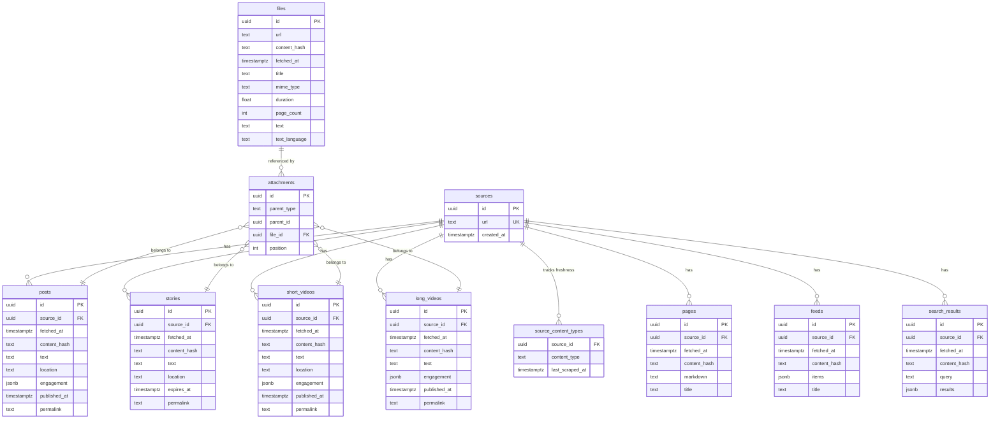

# Refactor Archive to Trait-Based Content Type API

## Overview

Replace the archive's single `fetch(target_string)` entry point with a trait-based content type API. The archive splits into three layers (Store, Services, Archive), introduces per-content-type database tables, and exposes a `SourceHandle` that lets callers request specific content types (`posts`, `stories`, `short_videos`, etc.) without coupling to any platform. Big-bang replacement of the existing `FetchBackend` trait and `web_interactions` table.

## Problem Statement / Motivation

The current `fetch()` API collapses all intent into a URL string. The router guesses what the caller wants. This breaks down when a single source (like an Instagram profile) has multiple distinct content streams — posts, stories, reels — and the caller needs to specify which one. Additionally, the single `web_interactions` table stores all content types in one undifferentiated blob, making queries like "all stories fetched in the last 24 hours" require JSONB introspection instead of a table scan.

## Proposed Solution

See brainstorm: `docs/brainstorms/2026-02-22-archive-content-type-api-brainstorm.md`

Key decisions:
- `SourceHandle` struct implements all content-type traits; returns `Err(Unsupported)` for non-applicable ones
- Three layers: Store (Postgres, no platform knowledge), Services (platform fetching, no storage), Archive (orchestration)
- Files as universal media layer; `attachments` join table for content → files
- `files.text` for all text extraction (PDF parsing, video transcription, image vision/OCR) — caller opts in via `.with_text_analysis()`
- Synthetic search URLs for platform-wide topic search (e.g., `instagram.com/explore/tags/coffee`)
- `run_id` decoupled from archive entirely — scout's responsibility if needed
- File dedup by `(url, content_hash)` — one file row, multiple content records can reference it via attachments

## Technical Approach

### Architecture

```
Caller (scout workflow)
        ↓
    Archive (orchestration)
      ├── SourceHandle (trait-based API)
      ├── Router (URL → platform detection)
      ├── TextAnalyzer (transcription + vision/OCR)
      │
      ├── Services (platform-specific)
      │   ├── InstagramService
      │   ├── TwitterService
      │   ├── RedditService
      │   ├── FacebookService
      │   ├── TikTokService
      │   ├── YouTubeService (future)
      │   ├── BlueskyService (future)
      │   ├── PageService (Chrome/Browserless)
      │   ├── FeedService (RSS/Atom)
      │   └── SearchService (Serper)
      │
      └── Store (Postgres)
          ├── sources
          ├── source_content_types
          ├── files
          ├── attachments
          ├── posts
          ├── stories
          ├── short_videos
          ├── long_videos
          ├── pages
          ├── feeds
          └── search_results
```

### Implementation Phases

#### Phase 1: Foundation — Types, Store, Schema

Define all shared types in `rootsignal-common` and create the new database schema.

**New types in `rootsignal-common/src/types.rs`:**

```rust
// Universal content types — app code uses these
pub struct Post {
    pub id: Uuid,
    pub source_id: Uuid,
    pub fetched_at: DateTime<Utc>,
    pub content_hash: String,
    pub text: Option<String>,
    pub location: Option<String>,
    pub engagement: Option<serde_json::Value>,
    pub published_at: Option<DateTime<Utc>>,
    pub permalink: Option<String>,
    pub attachments: Vec<File>,
}

pub struct Story {
    pub id: Uuid,
    pub source_id: Uuid,
    pub fetched_at: DateTime<Utc>,
    pub content_hash: String,
    pub text: Option<String>,
    pub location: Option<String>,
    pub expires_at: Option<DateTime<Utc>>,
    pub permalink: Option<String>,
    pub attachments: Vec<File>,
}

pub struct ShortVideo {
    pub id: Uuid,
    pub source_id: Uuid,
    pub fetched_at: DateTime<Utc>,
    pub content_hash: String,
    pub text: Option<String>,
    pub location: Option<String>,
    pub engagement: Option<serde_json::Value>,
    pub published_at: Option<DateTime<Utc>>,
    pub permalink: Option<String>,
    pub attachments: Vec<File>,
}

pub struct LongVideo {
    pub id: Uuid,
    pub source_id: Uuid,
    pub fetched_at: DateTime<Utc>,
    pub content_hash: String,
    pub text: Option<String>,
    pub engagement: Option<serde_json::Value>,
    pub published_at: Option<DateTime<Utc>>,
    pub permalink: Option<String>,
    pub attachments: Vec<File>,
}

pub struct Page {
    pub id: Uuid,
    pub source_id: Uuid,
    pub fetched_at: DateTime<Utc>,
    pub content_hash: String,
    pub markdown: String,
    pub title: Option<String>,
}

pub struct File {
    pub id: Uuid,
    pub source_id: Uuid,
    pub fetched_at: DateTime<Utc>,
    pub content_hash: String,
    pub url: String,
    pub title: Option<String>,
    pub mime_type: String,
    pub duration: Option<f64>,
    pub page_count: Option<i32>,
    pub text: Option<String>,
    pub text_language: Option<String>,
}

pub struct FeedResult {
    pub id: Uuid,
    pub source_id: Uuid,
    pub fetched_at: DateTime<Utc>,
    pub content_hash: String,
    pub items: Vec<FeedItem>,  // already exists in common
    pub title: Option<String>,
}

pub struct SearchResultSet {
    pub id: Uuid,
    pub source_id: Uuid,
    pub fetched_at: DateTime<Utc>,
    pub content_hash: String,
    pub query: String,
    pub results: Vec<SearchResult>,  // already exists in common
}

pub struct Source {
    pub id: Uuid,
    pub url: String,
    pub created_at: DateTime<Utc>,
}
```

**New migration `modules/rootsignal-archive/migrations/004_content_type_tables.sql`:**

```sql
-- Drop old table
DROP TABLE IF EXISTS web_interactions;

-- Sources
CREATE TABLE sources (
    id UUID PRIMARY KEY DEFAULT gen_random_uuid(),
    url TEXT NOT NULL UNIQUE,
    created_at TIMESTAMPTZ NOT NULL DEFAULT now()
);
CREATE INDEX idx_sources_url ON sources(url);

-- Source content type freshness
CREATE TABLE source_content_types (
    source_id UUID NOT NULL REFERENCES sources(id),
    content_type TEXT NOT NULL,
    last_scraped_at TIMESTAMPTZ NOT NULL DEFAULT now(),
    PRIMARY KEY (source_id, content_type)
);

-- Files (universal media layer)
CREATE TABLE files (
    id UUID PRIMARY KEY DEFAULT gen_random_uuid(),
    url TEXT NOT NULL,
    content_hash TEXT NOT NULL,
    fetched_at TIMESTAMPTZ NOT NULL DEFAULT now(),
    title TEXT,
    mime_type TEXT NOT NULL,
    duration DOUBLE PRECISION,
    page_count INTEGER,
    text TEXT,
    text_language TEXT,
    UNIQUE(url, content_hash)
);
CREATE INDEX idx_files_content_hash ON files(content_hash);
CREATE INDEX idx_files_url ON files(url);

-- Attachments (polymorphic join: content → files)
CREATE TABLE attachments (
    id UUID PRIMARY KEY DEFAULT gen_random_uuid(),
    parent_type TEXT NOT NULL,
    parent_id UUID NOT NULL,
    file_id UUID NOT NULL REFERENCES files(id),
    position INTEGER NOT NULL DEFAULT 0
);
CREATE INDEX idx_attachments_parent ON attachments(parent_type, parent_id);
CREATE INDEX idx_attachments_file ON attachments(file_id);

-- Posts
CREATE TABLE posts (
    id UUID PRIMARY KEY DEFAULT gen_random_uuid(),
    source_id UUID NOT NULL REFERENCES sources(id),
    fetched_at TIMESTAMPTZ NOT NULL DEFAULT now(),
    content_hash TEXT NOT NULL,
    text TEXT,
    location TEXT,
    engagement JSONB,
    published_at TIMESTAMPTZ,
    permalink TEXT
);
CREATE INDEX idx_posts_source ON posts(source_id);
CREATE INDEX idx_posts_fetched ON posts(fetched_at);
CREATE INDEX idx_posts_hash ON posts(content_hash);

-- Stories
CREATE TABLE stories (
    id UUID PRIMARY KEY DEFAULT gen_random_uuid(),
    source_id UUID NOT NULL REFERENCES sources(id),
    fetched_at TIMESTAMPTZ NOT NULL DEFAULT now(),
    content_hash TEXT NOT NULL,
    text TEXT,
    location TEXT,
    expires_at TIMESTAMPTZ,
    permalink TEXT
);
CREATE INDEX idx_stories_source ON stories(source_id);
CREATE INDEX idx_stories_fetched ON stories(fetched_at);

-- Short videos
CREATE TABLE short_videos (
    id UUID PRIMARY KEY DEFAULT gen_random_uuid(),
    source_id UUID NOT NULL REFERENCES sources(id),
    fetched_at TIMESTAMPTZ NOT NULL DEFAULT now(),
    content_hash TEXT NOT NULL,
    text TEXT,
    location TEXT,
    engagement JSONB,
    published_at TIMESTAMPTZ,
    permalink TEXT
);
CREATE INDEX idx_short_videos_source ON short_videos(source_id);
CREATE INDEX idx_short_videos_fetched ON short_videos(fetched_at);

-- Long videos
CREATE TABLE long_videos (
    id UUID PRIMARY KEY DEFAULT gen_random_uuid(),
    source_id UUID NOT NULL REFERENCES sources(id),
    fetched_at TIMESTAMPTZ NOT NULL DEFAULT now(),
    content_hash TEXT NOT NULL,
    text TEXT,
    engagement JSONB,
    published_at TIMESTAMPTZ,
    permalink TEXT
);
CREATE INDEX idx_long_videos_source ON long_videos(source_id);

-- Pages
CREATE TABLE pages (
    id UUID PRIMARY KEY DEFAULT gen_random_uuid(),
    source_id UUID NOT NULL REFERENCES sources(id),
    fetched_at TIMESTAMPTZ NOT NULL DEFAULT now(),
    content_hash TEXT NOT NULL,
    markdown TEXT NOT NULL,
    title TEXT
);
CREATE INDEX idx_pages_source ON pages(source_id);
CREATE INDEX idx_pages_fetched ON pages(fetched_at);

-- Feeds
CREATE TABLE feeds (
    id UUID PRIMARY KEY DEFAULT gen_random_uuid(),
    source_id UUID NOT NULL REFERENCES sources(id),
    fetched_at TIMESTAMPTZ NOT NULL DEFAULT now(),
    content_hash TEXT NOT NULL,
    items JSONB NOT NULL,
    title TEXT
);
CREATE INDEX idx_feeds_source ON feeds(source_id);

-- Search results
CREATE TABLE search_results (
    id UUID PRIMARY KEY DEFAULT gen_random_uuid(),
    source_id UUID NOT NULL REFERENCES sources(id),
    fetched_at TIMESTAMPTZ NOT NULL DEFAULT now(),
    content_hash TEXT NOT NULL,
    query TEXT NOT NULL,
    results JSONB NOT NULL
);
CREATE INDEX idx_search_results_source ON search_results(source_id);
```

**New `modules/rootsignal-archive/src/store.rs`** — rewritten to handle per-table CRUD:

```rust
// Store methods (sketch):
impl Store {
    // Sources
    async fn upsert_source(&self, url: &str) -> Result<Source>;
    async fn get_source(&self, url: &str) -> Result<Option<Source>>;

    // Source content types
    async fn update_last_scraped(&self, source_id: Uuid, content_type: &str) -> Result<()>;
    async fn get_last_scraped(&self, source_id: Uuid, content_type: &str) -> Result<Option<DateTime<Utc>>>;

    // Files
    async fn upsert_file(&self, file: &InsertFile) -> Result<File>;

    // Attachments
    async fn insert_attachments(&self, parent_type: &str, parent_id: Uuid, file_ids: &[(Uuid, i32)]) -> Result<()>;

    // Content tables
    async fn insert_posts(&self, posts: &[InsertPost]) -> Result<Vec<Post>>;
    async fn insert_stories(&self, stories: &[InsertStory]) -> Result<Vec<Story>>;
    async fn insert_short_videos(&self, videos: &[InsertShortVideo]) -> Result<Vec<ShortVideo>>;
    async fn insert_long_videos(&self, videos: &[InsertLongVideo]) -> Result<Vec<LongVideo>>;
    async fn insert_page(&self, page: &InsertPage) -> Result<Page>;
    async fn insert_feed(&self, feed: &InsertFeed) -> Result<FeedResult>;
    async fn insert_search_results(&self, results: &InsertSearchResults) -> Result<SearchResultSet>;

    // Reads (for cached_only / max_age)
    async fn get_posts(&self, source_id: Uuid, limit: u32) -> Result<Vec<Post>>;
    async fn get_stories(&self, source_id: Uuid) -> Result<Vec<Story>>;
    // ... etc
}
```

**Files to create/modify:**
- `modules/rootsignal-common/src/types.rs` — add new content type structs
- `modules/rootsignal-archive/migrations/004_content_type_tables.sql` — new schema
- `modules/rootsignal-archive/src/store.rs` — rewrite for multi-table persistence

---

#### Phase 2: Services — Extract Platform Logic

Extract platform-specific fetching into self-contained service modules. Each service takes API clients as input, returns universal content types as output. No storage dependency.

**New module structure:**

```
modules/rootsignal-archive/src/
├── services/
│   ├── mod.rs
│   ├── instagram.rs    -- InstagramService (wraps ApifyClient)
│   ├── twitter.rs      -- TwitterService (wraps ApifyClient)
│   ├── reddit.rs       -- RedditService (wraps ApifyClient)
│   ├── facebook.rs     -- FacebookService (wraps ApifyClient)
│   ├── tiktok.rs       -- TikTokService (wraps ApifyClient)
│   ├── page.rs         -- PageService (Chrome/Browserless)
│   ├── feed.rs         -- FeedService (RSS/Atom parser)
│   └── search.rs       -- SearchService (Serper)
```

**Each service follows the same pattern:**

```rust
// Example: InstagramService
pub struct InstagramService {
    apify: ApifyClient,
}

impl InstagramService {
    pub async fn fetch_posts(&self, identifier: &str, limit: u32) -> Result<Vec<RawPost>>;
    pub async fn fetch_stories(&self, identifier: &str) -> Result<Vec<RawStory>>;
    pub async fn fetch_reels(&self, identifier: &str, limit: u32) -> Result<Vec<RawShortVideo>>;
    pub async fn search_hashtags(&self, topics: &[&str], limit: u32) -> Result<Vec<RawPost>>;
}
```

`Raw*` types are intermediate — they carry the service's normalized output before the archive maps them to the universal types and persists. This keeps services free of storage concerns.

**Migration from current code:**
- Move `fetchers/social.rs` platform-specific logic → per-service modules
- Move `fetchers/page.rs` → `services/page.rs`
- Move `fetchers/feed.rs` → `services/feed.rs`
- Move `fetchers/search.rs` → `services/search.rs`
- Delete `fetchers/` directory

**Files to create/modify:**
- `modules/rootsignal-archive/src/services/mod.rs` — new
- `modules/rootsignal-archive/src/services/instagram.rs` — extract from `fetchers/social.rs`
- `modules/rootsignal-archive/src/services/twitter.rs` — extract from `fetchers/social.rs`
- `modules/rootsignal-archive/src/services/reddit.rs` — extract from `fetchers/social.rs`
- `modules/rootsignal-archive/src/services/facebook.rs` — extract from `fetchers/social.rs`
- `modules/rootsignal-archive/src/services/tiktok.rs` — extract from `fetchers/social.rs`
- `modules/rootsignal-archive/src/services/page.rs` — move from `fetchers/page.rs`
- `modules/rootsignal-archive/src/services/feed.rs` — move from `fetchers/feed.rs`
- `modules/rootsignal-archive/src/services/search.rs` — move from `fetchers/search.rs`
- Delete `modules/rootsignal-archive/src/fetchers/` — replaced by services

---

#### Phase 3: Archive Orchestration — SourceHandle + Traits

Build the public API: `Archive::source(url) -> SourceHandle`, trait implementations on `SourceHandle`, request builders with `.with_text_analysis()` and `.max_age()`.

**Traits in `modules/rootsignal-archive/src/traits.rs`:**

```rust
#[async_trait]
pub trait HasPosts: Send + Sync {
    fn posts(&self, limit: u32) -> PostsRequest;
}

#[async_trait]
pub trait HasStories: Send + Sync {
    fn stories(&self) -> StoriesRequest;
}

#[async_trait]
pub trait HasShortformVideo: Send + Sync {
    fn short_videos(&self, limit: u32) -> ShortVideoRequest;
}

#[async_trait]
pub trait HasLongformVideo: Send + Sync {
    fn videos(&self, limit: u32) -> VideoRequest;
}

#[async_trait]
pub trait HasPage: Send + Sync {
    fn page(&self) -> PageRequest;
}

#[async_trait]
pub trait HasFile: Send + Sync {
    fn file(&self) -> FileRequest;
}

#[async_trait]
pub trait HasFeed: Send + Sync {
    fn feed(&self) -> FeedRequest;
}

#[async_trait]
pub trait HasSearch: Send + Sync {
    fn search(&self) -> SearchRequest;
}
```

**SourceHandle in `modules/rootsignal-archive/src/source_handle.rs`:**

```rust
pub struct SourceHandle {
    source: Source,
    platform: Option<Platform>,
    archive: Arc<ArchiveInner>,
}

// ArchiveInner holds services + store
struct ArchiveInner {
    store: Store,
    router: Router,
    text_analyzer: TextAnalyzer,
    // Services
    instagram: Option<InstagramService>,
    twitter: Option<TwitterService>,
    reddit: Option<RedditService>,
    facebook: Option<FacebookService>,
    tiktok: Option<TikTokService>,
    page: PageService,
    feed: FeedService,
    search: Option<SearchService>,
}
```

**Request builders (example):**

```rust
pub struct PostsRequest {
    archive: Arc<ArchiveInner>,
    source: Source,
    platform: Option<Platform>,
    limit: u32,
    text_analysis: bool,
    max_age: Option<Duration>,
    cached_only: bool,
}

impl PostsRequest {
    pub fn with_text_analysis(mut self) -> Self {
        self.text_analysis = true;
        self
    }

    pub fn max_age(mut self, duration: Duration) -> Self {
        self.max_age = Some(duration);
        self
    }

    pub fn cached_only(mut self) -> Self {
        self.cached_only = true;
        self
    }

    pub async fn send(self) -> Result<Vec<Post>> {
        // 1. Check freshness via store if max_age/cached_only
        // 2. Delegate to appropriate service based on platform
        // 3. Map Raw* to universal types
        // 4. Persist via store (files, attachments, posts)
        // 5. If text_analysis, run TextAnalyzer on attached files
        // 6. Update source_content_types.last_scraped_at
        // 7. Return Vec<Post> with attachments populated
    }
}

// IntoFuture so callers can just .await directly
impl IntoFuture for PostsRequest {
    type Output = Result<Vec<Post>>;
    type IntoFuture = Pin<Box<dyn Future<Output = Self::Output> + Send>>;

    fn into_future(self) -> Self::IntoFuture {
        Box::pin(self.send())
    }
}
```

**Archive public API in `modules/rootsignal-archive/src/archive.rs`:**

```rust
pub struct Archive {
    inner: Arc<ArchiveInner>,
}

impl Archive {
    pub fn new(config: ArchiveConfig, pool: PgPool) -> Self;

    pub async fn source(&self, url: &str) -> Result<SourceHandle> {
        let normalized = normalize_url(url);
        let platform = self.inner.router.detect_platform(&normalized);
        let source = self.inner.store.upsert_source(&normalized).await?;
        Ok(SourceHandle {
            source,
            platform,
            archive: self.inner.clone(),
        })
    }

    pub async fn migrate(&self) -> Result<()>;
}
```

**URL normalization in `modules/rootsignal-archive/src/router.rs`:**

```rust
pub fn normalize_url(url: &str) -> String {
    // Strip protocol (http://, https://)
    // Strip www.
    // Strip trailing slashes
    // Lowercase
    // Consistent for: instagram.com/starbucks, www.instagram.com/starbucks/, https://instagram.com/starbucks
}

pub fn detect_platform(url: &str) -> Option<Platform> {
    // Existing pattern matching from router.rs detect_target()
    // Returns Platform enum instead of TargetKind
}
```

**TextAnalyzer in `modules/rootsignal-archive/src/text_analyzer.rs`:**

```rust
pub struct TextAnalyzer {
    ai_client: Arc<dyn AiClient>,
}

impl TextAnalyzer {
    pub async fn analyze(&self, file: &File) -> Result<TextAnalysis> {
        match file.mime_type.as_str() {
            t if t.starts_with("video/") => self.transcribe_video(file).await,
            t if t.starts_with("audio/") => self.transcribe_audio(file).await,
            t if t.starts_with("image/") => self.extract_image_text(file).await,
            "application/pdf" => self.extract_pdf_text(file).await,
            _ => Ok(TextAnalysis::empty()),
        }
    }
}
```

**Files to create/modify:**
- `modules/rootsignal-archive/src/traits.rs` — new
- `modules/rootsignal-archive/src/source_handle.rs` — new
- `modules/rootsignal-archive/src/archive.rs` — rewrite
- `modules/rootsignal-archive/src/router.rs` — refactor (normalize_url, detect_platform)
- `modules/rootsignal-archive/src/text_analyzer.rs` — new
- `modules/rootsignal-archive/src/error.rs` — update error variants
- `modules/rootsignal-archive/src/lib.rs` — update exports

---

#### Phase 4: Caller Migration — Big-Bang Update

Update all 19+ files that import `FetchBackend` to use the new `Archive::source()` API. Remove `FetchBackend`, `FetchBackendExt`, `FetchRequest`, `Content` enum.

**Key caller transformations:**

| Caller | Before | After |
|--------|--------|-------|
| `scrape_phase.rs` run_social | `archive.fetch(&id).content().await` → match `Content::SocialPosts` | `archive.source(&url).await?.posts(limit).await?` |
| `scrape_phase.rs` run_web | `archive.fetch(&query).content().await` → match `Content::SearchResults` | `archive.source(&query).await?.search().await?` |
| `scrape_phase.rs` run_web page | `archive.fetch(&url).text().await` | `archive.source(&url).await?.page().await?.markdown` |
| `scrape_phase.rs` discover_from_topics | `SocialSearch::new().to_string()` → `archive.fetch(...)` | `archive.source(&synthetic_url).await?.search().await?` |
| `investigator.rs` | `archive.fetch(&query).content().await` | `archive.source(&query).await?.search().await?` then `archive.source(&url).await?.page().await?` |
| `news_scanner.rs` | `archive.fetch(feed_url).content().await` → match `Content::Feed` | `archive.source(feed_url).await?.feed().await?` |
| `actor_discovery.rs` | `archive.fetch(&url).content().await` | `archive.source(&url).await?.page().await?` |
| `fixtures.rs` | `impl FetchBackend for FixtureArchive` | `FixtureArchive` wraps `Archive` with canned store data |
| `sim_adapter.rs` | `impl FetchBackend for SimAdapter` | Same pattern as fixtures |
| `workflows/mod.rs` | `create_archive() -> Arc<dyn FetchBackend>` | `create_archive() -> Arc<Archive>` |
| `scout.rs` | `archive: Arc<dyn FetchBackend>` | `archive: Arc<Archive>` |
| `mutations.rs` | Imports `Content` enum | Use typed structs directly |

**Files to modify:**
- `modules/rootsignal-scout/src/scout.rs`
- `modules/rootsignal-scout/src/workflows/mod.rs`
- `modules/rootsignal-scout/src/workflows/scrape.rs`
- `modules/rootsignal-scout/src/pipeline/scrape_phase.rs`
- `modules/rootsignal-scout/src/discovery/gathering_finder.rs`
- `modules/rootsignal-scout/src/discovery/tension_linker.rs`
- `modules/rootsignal-scout/src/discovery/response_finder.rs`
- `modules/rootsignal-scout/src/enrichment/investigator.rs`
- `modules/rootsignal-scout/src/enrichment/actor_discovery.rs`
- `modules/rootsignal-scout/src/scheduling/bootstrap.rs`
- `modules/rootsignal-scout/src/news_scanner.rs`
- `modules/rootsignal-scout/src/fixtures.rs`
- `modules/rootsignal-scout/tests/harness/sim_adapter.rs`
- `modules/rootsignal-scout/tests/harness/mod.rs`
- `modules/rootsignal-scout/src/bin/diagnose_reddit.rs`
- `modules/rootsignal-api/src/graphql/mutations.rs`

**Files to delete:**
- `modules/rootsignal-archive/src/fetchers/` — replaced by services
- `modules/rootsignal-archive/src/replay.rs` — removed (rebuild later if needed)
- `modules/rootsignal-archive/src/seed.rs` — removed (rebuild later if needed)
- `modules/rootsignal-archive/src/semantics.rs` — removed per brainstorm decision

---

#### Phase 5: Cleanup + Verify

- Remove old `FetchBackend` trait, `FetchBackendExt`, `FetchRequest`, `Content` enum
- Remove old migrations 001-003 (clean start)
- Update `Cargo.toml` dependencies if any are no longer needed
- Run `cargo build` — must compile
- Run `cargo test` — update/fix broken tests
- Run `cargo clippy` — clean warnings

**Files to modify:**
- `modules/rootsignal-archive/src/lib.rs` — remove old exports
- `modules/rootsignal-common/src/types.rs` — remove old `Content`, `ScrapedPage`, `SocialPost` etc. if fully replaced
- `modules/rootsignal-archive/Cargo.toml` — dep cleanup

## Acceptance Criteria

### Functional Requirements

- [ ] `archive.source(url).await?` returns a `SourceHandle` for any URL
- [ ] `source.posts(limit).await?` returns `Vec<Post>` for supported platforms, `Err(Unsupported)` otherwise
- [ ] `source.stories().await?` works for Instagram sources
- [ ] `source.short_videos(limit).await?` works for Instagram, TikTok
- [ ] `source.page().await?` works for web URLs
- [ ] `source.feed().await?` works for RSS/Atom URLs
- [ ] `source.search().await?` works for search queries and synthetic topic URLs
- [ ] `.with_text_analysis()` triggers transcription for video/audio, OCR for images, text extraction for PDFs
- [ ] `.max_age()` returns cached content if fresh enough
- [ ] `.cached_only()` never hits the network
- [ ] Files are deduped by `(url, content_hash)` — same file referenced by multiple content records via attachments
- [ ] All 19+ caller files compile and work with the new API
- [ ] `source_content_types.last_scraped_at` updated after each successful fetch
- [ ] URL normalization produces consistent source records for URL variants

### Non-Functional Requirements

- [ ] Services have zero storage dependencies (no `PgPool`, no `Store`)
- [ ] Store has zero platform dependencies (no `ApifyClient`, no service types)
- [ ] Request builders are `Send + Sync` (own `Arc` references, not borrows)
- [ ] All nullable fields use `Option<T>`, never `unwrap_or()` defaults

## Dependencies & Risks

- **Big-bang risk**: All 19+ files must be updated atomically. Mitigated by the fact that the compiler catches everything — if it compiles, the wiring is correct.
- **Apify actor IDs**: Services hardcode Apify actor IDs. These may change. Keep them as configuration, not constants.
- **Neo4j source sync**: Sources now exist in both Neo4j (scout authority) and Postgres (archive authority). Clear ownership: Neo4j owns source metadata (scheduling, weights), Postgres owns fetched content. `archive.source(url)` auto-creates Postgres rows on first access.
- **Replay/Seeder removed**: Developers lose offline replay capability until rebuilt. Acceptable for now since the codebase is actively evolving.

## ERD



## References & Research

### Internal References

- Brainstorm: `docs/brainstorms/2026-02-22-archive-content-type-api-brainstorm.md`
- Original archive plan: `docs/plans/2026-02-21-feat-web-archive-layer-plan.md`
- Current archive module: `modules/rootsignal-archive/src/`
- Current social fetcher: `modules/rootsignal-archive/src/fetchers/social.rs`
- Apify client: `modules/apify-client/src/lib.rs`
- Error patterns: `modules/rootsignal-archive/src/error.rs`
- Neo4j source model: `modules/rootsignal-graph/src/writer.rs:1743`
- Data quality learning: `docs/solutions/2026-02-17-unwrap-or-masks-data-quality.md`
