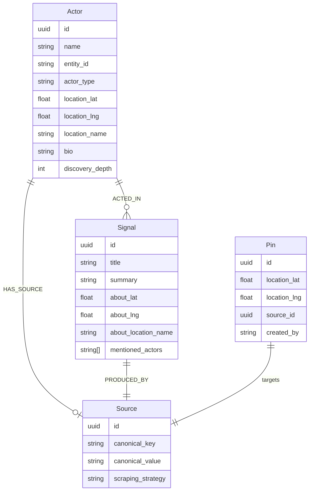

# Actor-Source-Signal Flywheel MVP

## Overview

Rewire the actor, source, and signal graph to form a self-reinforcing flywheel: scouts find signals → signals reveal actors (via authorship) → actors link to sources → sources get scraped in future runs → more signals. Every scout run is an evidence-gathering pass. Location and identity converge over time rather than being stamped once.

## Problem Statement

Today actors are created with name-based entity_ids that auto-merge across platforms (unsafe), location is stamped once at creation time and never updated (stale), `from_location` is snapshotted onto signals at write time (fights the living-location model), mentioned actors create low-quality nodes that pollute the graph, and there's no `Signal → Source` edge for reverse traversal. The `HAS_ACCOUNT` edge is queried but never created. Sources lost their region association when `center_lat/lng` was removed.

## Technical Approach

### Architecture

Six phases, each independently deployable. Earlier phases provide foundations for later ones.



### Implementation Phases

#### Phase 1: Foundation — Types and Data Model

Add the type-level building blocks. No behavior changes yet.

**1a. Owned vs aggregator: derived from scraping strategy (no enum)**

We already know ownership at scrape time — the source's structure tells us. A Facebook profile is owned by definition. An RSS feed from a news outlet is aggregated by definition. No counting, no thresholds, no queries needed.

**Implementation:**
- **No `SourceType` enum.** No `source_type` field on `SourceNode`.
- Instead: read the existing `ScrapingStrategy` to determine ownership:
  - `SocialMedia` / `Website` → owned (it's a single entity's profile or site) → create actor with `HAS_SOURCE`
  - `RssFeed` / `SearchQuery` / `EventPlatform` → aggregated → no actor node, authors stay as text metadata
- **File:** `modules/rootsignal-scout/src/pipeline/scrape_phase.rs`
- Add a helper: `fn is_owned_source(strategy: &ScrapingStrategy) -> bool`
- This is a heuristic, not a hard rule. If a source that looks aggregated turns out to have a single consistent author, that's a Stage 2 refinement (evidence-based reclassification).
- No new graph queries needed.

**1b. Actor entity_id = source `canonical_value` (URL-as-identity)**

No prefix vocabulary or handle extraction needed. The source's `canonical_value` already provides a globally unique, stable, verifiable identifier:

```
instagram.com/friendsfalls       → actor entity_id
facebook.com/friendsofthefalls   → actor entity_id (separate actor, same org)
friendsofthefalls.org            → actor entity_id (separate actor, same org)
x.com/friendsfalls               → actor entity_id
```

The `canonical_value()` function in `types.rs` already normalizes URLs (strips protocol, www, trailing slashes, aliases twitter→x.com). This IS the identity.

**Implications:**
- Actor nodes only exist for entities that own a source (owned sources only)
- Actors from aggregator sources (journalists, event organizers) are NOT created as nodes — they're text metadata on signals, same as `mentioned_actors`
- The `archive.source(url).identifier` path provides the same identity system for future work (e.g., discovering `@username` mentions → `archive.source("instagram.com/username")`)
- No `actor_entity_id()` construction function needed — just use `source.canonical_value`
- No `extract_handle_from_canonical()` needed
- No prefix vocabulary needed

**Migration note:** Old entity_ids (`name-slug` format like `friends-of-the-falls`) will not collide with new URL-based entity_ids. Old actors become orphans and age out naturally.

**1c. Add `discovery_depth` to `ActorNode`**

- **File:** `modules/rootsignal-common/src/types.rs`
- Add field: `discovery_depth: u32` to `ActorNode`
- Tracks how many hops from a bootstrap seed this actor was discovered:
  - `0` = bootstrap seed (human-curated)
  - `1` = discovered from a seed's signals
  - `2` = discovered from a depth-1 actor's signals
  - `MAX` = discovered via open gap analysis (no seed path)
- **File:** `modules/rootsignal-graph/src/writer.rs` — include in `upsert_actor` MERGE
- **Flywheel cap:** Actors beyond depth N (e.g., 3) cannot trigger further source discovery without investigation. Their source still gets scraped (signals still flow), but their signals' outbound links do not create new sources.
- This is the structural brake on flywheel amplification — limits the blast radius of a successful injection.

**1d. Add `PinNode` struct**

- **File:** `modules/rootsignal-common/src/types.rs`
  ```rust
  pub struct PinNode {
      pub id: Uuid,
      pub location_lat: f64,
      pub location_lng: f64,
      pub source_id: Uuid,
      pub created_by: String,  // scout run ID or "human"
      pub created_at: DateTime<Utc>,
  }
  ```

**1e. Resolve `SOURCED_FROM` edge name collision**

- **File:** `modules/rootsignal-common/src/types.rs`
- The existing `EdgeType::SourcedFrom` means Signal → Evidence (provenance)
- Rename existing to `EdgeType::EvidencedBy` (or `ProvenanceOf`)
- Use `PRODUCED_BY` for the new Signal → Source edge (avoids ambiguity entirely)
- Update all references to old `SourcedFrom` variant
- **File:** `modules/rootsignal-graph/src/writer.rs` — update Cypher queries referencing `SOURCED_FROM` label for evidence edges

**Tests for Phase 1:**
- `canonical_value_is_stable_identity` — verify same URL always produces same canonical_value
- `pin_node_struct_has_required_fields` — basic struct construction
- `discovery_depth_defaults_to_zero_for_seeds` — bootstrap actors get depth 0
- `discovery_depth_increments_from_parent` — actor discovered from depth-1 actor gets depth 2
- `evidence_edge_renamed_to_evidenced_by` — old SourcedFrom edge type becomes EvidencedBy

---

#### Phase 2: Graph Edges — `PRODUCED_BY` and `HAS_SOURCE`

Wire up the two new edges and rename the existing one.

**2a. Create `PRODUCED_BY` edge (Signal → Source)**

- **File:** `modules/rootsignal-graph/src/writer.rs`
- Add function:
  ```rust
  pub async fn link_signal_to_source(&self, signal_id: Uuid, source_id: Uuid) -> Result<()>
  ```
- Cypher: `MATCH (n {id: $signal_id}), (s:Source {id: $source_id}) MERGE (n)-[:PRODUCED_BY]->(s)`
- **File:** `modules/rootsignal-scout/src/pipeline/scrape_phase.rs`
- Call `link_signal_to_source` after storing each signal (in the `store_signals` method, ~line 1402)
- The source_id is available from `RunContext` / `ScheduledRun`

**2a-addendum. Signal-per-source cap for importance scoring**

- A single source producing thousands of signals shouldn't dominate region queries or inflate actor importance
- Add a scoring discount: when ranking signals in a region, signals from sources with >N signals per run get a diminishing weight (e.g., 1/log(signal_count) per source)
- This is NOT a hard cap on ingestion — all signals are still stored and queryable
- It's a soft brake on influence: a source can produce 1000 signals, but their combined weight in importance scoring is capped
- **File:** `modules/rootsignal-scout/src/pipeline/scrape_phase.rs` (in scoring logic)
- This prevents the `PRODUCED_BY` edge from being weaponized — flooding signals from one source doesn't increase that source's influence proportionally

**2b. Rename `HAS_ACCOUNT` → `HAS_SOURCE`**

- **File:** `modules/rootsignal-graph/src/writer.rs`
- Add function:
  ```rust
  pub async fn link_actor_to_source(&self, actor_id: Uuid, source_id: Uuid) -> Result<()>
  ```
- Cypher: `MATCH (a:Actor {id: $actor_id}), (s:Source {id: $source_id}) MERGE (a)-[:HAS_SOURCE]->(s)`
- Update `find_actors_in_region` query to use `[:HAS_SOURCE]` instead of `[:HAS_ACCOUNT]` (writer.rs ~line 2357)
- One-time migration (with dedup guard):
  ```cypher
  MATCH (a)-[r:HAS_ACCOUNT]->(s)
  WHERE NOT (a)-[:HAS_SOURCE]->(s)
  CREATE (a)-[:HAS_SOURCE]->(s)
  DELETE r
  ```

**2c. Add reader queries for reverse traversal**

- **File:** `modules/rootsignal-graph/src/reader.rs`
- Add: `find_sources_for_signals_in_region(bbox)` — signals in bbox → follow `PRODUCED_BY` → source IDs
- Add: `find_sources_for_actors_in_region(bbox)` — actors in bbox → follow `HAS_SOURCE` → source IDs
- These will be used by the scout pipeline to determine which sources to scrape

**Tests for Phase 2:**
- `link_signal_to_source` creates `PRODUCED_BY` edge; query back confirms
- `link_actor_to_source` creates `HAS_SOURCE` edge
- `find_actors_in_region` works with `HAS_SOURCE` instead of `HAS_ACCOUNT`
- `find_sources_for_signals_in_region` returns sources for signals in bbox
- Signals stored in pipeline have `PRODUCED_BY` edge to their source

---

#### Phase 3: Actor Creation Overhaul

Change how actors are created: source-scoped, no mentioned actor nodes, `HAS_SOURCE` for owned sources.

**3a. Change actor lookup from name-based to entity_id-based**

- **File:** `modules/rootsignal-graph/src/writer.rs`
- Add function: `find_actor_by_entity_id(entity_id: &str) -> Option<ActorNode>` (~line 2492)
- Keep `find_actor_by_name` for backward compat but deprecate
- Update `upsert_actor` — MERGE key is already `entity_id`, no change needed

**3b. Rework actor creation in scrape_phase.rs**

- **File:** `modules/rootsignal-scout/src/pipeline/scrape_phase.rs`
- The `store_signals` method (~line 1370) needs the source context (source_id, strategy, canonical_value)
- For `author_actor` resolution (~lines 1832-1886):
  1. Check `is_owned_source(strategy)` from Phase 1a
     - **If owned:** Create actor node + `HAS_SOURCE` + `ACTED_IN` edges
     - **If aggregated:** Skip actor creation. Author name stays as text metadata on signal (same treatment as mentioned_actors).
  2. Use `source.canonical_value` as entity_id (e.g., `instagram.com/friendsfalls`)
  3. Use LLM-extracted `author_actor` name as the actor's display `name` field
  4. Lookup by entity_id instead of name
  5. Create `HAS_SOURCE` edge via `link_actor_to_source` (owned sources only)
  6. Create `ACTED_IN` edge with role "authored" (owned sources only)
  7. Location: use `about_location` from signal if available; do NOT fall back to region center
  8. Set `discovery_depth` = parent actor's depth + 1 (or 0 for bootstrap seeds, MAX for gap-analysis discoveries)
- For `mentioned_actors` resolution (~lines 1779-1829):
  - **Remove actor node creation entirely**
  - `mentioned_actors` stays as `Vec<String>` on NodeMeta — already the case
  - Delete the loop that calls `find_actor_by_name` / `upsert_actor` / `link_actor_to_signal` for mentioned actors
- For aggregator sources:
  - `author_actor` name stored as text on signal metadata (same treatment as mentioned_actors)
  - No actor node, no `ACTED_IN` edge, no `HAS_SOURCE` edge
  - This is correct: journalists, event organizers on aggregator platforms don't own the source

**3c. Update actor_extractor.rs**

- **File:** `modules/rootsignal-scout/src/enrichment/actor_extractor.rs`
- This module finds signals without `ACTED_IN` edges and batch-extracts actors
- With the new model: signals from owned sources should already have author actors (created in 3b)
- Signals from aggregator sources won't have actors — and that's correct (no actor nodes for aggregator authors)
- **Simplification:** The actor_extractor may no longer be needed for MVP. If all owned-source signals get author actors during extraction, and aggregator-source signals deliberately don't get actors, there's nothing left for the extractor to do.
- **Decision:** Disable or remove the actor_extractor. If we later want to discover actors from mentions (e.g., `@username` → `archive.source("instagram.com/username")`), that's a different mechanism (Stage 2)

**3d. Migration: existing actors**

- Old actors with entity_id `name-slug` format (e.g., `friends-of-the-falls`) will not collide with new URL-based entity_ids (e.g., `instagram.com/friendsfalls`)
- They become orphans: no new signals link to them, signal counts stagnate
- They remain in the graph but will not appear in flywheel-driven discovery
- No migration script needed — they age out naturally
- Optional cleanup: after N runs, delete actors with `signal_count = 0` and no `HAS_SOURCE` edge

**Tests for Phase 3:**
- `author_actor_on_owned_source_creates_actor_and_has_source` — MOCK → scrape pipeline → check actor node + HAS_SOURCE edge exist
- `author_actor_on_aggregator_source_creates_no_actor_node` — RSS source → no actor node, author name stays as text metadata
- `mentioned_actors_do_not_create_actor_nodes` — verify mentioned_actors stays as text, no Actor nodes created
- `entity_id_is_source_canonical_value` — verify entity_id = `instagram.com/friendsfalls` (the source URL)
- `same_org_on_two_platforms_creates_two_actors` — `instagram.com/org` and `facebook.com/org` are separate actor nodes
- `blank_author_name_does_not_create_actor` — edge case: empty string or whitespace
- `actor_name_is_llm_extracted_display_name` — entity_id is URL, but `name` field is the human-readable name from LLM

---

#### Phase 4: Remove `from_location` From Write Path

Derive `from_location` at query time via actor graph traversal instead of storing it.

**4a. Update `score_and_filter`**

- **File:** `modules/rootsignal-scout/src/pipeline/scrape_phase.rs` (~lines 197-236)
- Remove the entire `from_location` population block (lines 211-229)
- Keep the `about_location` fallback logic? **No** — with query-time derivation, if a signal has no `about_location` from extraction, it simply has no content location. The actor's location is available via traversal. Don't fabricate `about_location` from actor coords.
- Simplified `score_and_filter`:
  1. Score quality, stamp source_url, stamp confidence
  2. Filter out Evidence nodes
  3. That's it — no location manipulation

**4b. Update NodeMeta**

- **File:** `modules/rootsignal-common/src/types.rs` (~line 237)
- Keep `from_location: Option<GeoPoint>` on the struct for backward compat (reading old signals)
- Stop writing it in new signals
- Add `#[deprecated]` annotation or comment

**4c. Update GraphQL for query-time from_location**

- **File:** `modules/rootsignal-api/src/graphql/types.rs`
- `from_location` is not currently exposed in GraphQL — no API breaking change
- For future: add a `from_location` resolver on signal types that traverses:
  ```
  Signal ← ACTED_IN(role="authored") ← Actor → actor.location
  ```
- This can use the existing `ActorsBySignalLoader` but filter for role="authored"
- **Not required for MVP** — just ensure the architecture supports it

**4d. Update map/region queries**

- **File:** `modules/rootsignal-graph/src/reader.rs`
- Current: signals in bbox query on `about_location` fields
- Add secondary query path: signals where author actor's location is in bbox
  ```cypher
  MATCH (a:Actor)-[:ACTED_IN {role: "authored"}]->(n)
  WHERE a.location_lat >= $min_lat AND a.location_lat <= $max_lat
    AND a.location_lng >= $min_lng AND a.location_lng <= $max_lng
    AND n.lat IS NULL  // only for signals without their own location
  RETURN n
  ```
- Union with the existing `about_location` bbox query

**Tests for Phase 4:**
- `score_and_filter_does_not_set_from_location` — verify from_location is None after scoring
- `signal_without_about_location_is_not_fabricated_from_actor` — verify about_location stays None
- `query_time_from_location_follows_actor_edge` — GraphQL resolver returns actor.location for authored signals
- `signals_discoverable_via_actor_location` — signal with no about_location found via author's location in bbox

---

#### Phase 5: Living Actor Location

Recalculate actor location at end of each scout run using triangulation heuristic.

**5a. Add actor location triangulation function**

- **File:** `modules/rootsignal-scout/src/enrichment/actor_location.rs` (new file)
- Pure function:
  ```rust
  pub fn triangulate_actor_location(
      current_location: Option<(f64, f64, String)>,
      bio: Option<&str>,
      recent_signal_locations: &[(String, DateTime<Utc>)],  // (location_name, timestamp)
      region_name: &str,
  ) -> Option<(f64, f64, String)>
  ```
- Heuristic (bio is corroborated-only — an unverified claim shouldn't override evidence):
  1. Group recent signals (last 90 days) by `about_location_name` (string equality)
  2. Find the mode (most frequent location name)
  3. Require minimum 2 signals in the mode
  4. Parse bio for location mentions → geocode
  5. If bio location found AND at least 1 signal corroborates it (same neighborhood) → bio wins (highest weight, corroborated)
  6. Else if bio location found but NO signal corroborates → treat bio as one more data point (weight = 1 signal)
  7. Else: use the signal mode
  8. If mode has strictly more signals than the current location name → update
  9. If tie → keep current location (inertia, prevents oscillation)
  10. If fewer than 2 signals total → return current location unchanged
- **Why corroborated-only for bio:** A bio is a self-declared, unverified claim. An attacker who creates a fake profile can put any location in their bio. Requiring at least one signal to corroborate the bio location prevents bio-only location spoofing while still giving bio the highest weight when it IS corroborated.

**5b. Add end-of-run triangulation step**

- **File:** `modules/rootsignal-scout/src/pipeline/scrape_pipeline.rs`
- After all scrape phases complete (after Stage 6: Update Source Metrics), add a new step:
  1. Query all actors touched in this run (via newly created `ACTED_IN` edges)
  2. For each actor: fetch their recent signals' `about_location_name` values
  3. Fetch actor's bio
  4. Call `triangulate_actor_location`
  5. If location changed: update `ActorNode.location_lat/lng/name`

**5c. Update `upsert_actor` to allow location overwrites**

- **File:** `modules/rootsignal-graph/src/writer.rs` (~lines 2298-2345)
- Current: `COALESCE(a.location_lat, $location_lat)` — never overwrites
- Add a separate function: `update_actor_location(actor_id, lat, lng, name)` that always sets the values
- Keep `upsert_actor` COALESCE behavior for creation time (first signal sets initial location)
- Triangulation step uses `update_actor_location` (intentional overwrite)

**5d. Bio location parsing (MVP simple)**

- For MVP: pattern match against region's known neighborhoods (already available in extraction prompt context)
- Or: single LLM call per actor with new bio → "What city/neighborhood is this org in based on their bio?"
- Geocode the result using the same neighborhood → coords mapping used by the extraction prompt
- This can be deferred — even without bio parsing, signal mode alone provides useful triangulation
- **Critical:** Bio parsing and signal location extraction must use the same neighborhood dictionary to avoid coordinate jitter (e.g., "Mpls" vs "Minneapolis" resolving to different points)

**Tests for Phase 5:**
- `corroborated_bio_overrides_signal_mode` — actor bio "Based in Phillips" + 1 Phillips signal → Phillips, even if 2 signals say Powderhorn
- `uncorroborated_bio_treated_as_one_signal` — bio says Phillips, 0 Phillips signals, 3 Powderhorn signals → Powderhorn (bio alone can't override)
- `signal_mode_used_when_no_bio` — 3 Phillips signals, 1 Powderhorn → Phillips
- `tie_keeps_current_location` — 2 Phillips, 2 Powderhorn, currently Phillips → stays Phillips
- `minimum_two_signals_required` — 1 signal → no location change
- `old_signals_excluded` — signals from >90 days ago don't count
- `no_signals_no_change` — actor with no recent signals keeps current location

---

#### Phase 6: Ephemeral Pins

One-shot location+source instructions consumed after a scout run.

**6a. Pin CRUD operations**

- **File:** `modules/rootsignal-graph/src/writer.rs`
  - `create_pin(pin: &PinNode)` — MERGE on source_id (one pin per source per location)
  - `delete_pin(pin_id: Uuid)` — DELETE by ID
  - `delete_pins(pin_ids: &[Uuid])` — batch delete after consumption
- **File:** `modules/rootsignal-graph/src/reader.rs`
  - `find_pins_in_region(bbox)` → `Vec<(PinNode, SourceNode)>`

**6b. Bootstrap creates pins**

- **File:** `modules/rootsignal-scout/src/discovery/bootstrap.rs`
- After creating seed query sources, create a pin for each: location = region center, source = the query source
- After creating platform sources (Eventbrite, VolunteerMatch), create pins with region center
- These pins ensure bootstrap sources get scraped in their first run

**6c. Scout pipeline consumes pins**

- **File:** `modules/rootsignal-scout/src/pipeline/scrape_pipeline.rs`
- In `load_and_schedule_sources` (~line 147):
  1. Query `find_pins_in_region(bbox)` alongside actor-based and signal-based source discovery
  2. Add pin sources to the scrape schedule
  3. After the run completes, delete all consumed pins via `delete_pins`

**6d. Mid-run discovery creates pins**

- **File:** `modules/rootsignal-scout/src/discovery/source_finder.rs`
- When gap analysis generates new source candidates that can't be scraped in the current run:
  - Create a pin (location = region center or specific sub-region, source = new source)
  - Pin gets consumed next run

**6e. Dedup pins against flywheel sources**

- When loading sources for a run, if a pin's source is already being scraped (via actor `HAS_SOURCE` or signal `PRODUCED_BY`), consume the pin silently — the flywheel has already picked up this source

**Tests for Phase 6:**
- `bootstrap_creates_pins_for_seed_sources` — after bootstrap, pins exist in region
- `pins_consumed_after_scout_run` — pins gone after run completes
- `pin_source_scraped_in_run` — pin's source appears in scrape schedule
- `pin_deduped_against_flywheel_sources` — pin for source already in flywheel is silently dropped
- `crashed_run_does_not_consume_pins` — pins survive if run fails before completion

---

## Acceptance Criteria

### Functional Requirements

- [ ] Actor nodes only created for owned sources (emergent from authorship consistency); entity_id = source `canonical_value` (URL)
- [ ] Actors on owned sources have `HAS_SOURCE` edge + `ACTED_IN` edge
- [ ] Aggregator source authors do NOT create actor nodes — stored as text metadata
- [ ] Mentioned actors do not create graph nodes — stay as `Vec<String>` on signal metadata
- [ ] Every stored signal has a `PRODUCED_BY` edge back to its source
- [ ] `find_actors_in_region` follows `HAS_SOURCE` to discover sources for scraping
- [ ] `from_location` is not written on new signals; derived at query time via actor traversal
- [ ] Actor location is recalculated at end of each scout run via triangulation heuristic
- [ ] Bio location requires signal corroboration before it can override signal mode
- [ ] Pins are created during bootstrap and consumed after scout runs
- [ ] Two scouts scraping the same source produce the same entity_id (deterministic — it's the URL)
- [ ] Every actor has a `discovery_depth` tracking hops from bootstrap seed
- [ ] Actors beyond depth N do not trigger further source discovery (flywheel cap)
- [ ] Signal-per-source scoring discount prevents single-source dominance

### Non-Functional Requirements

- [ ] No data loss — existing signals, actors, sources remain queryable
- [ ] GraphQL API backward compatible — no breaking changes to existing fields
- [ ] Triangulation runs in < 5s for regions with < 1000 actors

### Quality Gates

- [ ] All existing tests pass after each phase
- [ ] New tests follow MOCK → FUNCTION → OUTPUT pattern
- [ ] Test names describe behavior, not implementation
- [ ] No `unwrap_or()` masking extraction failures (per docs/solutions learnings)

## Dependencies & Prerequisites

- Recent commits already removed geo-filter and decoupled source location (8afae74, a29c01b)
- `from_location` / `about_location` model already established (signal-location-model brainstorm)
- `score_and_filter` already extracted as a pure function with tests

## Risk Analysis & Mitigation

| Risk | Impact | Mitigation |
|---|---|---|
| Old actors become orphans | Low — they stop receiving new signals but remain queryable | Let them age out. Optional cleanup script after stabilization |
| `SourcedFrom` edge rename breaks evidence queries | Medium | Phase 1e handles rename; search all Cypher references |
| Two scouts create same actor simultaneously | Low — MERGE on entity_id is atomic | The MERGE returns the existing node; pipeline should use the returned ID, not the local UUID |
| Location oscillation between runs | Medium | Inertia rule: only change on strictly-more signals. Minimum 2 signals required |
| `PRODUCED_BY` edge volume | Low — one edge per signal | Same order as existing signal nodes, no index concern |
| Flywheel amplifies injected actors | High — 5 fake profiles = 5 independent actors creating sources | `discovery_depth` caps expansion at N hops from seeds; actors at max depth can't create new sources |
| Bio location spoofing | Medium — attacker puts fake location in bio to mis-locate actor | Bio requires signal corroboration; uncorroborated bio treated as weight of 1 signal only |
| Single source floods signals to dominate region | Medium — PRODUCED_BY edges from one source inflate importance | Signal-per-source scoring discount (1/log(count)) caps influence regardless of volume |
| No investigation loop in MVP | Medium — no structural verification of actor legitimacy | `discovery_depth` is the structural substitute; investigation loop (Stage 2) provides ground truth later |
| `canonical_value` fragile under platform URL changes | Low — platforms rarely change URL schemes | `canonical_value()` already normalizes aliases (twitter→x.com); new aliases added as discovered |

## References & Research

### Internal References
- Brainstorm: `docs/brainstorms/2026-02-23-actor-source-flywheel-brainstorm.md`
- Gap: `docs/gaps/actor-location-investigation.md`
- Location model: `docs/brainstorms/2026-02-23-signal-location-model-brainstorm.md`
- Testing patterns: `docs/brainstorms/2026-02-23-scout-pipeline-testing-brainstorm.md`
- Unwrap-or learning: `docs/solutions/2026-02-17-unwrap-or-masks-data-quality.md`

### Key Files
- Types: `modules/rootsignal-common/src/types.rs`
- Writer: `modules/rootsignal-graph/src/writer.rs`
- Reader: `modules/rootsignal-graph/src/reader.rs`
- Scrape phase: `modules/rootsignal-scout/src/pipeline/scrape_phase.rs`
- Actor extractor: `modules/rootsignal-scout/src/enrichment/actor_extractor.rs`
- Score and filter: `modules/rootsignal-scout/src/pipeline/scrape_phase.rs:197-236`
- Bootstrap: `modules/rootsignal-scout/src/discovery/bootstrap.rs`
- GraphQL types: `modules/rootsignal-api/src/graphql/types.rs`
- GraphQL loaders: `modules/rootsignal-api/src/graphql/loaders.rs`
- Pipeline orchestrator: `modules/rootsignal-scout/src/pipeline/scrape_pipeline.rs`
- Archive: `modules/rootsignal-archive/src/archive.rs` (source identity via `archive.source(url)`)
- Source handle: `modules/rootsignal-archive/src/source_handle.rs` (identifier, platform)
- Router: `modules/rootsignal-archive/src/router.rs` (URL normalization, `canonical_value()`)
