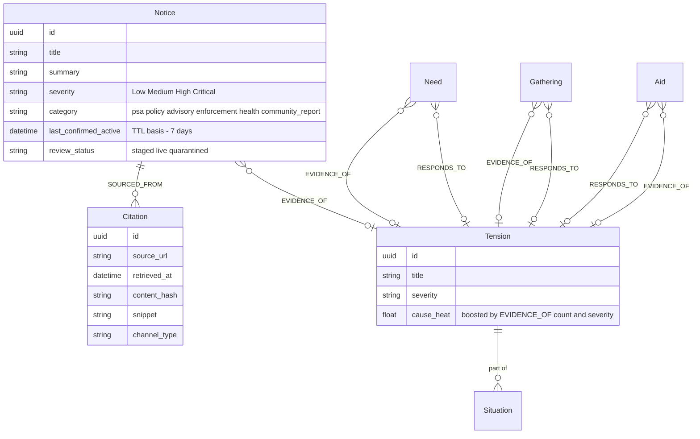

# Community Alert Surfacing via Notice Severity

## Overview

Enhance the Notice primitive to recognize and surface urgent community warnings — particularly enforcement sightings like "ICE is in Rosemount" — by using source trust, corroboration, and a new `EVIDENCE_OF` edge to Tensions. Includes foundational graph changes (new edge type, Evidence → Citation rename) that benefit the entire system.

Two phases: foundational graph work first, alert surfacing second.

## Problem Statement

People are using social media for real-time community mutual protection. When enforcement is the threat, institutions are silent or complicit, and community voices are the signal infrastructure. Root Signal currently:

1. Doesn't extract community warning patterns as Notices (extractor is tuned for institutional sources)
2. Assigns severity at extraction time with no post-extraction inference from trust/corroboration
3. Has no way to express "this signal is evidence of a Tension" (distinct from "responds to")
4. Uses 90-day Notice TTL — wrong for ephemeral community reports
5. The Evidence node name is misleading — it's provenance (a citation), not epistemic evidence

## Proposed Solution

**Phase 1** lays foundational graph improvements that benefit everything:
- `EVIDENCE_OF` edge: structural measure of Tension grounding
- Evidence → Citation rename: honest naming for provenance nodes

**Phase 2** builds alert surfacing on that foundation:
- `community_report` Notice category
- Severity inference from source trust + corroboration + EVIDENCE_OF linkage
- Shorter Notice TTL with re-scrape refresh
- Severity feeds into Situation temperature

---

## Technical Approach

### Architecture

```
                         EVIDENCE_OF
  Notice (community_report) ──────────────► Tension
          │                                    │
          │ SOURCED_FROM                       │ heat radiates
          ▼                                    ▼
  Citation (provenance URL)            Situation temperature
                                               │
                                               ▼
                                        Story (hot narrative)
```

Severity is earned, not assigned:

```
Trusted source + EVIDENCE_OF link → High severity (immediate)
Trusted source + no EVIDENCE_OF link → Medium severity (acknowledged, not yet grounded)
Unknown source + corroboration + EVIDENCE_OF link → High severity (earned)
Unknown source + no corroboration → Low severity (waiting)
Unknown source + no EVIDENCE_OF link → Low severity (ungrounded)
```

### Edge Type Naming: Rename EVIDENCES → PART_OF

The existing `EVIDENCES` edge (Signal → Situation) means "this signal is part of this Situation cluster." The new `EVIDENCE_OF` (Signal → Tension) means "this signal confirms this Tension is real/active." Having both `EVIDENCES` and `EVIDENCE_OF` in the schema is a high-friction naming collision for future developers.

Solution: rename `EVIDENCES` → `PART_OF` as part of Phase 1. `PART_OF` is more honest about what it means — cluster membership, not epistemic evidence. This leaves `EVIDENCE_OF` as the sole epistemic edge type.

| Edge | Meaning | Renamed? |
|---|---|---|
| `PART_OF` (was `EVIDENCES`) | Signal is a member of this Situation cluster | Yes — Phase 1 |
| `EVIDENCE_OF` (new) | Signal confirms this Tension is real/active | New — Phase 1 |

---

## Implementation Phases

### Phase 1: Foundational Graph Changes

#### 1.1 — New `EVIDENCE_OF` Edge Type

**What:** Add `EVIDENCE_OF` edge from any signal to a Tension. Follows the `RESPONDS_TO` / `DRAWN_TO` pattern.

**Files:**

`modules/rootsignal-graph/src/writer.rs`:
- Add `create_evidence_of_edge(&self, signal_id: Uuid, tension_id: Uuid, match_strength: f64, explanation: String)` method
- Pattern: MERGE-based idempotency, same as `create_response_edge` (line 2798) and `create_drawn_to_edge` (line 4507)
- Edge properties: `match_strength`, `explanation`, `created_at`

`modules/rootsignal-graph/src/reader.rs`:
- Update queries that traverse Tension edges to include `EVIDENCE_OF`
- Currently: `MATCH (t)<-[r:RESPONDS_TO|DRAWN_TO]-(sig)` → add `|EVIDENCE_OF`
- Add `evidence_of_count(tension_id)` query — count of `EVIDENCE_OF` edges on a Tension (structural grounding measure)

`modules/rootsignal-graph/src/migrate.rs`:
- Add index: `CREATE INDEX evidence_of_signal IF NOT EXISTS FOR ()-[r:EVIDENCE_OF]-() ON (r.match_strength)`

`modules/rootsignal-graph/src/cached_reader.rs`:
- Update cache for any queries that now include `EVIDENCE_OF`

`modules/rootsignal-scout/src/discovery/tension_linker.rs`:
- Currently creates `RESPONDS_TO` edges. Update to create `EVIDENCE_OF` when the relationship is "confirms/substantiates" rather than "responds to"
- The LLM already determines the nature of the link — add `EVIDENCE_OF` as a possible output alongside `RESPONDS_TO`

`modules/rootsignal-common/src/types.rs`:
- Add to `TensionRespondent` (or create a parallel struct) for carrying `EVIDENCE_OF` edge data
- The existing `edge_type: String` field on `TensionRespondent` (line 5472) may already support this

**Tests:**

`modules/rootsignal-graph/tests/litmus_test.rs`:
- `evidence_of_edge_links_notice_to_tension` — create Notice, create Tension, wire EVIDENCE_OF, query back
- `evidence_of_count_reflects_independent_sources` — multiple signals EVIDENCE_OF same Tension, count is correct
- `signal_can_have_both_responds_to_and_evidence_of` — Need linked to Tension with both edges

`modules/rootsignal-scout/tests/graph_write_test.rs`:
- `tension_linker_creates_evidence_of_for_confirmatory_signals` — mock writer, run tension linker with a Notice, assert EVIDENCE_OF edge created

#### 1.2 — Rename EVIDENCES → PART_OF

**What:** Rename the existing `EVIDENCES` edge (Signal → Situation) to `PART_OF` to avoid naming collision with the new `EVIDENCE_OF` edge.

**Files:**

`modules/rootsignal-graph/src/writer.rs`:
- All `EVIDENCES` Cypher strings → `PART_OF` (line 5863 and related)

`modules/rootsignal-graph/src/reader.rs`:
- All `EVIDENCES` Cypher strings → `PART_OF`

`modules/rootsignal-graph/src/migrate.rs`:
- Add migration: rename existing edges
  ```cypher
  MATCH ()-[r:EVIDENCES]->()
  WITH r, startNode(r) AS s, endNode(r) AS e, properties(r) AS props
  CREATE (s)-[r2:PART_OF]->(e) SET r2 = props
  DELETE r
  ```
- Drop old indexes, create new ones for `PART_OF`

`modules/rootsignal-graph/src/situation_weaver.rs`:
- Update edge creation to use `PART_OF`

**Tests:**
- Existing situation weaver tests should pass after mechanical rename
- `migration_renames_evidences_to_part_of` — run migration, verify `PART_OF` edges exist and `EVIDENCES` edges don't

#### 1.3 — Rename Evidence → Citation

**What:** Rename `EvidenceNode` → `CitationNode`, `:Evidence` → `:Citation` Neo4j label. Pure rename, no field changes.

**Migration strategy** (follows existing Ask → Need pattern in migrate.rs lines 13-37):

1. Neo4j migration: `MATCH (n:Evidence) SET n:Citation REMOVE n:Evidence`
2. Drop old constraint: `DROP CONSTRAINT evidence_id_unique IF EXISTS`
3. Create new constraint: `CREATE CONSTRAINT citation_id_unique IF NOT EXISTS FOR (n:Citation) REQUIRE n.id IS UNIQUE`
4. All idempotent, non-fatal on error (same pattern as existing renames)

**Rename surface area** (all files):

Core types (1 file):
- `modules/rootsignal-common/src/types.rs` — `EvidenceNode` → `CitationNode`, `NodeType::Evidence` → `NodeType::Citation`, `Node::Evidence` → `Node::Citation`, all match arms

Graph layer (4 files):
- `modules/rootsignal-graph/src/writer.rs` — `create_evidence()` → `create_citation()`, all `:Evidence` Cypher → `:Citation`
- `modules/rootsignal-graph/src/reader.rs` — `extract_evidence()` → `extract_citation()`, all `:Evidence` Cypher → `:Citation`, return types
- `modules/rootsignal-graph/src/cached_reader.rs` — imports, cache types
- `modules/rootsignal-graph/src/cache.rs` — `evidence_by_signal` → `citation_by_signal`

API layer (2 files):
- `modules/rootsignal-api/src/graphql/types.rs` — `GqlEvidence` → `GqlCitation`
- `modules/rootsignal-api/src/graphql/loaders.rs` — DataLoader types

Scout pipeline (4 files):
- `modules/rootsignal-scout/src/pipeline/traits.rs` — `create_evidence` → `create_citation`
- `modules/rootsignal-scout/src/pipeline/scrape_phase.rs` — constructs `CitationNode` (~5 call sites)
- `modules/rootsignal-scout/src/discovery/investigator.rs` — constructs `CitationNode`
- `modules/rootsignal-scout/src/testing.rs` — `MockGraphWriter` stores `Vec<(Uuid, CitationNode)>`

Tests (2 files):
- `modules/rootsignal-graph/tests/litmus_test.rs`
- `modules/rootsignal-scout/tests/graph_write_test.rs` — `make_evidence()` → `make_citation()`

Migration (1 file):
- `modules/rootsignal-graph/src/migrate.rs` — add relabel migration, drop/create constraints

**Serde note:** `NodeType` uses `#[serde(rename_all = "snake_case")]`. If `NodeType::Evidence` is serialized anywhere persistent (unlikely — it's used in-process, not stored), this would be a breaking change. The existing Ask → Need rename didn't have serde issues because the enum variant names aren't stored in Neo4j (they use label strings). Verify no external API returns `NodeType` as a serialized string.

**Tests:**
- Existing tests should pass after mechanical rename — no behavioral change
- `migration_relabels_evidence_to_citation` — run migration, verify `:Citation` nodes exist and `:Evidence` nodes don't

---

### Phase 2: Alert-Specific Work

#### 2.1 — `community_report` Notice Category

**What:** Add `community_report` to the extractor's Notice category list and update the system prompt to recognize community mutual-protection patterns.

**Files:**

`modules/rootsignal-scout/src/pipeline/extractor.rs`:
- Line 660: add `"community_report"` to category list
- Update Notice description (line 589): expand beyond "official advisory" to include community warnings
- Add extraction guidance: community members publicly warning about enforcement activity, environmental hazards, or other threats where protective action is possible

Example prompt addition:
```
- **Notice**: An official advisory, policy change, OR community warning about active threats.
  Community members publicly warning each other about enforcement activity (ICE sightings),
  environmental hazards, or safety concerns are valid Notices with category "community_report".
  These are distinct from rumors — they come from people with first-hand or local knowledge
  broadcasting publicly to enable protective action.
```

**Tests:**

`modules/rootsignal-scout/tests/` (extractor tests):
- `community_warning_post_extracted_as_notice` — mock LLM response for "ICE spotted in Rosemount" post, verify Notice with `category: "community_report"` extracted
- `routine_social_post_not_extracted_as_community_report` — "great weather today" does not become a Notice

#### 2.2 — Severity Inference

**What:** Post-extraction computation that re-evaluates Notice severity based on source trust, corroboration, and EVIDENCE_OF linkage. Runs in the pipeline after the curiosity/tension linking step.

**Severity inference formula:**

```rust
// modules/rootsignal-graph/src/severity_inference.rs (new file)

pub fn infer_notice_severity(
    extracted_severity: Severity,       // from LLM extraction
    source_trusted: bool,               // source has earned trust
    evidence_of_tension: bool,          // EVIDENCE_OF edge exists to a Tension
    tension_evidence_count: u32,        // number of EVIDENCE_OF edges on linked Tension
    corroboration_count: u32,           // on the Notice itself
    source_diversity: u32,              // unique sources corroborating
) -> Severity {
    // Trusted source without EVIDENCE_OF link → Medium (acknowledged, not yet grounded)
    // Avoids temporal blind spot: trusted source's breaking report shouldn't be invisible
    // while waiting for the curiosity loop to wire the EVIDENCE_OF edge
    if !evidence_of_tension && source_trusted {
        return max(extracted_severity, Severity::Medium);
    }

    // Unknown source without EVIDENCE_OF link → stay at Low
    if !evidence_of_tension {
        return Severity::Low;
    }

    // Trusted source + tension link → High
    if source_trusted && evidence_of_tension {
        return max(extracted_severity, Severity::High);
    }

    // Corroborated by 2+ diverse sources + tension link → High
    if source_diversity >= 2 && evidence_of_tension {
        return max(extracted_severity, Severity::High);
    }

    // Tension link but single unknown source → Medium (acknowledged but not escalated)
    if evidence_of_tension && tension_evidence_count >= 3 {
        return max(extracted_severity, Severity::Medium);
    }

    // Default: keep extracted severity
    extracted_severity
}
```

**Source trust definition:**

Use existing source metrics to compute trust. No new fields needed — derive from what exists:

```rust
pub fn is_source_trusted(source: &SourceNode) -> bool {
    // Must have enough history
    source.scrape_count >= 10
    // Must have produced signals that got corroborated
    && source.signals_corroborated >= 3
    // Must not be penalized by supervisor
    && source.quality_penalty < 0.3
    // Reasonable yield (not a spam source)
    && source.avg_signals_per_scrape < 20.0
}
```

This is deliberately conservative. Trust is earned through sustained, corroborated signal production. Can be tuned later.

**When it runs:** After tension linking, in the same scout run. Pipeline order:

```
Extraction → Dedup → Tension Linking (creates EVIDENCE_OF) → Severity Inference → Story Weaver
```

**Idempotent:** Yes — can re-run safely. Always computes from current graph state.

**Severity cooling:** Since inference is idempotent and reads current graph state, it naturally handles de-escalation. If a source's `quality_penalty` increases (supervisor flags bad behavior), `is_source_trusted()` returns false on the next cycle. Severity recalculates downward. Run severity inference periodically (every scout run) on all live Notices, not just newly extracted ones. This ensures severity stays current with the source's trust state.

**Applies to:** All Notices, not just `community_report`. An institutional Notice linked to a well-evidenced Tension also benefits from severity inference.

**Files:**

`modules/rootsignal-graph/src/severity_inference.rs` (new):
- `infer_notice_severity()` — pure function, no side effects
- `is_source_trusted()` — reads SourceNode metrics

`modules/rootsignal-graph/src/writer.rs`:
- Add `update_notice_severity(&self, notice_id: Uuid, severity: Severity)` — updates severity on the Neo4j node

`modules/rootsignal-scout/src/scout.rs`:
- Call severity inference after tension linking step
- Query all Notices from current run, compute inferred severity, write back

`modules/rootsignal-graph/src/reader.rs`:
- Add `get_source_for_signal(signal_id: Uuid) -> Option<SourceNode>` if not already available
- Add `count_evidence_of_edges(tension_id: Uuid) -> u32`

**Tests:**

`modules/rootsignal-graph/tests/severity_inference_test.rs` (new):
- `trusted_source_with_tension_link_earns_high_severity`
- `trusted_source_without_tension_link_earns_medium_severity`
- `unknown_source_without_corroboration_stays_low`
- `unknown_source_without_tension_link_stays_low`
- `corroborated_unknown_source_with_tension_link_earns_high`
- `well_grounded_tension_boosts_single_unknown_source_to_medium`

#### 2.3 — Shorter Notice TTL

**What:** Change Notice expiration from 90 days (based on `extracted_at`) to 7 days (based on `last_confirmed_active`). Re-scrape refreshes `last_confirmed_active`, keeping persistent notices alive.

**Migration strategy:**

Before changing the constant, backfill existing Notices so they don't mass-expire:

```cypher
// In migrate.rs — set last_confirmed_active to extracted_at for Notices that have never been refreshed
MATCH (n:Notice)
WHERE n.last_confirmed_active IS NULL OR n.last_confirmed_active = n.extracted_at
SET n.last_confirmed_active = datetime()
```

This gives all existing Notices a fresh 7-day window from the migration date.

**Files:**

`modules/rootsignal-common/src/quality.rs`:
- Change `NOTICE_EXPIRE_DAYS: i64 = 90` → `NOTICE_EXPIRE_DAYS: i64 = 7`
- Single TTL for all Notices. No sub-category special cases. ICE operations can persist for weeks — the system should not impose a temporal judgment on how long enforcement constitutes a threat. If the signal is still being posted about, re-scrape refreshes `last_confirmed_active` and it stays alive. If it stops appearing in sources, it naturally expires. Consistent with the anti-suppression principle (adversarial-threat-model.md).

`modules/rootsignal-graph/src/writer.rs` (`reap_expired`, line 1041-1052):
- Switch from `extracted_at` to `last_confirmed_active`:
  ```cypher
  MATCH (n:Notice)
  WHERE datetime(n.last_confirmed_active) < datetime() - duration('P7D')
  DETACH DELETE n
  ```

`modules/rootsignal-graph/src/reader.rs`:
- `expiry_clause` (line 1906-1908): switch from `extracted_at` to `last_confirmed_active`
- `passes_display_filter` (line 1968-1970): switch from `extracted_at` to `last_confirmed_active`

`modules/rootsignal-graph/src/migrate.rs`:
- Add backfill migration (idempotent)

**Re-scrape refresh:** The existing `refresh_signal()` method (writer.rs line 586-604) already updates `last_confirmed_active`. When the scraper re-encounters a Notice and dedup matches it, `refresh_signal()` fires. No new code needed for the refresh path.

**Tests:**

`modules/rootsignal-graph/tests/litmus_test.rs`:
- `notice_expires_after_seven_days_without_refresh`
- `refreshed_notice_survives_past_original_ttl`
- `notice_from_persistent_source_stays_alive_through_rescrapes`

#### 2.4 — Severity Feeds Situation Temperature

**What:** High-severity Notices linked via `EVIDENCE_OF` to a Tension boost that Tension's contribution to Situation temperature. This happens through the existing `cause_heat` mechanism — no new temperature component needed.

**Approach:** Currently, only Tensions radiate heat (cause_heat.rs line 27). When a Notice is `EVIDENCE_OF` a Tension, the Notice's severity should boost the Tension's effective heat. This is cleaner than adding a new temperature component — it works through the existing flow.

**Files:**

`modules/rootsignal-graph/src/cause_heat.rs`:
- When computing cause_heat for a Tension, factor in the count and severity of `EVIDENCE_OF` edges
- A Tension with 5 high-severity `EVIDENCE_OF` Notices radiates more heat than one with 1 low-severity Notice
- Use **logarithmic scaling** to prevent runaway heat from viral community reports:
  ```rust
  // evidence_score: sum of severity weights (Low=1, Medium=2, High=3, Critical=4)
  // ln(1 + score) provides diminishing returns — 20 High notices ≈ 2.5x, not 16x
  let boost = 1.0 + (evidence_score as f64).ln_1p() * 0.5;
  let capped_boost = boost.min(3.0); // hard ceiling at 3x
  ```
- This prevents a single viral Tension from drowning out all other Situations in the system

`modules/rootsignal-graph/src/situation_temperature.rs`:
- No formula changes needed — `tension_heat_agg` already reads cause_heat from Tensions
- The boost flows through naturally: more evidence → hotter Tension → higher temperature → hotter Story

**Tests:**

`modules/rootsignal-graph/tests/cause_heat_test.rs`:
- `tension_with_high_severity_evidence_radiates_more_heat`
- `tension_with_no_evidence_of_edges_unchanged`
- `multiple_evidence_of_edges_compound_heat_boost`

---

## Edge Cases and Answers

**No Tension exists yet for EVIDENCE_OF link:**
The curiosity loop can create a new Tension from the Notice's content (this is what it already does — investigates signals and discovers causal Tensions). A community_report Notice about ICE activity triggers curiosity → finds/creates the enforcement Tension → wires EVIDENCE_OF. If curiosity finds nothing, the Notice sits unlinked at low severity. This is honest — the system is saying "we can't confirm this yet."

**Trusted source posts incorrect information:**
Short TTL is the primary defense — the false alert expires in 7 days without re-scrape confirmation. Admin can also quarantine via `review_status` (set to `quarantined` in admin-app). The Signal Lint system (from the supervisor plan) provides another catch point. Trust is also not permanent — if a source's `quality_penalty` increases from supervisor checks, `is_source_trusted()` returns false.

**Race condition (severity inference before curiosity loop):**
Pipeline ordering prevents this: Extraction → Tension Linking → Severity Inference. In the same scout run, severity inference runs after the curiosity loop has already created EVIDENCE_OF edges. For Notices from a previous run that later get linked, severity inference is idempotent and can re-run on subsequent cycles.

**Notice re-scrape dedup:**
Existing content-hash + embedding similarity dedup handles this. If wording changes slightly, a new Notice is created (old one expires via TTL). The short TTL means this isn't a problem — the "latest version" naturally wins.

**EVIDENCE_OF edges on reaped Notices:**
`DETACH DELETE` removes the Notice and all its edges. On the next temperature recomputation cycle, the Tension's heat adjusts. The drop is not gradual but this matches reality — the evidence is gone, so the grounding should decrease.

---

## Acceptance Criteria

### Functional Requirements

- [ ] `EVIDENCE_OF` edge can be created between any signal type and a Tension
- [ ] A signal can have both `RESPONDS_TO` and `EVIDENCE_OF` edges to the same Tension
- [ ] `evidence_of_count` on a Tension reflects the number of independent `EVIDENCE_OF` edges
- [ ] `:Evidence` Neo4j nodes relabeled to `:Citation`, `EvidenceNode` renamed to `CitationNode`
- [ ] All existing queries work with the Citation rename (no `:Evidence` references remain in code)
- [ ] Extractor recognizes community mutual-protection patterns and extracts as Notice with `category: "community_report"`
- [ ] Severity inference runs post-extraction and re-evaluates Notice severity
- [ ] Trusted source + EVIDENCE_OF link → severity escalated to High
- [ ] Trusted source + no EVIDENCE_OF link → severity escalated to Medium (not invisible while awaiting graph wiring)
- [ ] Corroborated (2+ diverse sources) + EVIDENCE_OF link → severity escalated to High
- [ ] Unknown source + no EVIDENCE_OF link → severity capped at Low
- [ ] Notice TTL is 7 days based on `last_confirmed_active`
- [ ] Re-scraped Notices have `last_confirmed_active` refreshed, surviving past original TTL
- [ ] Existing Notices backfilled so they don't mass-expire on deploy
- [ ] High-severity EVIDENCE_OF Notices boost linked Tension's cause_heat

### Quality Gates

- [ ] All existing tests pass after Citation rename
- [ ] New tests follow MOCK → FUNCTION → OUTPUT pattern per CLAUDE.md
- [ ] Test names describe behavior: `trusted_source_with_tension_link_earns_high_severity`
- [ ] No hardcoded severity defaults — use `Option<Severity>` where extraction may fail (per institutional learning)
- [ ] All Notice queries filter on `review_status = 'live'` (staged pipeline pattern)

---

## Risk Analysis & Mitigation

| Risk | Severity | Mitigation |
|------|----------|------------|
| Citation rename breaks queries mid-deploy | Medium | Follow existing rename pattern (Add label → deploy code → remove old label). Migration is idempotent. |
| Mass Notice expiry on TTL change | High | Backfill migration sets `last_confirmed_active = datetime()` on all existing Notices before constant change |
| Source trust threshold too permissive | Medium | Start conservative (`scrape_count >= 10, signals_corroborated >= 3`). Tune based on observed behavior. |
| False alert from trusted source | Low | 7-day TTL auto-expires. Admin quarantine available. Trust derived from ongoing metrics, not permanent. |
| Severity inference runs before EVIDENCE_OF link exists | Low | Pipeline ordering: tension linking runs before severity inference in same scout run. |
| Trusted source trust degrades after severity escalation | Low | Severity inference re-runs every scout cycle on all live Notices. Trust changes reflected on next cycle. |
| Viral community report dominates global temperature | Medium | Logarithmic scaling on heat boost with 3x hard cap. Diminishing returns prevent runaway heat. |
| Trusted source report invisible before tension linking | Medium | Trusted source without EVIDENCE_OF starts at Medium (visible), not Low. Prevents temporal blind spot. |

---

## ERD: New Relationships



---

## References & Research

### Internal References
- Brainstorm: `docs/brainstorms/2026-02-24-notice-severity-alerts-brainstorm.md`
- Vision alignment: `docs/vision/editorial-and-signal-inclusion-principles.md` (updated with community mutual-protection carve-out)
- Vision alignment: `docs/vision/adversarial-threat-model.md` (fake ICE report attack vector)
- Existing rename pattern: `modules/rootsignal-graph/src/migrate.rs:13-60` (Ask→Need, Event→Gathering)
- Edge creation pattern: `modules/rootsignal-graph/src/writer.rs:2798-2818` (create_response_edge)
- TTL constants: `modules/rootsignal-common/src/quality.rs:43`
- Cause heat: `modules/rootsignal-graph/src/cause_heat.rs`
- Situation temperature: `modules/rootsignal-graph/src/situation_temperature.rs`
- Extractor prompt: `modules/rootsignal-scout/src/pipeline/extractor.rs:548-763`

### Institutional Learnings Applied
- `docs/solutions/2026-02-17-unwrap-or-masks-data-quality.md` — use `Option<Severity>` not defaults
- `docs/plans/2026-02-20-refactor-general-purpose-supervisor-plan.md` — staged→live pipeline, review_status filtering
- `docs/plans/2026-02-17-feat-community-signal-scoring-plan.md` — source_diversity over raw corroboration_count
