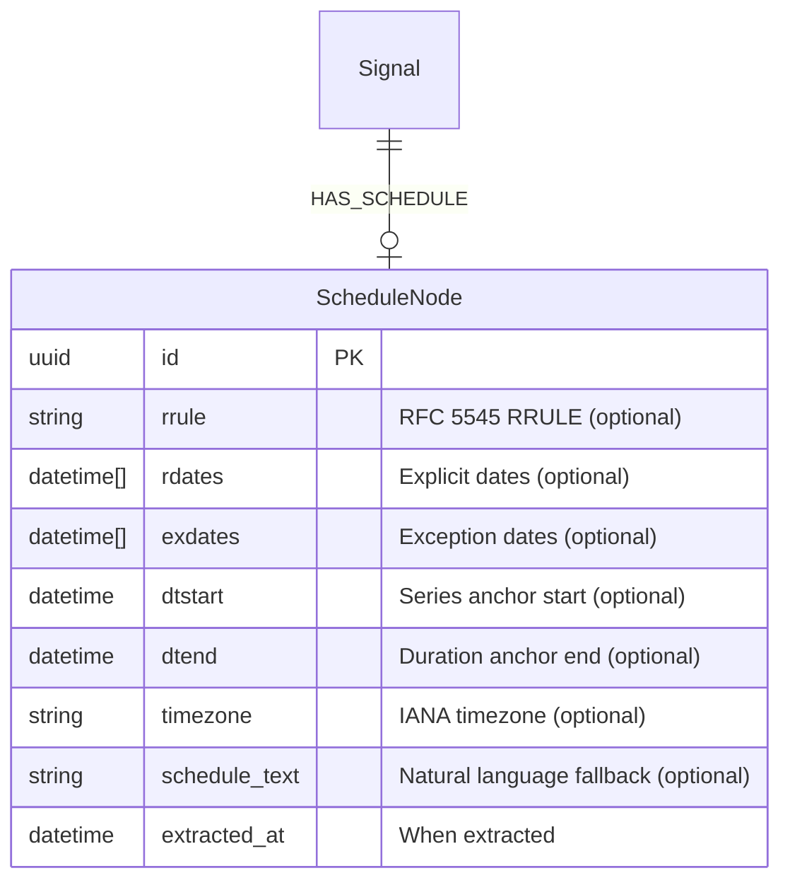

# feat: Add ScheduleNode for Event and Signal Recurrence

## Overview

Add a standalone `ScheduleNode` to the Neo4j graph that captures schedule and recurrence information (RRULE, explicit dates, natural language text) and connects to any signal type via a `HAS_SCHEDULE` edge. The LLM extractor produces RRULE strings directly; invalid RRULEs fall back to `schedule_text`. The GraphQL API exposes schedule data with a parameterized `occurrences(from, to)` resolver that expands RRULEs in Rust at query time.

Brainstorm: `docs/brainstorms/2026-02-24-schedule-node-brainstorm.md`

## Problem Statement / Motivation

The current data model has minimal schedule support — `starts_at`, `ends_at`, and `is_recurring` on `GatheringNode` only. This cannot express:

- Recurrence patterns ("every Tuesday at 7pm", "first Saturday of the month")
- Exception dates ("every week except holidays")
- Irregular schedules ("Jan 5, Feb 12, Mar 19")
- Schedules on non-Gathering signals (e.g., a food pantry's hours on an AidNode)

A calendar UI needs structured recurrence data to render upcoming occurrences, and the current boolean `is_recurring` flag provides no usable information.

## Proposed Solution

A graph-native `ScheduleNode` with three tiers of fidelity:

1. **Structured RRULE** — LLM produces RFC 5545 RRULE string directly, validated at write time by the `rrule` crate. Full calendar expansion possible.
2. **Explicit date list** (`rdates`) — for irregular schedules that don't fit a pattern. No expansion needed.
3. **Natural language fallback** (`schedule_text`) — always populated when the source has schedule info. Displayed when structured data is unavailable.

## Technical Considerations

### RRULE Validation Strategy
The LLM produces RRULE strings directly. At write time, the pipeline parses the string with the `rrule` crate. If parsing fails, the RRULE is discarded and only `schedule_text` is stored. A warning is logged. This follows the institutional learning from `docs/solutions/2026-02-17-unwrap-or-masks-data-quality.md` — we never fabricate structured data; `Option<T>` tracks what we actually know.

### Coexistence with Existing Fields
- `GatheringNode.starts_at/ends_at/is_recurring` stay as convenience fields for one-off events
- `dtstart` on ScheduleNode is the series anchor (first occurrence); `starts_at` on GatheringNode is the next upcoming occurrence
- `AidNode.availability` (natural language) coexists with `ScheduleNode.schedule_text` — the ScheduleNode is the richer representation

### Timezone Handling
When the source page doesn't state a timezone, infer from the signal's `about_location` via lat/lng-to-timezone lookup. If no location exists, store timezone as `None` and display times as "local time."

### Performance
RRULE expansion at query time for 50 signals is fast for simple weekly/monthly rules. Hard caps prevent abuse:
- Default expansion window: 90 days
- Maximum expansion window: 365 days
- Hard cap: 1000 materialized dates per ScheduleNode

### Neo4j Storage
- `rdates` and `exdates` stored as arrays of ISO 8601 strings (Neo4j datetime arrays)
- `rrule` stored as a plain string property
- Uniqueness constraint on `id`, index on `dtstart` for time-range queries

## Acceptance Criteria

### Type System
- [x] `ScheduleNode` struct in `modules/rootsignal-common/src/types.rs` (standalone, not in `Node` enum)
- [x] Derives `Debug, Clone, Serialize, Deserialize`
- [x] All date fields use `Option<DateTime<Utc>>`, schedule_text uses `Option<String>`

### LLM Extraction
- [x] `ExtractedSignal` gains `rrule`, `schedule_text`, `explicit_dates`, `exception_dates`, `schedule_timezone` fields
- [x] `ExtractionResult` gains a `schedules: Vec<(Uuid, ScheduleNode)>` field pairing signal IDs to extracted schedules
- [x] System prompt `build_system_prompt()` adds a `## Schedule / Recurrence` section coaching the LLM
- [x] Extraction targets Gathering and Aid signals initially

### Graph Write
- [x] `SignalStore` trait gains `create_schedule(&self, schedule: &ScheduleNode) -> Result<Uuid>` and `link_schedule_to_signal(&self, signal_id: Uuid, schedule_id: Uuid) -> Result<()>`
- [x] `GraphStore` implements both methods with Cypher CREATE + MERGE
- [x] RRULE string validated at write time via `rrule` crate parse; invalid RRULEs discarded with warning
- [x] Neo4j migration adds `Schedule` label with uniqueness constraint on `id`

### GraphQL API
- [x] `GqlSchedule` wrapper type exposing all ScheduleNode fields
- [x] `occurrences(from: DateTime!, to: DateTime!): [DateTime!]!` resolver on `GqlSchedule`
- [x] `schedule` resolver on `GqlGatheringSignal` and `GqlAidSignal` (extensible to other types)
- [x] `ScheduleBySignalLoader` DataLoader for N+1 prevention
- [x] Neo4j reader method to fetch ScheduleNodes by signal ID

### Testing
- [x] Graph write test: `schedule_node_created_and_linked_to_gathering`
- [x] Graph write test: `schedule_with_rrule_and_exdates_stored_correctly`
- [x] Graph write test: `schedule_text_only_fallback_works`
- [x] Pipeline test: `gathering_with_rrule_creates_linked_schedule_node` (and 2 more schedule chain tests)
- [x] Mock `create_schedule` and `link_schedule_to_signal` on `MockSignalStore`

### Dependencies
- [x] Add `rrule` crate to workspace `Cargo.toml` and `rootsignal-common/Cargo.toml`

## Dependencies & Risks

| Risk | Mitigation |
|------|------------|
| LLM produces invalid RRULE strings | Validate at write time, fall back to schedule_text, log warning. Expect schedule_text to carry most weight initially. |
| `rrule` crate edge cases (BYSETPOS, timezone transitions) | Test with realistic community event patterns; keep expansion window bounded |
| Dedup/re-scrape with conflicting schedules | If signal already has a ScheduleNode, keep existing and log. New schedule data from corroboration is not merged. |
| RRULE expansion performance at query time | Hard caps on window size and result count; consider caching if profiling shows issues |

## Implementation Phases

### Phase 1: Type + Graph Layer
1. Add `rrule` crate to workspace
2. Define `ScheduleNode` struct in `rootsignal-common/src/types.rs`
3. Add Neo4j migration for `Schedule` label + constraints
4. Add `create_schedule` + `link_schedule_to_signal` to `SignalStore` trait and `GraphStore`
5. Add methods to `MockSignalStore` in `testing.rs`
6. Write graph write tests

### Phase 2: LLM Extraction
1. Add schedule fields to `ExtractedSignal` schema
2. Update `build_system_prompt()` with schedule extraction instructions
3. Add schedule handling to `extract_impl()` conversion logic — validate RRULE, build ScheduleNode
4. Wire into pipeline: after signal node creation, create ScheduleNode + edge
5. Write pipeline tests for valid RRULE, invalid RRULE fallback, and no-schedule cases

### Phase 3: GraphQL API
1. Add `GqlSchedule` type in `graphql/types.rs`
2. Add `ScheduleBySignalLoader` in `graphql/loaders.rs`
3. Add Neo4j reader query for schedules by signal ID
4. Add `schedule` resolver to `GqlGatheringSignal` and `GqlAidSignal`
5. Implement `occurrences(from, to)` resolver with RRULE expansion + hard caps
6. Test via GraphQL playground

## References & Research

- Brainstorm: `docs/brainstorms/2026-02-24-schedule-node-brainstorm.md`
- Institutional learning: `docs/solutions/2026-02-17-unwrap-or-masks-data-quality.md`
- Existing types: `modules/rootsignal-common/src/types.rs`
- Graph writer patterns: `modules/rootsignal-graph/src/writer.rs`
- SignalStore trait: `modules/rootsignal-scout/src/pipeline/traits.rs`
- LLM extraction: `modules/rootsignal-scout/src/pipeline/extractor.rs`
- GraphQL types: `modules/rootsignal-api/src/graphql/types.rs`
- Rust rrule crate: https://crates.io/crates/rrule
- RFC 5545 (iCalendar): https://datatracker.ietf.org/doc/html/rfc5545
