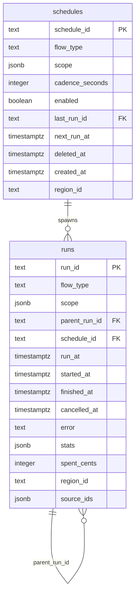

# Unified Workflows

## Enhancement Summary

**Deepened on:** 2026-03-12
**Sections enhanced:** 8 phases + architecture + data model
**Research agents used:** DB migration patterns, scheduling best practices, admin UI patterns, event-sourcing replay safety, agent-native architecture review, security review, performance analysis

### Key Improvements
1. **Three-step rename hardened** — advisory locks, FK/index auto-rename confirmed, `CREATE OR REPLACE VIEW` for idempotent re-runs
2. **Schedule polling production-hardened** — claim-process-complete cycle, transactional outbox pattern, catch-up-one semantics, `FOR UPDATE SKIP LOCKED` with `LIMIT` + heartbeat
3. **Admin UI grounded in real patterns** — discriminated union for polymorphic run rendering, server-side `RunStatus` enum, Apollo `keyArgs` for cursor pagination, breadcrumb chain navigation
4. **Replay safety deepened** — `#[serde(default)]` mandatory checklist, `COALESCE` patterns for derived fields, dual-write detection via `pg_projector.rs` sync
5. **Six agent-native gaps identified and addressed** — missing mutations, outcome resolvers, cancel semantics, `regionBusy` query

### New Considerations Discovered
- FK constraints and indexes automatically follow `ALTER TABLE RENAME` in PostgreSQL — no need to manually rename FKs
- `SELECT FOR UPDATE SKIP LOCKED` needs `LIMIT` to prevent long-held locks and a 30-minute staleness guard for crashed claimants
- `ScheduleTriggered` must be emitted BEFORE entry event to prevent duplicate runs on partial failure (transactional outbox ordering)
- When a disabled schedule is re-enabled after missed cadences, `next_run_at = now() + cadence_seconds` (skip to future, no catch-up storm)
- `stats` and `spent_cents` are pre-existing write-outside-the-stream violations — not blocking but tracked for follow-up

Replace the Scout page with a generalized Workflows system. All flow types (scout, coalesce, weave, bootstrap) share one `runs` table. Schedules are recurring event-backed triggers. Pipeline chains (scout → coalesce → weave) are modeled via `parent_run_id` on entry events.

## Overview

The Scout page already manages multiple flow types but weave/coalesce runs are invisible — they never create `scout_runs` rows. Rather than patching this per-flow, unify everything under a Workflows model: one runs table, one schedules table, one admin page. All data comes from events for replay safety.

## Problem Statement

1. **Weave and coalesce runs are invisible.** Only `ScoutRunRequested` creates `scout_runs` rows. `GenerateSituationsRequested` and `CoalesceRequested` bypass the table.
2. **Coalesce runs never finish.** `is_terminal_event()` doesn't match `CoalescingCompleted`/`CoalescingSkipped`, so `ScoutRunCompleted` never fires for them.
3. **No coalesced-run UI.** The only coalesce entry point is a button on Signal Detail — no way to see what groups were produced or browse coalesce history.
4. **Scheduling is one-shot.** `scheduled_scrapes` are single-use rows, not recurring templates.
5. **No pipeline chain.** Scout → coalesce → weave requires manual triggering of each stage.

## Technical Approach

### Architecture

```
┌─────────────────────────────────────────────────────┐
│                   Admin UI                          │
│  ┌──────────┐  ┌──────────────┐  ┌──────────────┐  │
│  │ Runs Tab │  │ Schedules Tab│  │ Run Detail   │  │
│  │ (all     │  │ (CRUD,       │  │ (flow-type-  │  │
│  │  types)  │  │  toggle)     │  │  aware)      │  │
│  └────┬─────┘  └──────┬───────┘  └──────┬───────┘  │
│       │               │                 │           │
├───────┼───────────────┼─────────────────┼───────────┤
│       ▼               ▼                 ▼           │
│  ┌─────────────────────────────────────────────┐    │
│  │           GraphQL Resolvers                 │    │
│  │  adminRuns, adminRun, adminSchedules,       │    │
│  │  createSchedule, toggleSchedule             │    │
│  └──────────────────┬──────────────────────────┘    │
│                     │                               │
├─────────────────────┼───────────────────────────────┤
│                     ▼                               │
│  ┌──────────────────────────┐  ┌────────────────┐   │
│  │   runs (projection)     │  │   schedules    │   │
│  │   ← RunRequested        │  │   (projection) │   │
│  │   ← RunCompleted        │  │   ← Schedule*  │   │
│  │   ← RunCancelled        │  │     events     │   │
│  └──────────────────────────┘  └────────────────┘   │
│                                                     │
│  ┌──────────────────────────────────────────────┐   │
│  │  Schedule Polling Loop                       │   │
│  │  SELECT ... FOR UPDATE SKIP LOCKED           │   │
│  │  → emits entry events when run_at arrives    │   │
│  └──────────────────────────────────────────────┘   │
│                                                     │
│  ┌──────────────────────────────────────────────┐   │
│  │  Chain Orchestration (ScoutRunner)           │   │
│  │  settle() success → spawn child run          │   │
│  │  parent_run_id carried on entry event        │   │
│  └──────────────────────────────────────────────┘   │
└─────────────────────────────────────────────────────┘
```

### Data Model

#### runs (rename from scout_runs)

| Column | Type | Notes |
|--------|------|-------|
| run_id | TEXT PK | UUID |
| flow_type | TEXT | scout, coalesce, weave, bootstrap |
| scope | JSONB | Flow-specific parameters |
| parent_run_id | TEXT FK nullable | Chain to parent run — from entry event |
| schedule_id | TEXT FK nullable | Which schedule spawned this — from entry event |
| run_at | TIMESTAMPTZ | When it should start — from entry event. Backfill = started_at |
| started_at | TIMESTAMPTZ nullable | Null = not yet started |
| finished_at | TIMESTAMPTZ nullable | Null = still running |
| cancelled_at | TIMESTAMPTZ nullable | Non-null = cancelled (from RunCancelled event) |
| error | TEXT nullable | Non-null = failed, contains reason |
| stats | JSONB | Flow-specific outcome stats |
| spent_cents | INTEGER DEFAULT 0 | Budget consumed |
| region_id | TEXT nullable | Denormalized for filtering |
| source_ids | JSONB nullable | Denormalized for is_source_busy queries |

**Status derivation:**
- `cancelled_at IS NOT NULL` → cancelled
- `error IS NOT NULL` → failed
- `started_at IS NULL AND run_at > now()` → scheduled
- `started_at IS NOT NULL AND finished_at IS NULL` → running
- `finished_at IS NOT NULL` → completed

#### schedules (new, event-backed projection)

| Column | Type | Notes |
|--------|------|-------|
| schedule_id | TEXT PK | UUID |
| flow_type | TEXT | What kind of run to create |
| scope | JSONB | Parameters for each spawned run |
| cadence_seconds | INTEGER | Interval in seconds (simple, parseable) |
| enabled | BOOLEAN DEFAULT true | Toggle without deleting |
| last_run_id | TEXT FK nullable | Most recent spawned run |
| next_run_at | TIMESTAMPTZ nullable | Computed from cadence + last run |
| deleted_at | TIMESTAMPTZ nullable | Soft delete |
| created_at | TIMESTAMPTZ | From event timestamp |
| region_id | TEXT nullable | Denormalized for display |



### Event Model

#### New/modified lifecycle events

```rust
// Extend existing entry events with optional fields (#[serde(default)] for replay compat)
pub struct ScoutRunRequested {
    // ... existing fields ...
    pub parent_run_id: Option<String>,  // NEW
    pub schedule_id: Option<String>,    // NEW
    pub run_at: Option<DateTime<Utc>>,  // NEW — None means "now"
}

pub struct GenerateSituationsRequested {
    // ... existing fields ...
    pub parent_run_id: Option<String>,  // NEW
    pub schedule_id: Option<String>,    // NEW
}

pub struct CoalesceRequested {
    // ... existing fields ...
    pub parent_run_id: Option<String>,  // NEW
    pub schedule_id: Option<String>,    // NEW
}

// New lifecycle event
pub struct RunCancelled {
    pub run_id: String,
    pub cancelled_at: DateTime<Utc>,
    pub reason: Option<String>,
}
```

#### New schedule events (new SchedulingEvent variants or separate enum)

```rust
pub enum ScheduleEvent {
    ScheduleCreated {
        schedule_id: String,
        flow_type: String,
        scope: serde_json::Value,
        cadence_seconds: u64,
        region_id: Option<String>,
    },
    ScheduleToggled {
        schedule_id: String,
        enabled: bool,
    },
    ScheduleTriggered {
        schedule_id: String,
        run_id: String,
    },
    ScheduleDeleted {
        schedule_id: String,
    },
}
```

### Flow-Type Busy Blocking Matrix

| Running ↓ \ Blocks → | scout | coalesce | weave | bootstrap |
|-----------------------|-------|----------|-------|-----------|
| scout                 | YES   | no       | no    | YES       |
| coalesce              | no    | YES      | no    | no        |
| weave                 | no    | no       | YES   | no        |
| bootstrap             | YES   | no       | no    | YES       |

Same flow_type + same region = blocked. Different flow_types can run concurrently for the same region.

### Chain Success Criteria

Terminal events that qualify as **success** (chain continues):
- `SynthesisEvent::SeverityInferred` (scout completed)
- `SupervisorEvent::SupervisionCompleted` (weave completed)
- `SupervisorEvent::NothingToSupervise` (weave completed, nothing to do)
- `CoalescingEvent::CoalescingCompleted` (coalesce completed)
- `CoalescingEvent::CoalescingSkipped` (coalesce completed, nothing to do — still success for chain)

Terminal events that mean **failure** (no chain):
- Any run where `error` column is set (panic, budget exhaustion, etc.)

## Implementation Phases

### Phase 0: Terminal event gap fix + GIN index

**Goal:** `is_terminal_event()` recognizes coalesce terminal events so `ScoutRunCompleted` fires for coalesce runs. Also fix the pre-existing missing GIN index on `source_ids`.

**Files:**
- `modules/rootsignal-scout/src/core/projection.rs` — extend `is_terminal_event()` to match `CoalescingEvent::CoalescingCompleted` and `CoalescingEvent::CoalescingSkipped`

**Migration (040):**
```sql
-- GIN index for source_ids JSONB containment queries (currently doing seq scans)
CREATE INDEX IF NOT EXISTS idx_scout_runs_source_ids_gin
    ON scout_runs USING gin (source_ids jsonb_path_ops)
    WHERE source_ids IS NOT NULL;
```

**Pre-deploy audit:** Check for zombie coalesce rows that will never finish:
```sql
SELECT run_id, flow_type, started_at FROM scout_runs
WHERE finished_at IS NULL AND started_at < now() - interval '2 hours';
```

**Test:**
- `coalesce_run_emits_completed_on_coalescing_completed` — emit `CoalescingCompleted`, verify `ScoutRunCompleted` fires

#### Research Insights

**GIN Index Details:**
- `jsonb_path_ops` is the right operator class — it supports only `@>` (containment) but uses ~3x less space than default GIN. This is exactly what `is_source_busy` needs.
- The `WHERE source_ids IS NOT NULL` partial index keeps the index tight — NULL rows are excluded from index maintenance entirely.
- GIN indexes are write-amplified (each JSON array element gets its own posting list), but `source_ids` changes only on INSERT, never UPDATE, so the cost is paid once.

**Zombie Row Cleanup:**
- Run the pre-deploy audit query BEFORE deploying Phase 0. Any zombie rows with `finished_at IS NULL AND started_at < now() - 2h` should be manually closed or investigated, since fixing `is_terminal_event` only helps future runs — it won't retroactively fire `ScoutRunCompleted` for already-stuck runs.

---

### Phase 1: Fix projection gap — make weave/coalesce visible

**Goal:** All flow types create rows in `scout_runs` and get `finished_at` set.

**Files:**
- `modules/rootsignal-scout/src/core/projection.rs` — extend `scout_runs_projection` to handle `GenerateSituationsRequested` (INSERT) and `CoalesceRequested` (INSERT), extracting common fields (run_id, region_id, budget_cents, task_id) from each. **Derive `flow_type` from event type** in the projection (not from a field on the event) — `GenerateSituationsRequested` is always "weave", `CoalesceRequested` is always "coalesce". This eliminates the risk of mismatched `flow_type` values.
- `modules/rootsignal-api/src/pg_projector.rs` — **CRITICAL**: add match arms for `lifecycle:generate_situations_requested` and `lifecycle:coalesce_requested` in `project_batch()`. Without this, `REPLAY=1` silently drops all weave/coalesce runs.
- `modules/rootsignal-api/src/scout_runner.rs` — fix `resume_incomplete_runs`: read `flow_type` from row (add to `IncompleteRun` struct), dispatch to correct engine builder (`build_coalesce_engine`, `build_weave_engine`, or `build_engine`). **This is not a footnote — it is a hard requirement.** If a weave/coalesce run crashes and gets resumed as a scrape engine, the results will be corrupted.

**Test:**
- `weave_run_appears_in_scout_runs` — emit `GenerateSituationsRequested`, verify row created with `flow_type = 'weave'`
- `coalesce_run_appears_in_scout_runs` — emit `CoalesceRequested`, verify row created with `flow_type = 'coalesce'`
- `coalesce_run_gets_finished_at` — emit `CoalesceRequested` then `CoalescingCompleted`, verify `finished_at` set
- `replay_rebuilds_weave_and_coalesce_runs` — replay events, verify rows present in `scout_runs`
- `resume_builds_correct_engine_for_weave` — verify weave run resumes with weave engine

**Deploy gate:** Ship Phase 0+1, run in production for 24h. Verify weave/coalesce rows appear and finish correctly. Do NOT proceed to Phase 2 until confirmed.

#### Research Insights

**pg_projector.rs Dual Code Path:**
- The replay projector (`pg_projector.rs`) has its own `SCHEMA_DDL` constant and `project_batch()` match arms. It is a completely separate code path from the live projection in `projection.rs`. Every event that the live projection handles MUST also be handled in `pg_projector.rs`, or `REPLAY=1` silently drops those events — no error, no log, just missing rows.
- The safe pattern: after adding match arms in `projection.rs`, immediately grep `pg_projector.rs` for the same event type names and add corresponding arms.

**Resume Dispatch Safety:**
- `resume_incomplete_runs` currently hardcodes `build_engine` (scrape engine). If a coalesce run crashes and resumes as a scrape engine, it will attempt to scrape URLs based on JSONB scope fields that don't exist in coalesce scope — likely causing silent failures or panics.
- The fix: read `flow_type` from the row, match on it, and dispatch to the correct engine builder. Add an `unreachable!()` arm for unknown flow types to fail loudly rather than silently.

**Event-Sourcing Replay Backward Compatibility:**
- All new `Option<T>` fields on existing events MUST use `#[serde(default)]`. Without it, replaying old events (which lack the field) will fail deserialization with a missing-field error.
- Test pattern: serialize an event WITHOUT the new fields, then deserialize it with the new struct. If `#[serde(default)]` is missing, this test catches it immediately.

---

### Phase 2: Table rename — `scout_runs` → `runs` (three-step for zero-downtime)

**Goal:** Mechanical rename with zero-downtime on rolling deploys.

**Why three steps:** On Fly.io, `entrypoint.sh` runs migrations then starts the server. During a rolling deploy, the migration renames the table on the first instance while old instances still serve requests against `scout_runs`. A direct rename would 500 every old instance immediately. The view shim prevents this.

**Phase 2a — Migration (041): Create view, update code**
```sql
-- Rename the real table
ALTER TABLE scout_runs RENAME TO runs;
ALTER INDEX IF EXISTS idx_scout_runs_region_finished RENAME TO idx_runs_region_finished;
ALTER INDEX IF EXISTS idx_scout_runs_region_id RENAME TO idx_runs_region_id;
ALTER INDEX IF EXISTS idx_scout_runs_flow_type RENAME TO idx_runs_flow_type;
ALTER INDEX IF EXISTS idx_scout_runs_source_ids_gin RENAME TO idx_runs_source_ids_gin;

-- Backward-compat view so old instances don't 500
CREATE OR REPLACE VIEW scout_runs AS SELECT * FROM runs;
```

Code changes: find-and-replace all `scout_runs` → `runs` in SQL strings.

**Phase 2b — Migration (042, later deploy): Drop backward-compat view**
```sql
DROP VIEW IF EXISTS scout_runs;
```

**Also in Phase 2a — backfill `flow_type` for historical rows:**
```sql
UPDATE runs SET flow_type = 'scrape' WHERE flow_type IS NULL;
ALTER TABLE runs ALTER COLUMN flow_type SET NOT NULL;
```
This prevents NULL `flow_type` rows from escaping the busy check in Phase 5.

**Files to update (find-and-replace `scout_runs` → `runs`):**
- `modules/rootsignal-scout/src/core/projection.rs` (~7 occurrences)
- `modules/rootsignal-api/src/db/models/scout_run.rs` (~15 occurrences)
- `modules/rootsignal-api/src/graphql/schema.rs` (~3 occurrences)
- `modules/rootsignal-api/src/scout_runner.rs` (~4 occurrences)
- `modules/rootsignal-api/src/pg_projector.rs` — **CRITICAL**: update `SCHEMA_DDL` constant, `TRUNCATE` statement, and all SQL in `project_batch()`. If missed, `REPLAY=1` creates a phantom `scout_runs` table alongside `runs` — complete split-brain.
- `modules/rootsignal-scout-supervisor/src/state.rs`
- `modules/rootsignal-api/src/db/models/budget.rs`

**Also rename:** Rust module `scout_run.rs` → `run.rs`, struct `ScoutRunRow` → `RunRow`.

**Verification before merge:**
```bash
# Must find ZERO matches in production code after changes
grep -rn 'scout_runs' modules/ --include='*.rs' | grep -v test | grep -v '//' | grep -v 'ScoutRunRow'
```

**Test:** All existing tests pass. `REPLAY=1` builds `runs` table (not `scout_runs`).

#### Research Insights

**PostgreSQL RENAME Behavior (Confirmed via Brandur Leach pattern):**
- `ALTER TABLE RENAME` is a metadata-only operation — no data movement, no table rewrite, completes in milliseconds regardless of table size.
- FK constraints referencing the table automatically follow the rename. If `runs.schedule_id REFERENCES scout_runs(run_id)` existed, it would automatically become `REFERENCES runs(run_id)`. No need to drop/recreate FKs.
- Indexes also follow the rename internally (they reference the table OID, not the name). However, their _names_ don't change, so `idx_scout_runs_region_id` still works but is confusingly named. The explicit `ALTER INDEX RENAME` is cosmetic but valuable for maintenance.
- Sequences follow the same pattern — `scout_runs_id_seq` (if any) would still function but keep its old name.

**View Shim Details:**
- `CREATE OR REPLACE VIEW scout_runs AS SELECT * FROM runs` is idempotent — safe to re-run if migration is retried.
- The view is updatable in PostgreSQL (single-table, no aggregates), so `INSERT INTO scout_runs (...)` from old instances will actually write to `runs`. This is critical for zero-downtime: old instances don't just SELECT, they INSERT on `ScoutRunRequested`.
- `DROP VIEW IF EXISTS scout_runs` in Phase 2b is safe because by that point all instances are running new code that references `runs` directly.

**Backfill Safety:**
- `UPDATE runs SET flow_type = 'scrape' WHERE flow_type IS NULL` is safe without a transaction wrapper because it's a single statement (implicitly atomic in PostgreSQL). On large tables, this could hold a lock — but `scout_runs` is small (thousands of rows, not millions), so it completes instantly.
- The `SET NOT NULL` constraint cannot be added in the same transaction as the backfill if using `ALTER TABLE ... ADD CONSTRAINT` — but `ALTER TABLE ... ALTER COLUMN ... SET NOT NULL` does a full table scan to verify. Since we just backfilled, this is guaranteed to pass.

---

### Phase 3: Add columns + new lifecycle events

**Goal:** Schema ready for chain orchestration and scheduling. All new columns are event-backed.

**Migration (043):**
```sql
ALTER TABLE runs ADD COLUMN IF NOT EXISTS parent_run_id TEXT REFERENCES runs(run_id);
ALTER TABLE runs ADD COLUMN IF NOT EXISTS schedule_id TEXT;
ALTER TABLE runs ADD COLUMN IF NOT EXISTS run_at TIMESTAMPTZ;
ALTER TABLE runs ADD COLUMN IF NOT EXISTS error TEXT;
ALTER TABLE runs ADD COLUMN IF NOT EXISTS cancelled_at TIMESTAMPTZ;

-- Backfill run_at from started_at for existing rows
UPDATE runs SET run_at = COALESCE(run_at, started_at, now()) WHERE run_at IS NULL;

-- Indexes
CREATE INDEX IF NOT EXISTS idx_runs_parent_run_id ON runs(parent_run_id) WHERE parent_run_id IS NOT NULL;
CREATE INDEX IF NOT EXISTS idx_runs_schedule_id ON runs(schedule_id) WHERE schedule_id IS NOT NULL;
CREATE INDEX IF NOT EXISTS idx_runs_deferred ON runs(run_at) WHERE started_at IS NULL AND cancelled_at IS NULL;
CREATE INDEX IF NOT EXISTS idx_runs_run_at_desc ON runs(run_at DESC);
```

**Event changes:**
- Add `parent_run_id: Option<String>`, `schedule_id: Option<String>`, `run_at: Option<DateTime<Utc>>` to `ScoutRunRequested`, `GenerateSituationsRequested`, `CoalesceRequested` — all with `#[serde(default)]`
- Add `RunCancelled { run_id, cancelled_at, reason }` lifecycle event
- Add `RunFailed { run_id, error, failed_at }` lifecycle event — **error MUST come from an event, not a handler-side SQL write** (same anti-pattern the replayability plan eliminated)
- Extend projection to write these columns on INSERT, using `COALESCE(run_at, now())` so `run_at` is always populated even for old events during replay
- Extend projection to handle `RunCancelled` (SET cancelled_at) and `RunFailed` (SET error)
- **Update `pg_projector.rs`**: add match arms for `RunCancelled`, `RunFailed`; update INSERT statements to include new columns

**Who emits `RunFailed`?** The `run_completion_handler` detects failure terminal events and emits `RunFailed` as a lifecycle event (alongside `ScoutRunCompleted`). The projection reacts to `RunFailed` to set the `error` column. No direct SQL writes for `error`.

**Test:**
- `run_with_parent_id_appears_in_runs` — emit entry event with `parent_run_id` set, verify column written
- `cancelled_run_gets_cancelled_at` — emit `RunCancelled`, verify column written
- `failed_run_gets_error` — emit `RunFailed`, verify `error` column written
- `replay_populates_run_at_for_old_events` — replay old events (no `run_at` field), verify `run_at` is set via COALESCE

#### Research Insights

**COALESCE Pattern for Replay Safety:**
- The projection INSERT should use `COALESCE($run_at, now())` for the `run_at` column. Old events replayed via `REPLAY=1` won't have `run_at` on the event (it's `Option<DateTime<Utc>>` with `#[serde(default)]`), so it deserializes as `None`. The `COALESCE` in SQL ensures the column is always populated.
- Same pattern applies to any derived field that's "new" but required in the schema. Prefer `COALESCE` in the INSERT SQL over Rust-side `unwrap_or_else(Utc::now)` — keeps the derivation visible in the SQL, not hidden in deserialization.

**RunFailed Event Design:**
- `RunFailed { run_id, error, failed_at }` is emitted by the `run_completion_handler` when it detects a failure terminal event. The projection then sets `error = $error` on the row. This keeps the event stream as the single source of truth.
- Edge case: if the engine panics (not a clean failure), there's no terminal event at all — `finished_at` stays NULL. The 30-minute staleness guard in `resume_incomplete_runs` handles this by reclaiming the run, but `error` is never set. Consider: should `resume_incomplete_runs` emit `RunFailed` for runs it reclaims? Decision: no — the resumed run gets a chance to complete. Only emit `RunFailed` if the resume itself fails.

**RunCancelled Semantics:**
- Cancel is only meaningful for scheduled-but-not-started runs (`started_at IS NULL`). For running runs, there's no cooperative cancellation mechanism in the engine. The admin action should: (1) emit `RunCancelled`, (2) projection sets `cancelled_at`. If the run is already started, the event is still valid (records the intent) but the engine continues until it finishes.
- The deferred-run index `idx_runs_deferred ON runs(run_at) WHERE started_at IS NULL AND cancelled_at IS NULL` correctly excludes cancelled runs from the polling query.

---

### Phase 4: Schedules table + events + polling loop

**Goal:** Recurring schedules that create runs. Event-backed for replay safety.

**Migration (044):**
```sql
CREATE TABLE IF NOT EXISTS schedules (
    schedule_id TEXT PRIMARY KEY,
    flow_type TEXT NOT NULL,
    scope JSONB NOT NULL DEFAULT '{}',
    cadence_seconds INTEGER NOT NULL,
    enabled BOOLEAN NOT NULL DEFAULT true,
    last_run_id TEXT REFERENCES runs(run_id),
    next_run_at TIMESTAMPTZ,
    deleted_at TIMESTAMPTZ,
    created_at TIMESTAMPTZ NOT NULL DEFAULT now(),
    region_id TEXT
);

CREATE INDEX IF NOT EXISTS idx_schedules_due
    ON schedules(next_run_at)
    WHERE enabled = true AND deleted_at IS NULL;

-- Add FK from runs to schedules (schedule_id was added in 043 without FK)
-- Safety: clear any orphaned schedule_ids that may have been written between Phase 3 and Phase 4
UPDATE runs SET schedule_id = NULL WHERE schedule_id IS NOT NULL;
ALTER TABLE runs ADD CONSTRAINT fk_runs_schedule_id
    FOREIGN KEY (schedule_id) REFERENCES schedules(schedule_id);
```

**Schedule events** (new variants in `modules/rootsignal-scout/src/domains/scheduling/events.rs` — NOT `lifecycle/events.rs`, schedules are a different domain):
- `ScheduleCreated { schedule_id, flow_type, scope, cadence_seconds, region_id }`
- `ScheduleToggled { schedule_id, enabled }`
- `ScheduleTriggered { schedule_id, run_id }`
- `ScheduleDeleted { schedule_id }`

**Schedules projection** (new, in `modules/rootsignal-scout/src/core/projection.rs`):
- `ScheduleCreated` → INSERT
- `ScheduleToggled` → UPDATE enabled, recompute next_run_at
- `ScheduleTriggered` → UPDATE last_run_id, compute next_run_at = now() + cadence_seconds
- `ScheduleDeleted` → UPDATE deleted_at

**`pg_projector.rs` updates — CRITICAL:**
- Add `schedules` table to `SCHEMA_DDL` constant
- Add `schedules` to `TRUNCATE` statement in `prepare()`
- Add match arms for all `ScheduleEvent` variants in `project_batch()`

**Schedule polling loop** (replaces `start_scheduled_scrapes_loop` in `scout_runner.rs`):
```rust
// Pseudo-code
loop {
    sleep(60 seconds);
    let due = sqlx::query("
        SELECT * FROM schedules
        WHERE enabled = true
          AND deleted_at IS NULL
          AND next_run_at <= now()
        FOR UPDATE SKIP LOCKED
        LIMIT 20  -- prevent long-held locks; remaining picked up next cycle
    ").fetch_all(&pool).await;

    for schedule in due {
        let run_id = Uuid::new_v4();
        // Use infra-only engine to emit schedule events (keeps them in the event stream)
        // 1. Advance next_run_at FIRST (via ScheduleTriggered) — prevents duplicate on crash
        // 2. Then emit entry event with schedule_id set
        // If entry event fails after ScheduleTriggered, next_run_at is already advanced,
        // so no duplicate. The "missed" run is acceptable (retry on next cadence).
    }
}
```

**Atomicity note:** Emit `ScheduleTriggered` BEFORE the entry event. If the entry event fails, the schedule advances past this window (no duplicate). If `ScheduleTriggered` fails, the schedule stays "due" and retries next poll (idempotent). This ordering prevents duplicate runs from partial failures.

**Re-enable semantics:** When a disabled schedule is re-enabled after multiple missed cadences, compute `next_run_at = now() + cadence_seconds` (skip to future, no catch-up).

**GraphQL mutations:**
- `createSchedule(input: ScheduleInput!) -> Schedule` — emits `ScheduleCreated`
- `toggleSchedule(scheduleId: ID!, enabled: Boolean!) -> Schedule` — emits `ScheduleToggled`
- `deleteSchedule(scheduleId: ID!) -> Boolean` — emits `ScheduleDeleted`

**Migrate `scheduled_scrapes`:**
- One-time data migration: convert pending `scheduled_scrapes` rows into runs with future `run_at`
- Delete `scheduled_scrapes` table and `process_scheduled_scrapes` loop
- Remove from `pg_projector.rs` `SCHEMA_DDL` and `TRUNCATE`

**Test:**
- `schedule_creates_run_when_due` — create schedule, advance time past next_run_at, verify run created
- `disabled_schedule_does_not_fire` — toggle enabled=false, verify no run created
- `schedule_deleted_stops_firing` — soft-delete, verify no run created
- `schedule_skip_locked_prevents_double_fire` — simulate concurrent poll, verify single run
- `schedule_triggered_before_entry_event_prevents_duplicate` — simulate crash after ScheduleTriggered but before entry event, verify no duplicate on next poll
- `replay_rebuilds_schedules_table` — `REPLAY=1`, verify schedules table correct

#### Research Insights

**Claim-Process-Complete Cycle (Production Pattern):**
- The polling loop should follow the claim-process-complete pattern from job queue literature:
  1. **Claim**: `SELECT ... FOR UPDATE SKIP LOCKED LIMIT 20` — claims up to 20 due schedules
  2. **Process**: For each claimed schedule, emit `ScheduleTriggered` (advances `next_run_at`) then emit entry event
  3. **Complete**: Transaction commits, locks release
- The `LIMIT 20` prevents a single poll cycle from holding locks on all due schedules for too long. If 50 schedules are due, the first 20 are processed, the remaining 30 are picked up in the next 60-second cycle.
- If a claimant crashes mid-processing, the `FOR UPDATE` lock is released on connection close, and the schedule is retried by the next poll cycle. No manual cleanup needed.

**Transactional Outbox Ordering:**
- `ScheduleTriggered` MUST be emitted before the entry event (e.g., `ScoutRunRequested`). If the entry event is emitted first and the process crashes before `ScheduleTriggered`, the schedule's `next_run_at` isn't advanced — the next poll cycle fires the same schedule again, creating a duplicate run.
- By emitting `ScheduleTriggered` first: if the entry event fails, the schedule has already advanced past this window. The "missed" run is acceptable — it fires on the next cadence. This is the transactional outbox pattern applied to event-sourced scheduling.

**Re-enable Catch-Up Semantics:**
- When a schedule is re-enabled after being disabled for multiple cadences, compute `next_run_at = now() + cadence_seconds`. Do NOT catch up missed windows (no storm of N runs). This is the "catch-up-one" pattern from Temporal/Airflow scheduling literature — simpler and safer than backfilling.
- The toggle mutation's projection handler: on `ScheduleToggled { enabled: true }`, set `next_run_at = now() + cadence_seconds`. On `ScheduleToggled { enabled: false }`, set `next_run_at = NULL`.

**Schedules as CRUD-with-Audit-Events:**
- The schedules table is a projection, but it's closer to a CRUD table than a pure event-sourced aggregate. The events (`ScheduleCreated`, `ScheduleToggled`, etc.) serve as an audit trail, not as the primary state management mechanism. The projection IS the source of truth for "what schedules exist right now."
- This is intentional — schedule state is simple (enabled/disabled, next_run_at) and doesn't benefit from event replay the way run state does. The events give you an audit log for free.

**Migrate `scheduled_scrapes`:**
- Convert pending `scheduled_scrapes` rows into runs with future `run_at` (one-time data migration in the same migration file).
- Delete the table, the `process_scheduled_scrapes` loop, and the `pg_projector.rs` entries for it.
- The `scheduled_scrapes` polling loop is currently in `scout_runner.rs` — replace it with the unified schedule polling loop in the same file.

**Agent-Native Gaps (Schedules):**
- `createSchedule`, `toggleSchedule`, `deleteSchedule` mutations are defined — good.
- Missing: `updateSchedule(scheduleId: ID!, input: ScheduleUpdateInput!) -> Schedule` — for changing cadence or scope without delete/recreate. Add a `ScheduleUpdated` event variant.
- The `adminSchedules` query should support filtering by `enabled` status in addition to region and flow_type.

---

### Phase 5: Flow-type-scoped busy checks

**Goal:** Unblock chain orchestration by allowing different flow types to run concurrently for the same region.

**Migration (045):**
```sql
-- Composite index for flow-type-scoped busy checks
CREATE INDEX IF NOT EXISTS idx_runs_busy_check
    ON runs (region_id, flow_type)
    WHERE finished_at IS NULL;
```

**Files:**
- `modules/rootsignal-api/src/db/models/run.rs` — change `is_region_busy` to accept `flow_type` parameter:

```sql
SELECT EXISTS(
    SELECT 1 FROM runs
    WHERE region_id = $1
      AND flow_type = ANY($2)
      AND finished_at IS NULL
      AND cancelled_at IS NULL
      AND started_at >= now() - interval '30 minutes'
)
```

Use `ANY($2)` with an array to handle bootstrap↔scout mutual blocking: `is_region_busy(region_id, &["bootstrap", "scrape"])`.

- `modules/rootsignal-api/src/graphql/mutations.rs` — pass flow_type arrays to busy check:
  - `run_scrape` → `is_region_busy(region_id, &["scrape", "bootstrap"])`
  - `run_weave` → `is_region_busy(region_id, &["weave"])`
  - `run_bootstrap` → `is_region_busy(region_id, &["bootstrap", "scrape"])`
  - `coalesce_signal` → `is_region_busy(region_id, &["coalesce"])` (currently missing any busy check)

- `admin_scout_status` in `schema.rs` — make region + flow-type aware (currently checks ALL runs globally — once all flow types are in the table, this always returns true during a chain)

**Test:**
- `scout_blocks_scout_same_region` — verify busy
- `scout_does_not_block_coalesce_same_region` — verify not busy
- `bootstrap_blocks_scout_same_region` — verify mutual blocking
- `null_flow_type_rows_do_not_escape_busy_check` — verify no NULL flow_type rows exist (backfilled in Phase 2)

#### Research Insights

**Composite Index for Busy Checks:**
- The index `ON runs (region_id, flow_type) WHERE finished_at IS NULL` is a partial composite index. PostgreSQL will use it for queries that filter on `region_id` AND `flow_type` AND `finished_at IS NULL`. The `WHERE` clause on the index means only active (unfinished) runs are indexed — the index stays small even as completed runs accumulate.
- The `ANY($2)` array parameter works with this index — PostgreSQL will do an index scan for each element in the array and merge results. For the blocking matrix (max 2 elements: `["scrape", "bootstrap"]`), this is effectively 2 index lookups — trivial.

**30-Minute Staleness Guard:**
- The `started_at >= now() - interval '30 minutes'` in the busy check prevents zombie runs (crashed without `finished_at`) from blocking the region forever. This is correct and should be preserved in the new flow-type-scoped version.
- Edge case: a legitimate long-running weave that takes >30 minutes would no longer block another weave for the same region. This is acceptable — the weave engine itself handles concurrency via its own locking.

**`admin_scout_status` Migration:**
- The current `admin_scout_status` query checks ALL runs globally with no flow_type filter. Once all flow types are in the table, any chain in progress means at least one run is active, so the global check always returns "running." Fix: make it region + flow-type aware, or change semantics to "any run active for this region."

---

### Phase 6: Chain orchestration

**Goal:** Scout → coalesce → weave runs automatically as parent→child chain.

**MUST NOT ship in the same deploy as Phase 1.** Phase 1 makes weave/coalesce visible. Phase 6 auto-chains them. If both ship together and chain logic has a bug, you can't tell if the problem is visibility or chaining.

**Implementation in `scout_runner.rs`:**

After `settle()` returns for a scout run:
1. Check if the run succeeded (query `runs` table for `finished_at IS NOT NULL AND error IS NULL`)
2. Check if chain is enabled (schedule scope has `"chain": true`, or region config)
3. Call `run_coalesce_for_region(region_id, parent_run_id = scout_run_id)`
4. This emits `CoalesceRequested` with `parent_run_id` set

**Implicit contract:** The chain logic queries the `runs` table after `settle()` to check success. This relies on the causal engine's dispatch semantics — projections run within the dispatch cycle, so `finished_at` is written before `settle()` returns. Document this assumption explicitly in the code.

After `settle()` returns for a coalesce run:
1. Check if succeeded
2. Check if groups were produced (from stats or state)
3. Call `run_weave(region_id, parent_run_id = coalesce_run_id)`
4. This emits `GenerateSituationsRequested` with `parent_run_id` set

**New ScoutRunner methods:**
- `run_coalesce_for_region(region_id, parent_run_id)` — like `run_coalesce_signal` but scoped to region, not a seed signal. Feeds existing groups.
- Existing `run_weave` gets an optional `parent_run_id` parameter.

**Chain opt-in:** Schedule-level config initially. A schedule's `scope` can include `"chain": true` to enable automatic chaining. Manual runs from the admin UI do not chain unless explicitly requested.

**Resume and chain:** `resume_incomplete_runs` does NOT trigger chains. If a run crashes and resumes, it completes but no child is spawned. This is a known gap — the original spawning instance owns the chain decision.

**Test:**
- `scout_run_spawns_coalesce_child` — run scout, verify coalesce run created with parent_run_id
- `coalesce_run_spawns_weave_child` — run coalesce, verify weave run created with parent_run_id
- `failed_scout_run_does_not_spawn_child` — run scout with error, verify no child
- `chain_is_navigable_via_parent_run_id` — verify parent→child links queryable
- `resumed_run_does_not_trigger_chain` — resume a run, verify no child spawned
- `no_duplicate_children_from_same_parent` — verify exactly 1 child per flow_type per parent

#### Research Insights

**Settle() Projection Ordering Contract:**
- The chain logic queries the `runs` table after `settle()` to check if the parent succeeded. This relies on an implicit contract: projections run within the seesaw dispatch cycle (PERSIST → REDUCE → ROUTE → RECURSE), so `finished_at` and `error` are written before `settle()` returns.
- This contract is currently true for the PostgresStore implementation. Document it as an explicit assumption with a code comment: "Projection writes within the dispatch cycle complete before settle(). If this changes, chain orchestration breaks."
- If seesaw ever moves to async projections, this assumption breaks. The mitigation: check `finished_at IS NOT NULL` in a retry loop with backoff (but don't build this now — YAGNI until the assumption actually breaks).

**Duplicate Child Prevention:**
- Add a unique constraint or check before spawning: `SELECT EXISTS(SELECT 1 FROM runs WHERE parent_run_id = $1 AND flow_type = $2)`. If a child already exists (e.g., from a previous partial attempt), skip spawning. This prevents duplicate children from retries.
- This is simpler than a database constraint because the flow_type of the child is determined by the parent's flow_type (scout → coalesce, coalesce → weave), and the unique constraint would need to be conditional.

**Chain Opt-In via Schedule Scope:**
- The `"chain": true` flag in schedule scope is a clean, minimal approach. Manual runs from the admin UI do not chain unless the user explicitly passes `chain: true` in the mutation input.
- Future: if users want partial chains (scout → coalesce but not → weave), the scope could carry `"chain_to": ["coalesce"]`. But this is YAGNI for now — full chain or no chain.

**Resume and Chain Gap:**
- Resumed runs do NOT trigger chains. This is a deliberate simplification. The original spawning instance "owns" the chain decision. If the original instance crashes after the parent completes but before spawning the child, the child is never created. This is an acceptable gap for v1 — the admin can manually trigger the next stage.

---

### Phase 7: Workflows admin UI

**Goal:** Replace Scout page with Workflows page. Two tabs: Runs, Schedules. Flow-type-aware run detail.

#### 7a: GraphQL schema changes

**New queries:**
- `adminRuns(region: String, flowType: String, status: String, limit: Int, cursor: String) -> RunConnection` — paginated, filterable
- `adminRun(runId: ID!) -> WorkflowRun` — single run with child runs
- `adminSchedules(region: String, flowType: String) -> [Schedule]`
- `adminSchedule(scheduleId: ID!) -> Schedule` — with run history

**New types:**
```graphql
type WorkflowRun {
  runId: ID!
  flowType: String!
  region: String
  regionId: String
  scope: JSON
  parentRunId: String
  parentRun: WorkflowRun      # lazy resolver
  childRuns: [WorkflowRun]    # lazy resolver
  scheduleId: String
  schedule: Schedule           # lazy resolver
  runAt: DateTime!
  startedAt: DateTime
  finishedAt: DateTime
  cancelledAt: DateTime
  error: String
  status: String!              # derived
  stats: JSON                  # flow-type-specific
  spentCents: Int
  # Flow-type-specific outcomes (lazy resolvers)
  signalCount: Int             # scout
  groupCount: Int              # coalesce
  situationCount: Int          # weave
}

type Schedule {
  scheduleId: ID!
  flowType: String!
  scope: JSON
  cadenceSeconds: Int!
  cadenceHuman: String!        # derived: "6h", "daily"
  enabled: Boolean!
  lastRun: WorkflowRun        # lazy resolver
  nextRunAt: DateTime
  deletedAt: DateTime
  createdAt: DateTime!
  regionId: String
  recentRuns(limit: Int): [WorkflowRun]  # lazy resolver
}

type RunConnection {
  nodes: [WorkflowRun!]!
  cursor: String
  hasMore: Boolean!
}
```

#### 7b: Admin UI pages

**New files:**
- `modules/admin-app/src/pages/WorkflowsPage.tsx` — two-tab layout (Runs, Schedules)
- `modules/admin-app/src/pages/RunDetailPage.tsx` — flow-type-aware detail (replaces ScoutRunDetailPage)
- `modules/admin-app/src/pages/ScheduleDetailPage.tsx` — schedule detail with run history
- `modules/admin-app/src/components/CreateScheduleDialog.tsx` — form for new schedules

**Runs tab:**
- `DataTable<WorkflowRun>` with columns: Status badge, Flow Type pill, Region, Run At, Duration, Parent (link)
- Filter bar: flow_type dropdown, region dropdown, status dropdown
- Cursor-based pagination
- Click row → `/workflows/runs/:runId`

**Run detail page:**
- Shared header: status, flow type, region, timing, parent/child links
- Flow-type switch for outcome sections:
  - Scout: signals produced, URLs scraped, dedup stats
  - Coalesce: groups produced, member signals per group with confidence
  - Weave: situations produced
- Events timeline (reuse from ScoutRunDetailPage)
- Child runs section (if parent)
- Cancel button (for scheduled/running runs)

**Schedules tab:**
- `DataTable<Schedule>` with columns: Flow Type, Region, Cadence, Enabled toggle, Last Run, Next Run
- "Create Schedule" button → dialog
- Click row → `/workflows/schedules/:scheduleId`

**Routing changes in `App.tsx`:**
- `/scout` → redirect to `/workflows` (backwards compat)
- `/workflows` → WorkflowsPage
- `/workflows/runs/:runId` → RunDetailPage
- `/workflows/schedules/:scheduleId` → ScheduleDetailPage
- `/scout-runs/:runId` → redirect to `/workflows/runs/:runId`

**Navigation in `AdminLayout.tsx`:**
- Replace `{ to: "/scout", label: "Scout", icon: Radar }` with `{ to: "/workflows", label: "Workflows", icon: Workflow }`
- Regions, Sources, Findings tabs move to their own top-level routes or stay as sub-tabs within Workflows

#### Research Insights

**Discriminated Union Pattern for Polymorphic Run Rendering:**
```typescript
// TypeScript discriminated union ensures exhaustive handling per flow type
type RunOutcome =
  | { flowType: "scout"; signalCount: number; urlsScraped: number; dedupStats: object }
  | { flowType: "coalesce"; groupCount: number; memberSignals: SignalGroupMember[] }
  | { flowType: "weave"; situationCount: number }
  | { flowType: "bootstrap"; signalCount: number };

function RunOutcomeSection({ outcome }: { outcome: RunOutcome }) {
  switch (outcome.flowType) {
    case "scout": return <ScoutOutcome {...outcome} />;
    case "coalesce": return <CoalesceOutcome {...outcome} />;
    case "weave": return <WeaveOutcome {...outcome} />;
    case "bootstrap": return <BootstrapOutcome {...outcome} />;
    // TypeScript exhaustiveness: adding a new flow_type here causes a compile error
    default: return exhaustiveCheck(outcome);
  }
}
```

**Server-Side Status Derivation:**
- Derive `RunStatus` on the server (GraphQL resolver), not in the client. The status derivation logic (cancelled_at → cancelled, error → failed, etc.) has ordering dependencies that are easy to get wrong. A single Rust `fn derive_status(row: &RunRow) -> RunStatus` ensures consistency across all clients (admin UI, API consumers, agents).
- Return as a GraphQL enum: `enum RunStatus { SCHEDULED, RUNNING, COMPLETED, FAILED, CANCELLED }`. Clients switch on the enum, never inspect raw timestamps.

**Cursor-Based Pagination:**
- Use `run_at DESC` as the cursor field — it's indexed (`idx_runs_run_at_desc`) and monotonically ordered.
- Cursor encoding: `base64(run_at timestamp)`. The query: `WHERE run_at < $cursor ORDER BY run_at DESC LIMIT $limit + 1`. If `limit + 1` rows returned, `hasMore = true`, cursor = last row's `run_at`.
- Apollo Client: use `keyArgs: ["region", "flowType", "status"]` in the cache policy so filtered queries maintain separate caches.

**Breadcrumb Chain Navigation:**
- Run detail page should show parent→child chain as a breadcrumb trail: `Scout Run abc → Coalesce Run def → Weave Run ghi`. Each segment is a link to the run detail page.
- Load the chain with a recursive resolver or two queries: (1) walk `parent_run_id` up to root, (2) query `WHERE parent_run_id = $this_run_id` for children. Recursive CTE works too but is overkill for chains of depth 2-3.

**Agent-Native Gaps (UI):**
- Every action the admin UI exposes MUST have a corresponding GraphQL mutation: `cancelRun`, `retryRun` (creates new run with same scope, no parent lineage), `createSchedule`, `toggleSchedule`, `deleteSchedule`, `updateSchedule`.
- Run mutations should return `runId` so agents can chain: `runId = runScout(...)`, then poll `adminRun(runId)` for completion.
- Missing query: `regionBusy(regionId: ID!, flowType: String!) -> Boolean` — agents need to check before submitting runs. Currently `admin_scout_status` is global and doesn't take flow_type.
- Coalesce/weave outcome resolvers (`groupCount`, `situationCount`) need to query the appropriate tables by `run_id` or derive from `stats` JSONB. These must be lazy resolvers to avoid N+1 on the runs list.

## Acceptance Criteria

### Functional Requirements

- [ ] All flow types (scout, coalesce, weave, bootstrap) create rows in the `runs` table
- [ ] All flow types get `finished_at` set via `ScoutRunCompleted`
- [ ] `runs` table is renamed from `scout_runs`; all queries updated
- [ ] New columns (`parent_run_id`, `schedule_id`, `run_at`, `error`, `cancelled_at`) populated from events
- [ ] Schedules table is event-backed (ScheduleCreated/Toggled/Triggered/Deleted events)
- [ ] Schedule polling loop creates runs when due, with `FOR UPDATE SKIP LOCKED`
- [ ] Busy checks are flow-type-scoped
- [ ] Scout → coalesce → weave chain fires automatically when configured
- [ ] Chain does not fire when parent fails
- [ ] Admin Workflows page shows all runs across all flow types with filtering
- [ ] Admin Schedules tab supports CRUD + toggle
- [ ] Run detail page renders flow-type-specific outcome sections
- [ ] `resume_incomplete_runs` builds correct engine variant per flow_type
- [ ] `RunCancelled` event handles cancellation (not row deletion)

### Non-Functional Requirements

- [ ] Full event replay (`REPLAY=1`) rebuilds both `runs` and `schedules` tables correctly
- [ ] All new event fields use `#[serde(default)]` for backward compatibility
- [ ] Schedule polling is multi-instance safe (no duplicate runs from concurrent servers)
- [ ] Runs list supports cursor-based pagination
- [ ] Existing admin links (`/scout`, `/scout-runs/:id`) redirect to new routes

### Quality Gates

- [ ] Each phase has its own PR with tests
- [ ] Phase 0+1 ship and verify in production before Phase 2+
- [ ] `is_source_busy` query still works after rename (regression test)
- [ ] No `scout_runs` string literal remains in codebase after Phase 2

## Dependencies & Prerequisites

- Phase 0 must ship before Phase 1 (coalesce terminal events must be recognized)
- Phase 1 must ship and verify in production for **24 hours** before Phase 2 (ensure weave/coalesce rows appear correctly, resume works)
- Phase 2 (rename) is three-step with a backward-compat view; Phase 2a and 2b are separate deploys
- Phase 3 (columns) depends on Phase 2a
- Phase 4 (schedules) depends on Phase 3
- Phase 5 (busy checks) depends on Phase 2a (needs `flow_type NOT NULL` from Phase 2a backfill)
- Phase 6 (chain) depends on Phase 3 + Phase 5 — **MUST NOT ship with Phase 1**
- Phase 7 (UI) can start after Phase 2a, incrementally adding features as backend phases land

```
Phase 0 → Phase 1 → [24h verify] → Phase 2a → Phase 3 → Phase 4
                                             ↘ Phase 5 → Phase 6
                                             ↘ Phase 7 (incremental)
                                   Phase 2b (after all code updated)
```

**Every phase that adds events or renames tables MUST also update `pg_projector.rs`** — the replay projector has its own DDL and SQL that must stay in sync with the live projection. Omitting it causes silent data loss on `REPLAY=1`.

## Risk Analysis & Mitigation

| Risk | Impact | Mitigation |
|------|--------|------------|
| Table rename breaks queries during rolling deploy | High — 500s on all old instances | Three-step rename with backward-compat view (Phase 2a/2b) |
| `pg_projector.rs` DDL diverges from live schema | High — silent data loss on replay, split-brain tables | Explicit `pg_projector.rs` updates in every phase; replay regression test |
| Replay builds wrong data after event field additions | High — projection drift | `#[serde(default)]` on all new fields; `COALESCE(run_at, now())` in projection INSERT |
| `resume_incomplete_runs` builds wrong engine for weave/coalesce | High — corrupted results | Phase 1 hard requirement: read `flow_type`, dispatch to correct engine builder |
| Schedule double-fire on multi-instance | Medium — duplicate runs | `SELECT FOR UPDATE SKIP LOCKED` + `LIMIT 20` + emit `ScheduleTriggered` before entry event |
| Chain orchestration creates runaway chains | Medium — resource waste | Chain only fires on explicit opt-in (schedule scope `chain: true`) |
| `error` column written outside event stream | Medium — breaks replay | `RunFailed` lifecycle event; projection reacts to event, no direct SQL writes |
| `flow_type IS NULL` rows escape busy check | Medium — concurrent runs that should be blocked | Phase 2a backfills `flow_type = 'scrape'` for NULL rows + `SET NOT NULL` |
| Phase 1 + Phase 6 ship together, bug in chain masked by visibility change | Medium — hard to debug | Explicit deploy gate: 24h between Phase 1 and Phase 6 |

## Known Pre-Existing Issues (Not Blocking, Track for Follow-Up)

- **`stats` and `spent_cents` are write-outside-the-stream.** The `run_completion_handler` writes these via direct SQL UPDATE, not via events. During `REPLAY=1`, they are repopulated because the handler re-runs, but this is a fragile implicit contract. Future work: carry stats on `ScoutRunCompleted` event.
- **`admin_scout_status` checks ALL runs globally.** No region or flow_type filter. Once all flow types are in the table, this always returns "running" during a chain. Fixed in Phase 5.
- **`source_scrape_stats` has N+1 pattern.** Two queries per source, called in a loop. Can be batched after the GIN index is added in Phase 0.

## Future Considerations

- **Hierarchical groups:** Coalesce could produce group-of-groups. The `scope` JSONB is flexible enough to carry group IDs.
- **DAG orchestration:** If chains become more complex (fan-out, conditional branches), consider a proper DAG engine. For now, linear parent→child is sufficient.
- **Schedule templates:** Admin could create schedule "templates" that configure full chains (scrape every 6h → coalesce → weave). This is just a schedule with `chain: true` in scope.
- **News scan integration:** Currently outside the model. When it needs scheduling, add `news_scan` as a flow_type.

## References

### Internal

- Brainstorm: `docs/brainstorms/2026-03-11-unified-workflows-brainstorm.md`
- Replayability refactor: `docs/plans/2026-03-10-refactor-scout-runs-replayability-plan.md`
- Budget event-sourcing: `docs/plans/2026-03-10-refactor-event-source-budget-tracking-plan.md`
- Decoupled flows: `docs/plans/2026-03-04-refactor-regions-and-decoupled-flows-plan.md`
- Coalescing architecture: `docs/brainstorms/2026-03-11-coalescing-weaving-layered-architecture.md`

### Key Files

- Projection (runs INSERT/UPDATE): `modules/rootsignal-scout/src/core/projection.rs:247-303`
- Entry events: `modules/rootsignal-scout/src/domains/lifecycle/events.rs`
- DB queries: `modules/rootsignal-api/src/db/models/scout_run.rs`
- ScoutRunner: `modules/rootsignal-api/src/scout_runner.rs`
- GraphQL resolvers: `modules/rootsignal-api/src/graphql/schema.rs:780-870`
- Mutations: `modules/rootsignal-api/src/graphql/mutations.rs:354-490`
- Admin ScoutPage: `modules/admin-app/src/pages/ScoutPage.tsx`
- Admin RunDetail: `modules/admin-app/src/pages/ScoutRunDetailPage.tsx`
- Scheduled scrapes: `modules/rootsignal-api/src/db/models/scheduled_scrapes.rs`
- Terminal event check: `modules/rootsignal-scout/src/core/projection.rs:178-190`
- Resume logic: `modules/rootsignal-api/src/scout_runner.rs:284-371`
- Rename migration template: `modules/rootsignal-migrate/migrations/032_rename_deferred_to_scheduled.sql`
